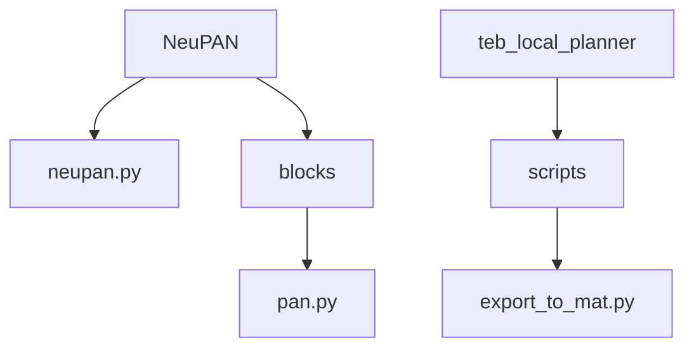
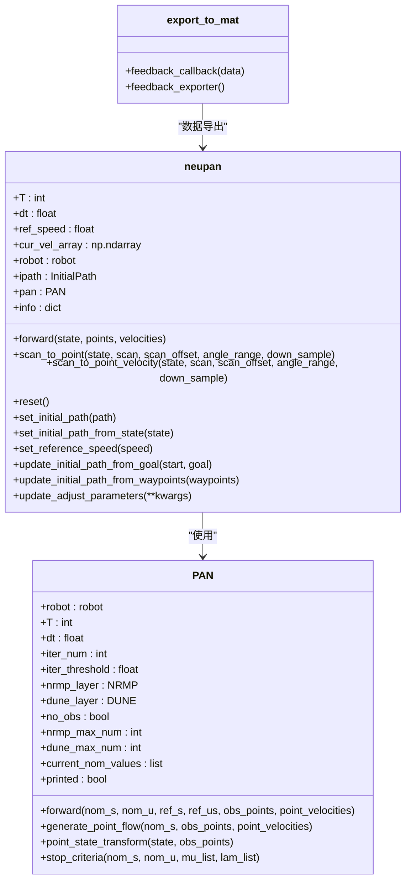
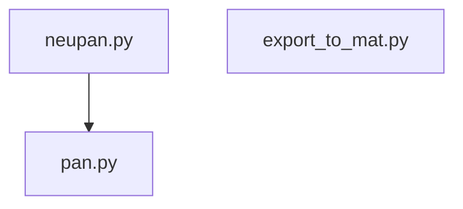

# NumPy基础操作

<cite>
**本文档中引用的文件**   
- [neupan.py](file://NeuPAN/neupan/neupan.py)
- [pan.py](file://NeuPAN/neupan/blocks/pan.py)
- [export_to_mat.py](file://teb_local_planner/scripts/export_to_mat.py)
</cite>

## 目录
1. [引言](#引言)
2. [项目结构](#项目结构)
3. [核心组件](#核心组件)
4. [架构概述](#架构概述)
5. [详细组件分析](#详细组件分析)
6. [依赖分析](#依赖分析)
7. [性能考虑](#性能考虑)
8. [故障排除指南](#故障排除指南)
9. [结论](#结论)

## 引言
本文档详细介绍了在路径规划算法中所依赖的NumPy核心功能，重点分析了`neupan.py`和`export_to_mat.py`两个文件中NumPy的使用方式。文档将展示如何利用NumPy进行机器人状态向量、轨迹点数组和障碍物坐标矩阵的创建与操作，并解释数组索引、切片和形状变换在实际场景中的应用。为初学者提供清晰的操作指南，包括数组创建方法、索引技巧和广播机制的工作原理。

## 项目结构
项目结构中包含多个子目录，其中与NumPy操作直接相关的文件位于`NeuPAN/neupan`和`teb_local_planner/scripts`目录下。`neupan.py`是NeuPAN算法的主类，负责封装PAN类并提供更友好的接口。`export_to_mat.py`脚本则用于将TEB局部规划器的反馈数据导出到.mat文件。



**图示来源**
- [neupan.py](file://NeuPAN/neupan/neupan.py)
- [pan.py](file://NeuPAN/neupan/blocks/pan.py)
- [export_to_mat.py](file://teb_local_planner/scripts/export_to_mat.py)

**本节来源**
- [neupan.py](file://NeuPAN/neupan/neupan.py)
- [export_to_mat.py](file://teb_local_planner/scripts/export_to_mat.py)

## 核心组件
`neupan.py`中的`neupan`类是路径规划算法的核心，它使用NumPy创建和操作机器人状态向量、轨迹点数组和障碍物坐标矩阵。`export_to_mat.py`中的`feedback_callback`函数则展示了如何使用NumPy将轨迹数据和障碍物信息组织成多维数组并导出。

**本节来源**
- [neupan.py](file://NeuPAN/neupan/neupan.py#L1-L402)
- [export_to_mat.py](file://teb_local_planner/scripts/export_to_mat.py#L1-L112)

## 架构概述
NeuPAN算法采用MPC框架，通过`neupan`类封装`PAN`类实现路径规划。`PAN`类进一步包含`NRMP`和`DUNE`两个子模块，分别负责非线性优化和深度学习部分。`export_to_mat.py`脚本则独立于规划算法，负责数据导出功能。



**图示来源**
- [neupan.py](file://NeuPAN/neupan/neupan.py#L1-L402)
- [pan.py](file://NeuPAN/neupan/blocks/pan.py#L1-L272)

## 详细组件分析

### neupan类分析
`neupan`类使用NumPy进行多种数组操作，包括创建零数组、堆叠数组、切片和形状变换。

#### 数组创建与初始化
```python
self.cur_vel_array = np.zeros((2, self.T))
```
这行代码创建了一个2×T的零数组，用于存储当前速度序列。`np.zeros`是NumPy中最常用的数组创建函数之一。

#### 数组堆叠与转换
```python
point_array = np.hstack(point_cloud)
```
`np.hstack`用于水平堆叠多个数组，将点云数据从列表形式转换为二维数组。

#### 坐标系变换
```python
trans, R = get_transform(state)
points = (R @ temp_points + trans)[:, ::down_sample]
```
这段代码展示了如何使用矩阵乘法（`@`运算符）和数组切片进行坐标系变换。

**图示来源**
- [neupan.py](file://NeuPAN/neupan/neupan.py#L50-L100)

**本节来源**
- [neupan.py](file://NeuPAN/neupan/neupan.py#L1-L402)

### PAN类分析
`PAN`类中的`generate_point_flow`方法展示了更复杂的NumPy操作。

#### 多维数组操作
```python
obs_points_list = []
point_flow_list = []
R_list = []

for i in range(self.T+1):
    receding_obs_points = obs_points + i * (point_velocities * self.dt)
    obs_points_list.append(receding_obs_points) 
    p0, R = self.point_state_transform(nom_s[:, i], receding_obs_points)
    point_flow_list.append(p0)
    R_list.append(R)
```
这段代码创建了三个列表，用于存储每个时间步的障碍物点、点流和旋转矩阵。

#### 数组切片与索引
```python
nom_s[:, i]
```
这种切片方式用于提取二维数组的第i列。

**图示来源**
- [pan.py](file://NeuPAN/neupan/blocks/pan.py#L100-L150)

**本节来源**
- [pan.py](file://NeuPAN/neupan/blocks/pan.py#L1-L272)

### export_to_mat脚本分析
`export_to_mat.py`脚本展示了如何将ROS消息中的数据转换为NumPy数组并导出。

#### 数组创建与填充
```python
arr = np.zeros([6, len(traj.trajectory)], dtype='double')
for index, point in enumerate(traj.trajectory):
    arr[0,index] = point.pose.position.x
    arr[1,index] = point.pose.position.y
    (roll,pitch,yaw) = euler_from_quaternion([point.pose.orientation.x,point.pose.orientation.y,point.pose.orientation.z,point.pose.orientation.w])
    arr[2,index] = yaw
    arr[3,index] = point.velocity.linear.x
    arr[4,index] = point.velocity.angular.z
    arr[5,index] = point.time_from_start.to_sec()
```
这段代码创建了一个6×N的数组，用于存储轨迹点的x、y、theta、v、omega和时间信息。

#### 数据导出
```python
sio.savemat(filename, mat)
```
使用`scipy.io.savemat`将NumPy数组导出为.mat文件。

**图示来源**
- [export_to_mat.py](file://teb_local_planner/scripts/export_to_mat.py#L50-L80)

**本节来源**
- [export_to_mat.py](file://teb_local_planner/scripts/export_to_mat.py#L1-L112)

## 依赖分析
`neupan.py`依赖于`pan.py`中的`PAN`类，而`export_to_mat.py`独立于其他文件。两个文件都依赖于NumPy库进行数组操作。



**图示来源**
- [neupan.py](file://NeuPAN/neupan/neupan.py)
- [pan.py](file://NeuPAN/neupan/blocks/pan.py)
- [export_to_mat.py](file://teb_local_planner/scripts/export_to_mat.py)

**本节来源**
- [neupan.py](file://NeuPAN/neupan/neupan.py)
- [pan.py](file://NeuPAN/neupan/blocks/pan.py)
- [export_to_mat.py](file://teb_local_planner/scripts/export_to_mat.py)

## 性能考虑
在使用NumPy进行路径规划时，需要注意以下性能问题：
- 避免在循环中频繁创建和销毁数组
- 尽量使用向量化操作而不是循环
- 合理选择数据类型以减少内存占用
- 使用适当的数据结构来存储中间结果

## 故障排除指南
常见问题及解决方案：
- **数组形状不匹配**：检查数组的维度是否符合预期
- **内存不足**：减少数组大小或使用更高效的数据类型
- **计算速度慢**：使用向量化操作替代循环
- **数据类型错误**：确保数组元素的数据类型正确

**本节来源**
- [neupan.py](file://NeuPAN/neupan/neupan.py#L1-L402)
- [pan.py](file://NeuPAN/neupan/blocks/pan.py#L1-L272)
- [export_to_mat.py](file://teb_local_planner/scripts/export_to_mat.py#L1-L112)

## 结论
本文档详细介绍了NumPy在路径规划算法中的应用，重点分析了`neupan.py`和`export_to_mat.py`两个文件中的NumPy操作。通过这些示例，初学者可以更好地理解如何使用NumPy进行数组创建、索引、切片和形状变换，以及如何将这些操作应用于实际的路径规划问题。