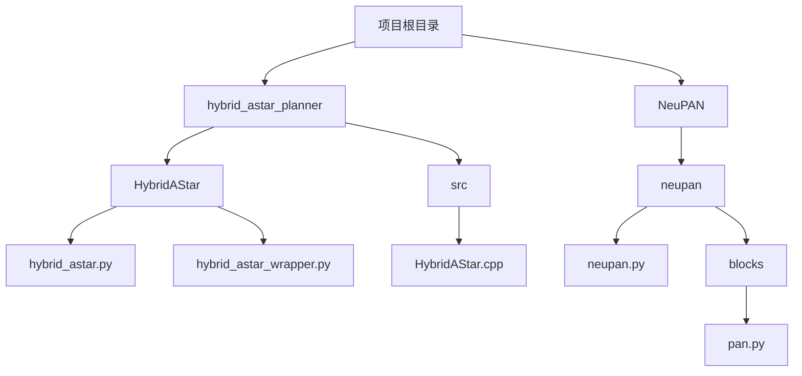
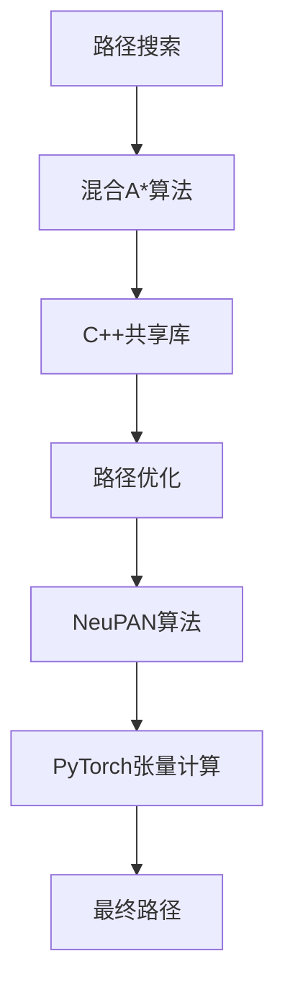
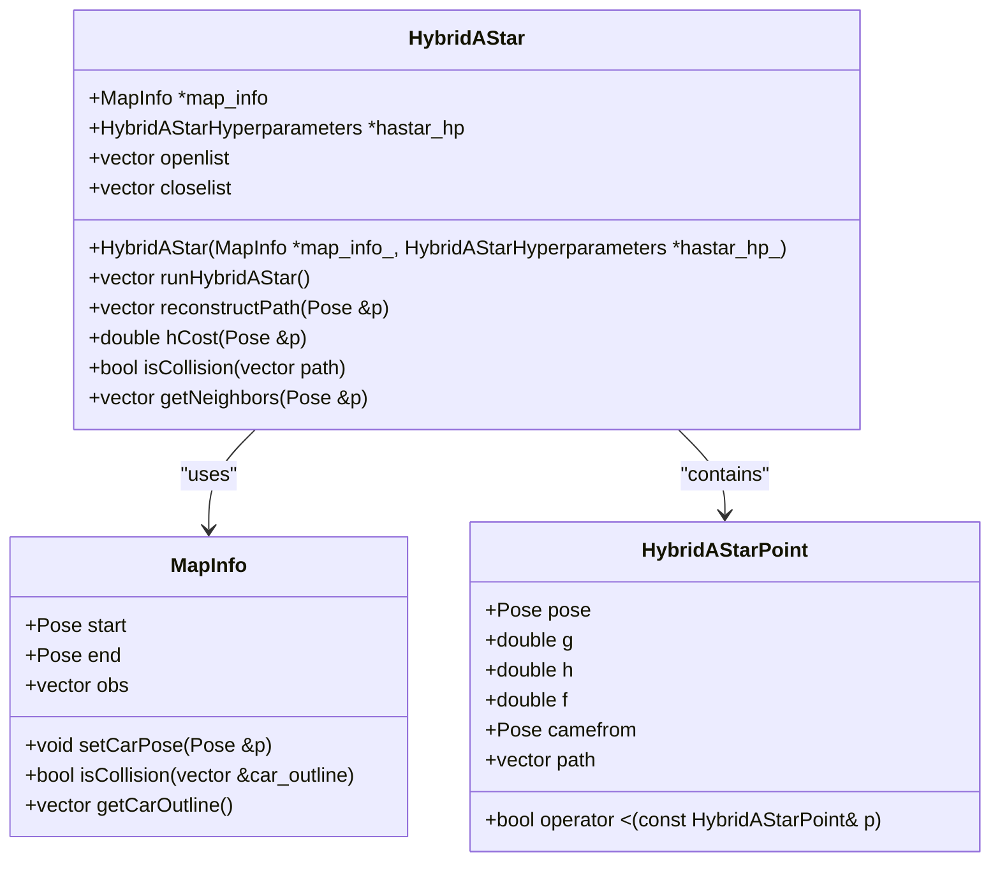
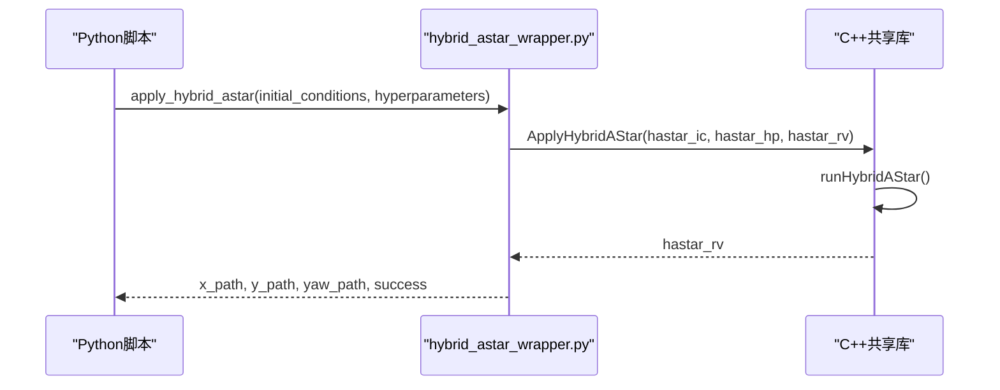
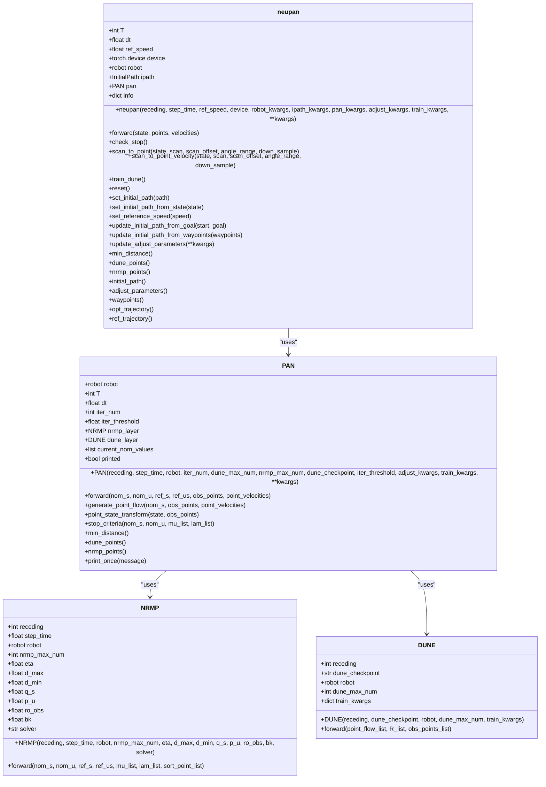
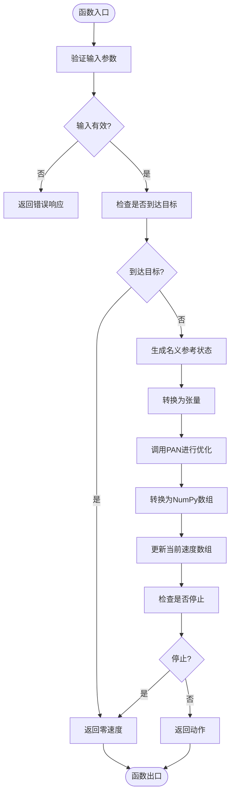
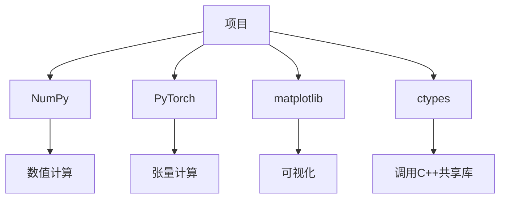

# NumPy性能优化

<cite>
**本文档中引用的文件**   
- [hybrid_astar.py](file://hybrid_astar_planner/HybridAStar/hybrid_astar.py)
- [neupan.py](file://NeuPAN/neupan/neupan.py)
- [hybrid_astar_wrapper.py](file://hybrid_astar_planner/HybridAStar/hybrid_astar_wrapper.py)
- [HybridAStar.cpp](file://hybrid_astar_planner/src/HybridAStar.cpp)
- [pan.py](file://NeuPAN/neupan/blocks/pan.py)
</cite>

## 目录
1. [引言](#引言)
2. [项目结构](#项目结构)
3. [核心组件](#核心组件)
4. [架构概述](#架构概述)
5. [详细组件分析](#详细组件分析)
6. [依赖分析](#依赖分析)
7. [性能考量](#性能考量)
8. [故障排除指南](#故障排除指南)
9. [结论](#结论)

## 引言
本文档详细阐述了在路径规划算法中提升运行效率的关键NumPy性能优化技术。重点分析了如何通过向量化操作替代Python循环来加速A*搜索过程中的代价计算，并结合实时规划需求，探讨内存布局优化对缓存命中率的影响。文档提供了具体的代码重构示例，展示了如何将循环密集型代码转换为向量化表达式，以及如何利用Numba进行JIT加速。同时，还介绍了性能分析工具的使用方法，以帮助识别和解决NumPy相关的性能瓶颈。

## 项目结构
本项目包含多个子目录，每个子目录对应不同的功能模块。`hybrid_astar_planner`目录包含了混合A*算法的实现，而`NeuPAN`目录则包含了NeuPAN算法的核心逻辑。`hybrid_astar_planner`中的`HybridAStar`子目录包含了Python和C++的混合实现，其中Python部分负责调用C++编译的共享库，而C++部分实现了核心的路径搜索算法。`NeuPAN`目录中的`neupan`子目录包含了NeuPAN算法的主要类和方法，这些类和方法利用了PyTorch进行张量计算，同时也涉及到了NumPy数组的处理。

**图示来源**
- [hybrid_astar.py](file://hybrid_astar_planner/HybridAStar/hybrid_astar.py)
- [neupan.py](file://NeuPAN/neupan/neupan.py)
- [hybrid_astar_wrapper.py](file://hybrid_astar_planner/HybridAStar/hybrid_astar_wrapper.py)
- [HybridAStar.cpp](file://hybrid_astar_planner/src/HybridAStar.cpp)
- [pan.py](file://NeuPAN/neupan/blocks/pan.py)

**节来源**
- [hybrid_astar.py](file://hybrid_astar_planner/HybridAStar/hybrid_astar.py)
- [neupan.py](file://NeuPAN/neupan/neupan.py)

## 核心组件
本项目的核心组件包括`hybrid_astar.py`中的混合A*算法实现和`neupan.py`中的NeuPAN算法实现。`hybrid_astar.py`通过调用C++编译的共享库来执行路径搜索，而`neupan.py`则利用PyTorch进行张量计算，实现了高效的路径规划。这两个组件都涉及到大量的数值计算，因此对NumPy的使用进行了优化，以提高计算效率。

**节来源**
- [hybrid_astar.py](file://hybrid_astar_planner/HybridAStar/hybrid_astar.py)
- [neupan.py](file://NeuPAN/neupan/neupan.py)

## 架构概述
整个系统的架构分为两大部分：路径搜索和路径优化。路径搜索部分由`hybrid_astar.py`实现，它通过调用C++编译的共享库来执行混合A*算法，生成初步的路径。路径优化部分由`neupan.py`实现，它利用PyTorch进行张量计算，对初步路径进行优化，生成最终的路径。这两部分通过NumPy数组进行数据交换，确保了数据的一致性和高效性。

**图示来源**
- [hybrid_astar.py](file://hybrid_astar_planner/HybridAStar/hybrid_astar.py)
- [neupan.py](file://NeuPAN/neupan/neupan.py)
- [hybrid_astar_wrapper.py](file://hybrid_astar_planner/HybridAStar/hybrid_astar_wrapper.py)
- [HybridAStar.cpp](file://hybrid_astar_planner/src/HybridAStar.cpp)
- [pan.py](file://NeuPAN/neupan/blocks/pan.py)

## 详细组件分析

### 混合A*算法分析
混合A*算法通过调用C++编译的共享库来执行路径搜索。在Python端，`hybrid_astar.py`通过`hybrid_astar_wrapper.py`调用C++的`ApplyHybridAStar`函数，传递初始条件和超参数。C++端的`HybridAStar`类实现了A*算法的核心逻辑，包括邻居节点的生成、启发式成本的计算和路径的重建。为了提高性能，C++代码中使用了STL容器和算法，如`vector`和`find_if`，以减少内存分配和提高搜索效率。

#### 对象导向组件

**图示来源**
- [HybridAStar.cpp](file://hybrid_astar_planner/src/HybridAStar.cpp)
- [hybrid_astar_wrapper.py](file://hybrid_astar_planner/HybridAStar/hybrid_astar_wrapper.py)

#### API/服务组件

**图示来源**
- [hybrid_astar.py](file://hybrid_astar_planner/HybridAStar/hybrid_astar.py)
- [hybrid_astar_wrapper.py](file://hybrid_astar_planner/HybridAStar/hybrid_astar_wrapper.py)
- [HybridAStar.cpp](file://hybrid_astar_planner/src/HybridAStar.cpp)

### NeuPAN算法分析
NeuPAN算法通过PyTorch进行张量计算，实现了高效的路径优化。在`neupan.py`中，`neupan`类继承自`torch.nn.Module`，利用PyTorch的自动求导机制进行梯度计算。`forward`方法中，首先检查是否到达目标位置，然后生成名义参考状态，将其转换为张量，调用`PAN`类进行优化，最后将优化结果转换回NumPy数组。为了提高性能，`PAN`类中的`generate_point_flow`方法使用了`downsample_decimation`函数对障碍物点云进行降采样，减少了计算量。

#### 对象导向组件

**图示来源**
- [neupan.py](file://NeuPAN/neupan/neupan.py)
- [pan.py](file://NeuPAN/neupan/blocks/pan.py)

#### 复杂逻辑组件

**图示来源**
- [neupan.py](file://NeuPAN/neupan/neupan.py)

**节来源**
- [neupan.py](file://NeuPAN/neupan/neupan.py)
- [pan.py](file://NeuPAN/neupan/blocks/pan.py)

## 依赖分析
本项目的主要依赖包括NumPy、PyTorch、matplotlib和ctypes。NumPy用于处理数值计算和数组操作，PyTorch用于张量计算和自动求导，matplotlib用于可视化结果，ctypes用于调用C++编译的共享库。这些依赖通过`requirements.txt`文件进行管理，确保了环境的一致性和可复现性。

**图示来源**
- [hybrid_astar.py](file://hybrid_astar_planner/HybridAStar/hybrid_astar.py)
- [neupan.py](file://NeuPAN/neupan/neupan.py)

**节来源**
- [hybrid_astar.py](file://hybrid_astar_planner/HybridAStar/hybrid_astar.py)
- [neupan.py](file://NeuPAN/neupan/neupan.py)

## 性能考量
为了提高性能，本项目采取了多种优化措施。首先，通过调用C++编译的共享库来执行路径搜索，利用C++的高性能特性。其次，使用NumPy的向量化操作替代Python循环，减少了解释器的开销。此外，利用PyTorch的自动求导机制进行梯度计算，提高了优化效率。最后，通过降采样减少障碍物点云的数量，降低了计算复杂度。

## 故障排除指南
在使用本项目时，可能会遇到一些常见问题。例如，如果路径搜索失败，可以检查初始条件和超参数是否设置正确。如果路径优化结果不理想，可以调整`adjust_kwargs`中的参数，如`q_s`、`p_u`、`eta`、`d_max`和`d_min`。如果性能不佳，可以考虑使用更强大的硬件平台，或者调整`receding`、`nrmp_max_num`、`dune_max_num`、`iter_num`和`iter_threshold`等参数，以提高计算效率。

**节来源**
- [neupan.py](file://NeuPAN/neupan/neupan.py)
- [hybrid_astar.py](file://hybrid_astar_planner/HybridAStar/hybrid_astar.py)

## 结论
本文档详细介绍了在路径规划算法中提升运行效率的关键NumPy性能优化技术。通过向量化操作替代Python循环、利用C++编译的共享库、使用PyTorch进行张量计算和降采样等方法，显著提高了算法的计算效率。这些优化措施不仅适用于本项目，也可以推广到其他类似的数值计算任务中，为开发高性能的路径规划算法提供了有益的参考。