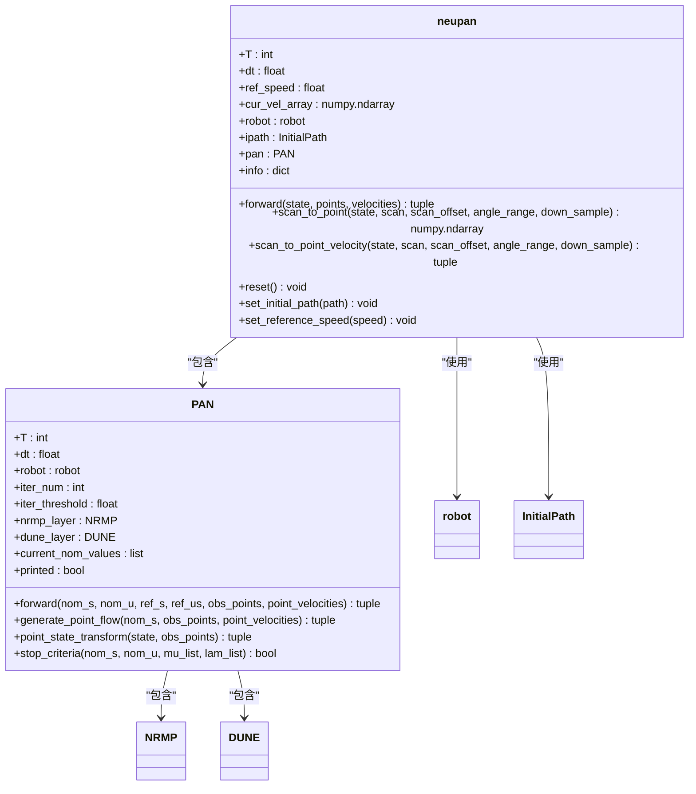
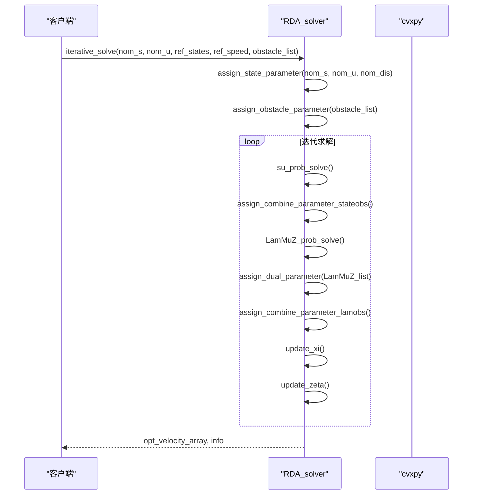
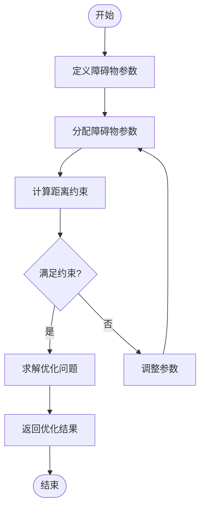
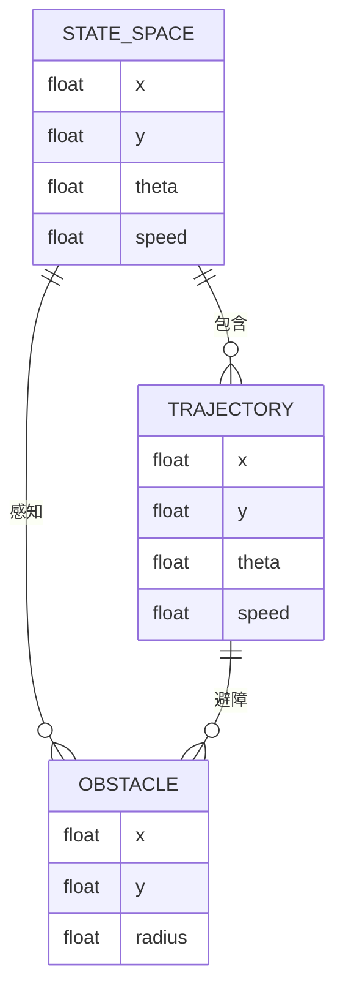
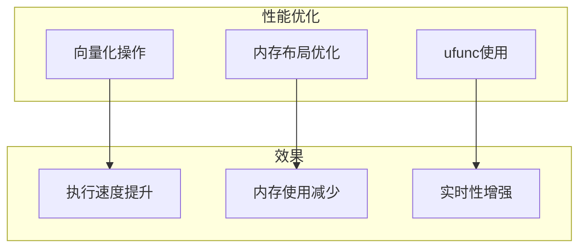
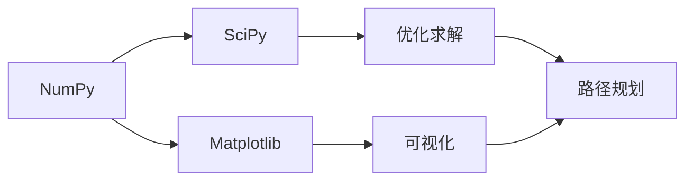
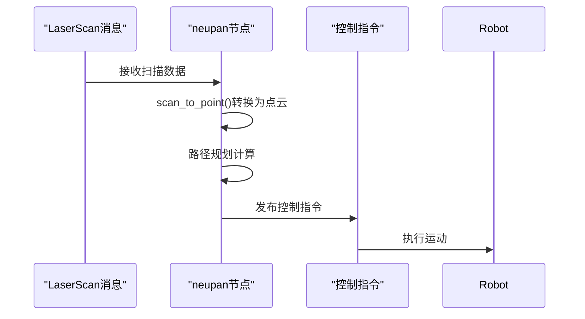

# NumPy数值计算与数据处理

<cite>
**本文档引用的文件**
- [neupan.py](file://NeuPAN/neupan/neupan.py)
- [rda_solver.py](file://RDA-planner/RDA_planner/rda_solver.py)
- [pan.py](file://NeuPAN/neupan/blocks/pan.py)
- [nrmp.py](file://NeuPAN/neupan/blocks/nrmp.py)
- [dune.py](file://NeuPAN/neupan/blocks/dune.py)
</cite>

## 目录
1. [引言](#引言)
2. [NumPy在路径规划中的核心作用](#numpy在路径规划中的核心作用)
3. [neupan.py中的轨迹优化与状态空间表示](#neupanpy中的轨迹优化与状态空间表示)
4. [rda_solver.py中的优化求解过程](#rda_solverpy中的优化求解过程)
5. [NumPy数组在约束条件计算中的应用](#numpy数组在约束条件计算中的应用)
6. [NumPy基础操作指南](#numpy基础操作指南)
7. [性能优化技巧](#性能优化技巧)
8. [与其他科学计算库的协同工作](#与其他科学计算库的协同工作)
9. [ROS消息处理中的应用](#ros消息处理中的应用)
10. [结论](#结论)

## 引言
NumPy作为Python科学计算的基础库，在本项目中扮演着至关重要的角色。本文档详细介绍了NumPy在路径规划算法中的核心应用，重点分析了neupan.py和rda_solver.py两个核心文件中NumPy的使用方式。通过深入剖析代码实现，展示了NumPy如何高效处理数值计算、数据处理和矩阵运算，为自动驾驶系统的实时路径规划提供强大的计算支持。

## NumPy在路径规划中的核心作用
NumPy在路径规划算法中发挥着多重关键作用。首先，它提供了高效的多维数组对象，用于表示机器人的状态空间、轨迹点和障碍物信息。其次，NumPy的向量化操作使得复杂的数学运算能够以极高的效率执行，这对于实时性要求极高的路径规划系统至关重要。在本项目中，NumPy被广泛应用于坐标变换、距离计算、矩阵求解等核心计算任务。

**Section sources**
- [neupan.py](file://NeuPAN/neupan/neupan.py#L1-L50)
- [rda_solver.py](file://RDA-planner/RDA_planner/rda_solver.py#L1-L50)

## neupan.py中的轨迹优化与状态空间表示
在neupan.py文件中，NumPy被用于实现轨迹优化和状态空间表示的核心功能。`neupan`类使用NumPy数组来存储和处理机器人的状态信息，包括位置、速度和方向。通过`scan_to_point`方法，将激光雷达的扫描数据转换为二维点云，这一过程充分利用了NumPy的数组操作和数学函数。

**Diagram sources**
- [neupan.py](file://NeuPAN/neupan/neupan.py#L50-L400)
- [pan.py](file://NeuPAN/neupan/blocks/pan.py#L50-L300)

**Section sources**
- [neupan.py](file://NeuPAN/neupan/neupan.py#L50-L400)

## rda_solver.py中的优化求解过程
rda_solver.py文件实现了基于ADMM（交替方向乘子法）的优化求解器，其中NumPy在矩阵运算和约束条件计算中发挥着关键作用。`RDA_solver`类使用NumPy数组来表示状态变量、控制变量和障碍物参数。通过`assign_state_parameter`方法，将名义状态和控制输入转换为优化问题的参数，这一过程涉及大量的矩阵运算和数组操作。

**Diagram sources**
- [rda_solver.py](file://RDA-planner/RDA_planner/rda_solver.py#L800-L1081)

**Section sources**
- [rda_solver.py](file://RDA-planner/RDA_planner/rda_solver.py#L800-L1081)

## NumPy数组在约束条件计算中的应用
在路径规划算法中，约束条件的计算是确保路径安全性和可行性的关键。NumPy的数组操作使得复杂的约束条件能够高效地进行计算。在rda_solver.py中，`obstacle_parameter_define`方法使用NumPy数组来表示障碍物的几何约束，通过矩阵乘法和向量运算快速计算机器人与障碍物之间的距离。

**Diagram sources**
- [rda_solver.py](file://RDA-planner/RDA_planner/rda_solver.py#L200-L500)

**Section sources**
- [rda_solver.py](file://RDA-planner/RDA_planner/rda_solver.py#L200-L500)

## NumPy基础操作指南
对于初学者来说，掌握NumPy的基础操作是理解和使用本项目代码的关键。以下是几个核心操作的简要指南：

### 数组创建
使用`np.array()`创建多维数组，`np.zeros()`和`np.ones()`创建全零或全一数组，`np.linspace()`创建等间距数组。

### 数组索引
支持标准的Python切片语法，如`arr[0:5]`，以及高级索引，如`arr[arr > 0]`。

### 广播机制
NumPy的广播机制允许不同形状的数组进行算术运算，极大地简化了代码编写。

**Diagram sources**
- [neupan.py](file://NeuPAN/neupan/neupan.py#L100-L200)
- [rda_solver.py](file://RDA-planner/RDA_planner/rda_solver.py#L100-L200)

**Section sources**
- [neupan.py](file://NeuPAN/neupan/neupan.py#L100-L200)
- [rda_solver.py](file://RDA-planner/RDA_planner/rda_solver.py#L100-L200)

## 性能优化技巧
为了提高路径规划算法的执行效率，本项目采用了多种基于NumPy的性能优化技巧：

### 向量化操作
避免使用Python循环，而是使用NumPy的向量化操作来处理数组。例如，在`scan_to_point`方法中，使用`np.hstack()`将多个点合并为一个数组，而不是逐个添加。

### 内存布局优化
合理安排数组的内存布局，减少内存访问的开销。在`rda_solver.py`中，通过预分配数组并重复使用来减少内存分配的开销。

### ufunc使用
充分利用NumPy的通用函数（ufunc），这些函数在C语言级别实现，具有极高的执行效率。

**Diagram sources**
- [neupan.py](file://NeuPAN/neupan/neupan.py#L300-L400)
- [rda_solver.py](file://RDA-planner/RDA_planner/rda_solver.py#L600-L800)

**Section sources**
- [neupan.py](file://NeuPAN/neupan/neupan.py#L300-L400)
- [rda_solver.py](file://RDA-planner/RDA_planner/rda_solver.py#L600-L800)

## 与其他科学计算库的协同工作
NumPy作为科学计算的基础，与SciPy、Matplotlib等库紧密协作，共同构建了完整的路径规划解决方案。

### 与SciPy的协同
在优化求解过程中，rda_solver.py通过cvxpy调用ECOS或SCS求解器，这些求解器底层依赖于SciPy的优化算法。

### 与Matplotlib的协同
在调试和可视化过程中，使用Matplotlib绘制轨迹、障碍物和优化结果，这些数据通常以NumPy数组的形式传递给Matplotlib。

**Diagram sources**
- [rda_solver.py](file://RDA-planner/RDA_planner/rda_solver.py#L1-L100)
- [neupan.py](file://NeuPAN/neupan/neupan.py#L1-L100)

**Section sources**
- [rda_solver.py](file://RDA-planner/RDA_planner/rda_solver.py#L1-L100)
- [neupan.py](file://NeuPAN/neupan/neupan.py#L1-L100)

## ROS消息处理中的应用
在ROS（机器人操作系统）环境中，NumPy被广泛用于处理传感器数据和控制指令。在neupan.py中，`scan_to_point`方法将ROS的LaserScan消息转换为NumPy数组，便于后续处理。同时，优化后的控制指令也以NumPy数组的形式发布到ROS话题中。

**Diagram sources**
- [neupan.py](file://NeuPAN/neupan/neupan.py#L200-L300)

**Section sources**
- [neupan.py](file://NeuPAN/neupan/neupan.py#L200-L300)

## 结论
NumPy在本项目的路径规划算法中发挥着不可替代的作用。通过高效的数组操作和数学计算，NumPy为复杂的优化求解和实时路径规划提供了坚实的基础。从neupan.py中的轨迹优化到rda_solver.py中的约束求解，NumPy的应用贯穿了整个算法流程。对于开发者来说，深入理解NumPy的使用技巧，不仅能够提高代码的执行效率，还能更好地理解和优化路径规划算法。