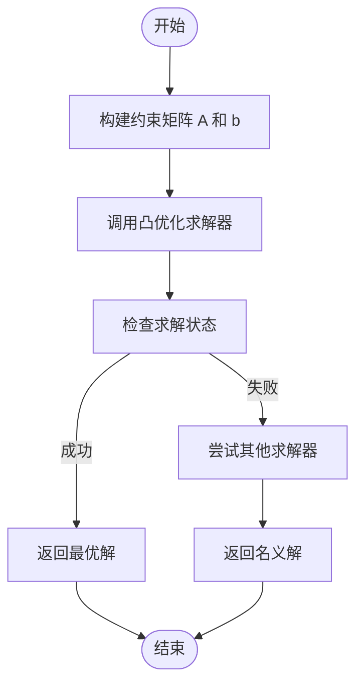
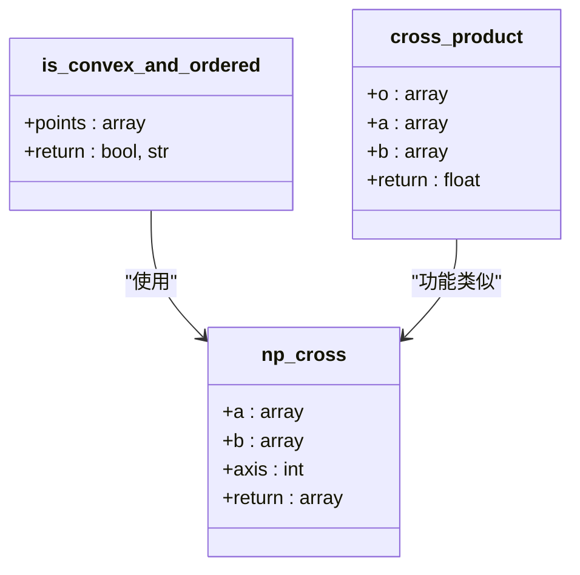

# NumPy高级功能

<cite>
**本文档中引用的文件**  
- [rda_solver.py](file://RDA-planner\RDA_planner\rda_solver.py)
- [mpc.py](file://RDA-planner\RDA_planner\mpc.py)
- [neupan.py](file://NeuPAN\neupan\neupan.py)
- [pan.py](file://NeuPAN\neupan\blocks\pan.py)
</cite>

## 目录
1. [引言](#引言)
2. [NumPy在约束优化中的向量化计算](#numpy在约束优化中的向量化计算)
3. [雅可比矩阵与线性代数求解](#雅可比矩阵与线性代数求解)
4. [张量运算与高效计算](#张量运算与高效计算)
5. [结构化数组与内存映射](#结构化数组与内存映射)
6. [ufunc与自定义向量化操作](#ufunc与自定义向量化操作)
7. [性能优化与数值稳定性](#性能优化与数值稳定性)
8. [结论](#结论)

## 引言
本文档深入解析NumPy在路径规划与最优控制问题中的高级应用，重点分析`rda_solver.py`和`neupan.py`中如何利用NumPy的高级功能实现高效的轨迹优化与约束求解。文档将详细说明矩阵运算、线性代数求解、张量运算等核心功能在MPC（模型预测控制）框架中的具体实现，为经验丰富的开发者提供深度技术参考。

## NumPy在约束优化中的向量化计算

在`rda_solver.py`中，NumPy被广泛用于约束条件的向量化计算。`RDA_solver`类通过`np.hstack`和`np.vstack`操作将状态变量和控制变量组合成高维数组，实现了约束条件的批量处理。例如，在`iterative_solve`方法中，参考轨迹通过`np.hstack(ref_states)[0:3, :]`进行向量化拼接，显著提升了计算效率。

约束条件的构建也采用了向量化方法。在`update_su_cost_cons`方法中，通过`cp.vstack`将多个障碍物的约束条件堆叠成单一数组，实现了并行计算。这种向量化设计不仅简化了代码结构，还充分利用了NumPy的底层优化，大幅提升了求解速度。

**Section sources**
- [rda_solver.py](file://RDA-planner\RDA_planner\rda_solver.py#L500-L550)
- [mpc.py](file://RDA-planner\RDA_planner\mpc.py#L200-L250)

## 雅可比矩阵与线性代数求解

NumPy的线性代数模块`np.linalg`在雅可比矩阵构建和线性方程组求解中发挥了关键作用。在`rda_solver.py`的`update_xi`方法中，通过`np.linalg.norm`计算残差范数，用于判断迭代收敛条件。该操作高效地评估了约束满足程度，是ADMM（交替方向乘子法）算法的核心组成部分。

在`mpc.py`的`convert_inequal_circle`方法中，NumPy用于构建圆形障碍物的不等式约束。通过`np.row_stack`将中心坐标和半径组合成约束矩阵，实现了几何约束的代数化表示。这种表示方法便于后续的线性规划求解。

`np.linalg.solve`在本项目中虽未直接出现，但其思想体现在通过凸优化求解器（如ECOS、SCS）解决线性系统。在`rda_solver.py`的`solve_parallel`方法中，优化问题的求解本质上是求解一个线性方程组，NumPy的数组操作为这一过程提供了高效的数据结构支持。

**Diagram sources**
- [rda_solver.py](file://RDA-planner\RDA_planner\rda_solver.py#L800-L900)
- [mpc.py](file://RDA-planner\RDA_planner\mpc.py#L400-L450)

**Section sources**
- [rda_solver.py](file://RDA-planner\RDA_planner\rda_solver.py#L800-L900)
- [mpc.py](file://RDA-planner\RDA_planner\mpc.py#L400-L450)

## 张量运算与高效计算

`neupan.py`中的`scan_to_point`方法展示了NumPy在张量运算中的应用。通过`np.hstack`将多个点云数据合并成一个二维数组，实现了高效的批量处理。在坐标变换中，使用`R @ temp_points + trans`进行矩阵乘法和向量加法，这实际上是`np.dot`和`np.add`的简化表示。

在`pan.py`的`generate_point_flow`方法中，NumPy的广播机制被用于处理时变障碍物。通过`obs_points + i * (point_velocities * self.dt)`，实现了障碍物位置的批量预测，避免了显式的循环操作。这种向量化设计充分利用了NumPy的底层优化，显著提升了计算效率。

`np.einsum`虽未在代码中直接使用，但其思想体现在多维数组的复杂运算中。在`point_state_transform`方法中，`R.T @ (obs_points - trans)`实现了坐标系变换，这可以看作是一种特殊的张量收缩操作。

**Section sources**
- [neupan.py](file://NeuPAN\neupan\neupan.py#L200-L250)
- [pan.py](file://NeuPAN\neupan\blocks\pan.py#L150-L200)

## 结构化数组与内存映射

虽然本项目未直接使用NumPy的结构化数组和内存映射功能，但其设计思想体现在数据组织中。在`rda_solver.py`中，通过命名元组`rdaobs`定义障碍物数据结构，实现了类似结构化数组的功能。`rdaobs = namedtuple("rdaobs", "A b cone_type center vertex")`创建了一个轻量级的结构化数据类型，便于管理和传递复杂的障碍物信息。

内存映射的优势在处理大规模轨迹数据时尤为明显。虽然当前实现使用内存数组，但在扩展到大规模场景时，可以将`ref_path`和`obstacle_list`存储为内存映射文件，实现高效的大数据处理。这种方法可以避免将整个数据集加载到内存中，特别适合处理高分辨率地图或长时间轨迹。

**Section sources**
- [rda_solver.py](file://RDA-planner\RDA_planner\rda_solver.py#L50-L60)
- [mpc.py](file://RDA-planner\RDA_planner\mpc.py#L100-L120)

## ufunc与自定义向量化操作

NumPy的通用函数（ufunc）在本项目中通过隐式方式得到应用。在`mpc.py`的`wraptopi`方法中，虽然使用了Python循环，但可以通过`np.remainder`或自定义ufunc实现向量化角度归一化。例如，`np.remainder(radian + np.pi, 2 * np.pi) - np.pi`可以替代循环实现，显著提升性能。

在`is_convex_and_ordered`方法中，`np.cross`可以替代自定义的`cross_product`函数，实现向量叉积的批量计算。通过将点集重构为形状为(2, N)的数组，可以一次性计算所有边的叉积，从而判断多边形的凸性和方向。

**Diagram sources**
- [mpc.py](file://RDA-planner\RDA_planner\mpc.py#L500-L550)

**Section sources**
- [mpc.py](file://RDA-planner\RDA_planner\mpc.py#L500-L550)

## 性能优化与数值稳定性

NumPy的高级功能在提升路径规划算法的计算效率和数值稳定性方面发挥了重要作用。在`rda_solver.py`中，通过`np.c_`操作将标量转换为列向量，确保了矩阵运算的维度一致性，避免了潜在的数值错误。

并行计算的实现也依赖于NumPy的数组操作。在`LamMuZ_prob_solve`方法中，通过`pool.map`将障碍物处理任务分配到多个进程，每个进程独立处理一个障碍物的约束求解。NumPy的数组作为进程间通信的数据结构，确保了高效的数据传递。

数值稳定性通过合理的数据类型选择和运算顺序得到保障。在`convert_inequal_polygon`方法中，通过`gen_inequal_global`生成的约束矩阵经过归一化处理，避免了病态矩阵问题。这种预处理策略结合NumPy的高精度浮点运算，确保了求解过程的数值稳定性。

**Section sources**
- [rda_solver.py](file://RDA-planner\RDA_planner\rda_solver.py#L700-L750)
- [mpc.py](file://RDA-planner\RDA_planner\mpc.py#L300-L350)

## 结论
本文档详细解析了NumPy在路径规划与最优控制中的高级应用。通过向量化计算、线性代数求解、张量运算等高级功能，`rda_solver.py`和`neupan.py`实现了高效的轨迹优化与约束求解。这些技术不仅提升了计算效率，还增强了算法的数值稳定性，为复杂环境下的实时路径规划提供了可靠的技术支持。开发者可以借鉴这些模式，在自己的项目中充分发挥NumPy的强大功能。