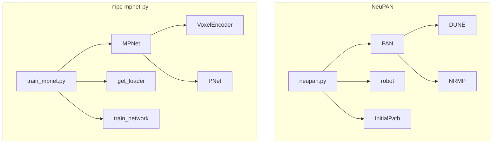
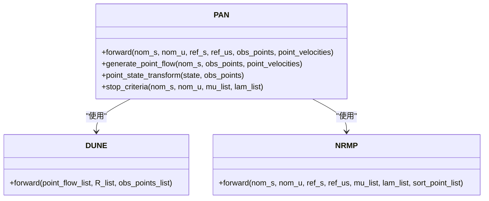
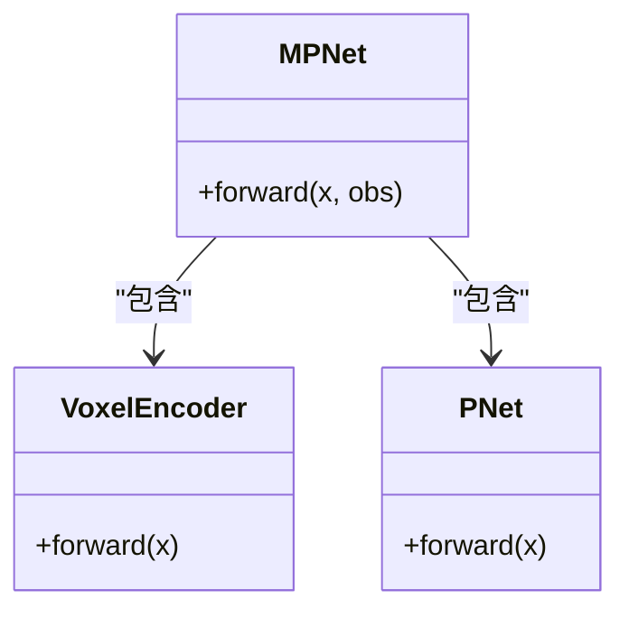
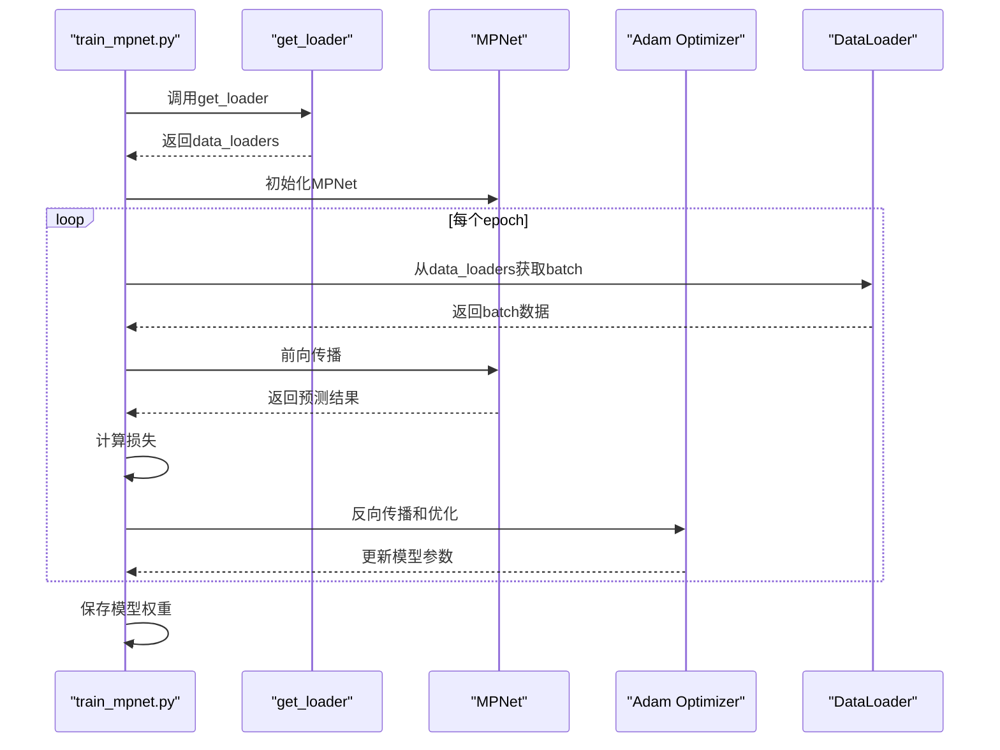

# PyTorch集成与模型训练

<cite>
**本文档引用的文件**  
- [neupan.py](file://NeuPAN/neupan/neupan.py)
- [pan.py](file://NeuPAN/neupan/blocks/pan.py)
- [dune_train.py](file://NeuPAN/neupan/blocks/dune_train.py)
- [train_mpnet.py](file://mpc-mpnet-py/mpnet/train_mpnet.py)
- [mpnet.py](file://mpc-mpnet-py/mpnet/networks/mpnet.py)
- [voxel_encoder.py](file://mpc-mpnet-py/mpnet/networks/voxel_encoder.py)
</cite>

## 目录
1. [引言](#引言)
2. [项目结构](#项目结构)
3. [核心组件](#核心组件)
4. [神经网络架构设计](#神经网络架构设计)
5. [模型训练流程](#模型训练流程)
6. [PyTorch环境配置与调试](#pytorch环境配置与调试)
7. [模型性能优化技巧](#模型性能优化技巧)
8. [与C++规划器的集成](#与c++规划器的集成)
9. [结论](#结论)

## 引言

本项目中的PyTorch主要用于实现NeuPAN和mpc-mpnet-py两个子项目中的深度学习路径规划算法。NeuPAN是一个基于模型预测控制（MPC）框架的端到端规划器，其核心是路径规划注意力网络（PAN）模块，该模块结合了可微优化层和神经网络，实现了高效的障碍物规避和轨迹优化。mpc-mpnet-py子项目则专注于使用深度神经网络进行运动规划，通过训练MPNet模型来学习从环境观测到控制指令的映射。这两个子项目共同构成了一个完整的智能路径规划系统，其中PyTorch不仅用于模型的定义和训练，还用于实时推理和与C++规划器的数据交换。

## 项目结构

NeuPAN和mpc-mpnet-py子项目均采用模块化设计，将不同的功能组件分离到独立的文件和目录中。NeuPAN项目的核心位于`neupan`包中，包含`neupan.py`作为主类，`blocks`目录下存放了PAN、DUNE等核心模块的实现。mpc-mpnet-py项目则将网络定义、数据加载、训练脚本等分别放在`networks`、`dataset`和`training_utils`等目录中。这种结构化的组织方式使得代码易于维护和扩展，同时也方便了PyTorch模型的集成和管理。

**图示来源**  
- [neupan.py](file://NeuPAN/neupan/neupan.py#L1-L403)
- [pan.py](file://NeuPAN/neupan/blocks/pan.py#L1-L273)
- [train_mpnet.py](file://mpc-mpnet-py/mpnet/train_mpnet.py#L1-L63)
- [mpnet.py](file://mpc-mpnet-py/mpnet/networks/mpnet.py#L1-L47)

## 核心组件

NeuPAN和mpc-mpnet-py子项目的核心组件包括neupan类、PAN模块、DUNE训练器、MPNet网络和VoxelEncoder。neupan类作为NeuPAN算法的主接口，封装了PAN模块并提供了用户友好的方法。PAN模块是NeuPAN的核心，由DUNE和NRMP两个子模块组成，实现了基于交替最小化的优化算法。DUNE训练器用于生成和训练DUNE模型，以适应不同机器人几何形状的需求。MPNet网络是mpc-mpnet-py项目的核心，由VoxelEncoder和PNet组成，用于学习从环境观测到控制指令的映射。

**本节来源**  
- [neupan.py](file://NeuPAN/neupan/neupan.py#L1-L403)
- [pan.py](file://NeuPAN/neupan/blocks/pan.py#L1-L273)
- [dune_train.py](file://NeuPAN/neupan/blocks/dune_train.py#L1-L545)
- [mpnet.py](file://mpc-mpnet-py/mpnet/networks/mpnet.py#L1-L47)

## 神经网络架构设计

### PAN模块实现

PAN（Path Planning Attention Network）模块是NeuPAN算法的核心，它是一个基于交替最小化的网络，由DUNE和NRMP两个子模块组成。DUNE模块负责处理点级障碍物规避约束，通过可微优化层计算最优的障碍物距离和方向。NRMP模块则负责生成最优的轨迹和速度序列，结合参考轨迹和障碍物信息进行优化。PAN模块的输入包括名义状态、名义控制、参考轨迹、参考速度以及障碍物点云和速度，输出为最优的速度序列和状态序列。

**图示来源**  
- [pan.py](file://NeuPAN/neupan/blocks/pan.py#L1-L273)

### MPNet网络结构

MPNet网络是mpc-mpnet-py项目的核心，由VoxelEncoder和PNet两个子网络组成。VoxelEncoder负责将环境的体素化表示编码为固定长度的特征向量，PNet则将该特征向量与当前状态和目标状态拼接后，输出控制指令。这种设计使得MPNet能够有效地处理高维环境观测，并学习到从环境到控制的复杂映射关系。

**图示来源**  
- [mpnet.py](file://mpc-mpnet-py/mpnet/networks/mpnet.py#L1-L47)
- [voxel_encoder.py](file://mpc-mpnet-py/mpnet/networks/voxel_encoder.py#L1-L31)

## 模型训练流程

### 数据加载与预处理

mpc-mpnet-py项目中的数据加载由`get_loader`函数实现，该函数根据指定的系统环境和设置加载相应的数据集。数据集通常包含环境的体素化表示、起始状态、目标状态和专家生成的控制指令。在训练过程中，数据会被批处理并送入模型进行前向传播和反向传播。

### 损失函数与优化器

MPNet的训练使用均方误差（MSE）损失函数，衡量模型输出的控制指令与真实控制指令之间的差异。优化器采用Adam，初始学习率为3e-4，并使用学习率调度器在每100个epoch后将学习率乘以0.9。此外，训练过程中还加入了数据增强（augmentation）以提高模型的泛化能力。

### 训练循环

训练循环由`train_network`函数实现，该函数接收网络、数据加载器、学习率、epoch数等参数。在每个epoch中，模型会在训练集上进行前向传播和反向传播，并在验证集上评估性能。训练过程中，模型的权重会定期保存，以便后续使用。

**图示来源**  
- [train_mpnet.py](file://mpc-mpnet-py/mpnet/train_mpnet.py#L1-L63)
- [mpnet.py](file://mpc-mpnet-py/mpnet/networks/mpnet.py#L1-L47)

## PyTorch环境配置与调试

### 环境配置

为了在本项目中使用PyTorch，需要安装PyTorch及其相关依赖，如torchvision、torchaudio等。此外，还需要安装项目特定的依赖，如cvxpy、colorama、rich等。建议使用conda或pip创建虚拟环境，并在其中安装所有依赖。

### 调试指南

在调试PyTorch模型时，可以使用`torch.autograd.set_detect_anomaly(True)`来检测梯度计算中的异常。此外，可以使用`torch.utils.tensorboard`来可视化训练过程中的损失、学习率等指标。对于内存问题，可以使用`torch.cuda.memory_summary()`来查看GPU内存使用情况。

## 模型性能优化技巧

### 梯度裁剪

在训练过程中，可以使用梯度裁剪来防止梯度爆炸。这可以通过在优化器的`step`方法之前调用`torch.nn.utils.clip_grad_norm_`来实现。

### 学习率调度

使用学习率调度器可以提高模型的收敛速度和性能。在本项目中，使用了`StepLR`调度器，每100个epoch将学习率乘以0.9。

### 模型量化

为了提高模型的推理速度，可以使用模型量化技术。PyTorch提供了`torch.quantization`模块，可以将浮点模型转换为量化模型，从而在保持性能的同时减少计算资源的消耗。

## 与C++规划器的集成

NeuPAN和mpc-mpnet-py项目中的PyTorch模型可以通过导出为ONNX格式或使用TorchScript来与C++规划器集成。导出后的模型可以在C++环境中加载和推理，从而实现高效的实时路径规划。数据交换通常通过共享内存或网络接口进行，确保规划器能够及时获取环境观测和输出控制指令。

## 结论

本项目通过NeuPAN和mpc-mpnet-py两个子项目，展示了PyTorch在智能路径规划中的强大能力。NeuPAN通过结合可微优化层和神经网络，实现了高效的障碍物规避和轨迹优化。mpc-mpnet-py则通过深度神经网络学习从环境观测到控制指令的映射，提高了规划的灵活性和适应性。通过合理的环境配置、调试和性能优化，这些模型能够在实际应用中发挥重要作用。未来的工作可以进一步探索更复杂的网络架构和训练策略，以提高规划的性能和鲁棒性。