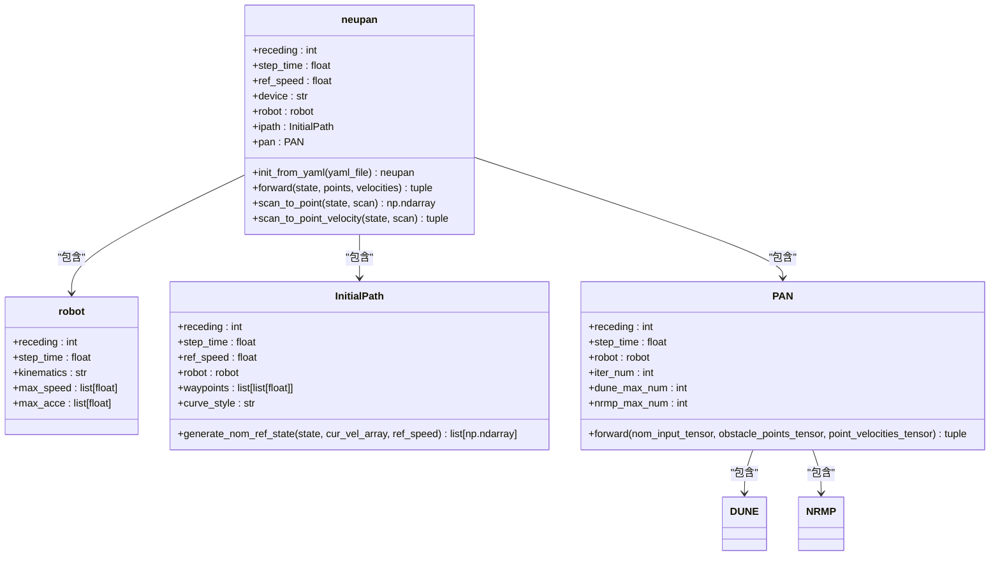
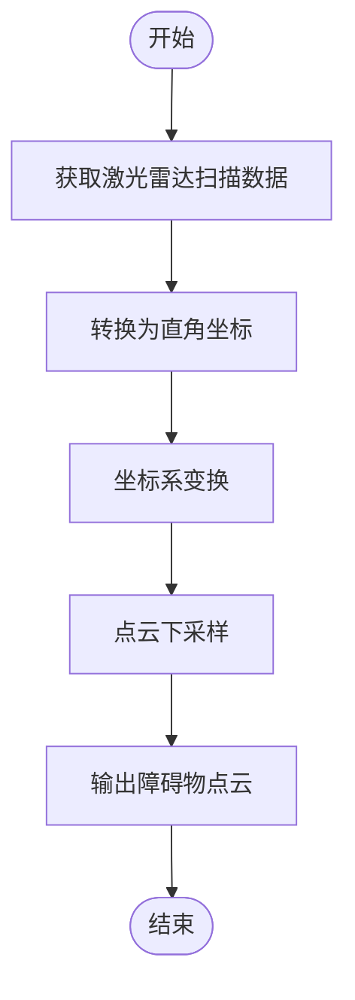
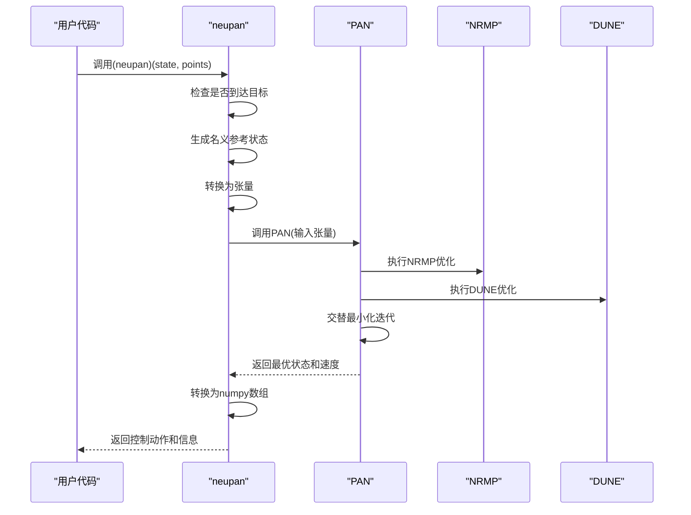
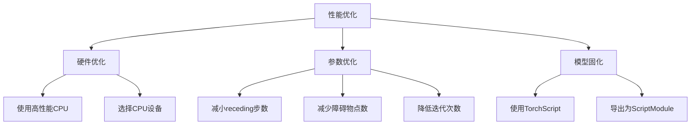
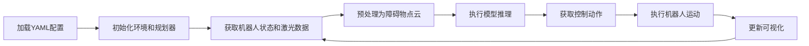

# 推理与系统集成

<cite>
**本文档引用的文件**  
- [run_exp.py](file://NeuPAN/example/run_exp.py)
- [neupan.py](file://NeuPAN/neupan/neupan.py)
- [planner.yaml](file://NeuPAN/example/corridor/diff/planner.yaml)
- [env.yaml](file://NeuPAN/example/corridor/diff/env.yaml)
- [README.md](file://NeuPAN/README.md)
</cite>

## 目录
1. [推理流程概述](#推理流程概述)
2. [模型加载与初始化](#模型加载与初始化)
3. [传感器数据预处理](#传感器数据预处理)
4. [模型推理执行](#模型推理执行)
5. [推理结果使用](#推理结果使用)
6. [性能优化](#性能优化)
7. [ROS系统集成](#ros系统集成)
8. [完整数据流示例](#完整数据流示例)

## 推理流程概述

NeuPAN模型的推理与系统集成流程始于`run_exp.py`脚本，该脚本作为整个导航系统的入口点。系统通过加载预训练的NeuPAN模型，将实时传感器数据（或仿真环境状态）预处理为模型输入，并执行前向传播以生成规划路径。推理结果随后被下游控制器使用，实现从感知到执行的完整闭环。整个流程在仿真环境`irsim`中进行验证，展示了模型在复杂动态环境中的实时导航能力。

**Section sources**
- [run_exp.py](file://NeuPAN/example/run_exp.py#L0-L93)

## 模型加载与初始化

NeuPAN模型的加载与初始化通过`neupan.init_from_yaml()`类方法实现。该方法从YAML配置文件中读取模型参数，包括MPC参数、机器人参数、初始路径参数、PAN网络参数和调整参数等。模型初始化时，会根据配置创建机器人模型、初始路径生成器和PAN网络实例。PAN网络由DUNE（深度不确定性估计网络）和NRMP（神经递归最小化规划器）组成，共同解决包含大量点级避障约束的优化问题。

**Diagram sources**
- [neupan.py](file://NeuPAN/neupan/neupan.py#L30-L65)
- [robot.py](file://NeuPAN/neupan/robot/robot.py)
- [initial_path.py](file://NeuPAN/neupan/blocks/initial_path.py)
- [pan.py](file://NeuPAN/neupan/blocks/pan.py)

**Section sources**
- [neupan.py](file://NeuPAN/neupan/neupan.py#L67-L95)
- [planner.yaml](file://NeuPAN/example/corridor/diff/planner.yaml#L1-L52)

## 传感器数据预处理

传感器数据预处理是将原始传感器数据转换为模型可用输入的关键步骤。NeuPAN提供了`scan_to_point`和`scan_to_point_velocity`两个方法，用于处理激光雷达扫描数据。预处理过程包括：将极坐标下的激光测距数据转换为直角坐标系下的点云；根据传感器相对于机器人坐标系的偏移量进行坐标变换；对点云进行下采样以减少计算量。预处理后的点云数据作为障碍物信息输入到模型中。

**Diagram sources**
- [neupan.py](file://NeuPAN/neupan/neupan.py#L210-L270)

**Section sources**
- [neupan.py](file://NeuPAN/neupan/neupan.py#L210-L270)
- [env.yaml](file://NeuPAN/example/corridor/diff/env.yaml#L1-L54)

## 模型推理执行

模型推理执行通过调用`neupan`实例的`__call__`方法（即`forward`方法）完成。推理过程首先检查机器人是否到达目标点，若未到达，则生成名义参考状态序列。接着，将预处理后的点云数据和机器人状态转换为PyTorch张量，并输入到PAN网络中进行前向传播。PAN网络通过交替最小化算法求解优化问题，输出最优状态序列、最优速度序列和最小距离。最终，将最优速度序列的第一个速度作为控制动作返回。

**Diagram sources**
- [neupan.py](file://NeuPAN/neupan/neupan.py#L97-L208)
- [pan.py](file://NeuPAN/neupan/blocks/pan.py)

**Section sources**
- [neupan.py](file://NeuPAN/neupan/neupan.py#L97-L208)
- [run_exp.py](file://NeuPAN/example/run_exp.py#L30-L42)

## 推理结果使用

推理结果的使用主要体现在下游控制器对模型输出的处理和应用。模型返回的控制动作（线速度和角速度）直接用于驱动机器人运动。同时，模型还返回一个包含丰富信息的字典，包括最优轨迹、参考轨迹、最小距离等。这些信息可用于可视化、调试和决策。例如，在`run_exp.py`中，系统使用`env.draw_trajectory`方法绘制最优轨迹和参考轨迹，使用`env.step(action)`方法执行控制动作。

**Section sources**
- [run_exp.py](file://NeuPAN/example/run_exp.py#L43-L65)

## 性能优化

NeuPAN的性能优化主要通过调整模型参数和硬件配置来实现。由于优化求解器cvxpy不支持GPU，推荐使用CPU设备运行NeuPAN算法。为了提高推理频率，可以调整`receding`、`nrmp_max_num`、`dune_max_num`、`iter_num`和`iter_threshold`等参数。此外，可以使用TorchScript对模型进行固化以加速推理。虽然代码库中未直接提供TorchScript导出功能，但可以通过PyTorch的`torch.jit.script`或`torch.jit.trace`方法将`neupan`模型转换为ScriptModule，从而在C++环境中进行高效推理。

**Section sources**
- [README.md](file://NeuPAN/README.md#L180-L200)

## ROS系统集成

NeuPAN通过`neupan_ros`包装器与ROS系统集成。尽管当前代码库中未包含`neupan_ros`，但根据文档说明，集成方式包括：通过`/initial_path`话题接收来自全局规划器（如A*）的初始路径；通过`refresh_initial_path`参数控制是否实时更新初始路径；将激光雷达点云数据转换为2D点云作为模型输入；将模型输出的控制动作发布到相应的执行器话题。这种集成方式使得NeuPAN可以作为局部规划器，与ROS中的全局规划器和控制器无缝协作。

**Section sources**
- [README.md](file://NeuPAN/README.md#L210-L214)

## 完整数据流示例

从模型输出到机器人运动指令的完整数据流示例如下：首先，`run_exp.py`脚本加载`planner.yaml`和`env.yaml`配置文件，初始化仿真环境和NeuPAN规划器。然后，在每个控制周期，系统获取机器人当前状态和激光雷达扫描数据，通过`scan_to_point`方法预处理为障碍物点云。接着，调用`neupan`实例的`__call__`方法执行推理，得到控制动作。最后，将控制动作传递给仿真环境执行，并更新可视化界面。该数据流实现了从感知到规划再到执行的完整闭环。

**Diagram sources**
- [run_exp.py](file://NeuPAN/example/run_exp.py#L0-L93)

**Section sources**
- [run_exp.py](file://NeuPAN/example/run_exp.py#L0-L93)