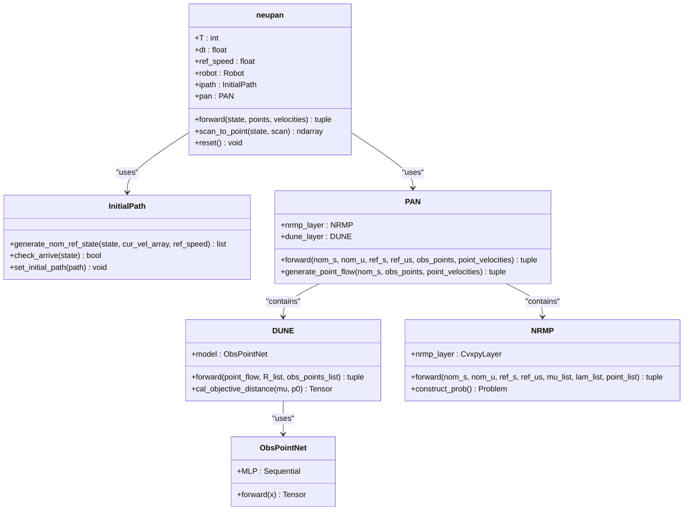
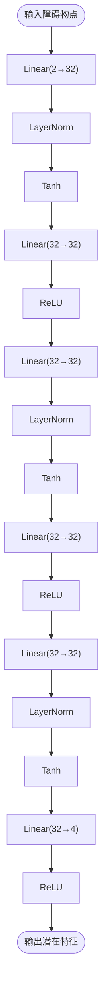
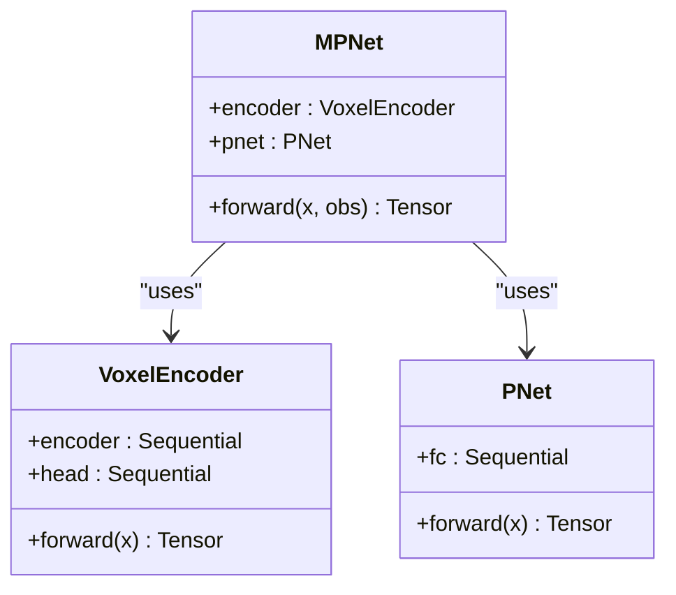

# 模型架构设计

<cite>
**本文档中引用的文件**   
- [neupan.py](file://NeuPAN/neupan/neupan.py)
- [pan.py](file://NeuPAN/neupan/blocks/pan.py)
- [dune.py](file://NeuPAN/neupan/blocks/dune.py)
- [nrmp.py](file://NeuPAN/neupan/blocks/nrmp.py)
- [obs_point_net.py](file://NeuPAN/neupan/blocks/obs_point_net.py)
- [mpnet.py](file://mpc-mpnet-py/mpnet/networks/mpnet.py)
- [voxel_encoder.py](file://mpc-mpnet-py/mpnet/networks/voxel_encoder.py)
- [pnet_shallow.py](file://mpc-mpnet-py/mpnet/networks/pnet_shallow.py)
</cite>

## 目录
1. [引言](#引言)
2. [项目结构与核心组件](#项目结构与核心组件)
3. [NeuPAN整体架构](#neupan整体架构)
4. [PAN模块实现原理](#pan模块实现原理)
5. [MPNet架构对比分析](#mpnet架构对比分析)
6. [环境感知与路径规划任务处理机制](#环境感知与路径规划任务处理机制)
7. [模型设计权衡考量](#模型设计权衡考量)
8. [结论](#结论)

## 引言
NeuPAN是一种基于深度学习的端到端MPC（模型预测控制）规划器，旨在解决复杂动态环境中的路径规划问题。该算法结合了神经网络与优化方法，通过PAN（Path Planning Attention Network）模块实现高效的路径生成。与此同时，mpc-mpnet-py项目中的MPNet架构也提供了另一种基于神经网络的路径规划解决方案。本文将深入解析NeuPAN和mpc-mpnet-py项目中基于PyTorch的神经网络架构设计，重点分析PAN模块的实现原理，并对比两种模型在处理环境感知和路径规划任务上的异同。

## 项目结构与核心组件
NeuPAN项目的目录结构清晰地展示了其模块化设计。核心功能主要集中在`NeuPAN/neupan`目录下，其中包含以下几个关键子模块：
- `blocks`：包含PAN、DUNE、NRMP等核心算法模块
- `robot`：定义机器人动力学模型及相关参数
- `configuration`：配置管理与工具函数
- `util`：通用工具函数

而mpc-mpnet-py项目则位于`mpc-mpnet-py/mpnet/networks`目录下，主要包括MPNet及其相关组件。

**Section sources**
- [neupan.py](file://NeuPAN/neupan/neupan.py#L1-L402)
- [mpnet.py](file://mpc-mpnet-py/mpnet/networks/mpnet.py#L1-L46)

## NeuPAN整体架构
NeuPAN的整体架构由多个协同工作的模块组成，主要包括`neupan`主类、`InitialPath`初始路径生成器、`PAN`核心规划模块以及底层的`DUNE`和`NRMP`组件。



**Diagram sources**
- [neupan.py](file://NeuPAN/neupan/neupan.py#L1-L402)
- [pan.py](file://NeuPAN/neupan/blocks/pan.py#L1-L272)
- [dune.py](file://NeuPAN/neupan/blocks/dune.py#L1-L251)
- [nrmp.py](file://NeuPAN/neupan/blocks/nrmp.py#L1-L325)
- [obs_point_net.py](file://NeuPAN/neupan/blocks/obs_point_net.py#L1-L72)

## PAN模块实现原理
PAN（Path Planning Attention Network）是NeuPAN的核心模块，采用近端交替最小化网络结构，结合NRMP和DUNE两个子模块，解决带有大量点级避障约束的优化问题。

### 注意力机制
PAN通过DUNE模块实现注意力机制，将障碍物点云映射到潜在距离特征空间。具体来说，DUNE利用`ObsPointNet`神经网络将每个障碍物点映射为潜在特征向量μ，再通过旋转矩阵R生成λ特征，从而实现对关键障碍物的关注。

### 特征提取网络
`ObsPointNet`是一个多层感知机（MLP），负责将2D坐标点映射到高维潜在特征空间。其结构包括五个隐藏层，使用Tanh和ReLU激活函数交替，最后通过ReLU输出层生成4维潜在特征。



**Diagram sources**
- [obs_point_net.py](file://NeuPAN/neupan/blocks/obs_point_net.py#L1-L72)

### 路径生成逻辑
PAN的路径生成过程分为两个阶段：首先由DUNE模块计算障碍物点的潜在距离特征，然后由NRMP模块求解优化问题生成最优控制序列。整个过程在MPC框架下进行，具有固定的预测时域T和时间步长dt。

**Section sources**
- [pan.py](file://NeuPAN/neupan/blocks/pan.py#L1-L272)
- [dune.py](file://NeuPAN/neupan/blocks/dune.py#L1-L251)
- [nrmp.py](file://NeuPAN/neupan/blocks/nrmp.py#L1-L325)

## MPNet架构对比分析
MPNet是mpc-mpnet-py项目中的核心网络架构，与NeuPAN的PAN模块在设计理念上有显著差异。



**Diagram sources**
- [mpnet.py](file://mpc-mpnet-py/mpnet/networks/mpnet.py#L1-L46)
- [voxel_encoder.py](file://mpc-mpnet-py/mpnet/networks/voxel_encoder.py#L1-L30)
- [pnet_shallow.py](file://mpc-mpnet-py/mpnet/networks/pnet_shallow.py#L1-L17)

### 架构差异
1. **输入处理方式**：MPNet使用体素编码器（VoxelEncoder）将点云数据转换为规则网格，而NeuPAN直接处理原始点云。
2. **优化策略**：NeuPAN结合了神经网络与凸优化（通过CvxpyLayer），而MPNet完全基于神经网络前向传播。
3. **注意力机制**：NeuPAN通过DUNE显式实现注意力机制，MPNet则依赖于卷积神经网络的隐式特征提取。

**Section sources**
- [mpnet.py](file://mpc-mpnet-py/mpnet/networks/mpnet.py#L1-L46)
- [voxel_encoder.py](file://mpc-mpnet-py/mpnet/networks/voxel_encoder.py#L1-L30)
- [pnet_shallow.py](file://mpc-mpnet-py/mpnet/networks/pnet_shallow.py#L1-L17)

## 环境感知与路径规划任务处理机制
### 环境信息编码
NeuPAN通过`scan_to_point`方法将激光雷达扫描数据转换为点云张量。该过程包括坐标变换、范围过滤和下采样，最终生成适合神经网络处理的(2, N)维张量。

```mermaid
flowchart TD
RawScan([原始扫描数据]) --> CoordinateTransform["坐标变换"]
CoordinateTransform --> RangeFilter["范围过滤"]
RangeFilter --> DownSample["下采样"]
DownSample --> PointCloudTensor[(2, N)张量]
```

**Diagram sources**
- [neupan.py](file://NeuPAN/neupan/neupan.py#L1-L402)

### 路径解码
NeuPAN的路径解码由NRMP模块完成，通过求解凸优化问题生成最优状态序列和控制序列。MPNet则直接通过PNet网络输出预测路径。

**Section sources**
- [neupan.py](file://NeuPAN/neupan/neupan.py#L1-L402)
- [nrmp.py](file://NeuPAN/neupan/blocks/nrmp.py#L1-L325)

## 模型设计权衡考量
### 计算效率与规划精度
NeuPAN通过将复杂优化问题分解为DUNE和NRMP两个子问题，在保证规划精度的同时提高了计算效率。DUNE模块负责快速提取关键障碍物特征，NRMP模块则专注于求解简化后的优化问题。

### 参数配置
NeuPAN提供了丰富的可调参数，包括：
- `receding`：预测时域长度
- `step_time`：时间步长
- `dune_max_num`：DUNE考虑的最大点数
- `nrmp_max_num`：NRMP考虑的最大点数

这些参数允许用户根据具体应用场景在计算效率和规划精度之间进行权衡。

**Section sources**
- [neupan.py](file://NeuPAN/neupan/neupan.py#L1-L402)
- [pan.py](file://NeuPAN/neupan/blocks/pan.py#L1-L272)

## 结论
NeuPAN和MPNet代表了两种不同的路径规划神经网络设计思路。NeuPAN通过结合神经网络与优化方法，在复杂动态环境中表现出更强的适应性和鲁棒性；而MPNet则通过端到端学习实现了更高的计算效率。选择哪种架构取决于具体应用场景对实时性、精度和鲁棒性的要求。