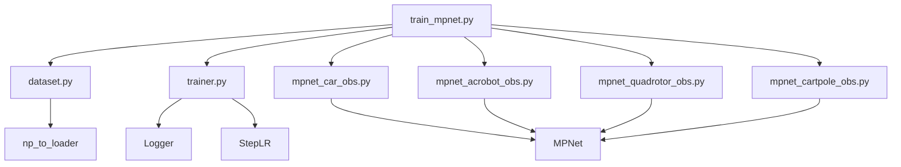
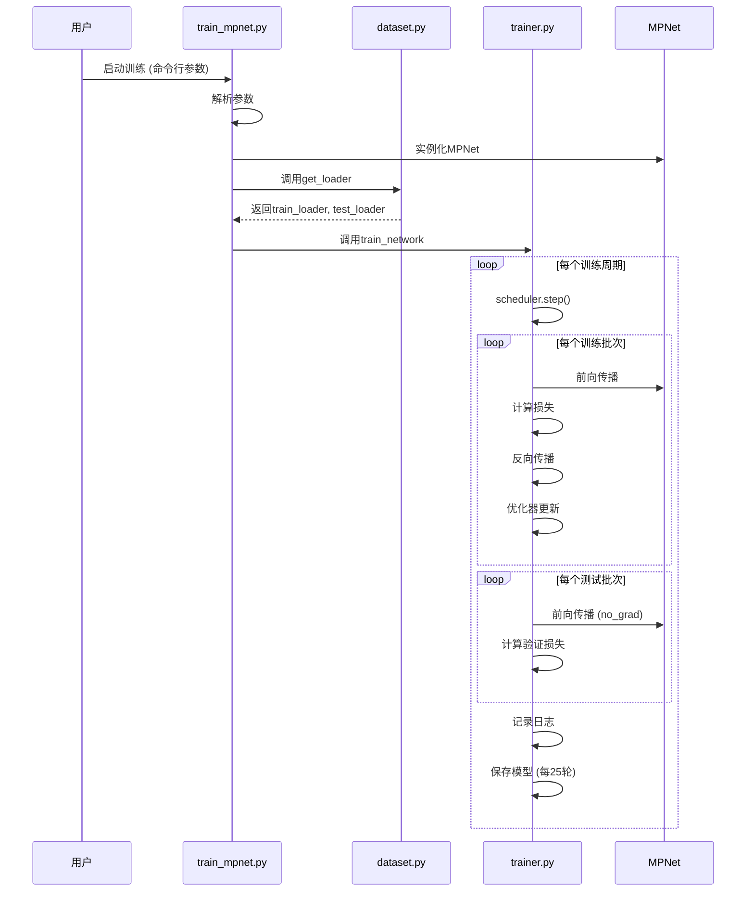
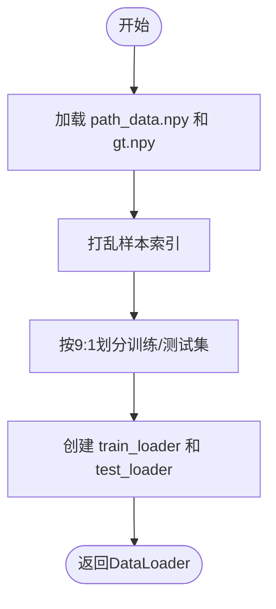
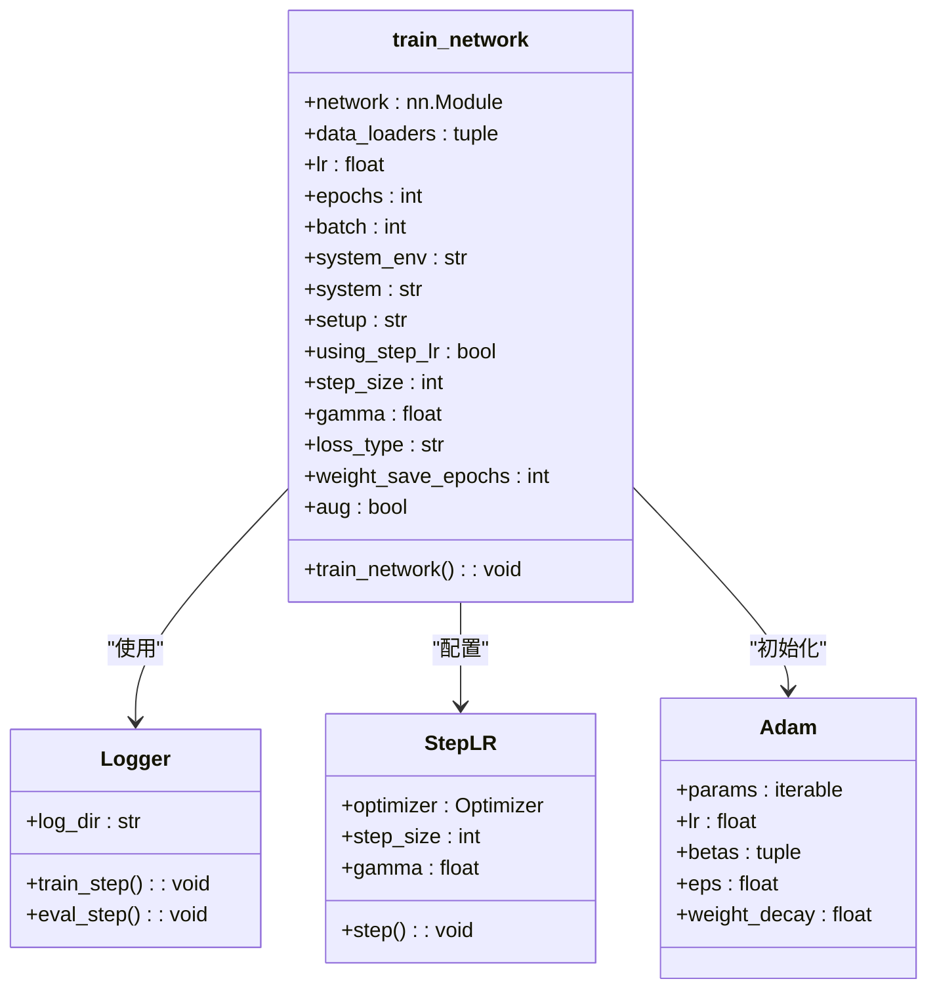
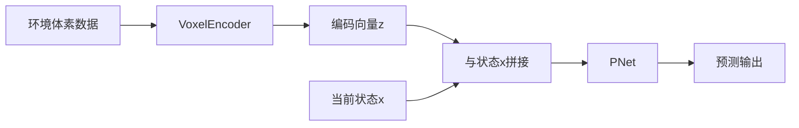
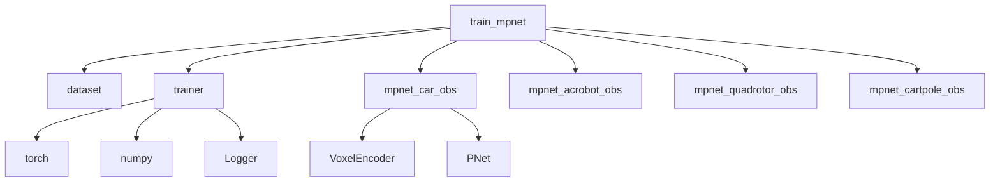

# 模型训练流程

<cite>
**本文档中引用的文件**  
- [train_mpnet.py](file://mpc-mpnet-py/mpnet/train_mpnet.py)
- [dataset.py](file://mpc-mpnet-py/mpnet/dataset/dataset.py)
- [trainer.py](file://mpc-mpnet-py/mpnet/training_utils/trainer.py)
- [mpnet.py](file://mpc-mpnet-py/mpnet/networks/mpnet.py)
- [mpnet_car_obs.py](file://mpc-mpnet-py/mpnet/networks/mpnet_car_obs.py)
- [mpnet_acrobot_obs.py](file://mpc-mpnet-py/mpnet/networks/mpnet_acrobot_obs.py)
- [mpnet_quadrotor_obs.py](file://mpc-mpnet-py/mpnet/networks/mpnet_quadrotor_obs.py)
- [mpnet_cartpole_obs.py](file://mpc-mpnet-py/mpnet/networks/mpnet_cartpole_obs.py)
- [mpnet_cartpole_obs_branch.py](file://mpc-mpnet-py/mpnet/networks/mpnet_cartpole_obs_branch.py)
</cite>

## 目录
1. [简介](#简介)
2. [项目结构](#项目结构)
3. [核心组件](#核心组件)
4. [架构概述](#架构概述)
5. [详细组件分析](#详细组件分析)
6. [依赖分析](#依赖分析)
7. [性能考虑](#性能考虑)
8. [故障排除指南](#故障排除指南)
9. [结论](#结论)

## 简介
本文档全面介绍基于PyTorch的模型训练工作流，以`train_mpnet.py`为核心。详细描述从数据加载、预处理到模型训练的完整流程，涵盖自定义数据集实现、训练循环逻辑、损失函数、优化器配置、学习率调度策略以及批量训练机制。同时提供启动训练、监控过程和保存检查点的代码示例，并为开发者提供调试技巧，如使用TensorBoard进行可视化、检测梯度问题等。

## 项目结构
本项目位于`mpc-mpnet-py`目录下，主要包含以下子模块：
- `mpnet/`：核心训练逻辑与网络结构
  - `dataset/`：数据加载与处理
  - `networks/`：不同系统的MPNet变体
  - `training_utils/`：训练器与日志工具
  - `train_mpnet.py`：主训练脚本
- `params/`：各系统参数配置
- `data_gen/`：数据生成脚本
- `benchmarks/`：基准测试脚本

**图示来源**  
- [train_mpnet.py](file://mpc-mpnet-py/mpnet/train_mpnet.py)
- [dataset.py](file://mpc-mpnet-py/mpnet/dataset/dataset.py)
- [trainer.py](file://mpc-mpnet-py/mpnet/training_utils/trainer.py)

**本节来源**  
- [train_mpnet.py](file://mpc-mpnet-py/mpnet/train_mpnet.py)
- [dataset.py](file://mpc-mpnet-py/mpnet/dataset/dataset.py)

## 核心组件
核心组件包括：
- `train_mpnet.py`：训练入口，通过Click定义命令行参数，加载对应网络和数据。
- `dataset.py`：实现`get_loader`函数，负责从`.npy`文件加载路径数据和标签，并划分为训练集和测试集。
- `trainer.py`：包含`train_network`函数，实现完整的训练循环，支持Adam优化器、StepLR学习率调度、损失记录与模型保存。
- 各`mpnet_*.py`文件：针对不同系统（如car_obs、acrobot_obs）的MPNet模型实现。

**本节来源**  
- [train_mpnet.py](file://mpc-mpnet-py/mpnet/train_mpnet.py#L1-L62)
- [dataset.py](file://mpc-mpnet-py/mpnet/dataset/dataset.py#L1-L43)
- [trainer.py](file://mpc-mpnet-py/mpnet/training_utils/trainer.py#L1-L89)

## 架构概述
系统采用模块化设计，训练流程如下：
1. 用户通过命令行指定系统类型、网络名称、学习率等参数。
2. `train_mpnet.py`根据参数动态导入对应的MPNet模型。
3. `dataset.py`加载预生成的仿真轨迹数据和真值标签。
4. `trainer.py`执行训练循环，包括前向传播、损失计算、反向传播、优化器更新和学习率调度。
5. 训练过程中定期保存模型检查点，并记录训练/验证损失。

**图示来源**  
- [train_mpnet.py](file://mpc-mpnet-py/mpnet/train_mpnet.py#L1-L62)
- [dataset.py](file://mpc-mpnet-py/mpnet/dataset/dataset.py#L1-L43)
- [trainer.py](file://mpc-mpnet-py/mpnet/training_utils/trainer.py#L1-L89)

## 详细组件分析

### 数据集实现分析
`dataset.py`中的`get_loader`函数负责数据加载：
- 从指定路径加载`path_data.npy`和`gt.npy`文件。
- 使用`np.random.shuffle`打乱样本顺序，并按9:1划分训练集和测试集。
- 利用`np_to_loader`将NumPy数组转换为PyTorch的`DataLoader`，支持批量训练和数据打乱。

**图示来源**  
- [dataset.py](file://mpc-mpnet-py/mpnet/dataset/dataset.py#L10-L43)

**本节来源**  
- [dataset.py](file://mpc-mpnet-py/mpnet/dataset/dataset.py#L1-L43)

### 训练器逻辑分析
`trainer.py`中的`train_network`函数实现训练核心逻辑：
- 使用`torch.optim.Adam`作为优化器。
- 支持`StepLR`学习率调度器，每`step_size`轮衰减`gamma`倍。
- 损失函数通过字符串动态调用（如`mse_loss`, `l1_loss`）。
- 在每个epoch中遍历训练集和测试集，记录损失并更新模型。
- 每`weight_save_epochs`轮保存一次模型权重。

**图示来源**  
- [trainer.py](file://mpc-mpnet-py/mpnet/training_utils/trainer.py#L1-L89)

**本节来源**  
- [trainer.py](file://mpc-mpnet-py/mpnet/training_utils/trainer.py#L1-L89)

### 模型结构分析
MPNet模型采用编码器-解码器结构：
- `VoxelEncoder`：将环境体素数据编码为固定长度向量。
- `PNet`：路径规划网络，接收编码后的环境特征和状态输入，输出预测路径。
- `forward`方法将环境编码`z`与输入状态`x`拼接后送入PNet。

**图示来源**  
- [mpnet.py](file://mpc-mpnet-py/mpnet/networks/mpnet.py#L6-L24)
- [mpnet_car_obs.py](file://mpc-mpnet-py/mpnet/networks/mpnet_car_obs.py#L6-L25)

**本节来源**  
- [mpnet.py](file://mpc-mpnet-py/mpnet/networks/mpnet.py#L6-L24)
- [mpnet_car_obs.py](file://mpc-mpnet-py/mpnet/networks/mpnet_car_obs.py#L6-L25)

## 依赖分析
项目依赖关系清晰，模块间耦合度低：
- `train_mpnet.py`依赖`dataset.py`和`trainer.py`。
- `trainer.py`依赖PyTorch、NumPy和自定义Logger。
- 各`mpnet_*.py`文件继承自`mpnet.py`中的基类，实现特定系统逻辑。

**图示来源**  
- [train_mpnet.py](file://mpc-mpnet-py/mpnet/train_mpnet.py)
- [trainer.py](file://mpc-mpnet-py/mpnet/training_utils/trainer.py)
- [mpnet_car_obs.py](file://mpc-mpnet-py/mpnet/networks/mpnet_car_obs.py)

**本节来源**  
- [train_mpnet.py](file://mpc-mpnet-py/mpnet/train_mpnet.py)
- [trainer.py](file://mpc-mpnet-py/mpnet/training_utils/trainer.py)

## 性能考虑
- **批量训练**：通过DataLoader实现批量处理，提升GPU利用率。
- **学习率调度**：使用StepLR避免训练后期震荡，提升收敛稳定性。
- **损失计算**：对输出的每一维单独计算损失后求和，便于监控各维度表现。
- **模型保存**：定期保存检查点，支持训练中断恢复。

## 故障排除指南
- **梯度消失/爆炸**：检查损失是否稳定下降，可尝试调整学习率或使用梯度裁剪。
- **过拟合**：若训练损失持续下降但验证损失上升，可增加正则化或数据增强。
- **CUDA错误**：确保GPU可用，模型和数据正确转移到CUDA设备。
- **数据路径错误**：确认`{system}/data/{setup}/`路径下存在所需`.npy`文件。

**本节来源**  
- [trainer.py](file://mpc-mpnet-py/mpnet/training_utils/trainer.py#L1-L89)
- [dataset.py](file://mpc-mpnet-py/mpnet/dataset/dataset.py#L1-L43)

## 结论
本文档详细解析了基于PyTorch的MPNet模型训练流程，涵盖了从数据加载到模型训练的各个环节。通过模块化设计和清晰的接口，开发者可以方便地扩展和调试训练过程。建议在实际使用中结合TensorBoard监控训练动态，及时调整超参数以获得最佳性能。