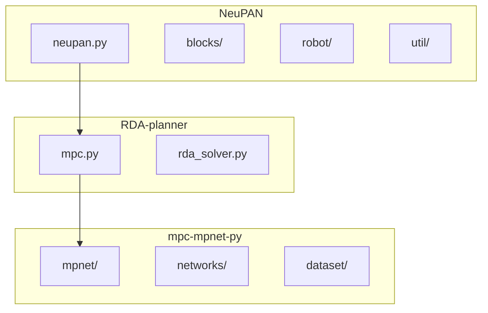
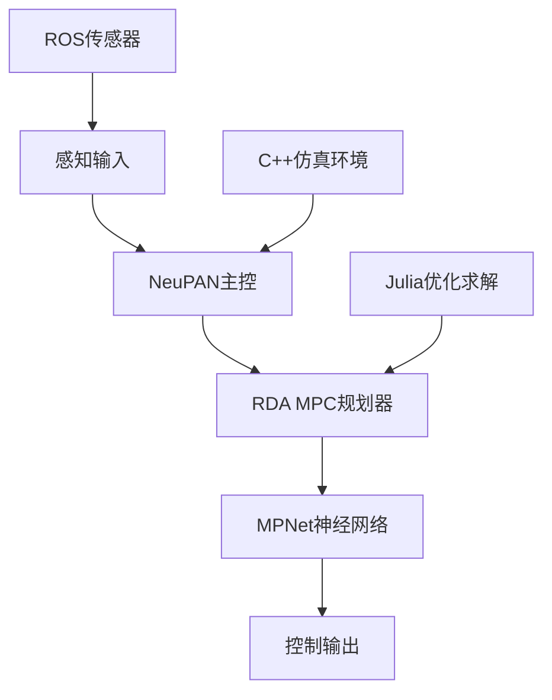
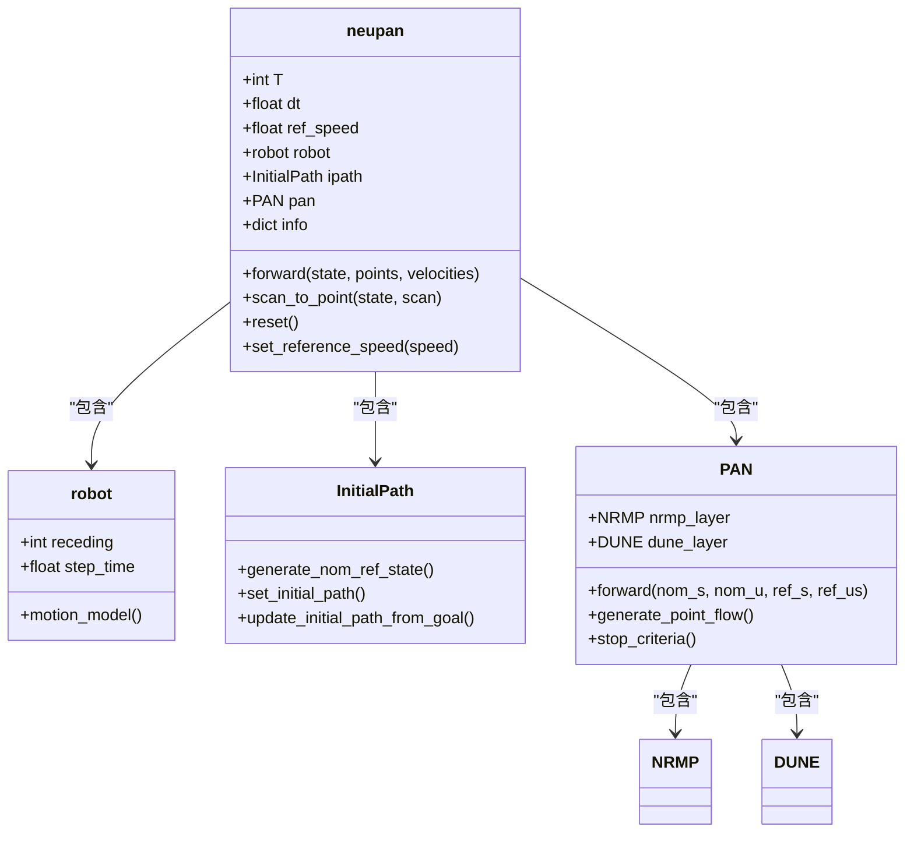
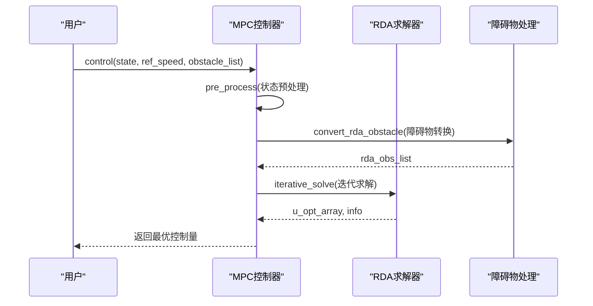
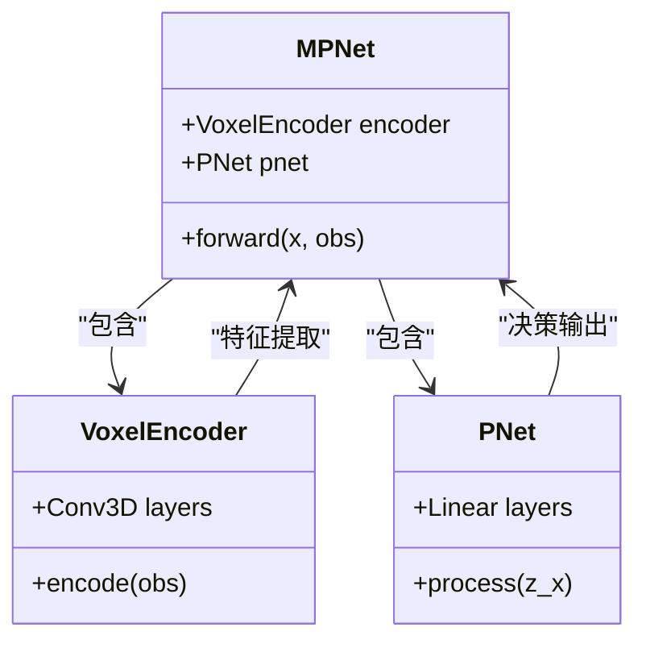
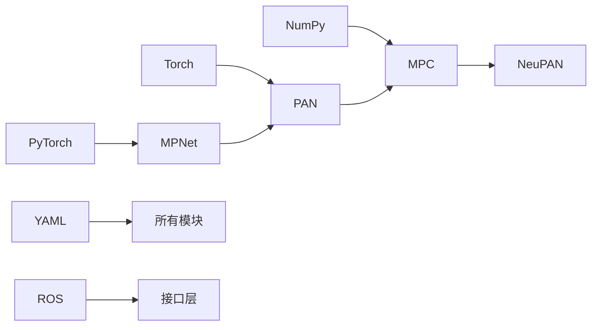

# Python技术栈

<cite>
**本文档中引用的文件**   
- [neupan.py](file://NeuPAN/neupan/neupan.py)
- [pan.py](file://NeuPAN/neupan/blocks/pan.py)
- [mpc.py](file://RDA-planner/RDA_planner/mpc.py)
- [mpnet.py](file://mpc-mpnet-py/mpnet/networks/mpnet.py)
</cite>

## 目录
1. [引言](#引言)
2. [项目结构](#项目结构)
3. [核心组件](#核心组件)
4. [架构概述](#架构概述)
5. [详细组件分析](#详细组件分析)
6. [依赖分析](#依赖分析)
7. [性能考虑](#性能考虑)
8. [故障排除指南](#故障排除指南)
9. [结论](#结论)

## 引言
本文档详细介绍了Python在NeuPAN、RDA-planner和mpc-mpnet-py等子项目中的核心技术应用。重点阐述了PyTorch在神经规划器中的模型构建与训练流程，结合实际代码示例展示端到端MPC规划的实现。同时解释了NumPy在数值计算和路径规划算法中的关键作用，并为不同层次开发者提供环境配置、性能优化和调试策略指导。

## 项目结构
项目采用模块化设计，各子项目独立封装，通过清晰的目录结构组织代码。Python技术栈主要集中在NeuPAN、RDA-planner和mpc-mpnet-py三个核心子项目中。

**图源**
- [neupan.py](file://NeuPAN/neupan/neupan.py#L1-L50)
- [mpc.py](file://RDA-planner/RDA_planner/mpc.py#L1-L30)
- [mpnet.py](file://mpc-mpnet-py/mpnet/networks/mpnet.py#L1-L20)

**本节来源**
- [NeuPAN](file://NeuPAN#L1-L10)
- [RDA-planner](file://RDA-planner#L1-L10)
- [mpc-mpnet-py](file://mpc-mpnet-py#L1-L10)

## 核心组件
Python技术栈在智能规划系统中扮演着核心角色，实现了从感知到决策的完整闭环。NeuPAN作为主控模块，集成MPC规划器和神经网络模型，形成端到端的智能决策系统。

**本节来源**
- [neupan.py](file://NeuPAN/neupan/neupan.py#L25-L100)
- [mpc.py](file://RDA-planner/RDA_planner/mpc.py#L15-L80)

## 架构概述
系统采用分层架构设计，上层为Python实现的智能决策层，下层为C++/Julia实现的高性能计算层。Python层负责系统集成、状态管理和高级决策，通过接口与底层计算模块交互。

**图源**
- [neupan.py](file://NeuPAN/neupan/neupan.py#L10-L50)
- [mpc.py](file://RDA-planner/RDA_planner/mpc.py#L20-L60)

## 详细组件分析
对各核心组件进行深入分析，揭示其内部实现机制和关键技术细节。

### NeuPAN主控模块分析
NeuPAN模块作为系统核心控制器，封装了完整的MPC规划流程，提供用户友好的接口。

**图源**
- [neupan.py](file://NeuPAN/neupan/neupan.py#L50-L150)
- [pan.py](file://NeuPAN/neupan/blocks/pan.py#L15-L45)

### RDA MPC规划器分析
RDA MPC规划器实现基于模型预测控制的路径规划算法，支持多种车辆动力学模型。

**图源**
- [mpc.py](file://RDA-planner/RDA_planner/mpc.py#L100-L200)
- [rda_solver.py](file://RDA-planner/RDA_planner/rda_solver.py#L10-L30)

### MPNet神经网络分析
MPNet神经网络实现基于深度学习的路径规划功能，结合卷积编码器和前馈网络。

**图源**
- [mpnet.py](file://mpc-mpnet-py/mpnet/networks/mpnet.py#L1-L30)
- [voxel_encoder.py](file://mpc-mpnet-py/mpnet/networks/voxel_encoder.py#L5-L20)

**本节来源**
- [neupan.py](file://NeuPAN/neupan/neupan.py#L1-L200)
- [mpc.py](file://RDA-planner/RDA_planner/mpc.py#L1-L300)
- [mpnet.py](file://mpc-mpnet-py/mpnet/networks/mpnet.py#L1-L50)

## 依赖分析
系统各组件之间存在明确的依赖关系，形成清晰的技术栈层次。

**图源**
- [requirements.txt](file://NeuPAN/requirements.txt#L1-L10)
- [setup.py](file://RDA-planner/setup.py#L1-L5)

**本节来源**
- [neupan.py](file://NeuPAN/neupan/neupan.py#L1-L10)
- [mpc.py](file://RDA-planner/RDA_planner/mpc.py#L1-L10)
- [mpnet.py](file://mpc-mpnet-py/mpnet/networks/mpnet.py#L1-L10)

## 性能考虑
Python技术栈在保证开发效率的同时，通过多种机制确保运行性能。

- **PyTorch优化**：利用GPU加速神经网络推理
- **NumPy向量化**：避免Python循环，提高数值计算效率
- **算法优化**：采用ADMM等高效优化算法
- **内存管理**：合理使用张量和数组，减少内存拷贝
- **并行计算**：支持多进程求解，充分利用CPU资源

## 故障排除指南
提供常见问题的诊断和解决方案。

**本节来源**
- [neupan.py](file://NeuPAN/neupan/neupan.py#L300-L400)
- [mpc.py](file://RDA-planner/RDA_planner/mpc.py#L500-L570)

## 结论
Python技术栈在智能规划系统中发挥了关键作用，通过PyTorch和NumPy等强大库的支持，实现了高效的算法开发和系统集成。NeuPAN、RDA-planner和mpc-mpnet-py三个子项目协同工作，形成了完整的智能决策系统，为自动驾驶和机器人导航提供了可靠的技术基础。