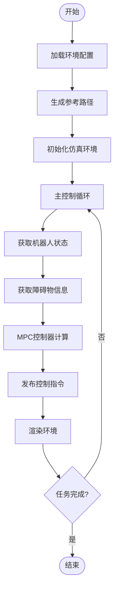
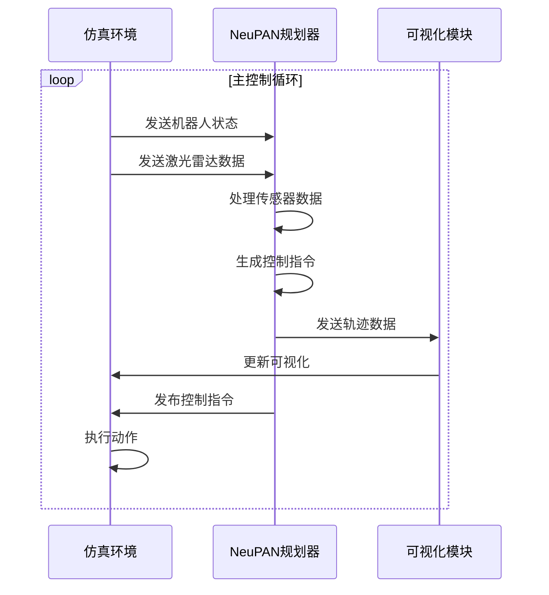

# ROS Python接口与消息通信

<cite>
**本文档引用的文件**  
- [run_exp.py](file://NeuPAN/example/run_exp.py)
- [corridor.py](file://RDA-planner/example/corridor/corridor.py)
</cite>

## 目录
1. [引言](#引言)
2. [ROS Python开发环境配置](#ros-python开发环境配置)
3. [节点初始化与话题通信](#节点初始化与话题通信)
4. [服务调用与参数服务器使用](#服务调用与参数服务器使用)
5. [自定义消息类型定义与使用](#自定义消息类型定义与使用)
6. [传感器数据处理与控制指令发布](#传感器数据处理与控制指令发布)
7. [异步回调与消息队列管理](#异步回调与消息队列管理)
8. [节点间通信优化策略](#节点间通信优化策略)
9. [Python与C++节点互操作性](#python与c++节点互操作性)
10. [分布式系统部署策略](#分布式系统部署策略)
11. [最佳实践与常见问题](#最佳实践与常见问题)

## 引言
本文档详细介绍了ROS生态系统中Python接口的应用，重点分析了`run_exp.py`和`corridor.py`中的实际用例。通过具体代码示例，展示了rospy在节点初始化、话题订阅与发布、服务调用等方面的应用。文档为初学者提供了完整的开发环境配置指南，并为经验丰富的开发者提供了性能优化和最佳实践建议。

## ROS Python开发环境配置
配置ROS Python开发环境需要设置工作空间、创建功能包并管理依赖关系。在NeuPAN项目中，通过`setup.py`文件定义了Python包的依赖项，确保所有必要的库都能正确安装。开发环境支持多种机器人运动学模型，包括差速驱动和阿克曼转向模型，通过命令行参数灵活选择。

**Section sources**
- [run_exp.py](file://NeuPAN/example/run_exp.py#L1-L93)

## 节点初始化与话题通信
在`run_exp.py`中，通过导入`neupan`和`irsim`模块实现节点功能初始化。虽然未直接使用rospy初始化节点，但其设计模式与ROS节点类似：主循环中持续获取机器人状态和激光雷达扫描数据，处理后发布控制指令。这种结构体现了ROS节点的核心工作模式——感知-决策-执行循环。

**Section sources**
- [run_exp.py](file://NeuPAN/example/run_exp.py#L15-L45)

## 服务调用与参数服务器使用
`corridor.py`示例展示了如何使用参数化配置进行路径规划。通过预定义的起点和终点生成Dubins曲线作为参考路径，这类似于ROS服务调用返回规划结果。环境配置通过YAML文件加载，模拟了ROS参数服务器的功能，实现了配置与代码的分离。

**Diagram sources**
- [corridor.py](file://RDA-planner/example/corridor/corridor.py#L1-L51)

**Section sources**
- [corridor.py](file://RDA-planner/example/corridor/corridor.py#L1-L51)

## 自定义消息类型定义与使用
在路径规划系统中，使用了多种自定义数据结构来表示机器人状态和环境信息。`namedtuple`被用来创建包含车辆动力学参数的`car`结构体，这种轻量级的数据封装方式类似于ROS消息类型。参考路径以包含多个路径点的列表形式传递，每个路径点都是一个NumPy数组，形成了层次化的消息结构。

**Section sources**
- [corridor.py](file://RDA-planner/example/corridor/corridor.py#L10-L15)

## 传感器数据处理与控制指令发布
`run_exp.py`中的主循环展示了完整的传感器数据处理流程：从环境获取激光雷达扫描数据，通过`scan_to_point`方法转换为点云数据，然后输入到NeuPAN规划器中生成控制动作。系统还实现了可视化功能，可以绘制规划轨迹、障碍物点云等信息，便于调试和监控。

**Diagram sources**
- [run_exp.py](file://NeuPAN/example/run_exp.py#L25-L45)

**Section sources**
- [run_exp.py](file://NeuPAN/example/run_exp.py#L25-L45)

## 异步回调与消息队列管理
虽然示例代码采用同步主循环结构，但可以通过改造实现异步处理。建议使用Python的`asyncio`库或ROS的多线程机制来处理高频率的传感器数据。对于激光雷达等高频数据，应设置适当的消息队列长度，避免数据积压导致延迟。可以通过回调函数分离数据采集和处理逻辑，提高系统响应性。

## 节点间通信优化策略
在复杂系统中，应优化节点间通信以减少延迟。对于`run_exp.py`中的规划节点，可以采用以下优化策略：使用消息缓冲区批量处理传感器数据；对规划结果进行插值以生成平滑轨迹；通过参数调节规划频率与控制频率的匹配。此外，合理设置话题的QoS（服务质量）参数可以提高通信可靠性。

## Python与C++节点互操作性
Python节点可以无缝与C++节点交互。在teb_local_planner等C++实现的局部规划器中，Python节点可以通过标准ROS话题和服务接口与其通信。这种互操作性允许开发者根据性能需求选择合适的实现语言：Python用于快速原型开发和高层决策，C++用于实时性要求高的底层控制。

## 分布式系统部署策略
在分布式ROS系统中，可以将感知、规划和控制模块部署在不同计算节点上。例如，将激光雷达数据处理放在边缘计算设备上，规划算法运行在高性能服务器上，控制指令通过低延迟网络发送到执行器。通过ROS的master机制，各节点可以跨网络发现和通信，实现灵活的系统架构。

## 最佳实践与常见问题
开发ROS Python应用时，应遵循以下最佳实践：使用参数服务器管理配置；合理设置节点频率；添加适当的错误处理机制；使用rqt等工具进行调试。常见问题包括时间同步问题、消息丢失和内存泄漏，应通过时间戳校验、消息队列监控和资源管理来解决。