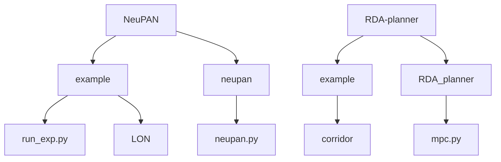
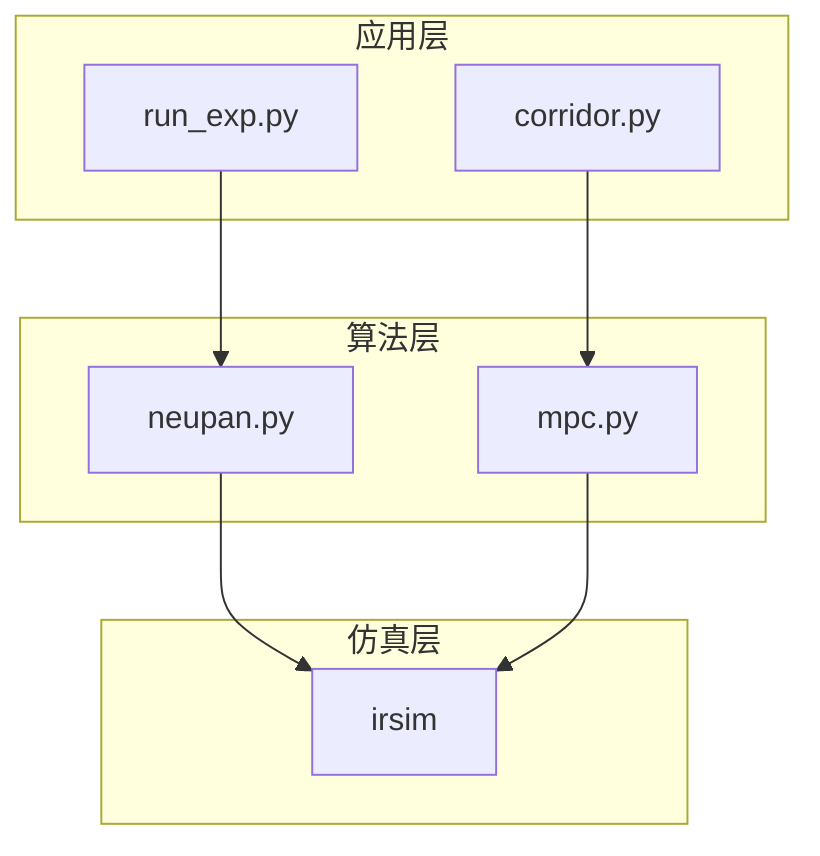
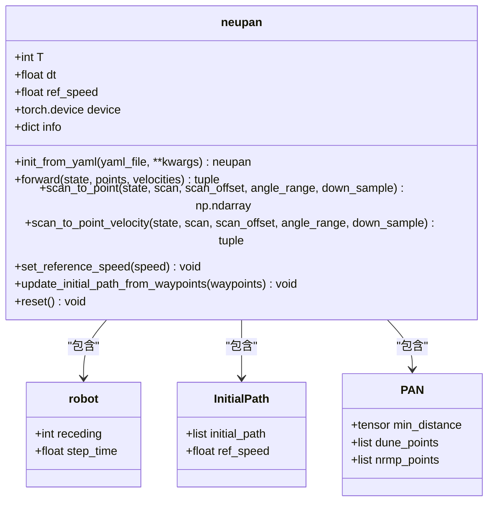
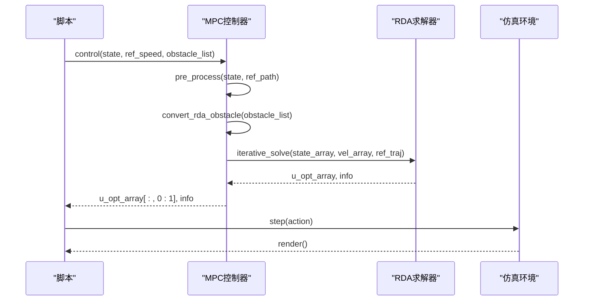
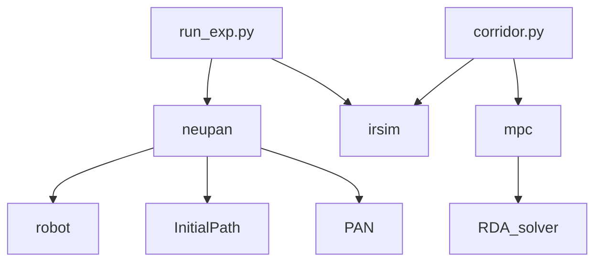

# ROS节点管理

<cite>
**本文档中引用的文件**  
- [run_exp.py](file://NeuPAN/example/run_exp.py)
- [corridor.py](file://RDA-planner/example/corridor/corridor.py)
- [neupan.py](file://NeuPAN/neupan/neupan.py)
- [mpc.py](file://RDA-planner/RDA_planner/mpc.py)
- [LON_corridor.py](file://NeuPAN/example/LON/LON_corridor.py)
- [env.yaml](file://NeuPAN/example/corridor/diff/env.yaml)
</cite>

## 目录
1. [简介](#简介)
2. [项目结构](#项目结构)
3. [核心组件](#核心组件)
4. [架构概述](#架构概述)
5. [详细组件分析](#详细组件分析)
6. [依赖关系分析](#依赖关系分析)
7. [性能考虑](#性能考虑)
8. [故障排除指南](#故障排除指南)
9. [结论](#结论)

## 简介
本文档详细介绍了在ROS环境中使用Python进行节点管理的方法，重点分析了`rospy`库在节点初始化和生命周期管理中的应用。通过`run_exp.py`和`corridor.py`两个实际用例，深入探讨了ROS节点的创建、多节点协同工作模式、命名冲突解决方案以及节点间依赖关系的处理机制。文档为初学者提供了节点调试技巧，同时为经验丰富的开发者总结了最佳实践，包括资源管理、日志记录和错误处理。

## 项目结构
项目结构展示了多个子模块的组织方式，其中`NeuPAN`和`RDA-planner`是主要的实验模块。`NeuPAN`模块包含示例脚本和核心算法实现，而`RDA-planner`模块提供了路径规划和MPC控制功能。这种模块化设计便于功能扩展和维护。

**图示来源**  
- [run_exp.py](file://NeuPAN/example/run_exp.py#L1-L93)
- [corridor.py](file://RDA-planner/example/corridor/corridor.py#L1-L50)

**本节来源**  
- [run_exp.py](file://NeuPAN/example/run_exp.py#L1-L93)
- [corridor.py](file://RDA-planner/example/corridor/corridor.py#L1-L50)

## 核心组件
核心组件包括`neupan`类和`MPC`类，分别负责神经网络路径规划和模型预测控制。`neupan`类封装了PAN算法，提供了用户友好的接口，而`MPC`类实现了基于RDA求解器的优化控制。这些组件通过清晰的接口设计实现了功能解耦。

**本节来源**  
- [neupan.py](file://NeuPAN/neupan/neupan.py#L1-L403)
- [mpc.py](file://RDA-planner/RDA_planner/mpc.py#L1-L570)

## 架构概述
系统架构采用分层设计，上层为实验脚本，中层为算法实现，底层为仿真环境。`run_exp.py`作为主入口点，协调`neupan`和`irsim`之间的交互。这种架构支持灵活的实验配置和算法替换。

**图示来源**  
- [run_exp.py](file://NeuPAN/example/run_exp.py#L1-L93)
- [corridor.py](file://RDA-planner/example/corridor/corridor.py#L1-L50)
- [neupan.py](file://NeuPAN/neupan/neupan.py#L1-L403)
- [mpc.py](file://RDA-planner/RDA_planner/mpc.py#L1-L570)

## 详细组件分析

### neupan类分析
`neupan`类是NeuPAN算法的核心实现，继承自`torch.nn.Module`，提供了完整的路径规划功能。类的初始化参数包括预测时域、时间步长和参考速度等，支持从YAML文件加载配置。

#### 类图

**图示来源**  
- [neupan.py](file://NeuPAN/neupan/neupan.py#L1-L403)

**本节来源**  
- [neupan.py](file://NeuPAN/neupan/neupan.py#L1-L403)

### MPC类分析
`MPC`类实现了模型预测控制算法，通过迭代求解优化问题生成控制指令。类支持多种车辆动力学模型，包括阿克曼转向、差速驱动和全向移动。

#### 序列图

**图示来源**  
- [mpc.py](file://RDA-planner/RDA_planner/mpc.py#L1-L570)

**本节来源**  
- [mpc.py](file://RDA-planner/RDA_planner/mpc.py#L1-L570)

## 依赖关系分析
项目依赖关系清晰，`run_exp.py`依赖`neupan`和`irsim`，`corridor.py`依赖`mpc`和`irsim`。`neupan`类内部依赖`robot`、`InitialPath`和`PAN`等组件。这种依赖结构支持模块化开发和测试。

**图示来源**  
- [run_exp.py](file://NeuPAN/example/run_exp.py#L1-L93)
- [neupan.py](file://NeuPAN/neupan/neupan.py#L1-L403)
- [corridor.py](file://RDA-planner/example/corridor/corridor.py#L1-L50)
- [mpc.py](file://RDA-planner/RDA_planner/mpc.py#L1-L570)

**本节来源**  
- [run_exp.py](file://NeuPAN/example/run_exp.py#L1-L93)
- [neupan.py](file://NeuPAN/neupan/neupan.py#L1-L403)
- [corridor.py](file://RDA-planner/example/corridor/corridor.py#L1-L50)
- [mpc.py](file://RDA-planner/RDA_planner/mpc.py#L1-L570)

## 性能考虑
算法性能受多个因素影响，包括预测时域长度、障碍物数量和优化迭代次数。建议根据实际应用场景调整参数，在计算效率和控制精度之间取得平衡。使用GPU加速可以显著提升神经网络推理速度。

## 故障排除指南
常见问题包括节点启动失败、规划路径异常和控制指令不响应。建议使用`rosnode list`和`rostopic echo`等工具监控节点状态和消息流。对于规划失败的情况，检查障碍物检测和参考路径生成是否正常。

**本节来源**  
- [run_exp.py](file://NeuPAN/example/run_exp.py#L1-L93)
- [corridor.py](file://RDA-planner/example/corridor/corridor.py#L1-L50)

## 结论
本文档详细分析了ROS节点管理的关键技术和实现方法。通过`run_exp.py`和`corridor.py`两个用例，展示了从节点初始化到多节点协同工作的完整流程。建议在实际应用中遵循模块化设计原则，合理管理节点生命周期，确保系统的稳定性和可维护性。