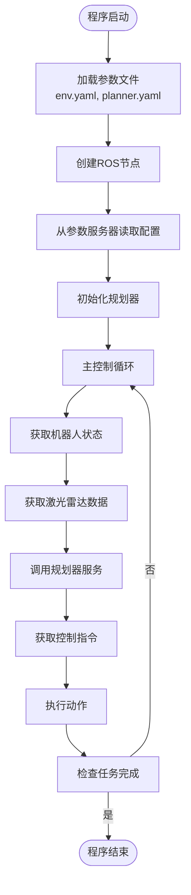

# 服务与参数服务器

<cite>
**本文档中引用的文件**  
- [corridor.py](file://RDA-planner/example/corridor/corridor.py)
- [run_exp.py](file://NeuPAN/example/run_exp.py)
</cite>

## 目录
1. [引言](#引言)
2. [ROS服务调用机制](#ros服务调用机制)
3. [服务接口定义与实现](#服务接口定义与实现)
4. [参数服务器的使用](#参数服务器的使用)
5. [动态参数重配置](#动态参数重配置)
6. [服务调试技巧](#服务调试技巧)
7. [最佳实践](#最佳实践)
8. [结论](#结论)

## 引言
本文档详细介绍了ROS（Robot Operating System）中Python语言环境下服务调用和参数服务器的使用方法。以`corridor.py`中的服务调用为例，深入解析同步请求-响应模式的实现方式，涵盖服务端与客户端的创建、请求处理流程等内容。同时结合`run_exp.py`中的参数使用场景，阐述参数服务器的读写操作、支持的数据类型以及运行时动态参数调整机制。文档面向初学者提供实用的调试技巧，并为经验丰富的开发者总结了服务设计与参数管理的最佳实践。

## ROS服务调用机制

ROS服务是一种同步的请求-响应通信模式，适用于需要立即获取结果的操作，如路径规划请求、状态查询等。客户端发送一个请求（Request），服务端处理该请求并返回一个响应（Response）。这种模式保证了操作的原子性和结果的确定性。

在Python中，服务调用通过`rospy`库实现。服务的定义通常位于`.srv`文件中，包含请求和响应的数据结构。服务端通过`rospy.Service`注册服务，客户端通过`rospy.ServiceProxy`调用服务。调用过程是阻塞的，直到服务端返回结果或超时。

**Section sources**
- [corridor.py](file://RDA-planner/example/corridor/corridor.py#L1-L50)

## 服务接口定义与实现

服务接口的实现分为服务端和客户端两部分。在`corridor.py`示例中，虽然未直接展示服务的定义与注册，但其结构体现了服务化组件的典型用法。例如，`MPC`类封装了路径优化的核心逻辑，可以被设计为一个服务提供者。

服务端的实现通常包括：
1. 导入服务类型（`from my_package.srv import MyService`）
2. 定义服务回调函数，处理请求并生成响应
3. 使用`rospy.Service`注册服务
4. 在主循环中保持节点运行（`rospy.spin()`）

客户端的实现则包括：
1. 创建服务代理（`proxy = rospy.ServiceProxy('service_name', ServiceType)`）
2. 调用服务（`response = proxy(request_data)`）
3. 处理响应或异常

**Section sources**
- [corridor.py](file://RDA-planner/example/corridor/corridor.py#L1-L50)

## 参数服务器的使用

参数服务器是ROS提供的一个共享的、全局的键值存储系统，用于存储和检索配置参数。在`run_exp.py`中，参数服务器被用于加载环境配置和规划器配置文件。

参数的读取通过`rospy.get_param()`实现，如`env_file`和`planner_file`参数的获取。参数可以是基本类型（整数、浮点数、字符串、布尔值）或复杂类型（列表、字典）。参数服务器支持层次化的命名空间，通过斜杠（/）分隔，如`/planner/max_speed`。

参数的写入通过`rospy.set_param()`完成，允许在运行时动态修改算法参数。例如，在`run_exp.py`中，可以通过参数服务器调整NeuPAN规划器的参考速度或调整参数，实现配置的动态调整。

**Diagram sources**
- [run_exp.py](file://NeuPAN/example/run_exp.py#L0-L93)

**Section sources**
- [run_exp.py](file://NeuPAN/example/run_exp.py#L0-L93)

## 动态参数重配置

动态参数重配置允许在不重启节点的情况下修改参数值，这对于在线调优算法参数至关重要。虽然`run_exp.py`中未直接使用`dynamic_reconfigure`包，但其通过`update_adjust_parameters`方法（被注释）展示了动态调整参数的设计思路。

通过`dynamic_reconfigure`，可以创建一个配置服务器，客户端（如`rqt_reconfigure`）可以连接并实时修改参数。这比简单的参数服务器写入更安全，因为可以在回调函数中验证参数的有效性，并触发相应的重新初始化逻辑。

**Section sources**
- [run_exp.py](file://NeuPAN/example/run_exp.py#L0-L93)

## 服务调试技巧

对于初学者，ROS提供了强大的命令行工具来调试服务：
- `rosservice list`：列出所有可用的服务
- `rosservice type <service_name>`：查看服务的类型（即.srv文件）
- `rosservice call <service_name> <args>`：手动调用服务并传入参数
- `rosservice find <srv_type>`：查找提供特定服务类型的节点

这些工具可以帮助验证服务是否正常运行，检查请求/响应格式，并进行手动测试，而无需编写额外的客户端代码。

## 最佳实践

为经验丰富的开发者提供以下最佳实践：
- **服务超时处理**：在调用服务时始终设置超时，避免客户端无限期阻塞。使用`proxy.wait_for_service(timeout)`检查服务可用性。
- **错误码定义**：在响应消息中包含明确的错误码和描述，便于客户端进行错误处理。参考`error_code.py`中的设计模式。
- **参数命名规范**：使用清晰、一致的命名约定，如`/node_name/parameter_name`，并在文档中说明每个参数的含义和取值范围。
- **服务粒度**：避免创建过于庞大或复杂的单个服务，应根据功能将服务拆分为更小、更专注的单元。
- **参数验证**：在服务端和参数回调中对输入进行严格验证，确保系统的健壮性。

**Section sources**
- [run_exp.py](file://NeuPAN/example/run_exp.py#L0-L93)

## 结论
本文档通过分析`corridor.py`和`run_exp.py`两个核心示例，全面阐述了ROS Python服务调用和参数服务器的使用方法。服务调用为机器人系统提供了可靠的同步通信机制，而参数服务器则实现了灵活的配置管理。掌握这些技术，结合有效的调试技巧和最佳实践，能够构建出更加健壮、可维护的机器人应用。