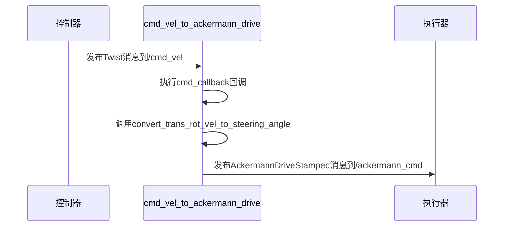

# 话题通信机制

<cite>
**本文档中引用的文件**   
- [publish_dynamic_obstacle.py](file://teb_local_planner/scripts/publish_dynamic_obstacle.py)
- [cmd_vel_to_ackermann_drive.py](file://teb_local_planner/scripts/cmd_vel_to_ackermann_drive.py)
</cite>

## 目录
1. [引言](#引言)
2. [话题发布器实现机制](#话题发布器实现机制)
3. [话题订阅器与回调函数设计](#话题订阅器与回调函数设计)
4. [消息类型定义与使用](#消息类型定义与使用)
5. [通信调试方法](#通信调试方法)
6. [最佳实践与优化策略](#最佳实践与优化策略)
7. [结论](#结论)

## 引言
ROS（Robot Operating System）中的话题通信机制是实现模块间解耦和分布式协作的核心。本节将深入探讨基于Python的话题发布与订阅机制，重点分析障碍物信息发布和控制指令转换的实际案例。通过`publish_dynamic_obstacle.py`和`cmd_vel_to_ackermann_drive.py`两个脚本，展示如何在实际项目中实现高效、可靠的消息传递。

## 话题发布器实现机制

`publish_dynamic_obstacle.py`脚本展示了如何创建一个动态障碍物信息的话题发布器。该脚本首先初始化ROS节点，并创建一个发布者对象，用于向`/test_optim_node/obstacles`话题发布`ObstacleArrayMsg`类型的消息。发布频率通过`rospy.Rate(10)`设置为10Hz，确保了数据的实时性。脚本中定义了一个点障碍物，其位置随时间变化，模拟动态障碍物的运动。障碍物的速度信息通过`TwistWithCovariance`消息类型封装，并与位置信息一起发布，为路径规划器提供完整的动态环境感知数据。

**节来源**
- [publish_dynamic_obstacle.py](file://teb_local_planner/scripts/publish_dynamic_obstacle.py#L1-L67)

## 话题订阅器与回调函数设计

`cmd_vel_to_ackermann_drive.py`脚本实现了从`geometry_msgs/Twist`到`ackermann_msgs/AckermannDriveStamped`的消息转换，展示了话题订阅器的设计模式。该脚本创建了一个订阅器，监听`/cmd_vel`话题，并在接收到消息时触发`cmd_callback`回调函数。回调函数中，线速度和角速度被转换为阿克曼转向模型所需的前轮转角和车速。消息队列的缓冲策略通过`queue_size=1`参数设置，确保了消息的及时处理，避免了消息积压。此外，脚本通过参数服务器获取车辆轴距等配置信息，实现了良好的可配置性。

**图来源**
- [cmd_vel_to_ackermann_drive.py](file://teb_local_planner/scripts/cmd_vel_to_ackermann_drive.py#L1-L65)

**节来源**
- [cmd_vel_to_ackermann_drive.py](file://teb_local_planner/scripts/cmd_vel_to_ackermann_drive.py#L1-L65)

## 消息类型定义与使用

在ROS中，消息类型是通信的基础。`publish_dynamic_obstacle.py`使用了`costmap_converter/ObstacleArrayMsg`和`ObstacleMsg`等自定义消息类型，这些消息类型能够封装复杂的障碍物信息，包括位置、形状、速度和方向。`cmd_vel_to_ackermann_drive.py`则使用了标准的`geometry_msgs/Twist`和`ackermann_msgs/AckermannDriveStamped`消息类型，分别用于表示差速驱动和阿克曼转向的控制指令。正确选择和使用消息类型，能够确保数据的准确传递和系统的互操作性。

**节来源**
- [publish_dynamic_obstacle.py](file://teb_local_planner/scripts/publish_dynamic_obstacle.py#L1-L67)
- [cmd_vel_to_ackermann_drive.py](file://teb_local_planner/scripts/cmd_vel_to_ackermann_drive.py#L1-L65)

## 通信调试方法

对于初学者，使用`rostopic`命令行工具是调试话题通信的有效方法。例如，使用`rostopic echo /test_optim_node/obstacles`可以实时查看发布的障碍物信息，验证发布器是否正常工作。使用`rostopic info /cmd_vel`可以查看`/cmd_vel`话题的发布者和订阅者，帮助理解系统的数据流。此外，`rqt_graph`工具可以可视化节点间的连接关系，便于分析复杂的通信拓扑。

**节来源**
- [publish_dynamic_obstacle.py](file://teb_local_planner/scripts/publish_dynamic_obstacle.py#L1-L67)
- [cmd_vel_to_ackermann_drive.py](file://teb_local_planner/scripts/cmd_vel_to_ackermann_drive.py#L1-L65)

## 最佳实践与优化策略

对于经验丰富的开发者，话题通信的优化至关重要。带宽优化可以通过减少发布频率或使用消息压缩来实现。实时性保障策略包括使用实时操作系统、优化回调函数的执行时间以及合理设置消息队列大小。此外，使用`latched`话题可以确保新订阅者能够立即接收到最新的状态信息。在多订阅器场景下，应考虑消息的同步问题，避免因处理延迟导致的数据不一致。

**节来源**
- [publish_dynamic_obstacle.py](file://teb_local_planner/scripts/publish_dynamic_obstacle.py#L1-L67)
- [cmd_vel_to_ackermann_drive.py](file://teb_local_planner/scripts/cmd_vel_to_ackermann_drive.py#L1-L65)

## 结论
ROS的话题通信机制为机器人系统的模块化设计提供了强大的支持。通过深入分析`publish_dynamic_obstacle.py`和`cmd_vel_to_ackermann_drive.py`两个脚本，我们不仅掌握了话题发布与订阅的基本实现方法，还了解了消息类型的选择、通信调试技巧以及性能优化策略。这些知识对于开发高效、可靠的机器人应用具有重要意义。