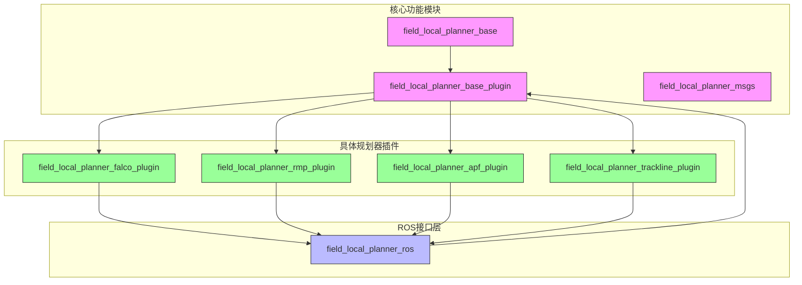
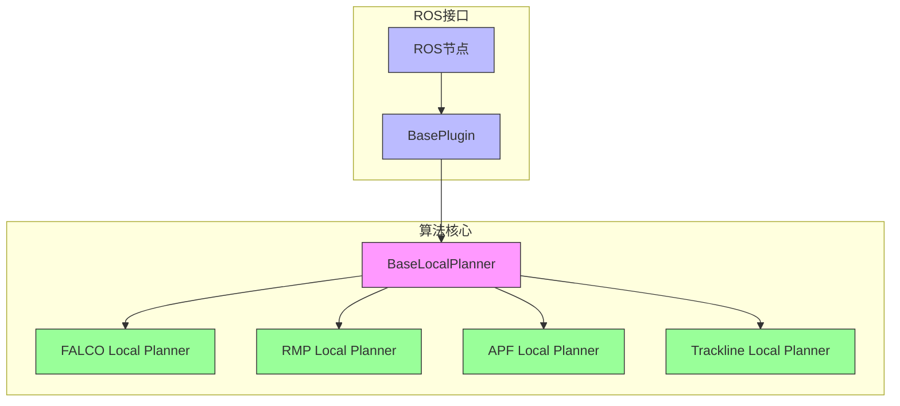
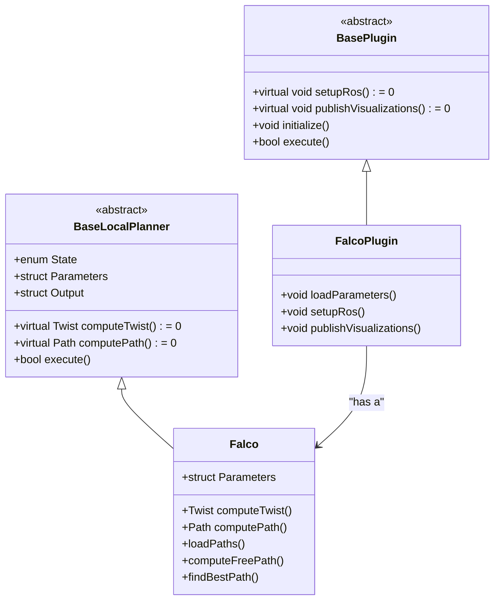
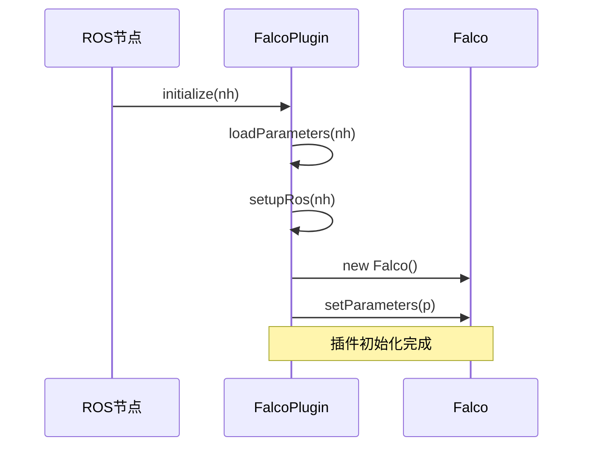
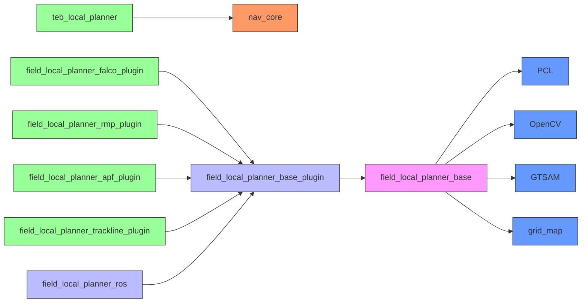

# ROS框架集成

<cite>
**本文档中引用的文件**  
- [teb_local_planner_plugin.xml](file://teb_local_planner/teb_local_planner_plugin.xml)
- [field_local_planner_plugin.xml](file://field_local_planners/field_local_planner_falco/field_local_planner_falco_plugin/field_local_planner_plugin.xml)
- [local_planner.launch.xml](file://field_local_planner_ros/launch/local_planner.launch.xml)
- [base_local_planner.hpp](file://field_local_planner_base/field_local_planner_base/include/field_local_planner_base/base_local_planner.hpp)
- [base_plugin.hpp](file://field_local_planner_base_plugin/include/field_local_planner_base_plugin/base_plugin.hpp)
- [falco_local_planner.hpp](file://field_local_planner_falco/include/field_local_planner_falco/falco_local_planner.hpp)
- [falco_plugin.cpp](file://field_local_planner_falco_plugin/src/field_local_planner_falco_plugin/falco_plugin.cpp)
</cite>

## 目录
1. [引言](#引言)
2. [项目结构](#项目结构)
3. [核心组件](#核心组件)
4. [架构概述](#架构概述)
5. [详细组件分析](#详细组件分析)
6. [依赖分析](#依赖分析)
7. [性能考虑](#性能考虑)
8. [故障排除指南](#故障排除指南)
9. [结论](#结论)

## 引言
本文档详细阐述了ROS（机器人操作系统）框架在导航系统中的集成机制，重点聚焦于局部路径规划器的设计与实现。文档深入解析了ROS节点、话题、服务和插件系统在多个局部规划器（如TEB、FALCO、RMP等）中的协同工作机制。通过分析`teb_local_planner_plugin.xml`和`field_local_planner_plugin.xml`等核心配置文件，揭示了ROS插件系统的动态加载原理。同时，文档解释了launch文件在系统启动和参数配置中的关键作用，并强调了TF坐标变换在机器人感知与运动控制中的核心地位。本指南旨在为初学者提供清晰的ROS工作流程，也为高级开发者提供优化和迁移的实践策略。

## 项目结构
项目采用标准的ROS工作空间结构，以`field_local_planner`为核心，包含多个独立的规划器插件。整体结构清晰地分离了基础功能、ROS接口和具体算法实现。



**图示来源**
- [field_local_planner](file://field_local_planner)

**本节来源**
- [field_local_planner](file://field_local_planner)

## 核心组件
本系统的核心组件围绕`BaseLocalPlanner`抽象基类和`BasePlugin`ROS插件基类构建。`BaseLocalPlanner`定义了所有局部规划器必须实现的`computeTwist()`和`computePath()`接口，以及状态管理、传感器数据输入等通用功能。`BasePlugin`则负责处理ROS相关的所有交互，包括话题订阅、服务调用、动态参数配置和TF坐标变换，实现了算法逻辑与ROS框架的解耦。

**本节来源**
- [base_local_planner.hpp](file://field_local_planner_base/field_local_planner_base/include/field_local_planner_base/base_local_planner.hpp)
- [base_plugin.hpp](file://field_local_planner_base_plugin/include/field_local_planner_base_plugin/base_plugin.hpp)

## 架构概述
系统采用分层插件化架构，确保了高内聚、低耦合的设计原则。上层为ROS接口，负责与外部系统通信；中层为插件基类，管理ROS资源和生命周期；底层为具体算法实现，专注于路径规划逻辑。



**图示来源**
- [base_local_planner.hpp](file://field_local_planner_base/field_local_planner_base/include/field_local_planner_base/base_local_planner.hpp)
- [base_plugin.hpp](file://field_local_planner_base_plugin/include/field_local_planner_base_plugin/base_plugin.hpp)

## 详细组件分析

### FALCO规划器分析
FALCO规划器是一种基于预计算路径库的局部规划器，通过碰撞检测和评分机制选择最优路径。

#### 类图


**图示来源**
- [falco_local_planner.hpp](file://field_local_planner_falco/include/field_local_planner_falco/falco_local_planner.hpp)
- [falco_plugin.cpp](file://field_local_planner_falco_plugin/src/field_local_planner_falco_plugin/falco_plugin.cpp)

#### 插件初始化序列图


**图示来源**
- [falco_plugin.cpp](file://field_local_planner_falco_plugin/src/field_local_planner_falco_plugin/falco_plugin.cpp)

**本节来源**
- [falco_local_planner.hpp](file://field_local_planner_falco/include/field_local_planner_falco/falco_local_planner.hpp)
- [falco_plugin.cpp](file://field_local_planner_falco_plugin/src/field_local_planner_falco_plugin/falco_plugin.cpp)

### ROS插件系统机制
ROS插件系统通过`pluginlib`库实现动态加载。`field_local_planner_plugin.xml`文件是插件的注册表，它声明了插件库的路径、类名和基类类型。当ROS节点请求加载一个插件时，`pluginlib`会读取该XML文件，找到对应的共享库（如`libfield_local_planner_falco_plugin.so`），并创建指定类（如`field_local_planner::FalcoPlugin`）的实例。这种机制允许在不修改主程序代码的情况下，通过替换插件库来扩展或更换功能。

```xml
<library path="lib/libfield_local_planner_falco_plugin">
  <class type="field_local_planner::FalcoPlugin" base_class_type="field_local_planner::BasePlugin" >
    <description>
      FALCO-inspired local planner
    </description>
  </class>
</library>
```

**本节来源**
- [field_local_planner_plugin.xml](file://field_local_planners/field_local_planner_falco/field_local_planner_falco_plugin/field_local_planner_plugin.xml)

### Launch文件作用
`local_planner.launch.xml`文件定义了系统启动时的节点配置和参数传递。它通过`<arg>`标签声明可配置参数（如话题名称、调试模式），并通过`<param>`标签将这些参数注入到`field_local_planner_node`节点中。这种方式实现了配置与代码的分离，使得同一套代码可以在不同场景下通过修改launch文件来适应不同的传感器配置或运行模式。

**本节来源**
- [local_planner.launch.xml](file://field_local_planner_ros/launch/local_planner.launch.xml)

### TF坐标变换
TF（Transform）系统是ROS中处理坐标变换的核心。在本系统中，`BasePlugin`类通过`tf_buffer_`和`tf_listener_`订阅并缓存不同坐标系（如`odom`、`base_link`、`camera`）之间的实时变换。当规划器需要将传感器数据（如点云）从相机坐标系转换到机器人基座坐标系或世界坐标系时，可以直接查询TF树，确保了所有感知和决策数据都在统一的坐标系下进行，这是实现精确导航的基础。

**本节来源**
- [base_plugin.hpp](file://field_local_planner_base_plugin/include/field_local_planner_base_plugin/base_plugin.hpp)

## 依赖分析
系统依赖关系清晰，形成了一个稳定的依赖链。



**图示来源**
- [package.xml](file://teb_local_planner/package.xml)
- [CMakeLists.txt](file://field_local_planner/CMakeLists.txt)

**本节来源**
- [package.xml](file://teb_local_planner/package.xml)
- [CMakeLists.txt](file://field_local_planner/CMakeLists.txt)

## 性能考虑
为提升系统性能，建议：
1.  **优化TF查询**：避免在高频循环中重复查询相同的TF变换，应缓存结果。
2.  **合理设置控制频率**：`control_rate`参数应根据机器人动力学和传感器更新率进行调整，过高会增加CPU负载，过低会影响响应速度。
3.  **传感器数据降采样**：对于高分辨率的点云或图像，使用`voxel_grid`滤波器进行降采样，以减少计算量。
4.  **选择合适的规划器**：FALCO适用于结构化环境，RMP适用于动态避障，应根据场景选择最优算法。

## 故障排除指南
常见问题及解决方案：
- **问题**：节点启动失败，提示“Failed to load plugin”。
  **解决**：检查`package.xml`中是否正确声明了`<export><field_local_planner_base_plugin plugin="${prefix}/field_local_planner_plugin.xml"/></export>`，并确保插件库已正确编译。
- **问题**：机器人无法移动，TF变换超时。
  **解决**：使用`rosrun tf view_frames`检查TF树是否完整，确保`odom`到`base_link`的变换由里程计节点正确发布。
- **问题**：规划路径频繁中断。
  **解决**：检查传感器数据话题是否正常发布，确认`point_cloud_topic`等参数配置正确。

**本节来源**
- [base_plugin.hpp](file://field_local_planner_base_plugin/include/field_local_planner_base_plugin/base_plugin.hpp)
- [base_local_planner.hpp](file://field_local_planner_base/field_local_planner_base/include/field_local_planner_base/base_local_planner.hpp)

## 结论
本文档全面解析了ROS框架在复杂局部路径规划系统中的集成应用。通过分层架构和插件化设计，系统实现了算法的灵活扩展和高效复用。对ROS核心机制（节点、话题、服务、TF、插件系统）的深入理解，是开发和维护此类机器人软件系统的关键。未来的工作可聚焦于ROS2的迁移，以利用其DDS通信带来的实时性和分布式部署优势。