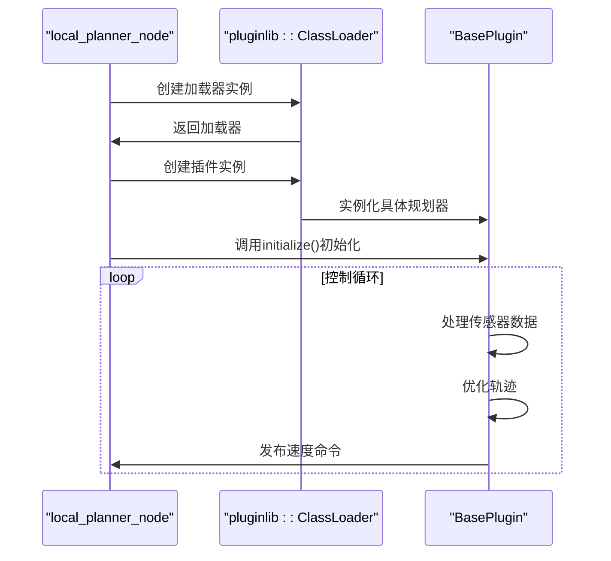
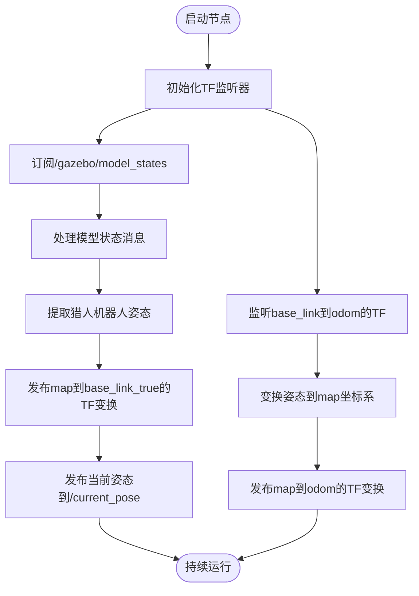

# ROS节点架构

<cite>
**本文档引用的文件**   
- [teb_local_planner_ros.cpp](file://teb_local_planner/src/teb_local_planner_ros.cpp)
- [teb_local_planner_ros.h](file://teb_local_planner/include/teb_local_planner/teb_local_planner_ros.h)
- [local_planner_node.cpp](file://field_local_planner/field_local_planner_ros/src/local_planner_node.cpp)
- [hunter_tf_listener.py](file://AEMCARL/attachments/ros_ws/hunter_listener_node/hunter_tf_listener.py)
</cite>

## 目录
1. [TebLocalPlannerROS类初始化与生命周期管理](#teblocalplannerros类初始化与生命周期管理)
2. [局部规划器节点控制循环分析](#局部规划器节点控制循环分析)
3. [TF监听器工作原理](#tf监听器工作原理)
4. [ROS节点创建与调试指南](#ros节点创建与调试指南)
5. [多节点协同与故障排查](#多节点协同与故障排查)

## TebLocalPlannerROS类初始化与生命周期管理

TebLocalPlannerROS类作为TEB局部规划器的ROS插件实现，继承自`nav_core::BaseLocalPlanner`和`mbf_costmap_core::CostmapController`接口。其生命周期管理通过构造函数、初始化方法和析构函数实现。

类的构造函数在`teb_local_planner_ros.cpp`中定义，初始化了多个成员变量，包括指向成本地图和TF缓冲区的指针、成本地图转换器加载器、动态重配置服务器指针以及各种状态标志。这些初始化确保了规划器在创建时具有正确的初始状态。

```mermaid
classDiagram
class TebLocalPlannerROS {
+TebLocalPlannerROS()
+~TebLocalPlannerROS()
+initialize(name, tf, costmap_ros)
+setPlan(orig_global_plan)
+computeVelocityCommands(cmd_vel)
+isGoalReached()
-reconfigureCB(config, level)
-customObstacleCB(obst_msg)
-customViaPointsCB(via_points_msg)
}
TebLocalPlannerROS --> costmap_2d : : Costmap2DROS : "使用"
TebLocalPlannerROS --> tf2_ros : : Buffer : "使用"
TebLocalPlannerROS --> PlannerInterfacePtr : "包含"
TebLocalPlannerROS --> ObstContainer : "包含"
TebLocalPlannerROS --> ViaPointContainer : "包含"
TebLocalPlannerROS --> TebVisualizationPtr : "包含"
TebLocalPlannerROS --> TebConfig : "包含"
```

**Diagram sources**
- [teb_local_planner_ros.h](file://teb_local_planner/include/teb_local_planner/teb_local_planner_ros.h#L92-L450)

**Section sources**
- [teb_local_planner_ros.cpp](file://teb_local_planner/src/teb_local_planner_ros.cpp#L68-L73)
- [teb_local_planner_ros.h](file://teb_local_planner/include/teb_local_planner/teb_local_planner_ros.h#L92-L450)

## 局部规划器节点控制循环分析

`local_planner_node.cpp`文件实现了局部规划器的主节点，采用插件架构设计。该节点在`main`函数中初始化ROS节点，从参数服务器获取插件名称，使用`pluginlib::ClassLoader`动态加载指定的局部规划器插件。

控制循环结构通过ROS的回调机制实现，节点创建后进入阻塞的`ros::spin()`调用，等待订阅的topic消息触发相应的回调函数。这种设计模式允许规划器在接收到新的全局路径、传感器数据或配置参数时立即响应，确保了实时性能。



**Diagram sources**
- [local_planner_node.cpp](file://field_local_planner/field_local_planner_ros/src/local_planner_node.cpp#L0-L49)

**Section sources**
- [local_planner_node.cpp](file://field_local_planner/field_local_planner_ros/src/local_planner_node.cpp#L0-L49)

## TF监听器工作原理

`hunter_tf_listener.py`脚本实现了TF坐标变换监听器，用于处理机器人在不同坐标系之间的位置变换。该监听器通过`tf.TransformListener`订阅TF树中的变换关系，特别是`base_link`到`odom`的变换。

监听器的工作原理基于多线程架构：一个线程持续监听TF变换，另一个线程处理模型状态消息。当接收到`/gazebo/model_states`话题的消息时，脚本提取猎人机器人的姿态信息，并通过`tf2_ros.TransformBroadcaster`发布`map`到`base_link_true`的变换。



**Diagram sources**
- [hunter_tf_listener.py](file://AEMCARL/attachments/ros_ws/hunter_listener_node/hunter_tf_listener.py#L0-L315)

**Section sources**
- [hunter_tf_listener.py](file://AEMCARL/attachments/ros_ws/hunter_listener_node/hunter_tf_listener.py#L0-L315)

## ROS节点创建与调试指南

对于初学者，创建ROS节点的基本步骤包括：使用`ros::init()`初始化节点，创建`ros::NodeHandle`，设置订阅者和发布者，最后调用`ros::spin()`进入事件循环。调试ROS节点时，建议使用`ROS_INFO`、`ROS_WARN`和`ROS_ERROR`宏输出调试信息，并利用`rqt_console`工具查看日志。

监控ROS节点的运行状态可以通过`rosnode list`、`rostopic list`和`rosrun rqt_graph rqt_graph`等命令行工具实现。这些工具可以帮助开发者理解节点间的通信关系和数据流。

## 多节点协同与故障排查

经验丰富的开发者在进行多节点协同时，应关注节点间的启动依赖关系。例如，TF监听器节点通常需要在其他依赖坐标变换的节点之前启动。资源管理方面，应注意避免内存泄漏和CPU过度占用，特别是在处理大量传感器数据时。

故障排查的最佳实践包括：使用`rosparam list`检查参数服务器中的配置，通过`rostopic echo`验证话题数据的正确性，以及利用`rosbag`记录和回放系统运行数据。对于复杂的多节点系统，建议使用`launch`文件统一管理节点的启动和参数配置。