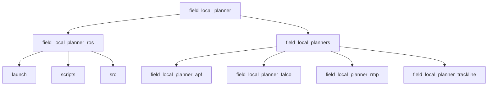
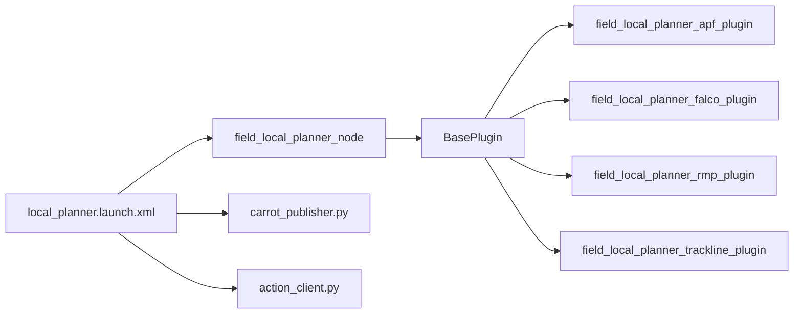
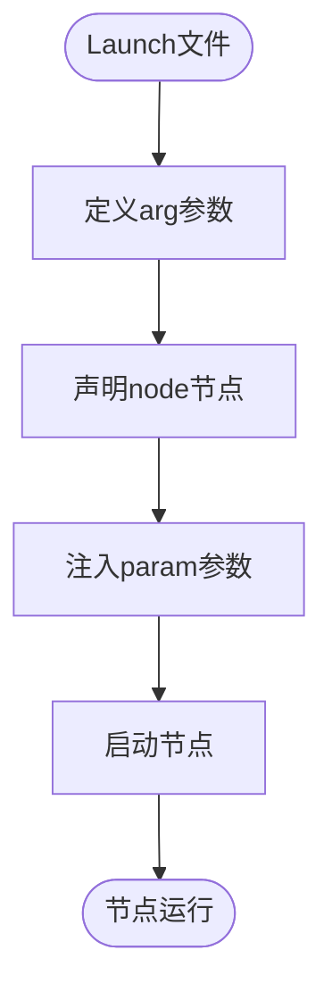
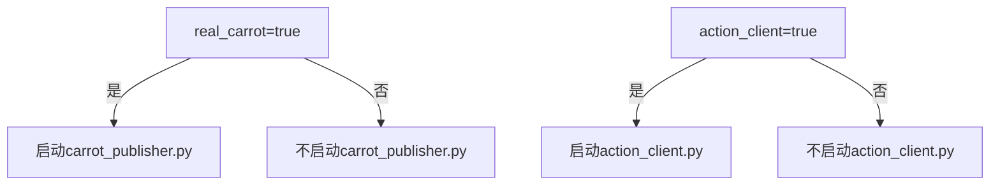
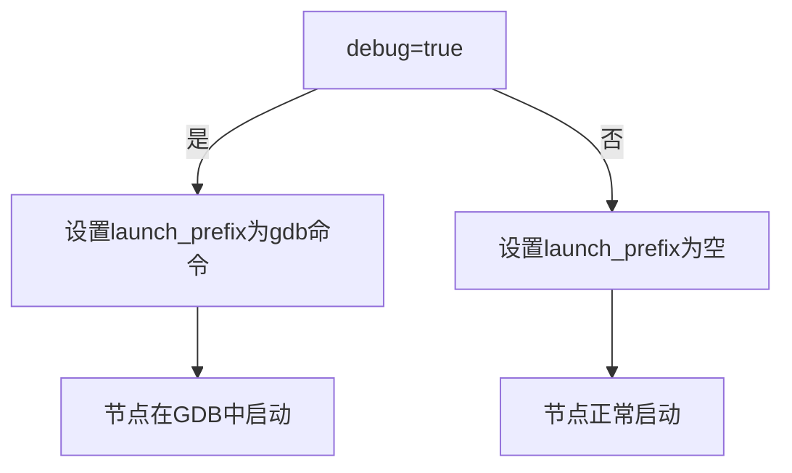
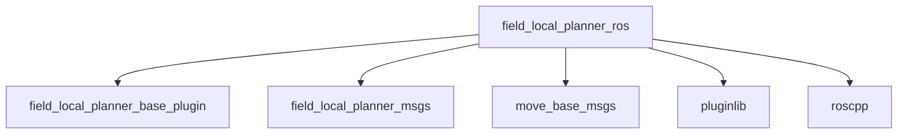

# Launch文件配置

<cite>
**本文档中引用的文件**  
- [local_planner.launch.xml](file://field_local_planner/field_local_planner_ros/launch/local_planner.launch.xml)
- [local_planner_node.cpp](file://field_local_planner/field_local_planner_ros/src/local_planner_node.cpp)
- [carrot_publisher.py](file://field_local_planner/field_local_planner_ros/scripts/carrot_publisher.py)
- [action_client.py](file://field_local_planner/field_local_planner_ros/scripts/action_client.py)
- [CMakeLists.txt](file://field_local_planner/field_local_planner_ros/CMakeLists.txt)
- [package.xml](file://field_local_planner/field_local_planner_ros/package.xml)
</cite>

## 目录
1. [简介](#简介)
2. [项目结构](#项目结构)
3. [核心组件](#核心组件)
4. [架构概述](#架构概述)
5. [详细组件分析](#详细组件分析)
6. [依赖分析](#依赖分析)
7. [性能考虑](#性能考虑)
8. [故障排除指南](#故障排除指南)
9. [结论](#结论)

## 简介
本文档旨在深入介绍ROS系统中Launch文件的配置方法，重点分析`local_planner.launch.xml`文件的XML结构。文档将详细解释节点声明、参数注入、命名空间设置和条件启动逻辑的实现方式。同时，阐述如何通过`include`标签实现模块化配置，以及如何利用`arg`参数实现配置复用。通过实际代码示例展示多节点协同启动的配置模式，为开发者提供Launch文件的最佳实践指南，包括错误处理、调试技巧和大型系统中的配置组织策略。

## 项目结构
`field_local_planner`项目采用模块化设计，将核心功能与ROS接口分离。`field_local_planner_ros`包负责ROS节点的启动和参数管理，包含Launch文件、Python脚本和C++节点。`field_local_planners`包则包含各种局部规划器的具体实现。这种结构使得不同规划算法可以轻松集成到统一的ROS接口中。

**Diagram sources**
- [local_planner.launch.xml](file://field_local_planner/field_local_planner_ros/launch/local_planner.launch.xml)

**Section sources**
- [README.md](file://field_local_planner/README.md#L37-L63)

## 核心组件
`local_planner.launch.xml`是系统的核心配置文件，它定义了局部规划器的启动流程。该文件通过参数化设计实现了高度的灵活性，允许用户在不修改代码的情况下调整系统行为。主要组件包括信号主题配置、调试模式开关、胡萝卜可视化和动作客户端。

**Section sources**
- [local_planner.launch.xml](file://field_local_planner/field_local_planner_ros/launch/local_planner.launch.xml#L1-L54)

## 架构概述
系统采用插件化架构，主节点`field_local_planner_node`通过`pluginlib`动态加载具体的规划算法插件。Launch文件负责启动主节点和辅助节点（如胡萝卜发布器和动作客户端），并通过参数服务器传递配置信息。这种设计实现了算法与接口的解耦，便于算法的替换和扩展。

**Diagram sources**
- [local_planner.launch.xml](file://field_local_planner/field_local_planner_ros/launch/local_planner.launch.xml#L1-L54)
- [local_planner_node.cpp](file://field_local_planner/field_local_planner_ros/src/local_planner_node.cpp#L1-L49)

## 详细组件分析

### 节点声明与参数注入
`local_planner.launch.xml`文件通过`<node>`标签声明ROS节点，并使用`<param>`标签将参数注入到节点的私有命名空间中。参数值可以通过`$(arg ...)`语法从Launch文件的参数中获取，实现了配置的动态化。

**Diagram sources**
- [local_planner.launch.xml](file://field_local_planner/field_local_planner_ros/launch/local_planner.launch.xml#L10-L20)

**Section sources**
- [local_planner.launch.xml](file://field_local_planner/field_local_planner_ros/launch/local_planner.launch.xml#L1-L54)

### 条件启动逻辑
Launch文件支持条件启动逻辑，通过`if`和`unless`属性控制节点的启动。例如，`carrot_publisher.py`节点仅在`real_carrot`参数为`true`时启动，`action_client.py`节点仅在`action_client`参数为`true`时启动。这种机制使得系统配置更加灵活，可以根据不同场景启用或禁用特定功能。

**Diagram sources**
- [local_planner.launch.xml](file://field_local_planner/field_local_planner_ros/launch/local_planner.launch.xml#L48-L54)

**Section sources**
- [local_planner.launch.xml](file://field_local_planner/field_local_planner_ros/launch/local_planner.launch.xml#L1-L54)

### 调试模式配置
Launch文件通过`arg`参数实现了调试模式的配置。当`debug`参数为`true`时，`launch_prefix`参数被设置为`gdb -ex run --args`，使得节点在GDB调试器中启动。这种设计使得开发者可以方便地进行调试，而无需修改Launch文件。

**Diagram sources**
- [local_planner.launch.xml](file://field_local_planner/field_local_planner_ros/launch/local_planner.launch.xml#L22-L24)

**Section sources**
- [local_planner.launch.xml](file://field_local_planner/field_local_planner_ros/launch/local_planner.launch.xml#L1-L54)

## 依赖分析
`field_local_planner_ros`包依赖于多个其他包，包括`field_local_planner_base_plugin`、`field_local_planner_msgs`、`move_base_msgs`、`pluginlib`和`roscpp`。这些依赖关系在`package.xml`和`CMakeLists.txt`文件中定义，确保了编译和运行时所需的库和头文件能够正确链接。

**Diagram sources**
- [package.xml](file://field_local_planner/field_local_planner_ros/package.xml#L1-L23)

**Section sources**
- [package.xml](file://field_local_planner/field_local_planner_ros/package.xml#L1-L23)
- [CMakeLists.txt](file://field_local_planner/field_local_planner_ros/CMakeLists.txt#L1-L85)

## 性能考虑
系统在设计时考虑了性能因素。主节点`field_local_planner_node`使用C++编写，确保了实时性要求。辅助功能如胡萝卜可视化和动作客户端使用Python编写，便于快速开发和调试。通过将计算密集型任务与辅助功能分离，系统在保证性能的同时也保持了开发的灵活性。

## 故障排除指南
当系统无法正常启动时，首先检查Launch文件中的参数配置是否正确。确保所有必要的主题名称都已正确设置。如果节点崩溃，可以启用调试模式，在GDB中查看崩溃原因。对于插件加载失败的问题，检查`pluginlib`的配置文件是否正确，确保插件库已正确编译和安装。

**Section sources**
- [local_planner_node.cpp](file://field_local_planner/field_local_planner_ros/src/local_planner_node.cpp#L28-L49)
- [local_planner.launch.xml](file://field_local_planner/field_local_planner_ros/launch/local_planner.launch.xml#L22-L24)

## 结论
`local_planner.launch.xml`文件展示了ROS Launch文件的高级用法，包括参数化配置、条件启动和调试支持。通过模块化设计和插件化架构，系统实现了高度的灵活性和可扩展性。开发者可以借鉴这种设计模式，构建复杂而灵活的ROS系统。