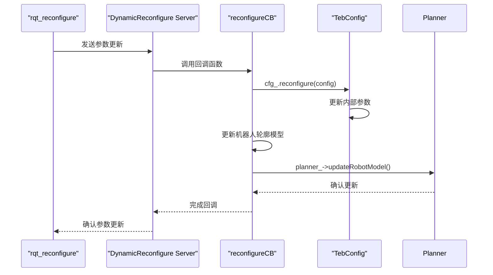

# 动态重配置参数

<cite>
**本文档引用文件**  
- [TebLocalPlannerReconfigure.cfg](file://teb_local_planner/cfg/TebLocalPlannerReconfigure.cfg)
- [teb_local_planner_ros.cpp](file://teb_local_planner/src/teb_local_planner_ros.cpp)
- [teb_config.cpp](file://teb_local_planner/src/teb_config.cpp)
- [teb_config.h](file://teb_local_planner/include/teb_local_planner/teb_config.h)
</cite>

## 目录
1. [引言](#引言)
2. [ROS动态重配置机制概述](#ros动态重配置机制概述)
3. [TebLocalPlannerReconfigure.cfg配置文件解析](#teblocalplannerreconfigurecfg配置文件解析)
4. [运行时参数调整方法](#运行时参数调整方法)
5. [动态参数回调机制实现原理](#动态参数回调机制实现原理)
6. [自定义节点动态重配置接口创建示例](#自定义节点动态重配置接口创建示例)
7. [算法调优最佳实践](#算法调优最佳实践)
8. [结论](#结论)

## 引言
本文档深入介绍ROS（Robot Operating System）中的动态重配置（Dynamic Reconfigure）机制，重点解析teb_local_planner包中TebLocalPlannerReconfigure.cfg配置文件的语法结构和参数含义。文档详细解释了如何在运行时通过rqt_reconfigure工具或编程接口调整控制器参数，并阐述了动态参数回调机制的实现原理。通过实际应用示例，展示了为自定义节点创建动态重配置接口的方法，并讨论了在算法调优中的最佳实践。

## ROS动态重配置机制概述
ROS动态重配置机制允许在不重启节点的情况下实时修改节点参数。这一机制对于机器人算法调优至关重要，因为它使得开发者能够在机器人运行过程中观察和调整控制器行为。动态重配置基于客户端-服务器架构，其中每个支持动态重配置的节点都会启动一个服务器，客户端（如rqt_reconfigure）可以连接到该服务器并发送参数更新请求。当参数发生变化时，服务器会调用预定义的回调函数来处理这些变化，从而实现参数的实时更新。

## TebLocalPlannerReconfigure.cfg配置文件解析
TebLocalPlannerReconfigure.cfg是teb_local_planner包的核心配置文件，使用Python语法定义了所有可动态调整的参数。该文件通过dynamic_reconfigure.parameter_generator_catkin模块生成配置参数。

### 参数组定义
配置文件使用`gen.add_group()`方法创建了多个参数组，这些组在rqt_reconfigure界面中以标签页形式呈现：
- **Trajectory（轨迹）**: 轨迹相关参数
- **ViaPoints（途经点）**: 途经点相关参数
- **Robot（机器人）**: 机器人运动学参数
- **GoalTolerance（目标容差）**: 目标到达条件参数
- **Obstacles（障碍物）**: 障碍物处理参数
- **Optimization（优化）**: 优化器相关参数
- **HCPlanning（同伦类规划）**: 同伦类规划参数
- **Recovery（恢复）**: 恢复行为参数

### 参数类型声明与语法结构
配置文件中每个参数都通过`add()`方法添加，其语法结构如下：
```
grp.add("参数名", 参数类型, 重配置级别, "描述", 默认值, 最小值, 最大值)
```
其中参数类型包括：
- `bool_t`: 布尔类型
- `double_t`: 双精度浮点类型
- `int_t`: 整数类型

### 默认值设置与范围限制
每个参数都设置了合理的默认值和取值范围，确保参数调整的安全性。例如：
- `dt_ref`（时间分辨率）默认值为0.3秒，范围在0.01到1秒之间
- `max_vel_x`（最大x方向速度）默认值为0.4 m/s，范围在0.01到100 m/s之间
- `xy_goal_tolerance`（目标位置容差）默认值为0.2米，范围在0.001到10米之间

这些范围限制防止了不合理的参数值导致系统不稳定。

**节来源**
- [TebLocalPlannerReconfigure.cfg](file://teb_local_planner/cfg/TebLocalPlannerReconfigure.cfg)

## 运行时参数调整方法
在运行时调整teb_local_planner参数有两种主要方法：使用rqt_reconfigure图形化工具和通过编程接口。

### 使用rqt_reconfigure工具
rqt_reconfigure是ROS提供的图形化动态重配置工具。使用方法如下：
1. 启动teb_local_planner节点
2. 运行`rosrun rqt_reconfigure rqt_reconfigure`
3. 在界面中选择`teb_local_planner`插件
4. 通过滑块或输入框调整各个参数
5. 修改会立即生效，无需重启节点

该工具提供了直观的用户界面，特别适合参数调优过程中的快速迭代。

### 编程接口调整
除了图形化工具，还可以通过编程方式调整参数。这通常用于自动化测试或自适应控制策略。主要方法包括：
- 使用`dynamic_reconfigure.client`模块创建客户端
- 调用`update_configuration()`方法发送参数更新
- 监听参数变化并做出相应处理

这种方法允许在运行时根据环境变化或性能指标自动调整控制器参数。

**节来源**
- [TebLocalPlannerReconfigure.cfg](file://teb_local_planner/cfg/TebLocalPlannerReconfigure.cfg)
- [teb_local_planner_ros.cpp](file://teb_local_planner/src/teb_local_planner_ros.cpp)

## 动态参数回调机制实现原理
动态重配置的回调机制是teb_local_planner能够实时响应参数变化的核心。该机制的实现涉及多个组件的协同工作。

### 回调函数注册
在`TebLocalPlannerROS::initialize()`方法中，系统注册了动态重配置服务器和回调函数：
```cpp
dynamic_recfg_ = boost::make_shared<dynamic_reconfigure::Server<TebLocalPlannerReconfigureConfig>>(nh);
dynamic_reconfigure::Server<TebLocalPlannerReconfigureConfig>::CallbackType cb = boost::bind(&TebLocalPlannerROS::reconfigureCB, this, _1, _2);
dynamic_recfg_->setCallback(cb);
```
这段代码创建了一个动态重配置服务器，并将其回调函数设置为`reconfigureCB`。

### 参数更新处理
当参数发生变化时，`reconfigureCB`回调函数被调用，其主要工作流程如下：
1. 调用`cfg_.reconfigure(config)`将新参数应用到配置对象
2. 获取节点句柄以访问ROS参数服务器
3. 使用互斥锁保护配置访问
4. 从参数服务器更新机器人轮廓模型
5. 通知规划器更新机器人模型



**图来源**
- [teb_local_planner_ros.cpp](file://teb_local_planner/src/teb_local_planner_ros.cpp#L169-L198)

**节来源**
- [teb_local_planner_ros.cpp](file://teb_local_planner/src/teb_local_planner_ros.cpp#L76-L90)
- [teb_config.cpp](file://teb_local_planner/src/teb_config.cpp#L184-L210)

## 自定义节点动态重配置接口创建示例
为自定义节点创建动态重配置接口需要以下步骤：

### 创建.cfg配置文件
首先创建一个.cfg配置文件，定义所有可动态调整的参数。文件结构与TebLocalPlannerReconfigure.cfg类似，包含参数组、参数类型、默认值和范围限制。

### 生成配置头文件
使用catkin构建系统，配置文件会被自动编译生成C++头文件。需要在CMakeLists.txt中添加：
```cmake
generate_dynamic_reconfigure_options(cfg/MyNodeConfig.cfg)
```

### 在节点中集成
在节点代码中包含生成的头文件，并设置动态重配置服务器：
```cpp
#include "my_node/MyNodeConfig.h"
#include <dynamic_reconfigure/server.h>

class MyNode {
private:
    dynamic_reconfigure::Server<my_node::MyNodeConfig> server_;
    
    void reconfigureCallback(my_node::MyNodeConfig &config, uint32_t level) {
        // 处理参数更新
        param1_ = config.param1;
        param2_ = config.param2;
        // 通知其他组件参数已更新
    }
    
public:
    MyNode() {
        dynamic_reconfigure::Server<my_node::MyNodeConfig>::CallbackType f;
        f = boost::bind(&MyNode::reconfigureCallback, this, _1, _2);
        server_.setCallback(f);
    }
};
```

这种方法使得自定义节点能够像teb_local_planner一样支持实时参数调整。

**节来源**
- [teb_local_planner_ros.cpp](file://teb_local_planner/src/teb_local_planner_ros.cpp#L169-L198)
- [teb_config.h](file://teb_local_planner/include/teb_local_planner/teb_config.h#L397-L434)

## 算法调优最佳实践
在使用动态重配置进行算法调优时，应遵循以下最佳实践：

### 参数分组调优
将相关参数分组调整，而不是单独调整每个参数。例如：
- **轨迹参数组**: `teb_autosize`, `dt_ref`, `dt_hysteresis`
- **机器人运动学参数组**: `max_vel_x`, `max_vel_theta`, `acc_lim_x`
- **优化权重参数组**: `weight_max_vel_x`, `weight_obstacle`, `weight_optimaltime`

### 渐进式调整策略
采用渐进式调整策略，从小幅度调整开始，观察系统响应，再决定是否进行更大幅度的调整。避免一次性进行大幅度参数修改，这可能导致系统不稳定。

### 记录调优过程
记录每次参数调整的值和对应的系统性能表现，建立参数-性能映射关系。这有助于：
- 识别最优参数组合
- 理解参数之间的相互影响
- 在不同场景下快速找到合适的参数设置

### 使用默认值作为基准
始终以配置文件中的默认值作为调优基准。这些默认值通常是经过验证的合理起始点，偏离太远可能导致意外行为。

### 并行测试
利用teb_local_planner的同伦类规划功能，可以同时测试多个参数配置下的轨迹规划结果，快速比较不同参数设置的优劣。

**节来源**
- [TebLocalPlannerReconfigure.cfg](file://teb_local_planner/cfg/TebLocalPlannerReconfigure.cfg)
- [teb_config.h](file://teb_local_planner/include/teb_local_planner/teb_config.h)

## 结论
ROS动态重配置机制为机器人控制器的实时调优提供了强大支持。通过对teb_local_planner的TebLocalPlannerReconfigure.cfg配置文件的深入分析，我们了解了参数组定义、参数类型声明、默认值设置和范围限制的实现方法。运行时参数调整既可以通过rqt_reconfigure图形化工具进行，也可以通过编程接口实现。动态参数回调机制确保了参数变化能够被及时处理并应用到系统中。为自定义节点创建动态重配置接口是一个标准化的过程，涉及.cfg文件创建、头文件生成和回调函数集成。在算法调优实践中，应采用分组调优、渐进式调整、过程记录等最佳实践，以高效地找到最优参数配置。