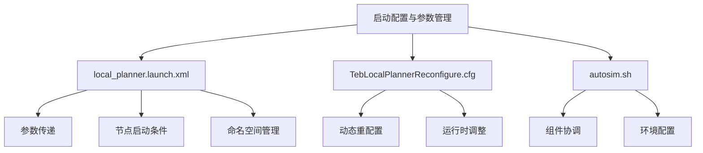
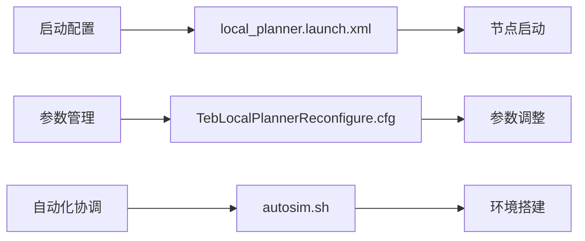
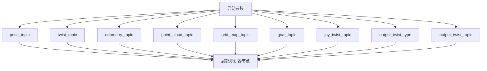
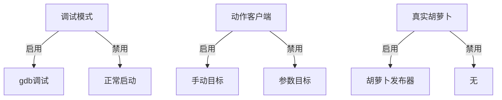
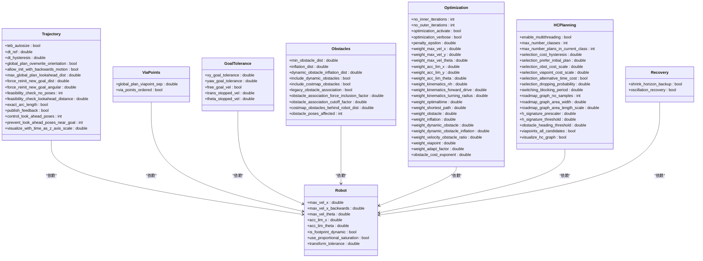
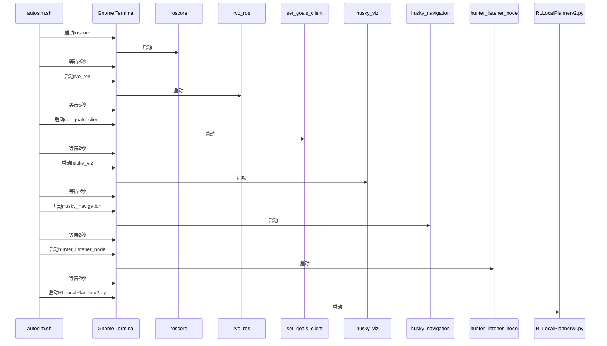
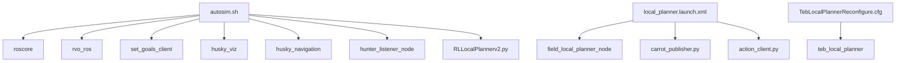

# 启动配置与参数管理

<cite>
**本文档引用文件**   
- [local_planner.launch.xml](file://field_local_planner/field_local_planner_ros/launch/local_planner.launch.xml)
- [TebLocalPlannerReconfigure.cfg](file://teb_local_planner/cfg/TebLocalPlannerReconfigure.cfg)
- [autosim.sh](file://AEMCARL/attachments/ros_ws/autosim.sh)
</cite>

## 目录
1. [引言](#引言)
2. [项目结构](#项目结构)
3. [核心组件](#核心组件)
4. [架构概述](#架构概述)
5. [详细组件分析](#详细组件分析)
6. [依赖分析](#依赖分析)
7. [性能考虑](#性能考虑)
8. [故障排除指南](#故障排除指南)
9. [结论](#结论)

## 引言
本文档旨在深入探讨ROS系统中启动配置与参数管理的最佳实践，重点分析`local_planner.launch.xml`中的launch文件结构设计、`TebLocalPlannerReconfigure.cfg`中的动态重配置参数定义方法，以及`autosim.sh`脚本如何协调多个ROS组件的启动顺序和环境配置。文档为初学者提供launch文件编写规范和参数调试技巧，同时为经验丰富的开发者提供大型系统模块化配置、参数分组管理和配置版本控制的解决方案。

## 项目结构
本项目包含多个子模块，涵盖路径规划、局部规划、动态障碍物处理等多个方面。核心文件包括`local_planner.launch.xml`、`TebLocalPlannerReconfigure.cfg`和`autosim.sh`，分别用于启动配置、参数动态调整和自动化仿真环境搭建。

**图示来源**
- [local_planner.launch.xml](file://field_local_planner/field_local_planner_ros/launch/local_planner.launch.xml)
- [TebLocalPlannerReconfigure.cfg](file://teb_local_planner/cfg/TebLocalPlannerReconfigure.cfg)
- [autosim.sh](file://AEMCARL/attachments/ros_ws/autosim.sh)

**本节来源**
- [local_planner.launch.xml](file://field_local_planner/field_local_planner_ros/launch/local_planner.launch.xml)
- [TebLocalPlannerReconfigure.cfg](file://teb_local_planner/cfg/TebLocalPlannerReconfigure.cfg)
- [autosim.sh](file://AEMCARL/attachments/ros_ws/autosim.sh)

## 核心组件
本文档的核心组件包括launch文件、动态重配置配置文件和自动化脚本。这些组件共同构成了ROS系统中启动配置与参数管理的基础。

**本节来源**
- [local_planner.launch.xml](file://field_local_planner/field_local_planner_ros/launch/local_planner.launch.xml)
- [TebLocalPlannerReconfigure.cfg](file://teb_local_planner/cfg/TebLocalPlannerReconfigure.cfg)
- [autosim.sh](file://AEMCARL/attachments/ros_ws/autosim.sh)

## 架构概述
系统架构分为三个主要部分：启动配置、参数管理和自动化协调。启动配置通过launch文件实现，参数管理通过动态重配置实现，自动化协调通过shell脚本实现。

**图示来源**
- [local_planner.launch.xml](file://field_local_planner/field_local_planner_ros/launch/local_planner.launch.xml)
- [TebLocalPlannerReconfigure.cfg](file://teb_local_planner/cfg/TebLocalPlannerReconfigure.cfg)
- [autosim.sh](file://AEMCARL/attachments/ros_ws/autosim.sh)

## 详细组件分析

### local_planner.launch.xml 分析
该文件定义了局部规划器的启动配置，包括信号主题、调试标志和节点启动条件。

#### 参数传递机制

**图示来源**
- [local_planner.launch.xml](file://field_local_planner/field_local_planner_ros/launch/local_planner.launch.xml)

#### 节点启动条件

**图示来源**
- [local_planner.launch.xml](file://field_local_planner/field_local_planner_ros/launch/local_planner.launch.xml)

**本节来源**
- [local_planner.launch.xml](file://field_local_planner/field_local_planner_ros/launch/local_planner.launch.xml)

### TebLocalPlannerReconfigure.cfg 分析
该文件定义了TEB局部规划器的动态重配置参数，允许在运行时调整规划器行为。

#### 参数分组

**图示来源**
- [TebLocalPlannerReconfigure.cfg](file://teb_local_planner/cfg/TebLocalPlannerReconfigure.cfg)

**本节来源**
- [TebLocalPlannerReconfigure.cfg](file://teb_local_planner/cfg/TebLocalPlannerReconfigure.cfg)

### autosim.sh 分析
该脚本用于自动化启动ROS仿真环境，协调多个组件的启动顺序和环境配置。

#### 启动流程

**图示来源**
- [autosim.sh](file://AEMCARL/attachments/ros_ws/autosim.sh)

**本节来源**
- [autosim.sh](file://AEMCARL/attachments/ros_ws/autosim.sh)

## 依赖分析
各组件之间存在明确的依赖关系，launch文件依赖于参数配置，动态重配置依赖于运行时环境，自动化脚本依赖于所有ROS组件。

**图示来源**
- [local_planner.launch.xml](file://field_local_planner/field_local_planner_ros/launch/local_planner.launch.xml)
- [TebLocalPlannerReconfigure.cfg](file://teb_local_planner/cfg/TebLocalPlannerReconfigure.cfg)
- [autosim.sh](file://AEMCARL/attachments/ros_ws/autosim.sh)

**本节来源**
- [local_planner.launch.xml](file://field_local_planner/field_local_planner_ros/launch/local_planner.launch.xml)
- [TebLocalPlannerReconfigure.cfg](file://teb_local_planner/cfg/TebLocalPlannerReconfigure.cfg)
- [autosim.sh](file://AEMCARL/attachments/ros_ws/autosim.sh)

## 性能考虑
在配置管理中需要考虑性能因素，包括启动时间、内存占用和运行时开销。

- **启动时间**：通过合理安排启动顺序和并行启动组件来优化
- **内存占用**：避免重复加载相同组件
- **运行时开销**：动态重配置应避免频繁更新

## 故障排除指南
常见问题及解决方案：

- **启动失败**：检查依赖组件是否已正确启动
- **参数不生效**：确认参数名称和类型是否正确
- **性能下降**：检查是否有不必要的调试输出或频繁的参数更新

**本节来源**
- [local_planner.launch.xml](file://field_local_planner/field_local_planner_ros/launch/local_planner.launch.xml)
- [TebLocalPlannerReconfigure.cfg](file://teb_local_planner/cfg/TebLocalPlannerReconfigure.cfg)
- [autosim.sh](file://AEMCARL/attachments/ros_ws/autosim.sh)

## 结论
本文档详细介绍了ROS系统中启动配置与参数管理的最佳实践，通过分析具体文件展示了如何有效管理复杂系统的配置。建议开发者遵循模块化设计原则，合理使用动态重配置，并通过自动化脚本简化系统启动过程。