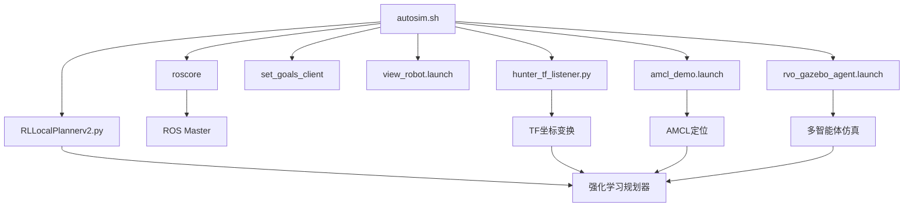
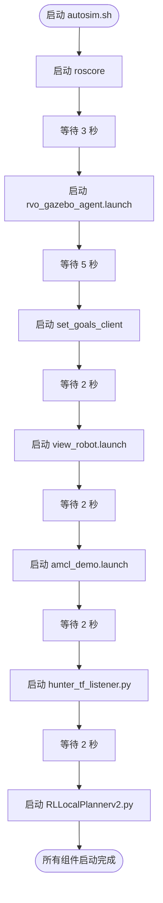
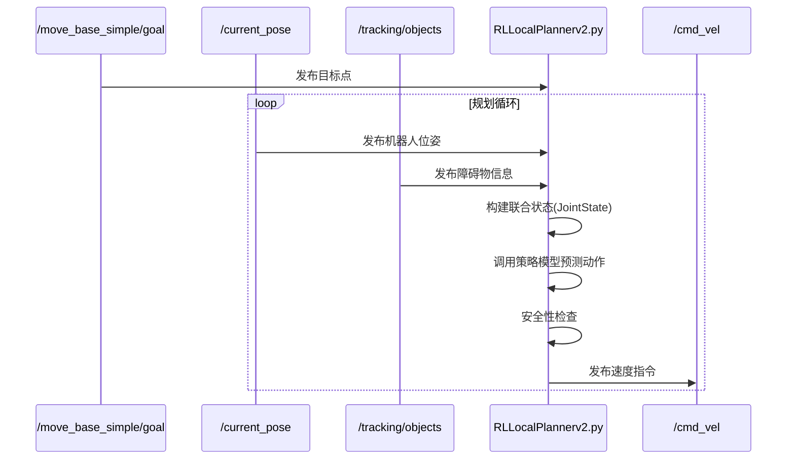
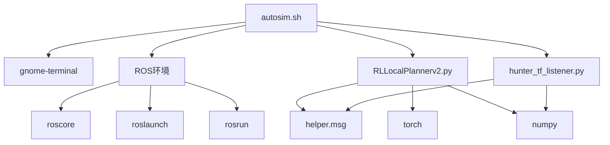

# 环境启动脚本

<cite>
**本文档引用的文件**  
- [autosim.sh](file://AEMCARL/attachments/ros_ws/autosim.sh)
- [RLLocalPlannerv2.py](file://AEMCARL/attachments/ros_ws/local_planner_py/scripts/RLLocalPlannerv2.py)
- [hunter_tf_listener.py](file://AEMCARL/attachments/ros_ws/hunter_listener_node/hunter_tf_listener.py)
</cite>

## 目录
1. [简介](#简介)
2. [项目结构](#项目结构)
3. [核心组件](#核心组件)
4. [架构概述](#架构概述)
5. [详细组件分析](#详细组件分析)
6. [依赖分析](#依赖分析)
7. [性能考虑](#性能考虑)
8. [故障排除指南](#故障排除指南)
9. [结论](#结论)

## 简介
本文档深入分析了 `autosim.sh` 启动脚本的设计与实现，该脚本用于自动化启动一个复杂的机器人仿真环境。脚本通过协调多个ROS（机器人操作系统）组件，实现了从环境初始化到多智能体协同工作的完整工作流程。文档详细解释了脚本如何通过shell命令管理后台进程、设置工作空间环境，并协调多个ROS节点的启动顺序，为开发、测试和部署提供了可靠的自动化解决方案。

## 项目结构
`autosim.sh` 脚本位于 `AEMCARL/attachments/ros_ws/` 目录下，是整个机器人仿真系统的关键入口点。该脚本负责启动一个包含核心ROS服务、仿真环境、导航系统和自定义智能体的复杂系统。其依赖的Python脚本（如 `RLLocalPlannerv2.py` 和 `hunter_tf_listener.py`）位于 `local_planner_py/scripts/` 和 `hunter_listener_node/` 子目录中，共同构成了一个基于ROS的多智能体强化学习与导航框架。

## 核心组件
`autosim.sh` 脚本的核心功能是作为系统初始化的协调器。它通过一系列有序的 `gnome-terminal` 命令，依次启动 `roscore`、仿真环境、可视化工具、导航堆栈以及自定义的Python节点。这些节点共同工作，实现了从环境感知、状态估计到路径规划和运动控制的完整闭环。脚本通过 `sleep` 命令确保组件按正确的依赖顺序启动，避免了因服务未就绪而导致的初始化失败。

**Section sources**
- [autosim.sh](file://AEMCARL/attachments/ros_ws/autosim.sh#L1-L15)

## 架构概述
整个系统采用基于ROS的分布式架构。`autosim.sh` 脚本作为顶层启动器，负责初始化ROS主节点（`roscore`）并按顺序启动各个功能模块。底层的Python脚本（如 `RLLocalPlannerv2.py`）作为ROS节点运行，通过话题（topics）和变换（tf）系统与其他组件通信。这种架构实现了模块化设计，使得各个功能（如感知、规划、控制）可以独立开发和测试。



**Diagram sources **
- [autosim.sh](file://AEMCARL/attachments/ros_ws/autosim.sh#L1-L15)

## 详细组件分析

### autosim.sh 脚本分析
`autosim.sh` 是一个使用 `zsh` 执行的shell脚本，其主要职责是自动化启动一系列ROS组件。脚本首先启动 `roscore`，这是所有ROS节点通信的基础。随后，它使用 `gnome-terminal` 在独立的终端窗口中启动多个 `roslaunch` 和 `rosrun` 命令。每个命令都通过 `source devel/setup.bash` 确保在正确的ROS工作空间环境中执行。`sleep` 命令用于在启动关键服务（如仿真环境）后引入延迟，以确保后续依赖该服务的节点能够成功连接。

#### 启动流程图


**Diagram sources **
- [autosim.sh](file://AEMCARL/attachments/ros_ws/autosim.sh#L1-L15)

**Section sources**
- [autosim.sh](file://AEMCARL/attachments/ros_ws/autosim.sh#L1-L15)

### RLLocalPlannerv2.py 组件分析
`RLLocalPlannerv2.py` 是一个基于强化学习的局部路径规划器ROS节点。它订阅机器人的里程计（`/current_pose`）、目标点（`/move_base_simple/goal`）和障碍物信息（`/tracking/objects`），利用预训练的策略模型（policy model）预测机器人的速度指令，并通过 `/husky_velocity_controller/cmd_vel` 话题发布控制命令。该节点实现了线程安全的规划逻辑，确保在接收新数据时不会发生状态冲突。

#### 规划器工作流程


**Diagram sources **
- [RLLocalPlannerv2.py](file://AEMCARL/attachments/ros_ws/local_planner_py/scripts/RLLocalPlannerv2.py#L1-L494)

**Section sources**
- [RLLocalPlannerv2.py](file://AEMCARL/attachments/ros_ws/local_planner_py/scripts/RLLocalPlannerv2.py#L1-L494)

### hunter_tf_listener.py 组件分析
`hunter_tf_listener.py` 节点负责处理和广播关键的坐标变换（tf）。它订阅Gazebo提供的地面真值状态（`/ground_truth/state`），并将其转换为ROS导航堆栈所需的 `map` 到 `odom` 和 `map` 到 `base_link` 的变换。这对于AMCL（自适应蒙特卡洛定位）等需要精确全局定位的算法至关重要。该节点还负责将仿真环境中的动态障碍物（agent）信息转换为自定义的 `ObjectArray` 消息格式，供规划器使用。

#### TF变换与信息流
```mermaid
flowchart LR
Gazebo[/ground_truth/state] --> |ModelStates| HunterTF[hunter_tf_listener.py]
HunterTF --> |map->odom| TF[tf系统]
HunterTF --> |map->base_link| TF
HunterTF --> |ObjectArray| RLLocalPlanner[RLLocalPlannerv2.py]
HunterTF --> |MarkerArray| RViz[RViz可视化]
```

**Diagram sources **
- [hunter_tf_listener.py](file://AEMCARL/attachments/ros_ws/hunter_listener_node/hunter_tf_listener.py#L1-L315)

**Section sources**
- [hunter_tf_listener.py](file://AEMCARL/attachments/ros_ws/hunter_listener_node/hunter_tf_listener.py#L1-L315)

## 依赖分析
`autosim.sh` 脚本的成功执行依赖于多个外部组件和正确的环境配置。它依赖于 `gnome-terminal` 作为终端模拟器来启动各个进程。所有ROS相关的命令（`roslaunch`, `rosrun`）都依赖于ROS环境的正确设置，这通过 `source devel/setup.bash` 命令完成。Python脚本则依赖于特定的ROS消息包（如 `helper.msg`）和Python库（如 `torch`, `numpy`）。脚本的启动顺序也体现了严格的依赖关系，例如 `RLLocalPlannerv2.py` 必须在 `roscore` 和 `hunter_tf_listener.py` 启动后才能成功运行。



**Diagram sources **
- [autosim.sh](file://AEMCARL/attachments/ros_ws/autosim.sh#L1-L15)
- [RLLocalPlannerv2.py](file://AEMCARL/attachments/ros_ws/local_planner_py/scripts/RLLocalPlannerv2.py#L1-L494)
- [hunter_tf_listener.py](file://AEMCARL/attachments/ros_ws/hunter_listener_node/hunter_tf_listener.py#L1-L315)

**Section sources**
- [autosim.sh](file://AEMCARL/attachments/ros_ws/autosim.sh#L1-L15)
- [RLLocalPlannerv2.py](file://AEMCARL/attachments/ros_ws/local_planner_py/scripts/RLLocalPlannerv2.py#L1-L494)
- [hunter_tf_listener.py](file://AEMCARL/attachments/ros_ws/hunter_listener_node/hunter_tf_listener.py#L1-L315)

## 性能考虑
虽然 `autosim.sh` 本身是一个轻量级的启动脚本，但其启动的整个系统对性能有较高要求。脚本中使用的 `sleep` 命令是性能和稳定性的折衷，过短的延迟可能导致节点初始化失败，过长的延迟则会增加启动时间。`RLLocalPlannerv2.py` 节点中的强化学习推理是计算密集型操作，其性能直接影响机器人的响应速度。此外，`hunter_tf_listener.py` 节点以50Hz的频率广播变换，对CPU和网络带宽有一定消耗。最佳实践是根据实际硬件性能调整 `sleep` 时间，并在生产环境中使用更高效的进程管理工具（如 `tmux` 或 `systemd`）替代 `gnome-terminal`。

## 故障排除指南
当 `autosim.sh` 脚本无法正常工作时，应按以下步骤排查：
1.  **检查ROS环境**：确保 `devel/setup.bash` 文件存在且路径正确。
2.  **验证终端命令**：确认 `gnome-terminal` 已安装并能正常工作。
3.  **检查节点依赖**：确保 `roscore` 成功启动，因为所有其他节点都依赖于它。
4.  **查看节点日志**：检查 `RLLocalPlannerv2.py` 和 `hunter_tf_listener.py` 的输出，寻找Python导入错误或ROS话题连接失败的提示。
5.  **调整延迟**：如果节点因服务未就绪而失败，尝试增加 `sleep` 命令的等待时间。

**Section sources**
- [autosim.sh](file://AEMCARL/attachments/ros_ws/autosim.sh#L1-L15)
- [RLLocalPlannerv2.py](file://AEMCARL/attachments/ros_ws/local_planner_py/scripts/RLLocalPlannerv2.py#L1-L494)
- [hunter_tf_listener.py](file://AEMCARL/attachments/ros_ws/hunter_listener_node/hunter_tf_listener.py#L1-L315)

## 结论
`autosim.sh` 脚本是一个设计精巧的自动化启动工具，它通过简单的shell命令协调了一个复杂的机器人仿真系统。该脚本展示了如何利用 `gnome-terminal` 和 `sleep` 实现多进程的有序启动，为开发和测试提供了极大的便利。其与 `RLLocalPlannerv2.py` 和 `hunter_tf_listener.py` 等自定义ROS节点的集成，构建了一个功能完整的强化学习导航框架。尽管存在使用图形化终端和硬编码延迟等可改进之处，但该脚本有效地实现了其设计目标，是自动化系统初始化的一个实用范例。