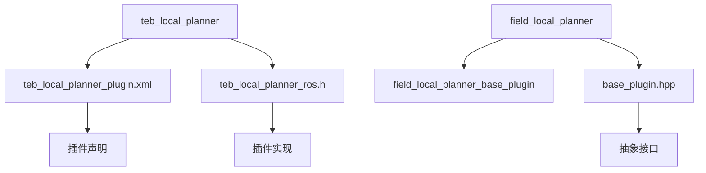
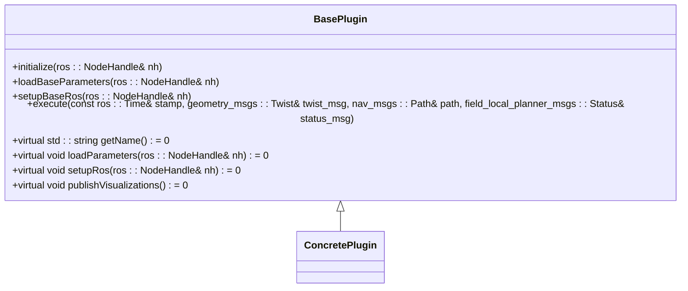
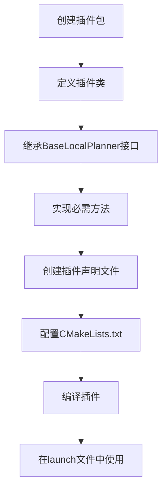
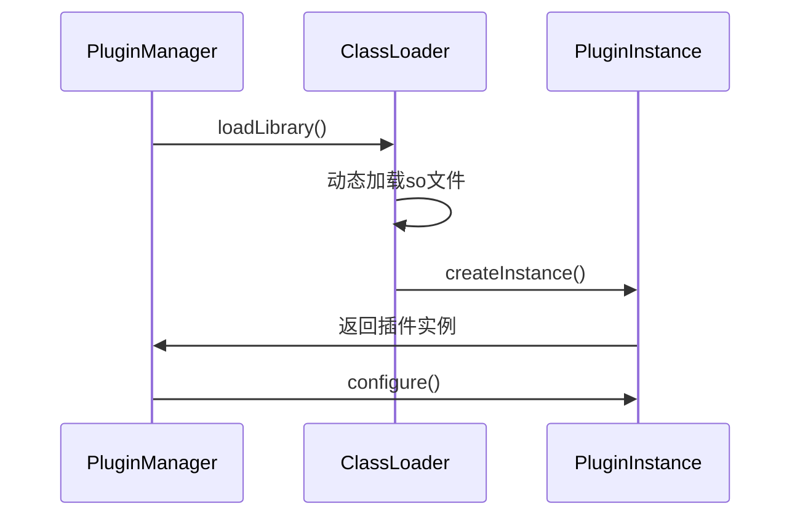

# 插件系统实现

<cite>
**本文档引用的文件**   
- [teb_local_planner_plugin.xml](file://teb_local_planner/teb_local_planner_plugin.xml)
- [teb_local_planner_ros.h](file://teb_local_planner/include/teb_local_planner/teb_local_planner_ros.h)
- [base_plugin.hpp](file://field_local_planner/field_local_planner_base/field_local_planner_base_plugin/include/field_local_planner_base_plugin/base_plugin.hpp)
</cite>

## 目录
1. [引言](#引言)
2. [项目结构分析](#项目结构分析)
3. [核心组件解析](#核心组件解析)
4. [插件声明机制](#插件声明机制)
5. [TebLocalPlannerROS类实现](#teblocalplannerros类实现)
6. [BasePlugin抽象接口设计](#baseplugin抽象接口设计)
7. [插件开发完整流程](#插件开发完整流程)
8. [高级技术特性](#高级技术特性)
9. [结论](#结论)

## 引言
本文档详细解析ROS导航系统中基于pluginlib的插件架构实现，重点分析teb_local_planner和field_local_planner两个项目中的插件系统设计。通过深入研究插件声明机制、类继承关系和接口设计模式，为开发者提供从入门到高级的完整指导。

## 项目结构分析
项目包含多个局部规划器实现，其中teb_local_planner和field_local_planner构成了主要的插件系统。teb_local_planner实现了基于时间弹性带的局部规划算法，而field_local_planner提供了基础插件框架。



**图示来源**
- [teb_local_planner_plugin.xml](file://teb_local_planner/teb_local_planner_plugin.xml)
- [teb_local_planner_ros.h](file://teb_local_planner/include/teb_local_planner/teb_local_planner_ros.h)
- [base_plugin.hpp](file://field_local_planner/field_local_planner_base/field_local_planner_base_plugin/include/field_local_planner_base_plugin/base_plugin.hpp)

## 核心组件解析
系统主要由三个核心组件构成：插件声明文件、插件实现类和抽象接口基类。这些组件共同构成了可扩展的插件架构。

**组件来源**
- [teb_local_planner_plugin.xml](file://teb_local_planner/teb_local_planner_plugin.xml#L1-L15)
- [teb_local_planner_ros.h](file://teb_local_planner/include/teb_local_planner/teb_local_planner_ros.h#L1-L50)
- [base_plugin.hpp](file://field_local_planner/field_local_planner_base/field_local_planner_base_plugin/include/field_local_planner_base_plugin/base_plugin.hpp#L1-L50)

## 插件声明机制
teb_local_planner通过XML文件声明插件，这是ROS pluginlib的标准做法。插件声明文件定义了插件的路径、类名和基类类型。

```xml
<library path="lib/libteb_local_planner">
	<class name="teb_local_planner/TebLocalPlannerROS" type="teb_local_planner::TebLocalPlannerROS" base_class_type="nav_core::BaseLocalPlanner">
		<description>
			The teb_local_planner package implements a plugin
			to the base_local_planner of the 2D navigation stack.
		</description>
	</class>
	<class name="teb_local_planner/TebLocalPlannerROS" type="teb_local_planner::TebLocalPlannerROS" base_class_type="mbf_costmap_core::CostmapController">
		<description>
			Same plugin implemented MBF CostmapController's extended interface.
		</description>
	</class>
</library>
```

该声明表明TebLocalPlannerROS类实现了两个接口：nav_core::BaseLocalPlanner和mbf_costmap_core::CostmapController，使其能够在move_base和move_base_flex中使用。

**图示来源**
- [teb_local_planner_plugin.xml](file://teb_local_planner/teb_local_planner_plugin.xml#L1-L15)

## TebLocalPlannerROS类实现
TebLocalPlannerROS类是teb_local_planner插件的核心实现，它继承了nav_core::BaseLocalPlanner接口，实现了ROS导航栈要求的局部规划功能。

```mermaid
classDiagram
class TebLocalPlannerROS {
+TebLocalPlannerROS()
+~TebLocalPlannerROS()
+initialize(std : : string name, tf2_ros : : Buffer *tf, costmap_2d : : Costmap2DROS* costmap_ros)
+setPlan(const std : : vector<geometry_msgs : : PoseStamped>& orig_global_plan)
+computeVelocityCommands(geometry_msgs : : Twist& cmd_vel)
+computeVelocityCommands(const geometry_msgs : : PoseStamped& pose, const geometry_msgs : : TwistStamped& velocity, geometry_msgs : : TwistStamped &cmd_vel, std : : string &message)
+isGoalReached()
+cancel()
}
nav_core : : BaseLocalPlanner <|-- TebLocalPlannerROS
mbf_costmap_core : : CostmapController <|-- TebLocalPlannerROS
```

该类实现了插件初始化、路径规划、速度命令计算等关键方法，通过pluginlib机制被ROS系统动态加载。

**图示来源**
- [teb_local_planner_ros.h](file://teb_local_planner/include/teb_local_planner/teb_local_planner_ros.h#L100-L150)

## BasePlugin抽象接口设计
field_local_planner中的BasePlugin类采用了抽象接口设计模式，为插件开发提供了标准化的框架。



这种设计模式通过纯虚函数强制子类实现必要的方法，同时提供了一些基础功能的默认实现，平衡了灵活性和一致性。

**图示来源**
- [base_plugin.hpp](file://field_local_planner/field_local_planner_base/field_local_planner_base_plugin/include/field_local_planner_base_plugin/base_plugin.hpp#L50-L100)

## 插件开发完整流程
开发新的局部规划器插件需要遵循以下步骤：



1. 创建新的ROS包作为插件容器
2. 定义插件类并继承nav_core::BaseLocalPlanner接口
3. 实现initialize、setPlan、computeVelocityCommands和isGoalReached等必需方法
4. 创建XML插件声明文件
5. 在CMakeLists.txt中配置库的编译和导出
6. 编译并测试插件
7. 在move_base的配置中使用新插件

**组件来源**
- [teb_local_planner_ros.h](file://teb_local_planner/include/teb_local_planner/teb_local_planner_ros.h#L150-L200)
- [base_plugin.hpp](file://field_local_planner/field_local_planner_base/field_local_planner_base_plugin/include/field_local_planner_base_plugin/base_plugin.hpp#L100-L150)

## 高级技术特性
系统支持多种高级特性，包括插件热加载、版本管理和依赖注入。

### 插件热加载
通过pluginlib的ClassLoader机制，可以在运行时动态加载和卸载插件，无需重启整个系统。

### 版本管理
通过XML声明文件中的版本信息和接口定义，确保插件与系统其他组件的兼容性。

### 依赖注入
系统通过依赖注入模式管理插件所需的资源，如TF缓冲区、代价地图等，提高了代码的可测试性和可维护性。



**图示来源**
- [teb_local_planner_ros.h](file://teb_local_planner/include/teb_local_planner/teb_local_planner_ros.h#L400-L450)
- [base_plugin.hpp](file://field_local_planner/field_local_planner_base/field_local_planner_base_plugin/include/field_local_planner_base_plugin/base_plugin.hpp#L150-L180)

## 结论
本文档详细解析了ROS系统中基于pluginlib的插件架构实现，涵盖了从基础概念到高级特性的完整内容。通过分析teb_local_planner和field_local_planner的实现，展示了如何设计和实现可扩展的局部规划器插件系统。这些设计模式和实现技术不仅适用于导航系统，也可以推广到其他ROS模块的开发中。