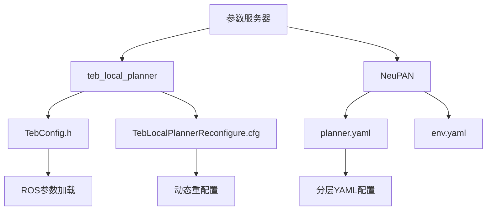
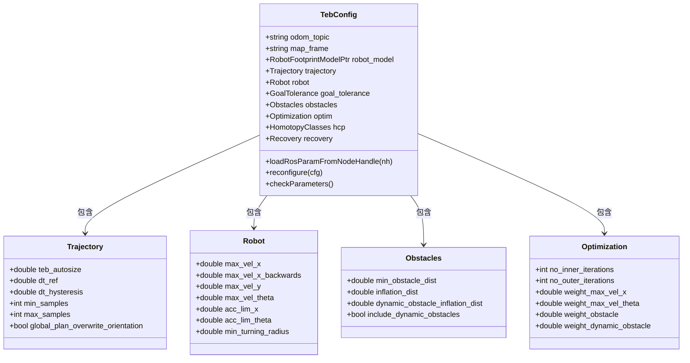
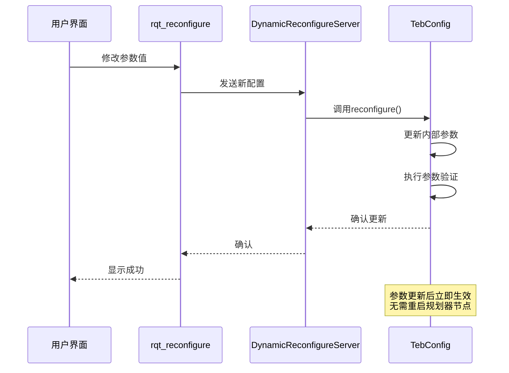
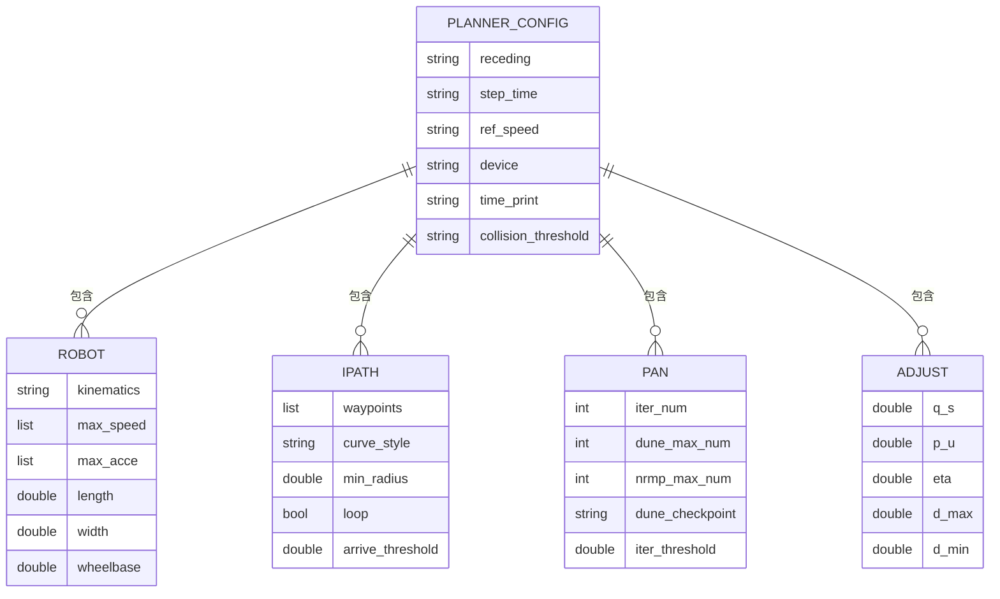
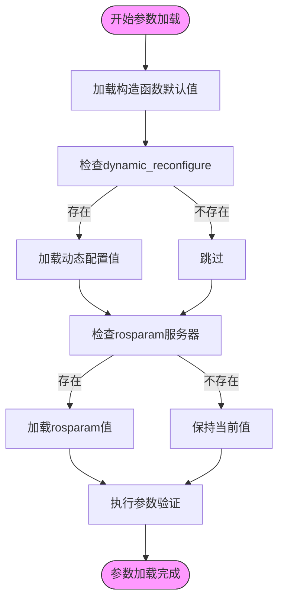
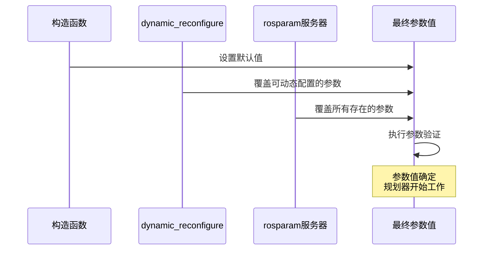
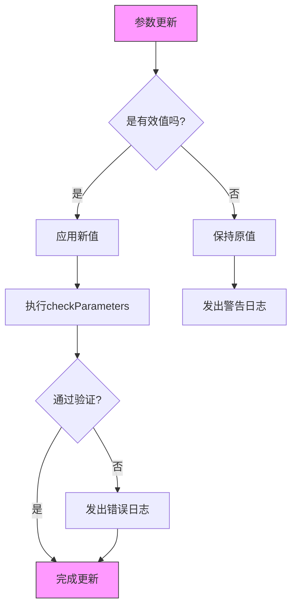
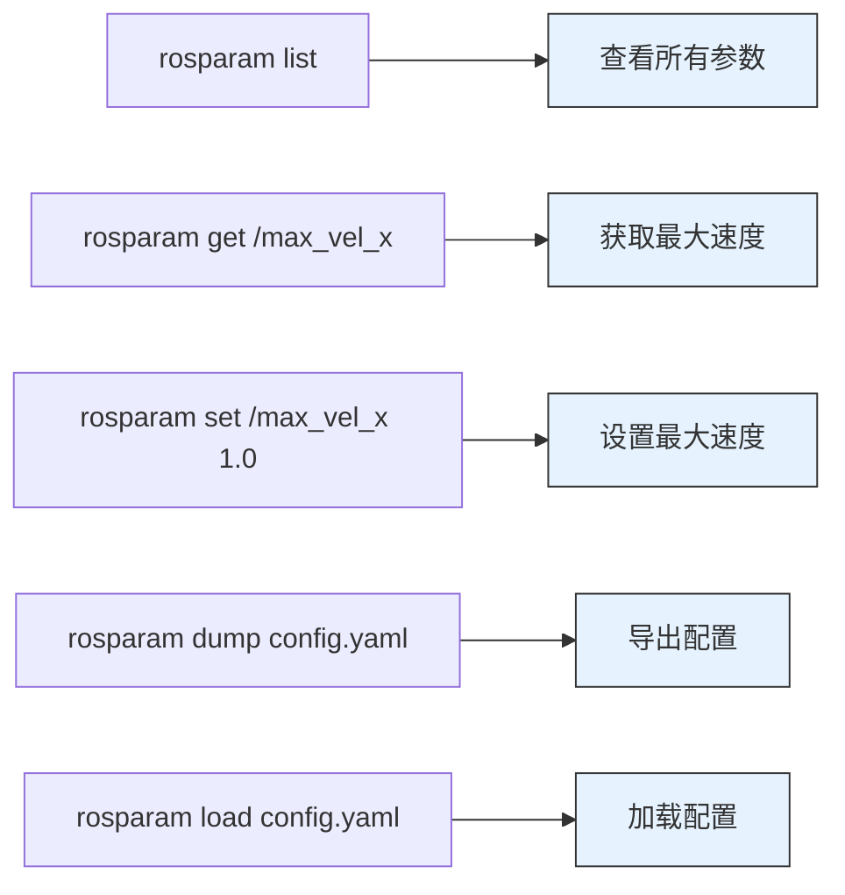
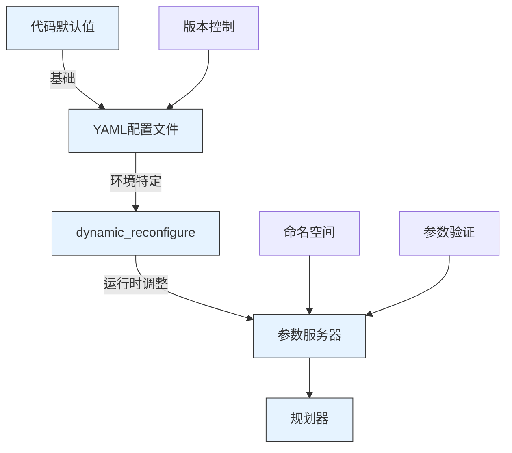

# 参数服务器

<cite>
**本文档中引用的文件**  
- [teb_config.h](file://teb_local_planner/include/teb_local_planner/teb_config.h)
- [TebLocalPlannerReconfigure.cfg](file://teb_local_planner/cfg/TebLocalPlannerReconfigure.cfg)
- [planner.yaml](file://NeuPAN/example/corridor/acker/planner.yaml)
- [planner.yaml](file://NeuPAN/example/corridor/diff/planner.yaml)
</cite>

## 目录
1. [引言](#引言)
2. [项目结构分析](#项目结构分析)
3. [teb_config.h中的参数加载机制](#teb_configh中的参数加载机制)
4. [动态配置与reconfigure机制](#动态配置与reconfigure机制)
5. [YAML配置文件结构与分层设计](#yaml配置文件结构与分层设计)
6. [参数读取与工具函数分析](#参数读取与工具函数分析)
7. [参数定义与初始化流程](#参数定义与初始化流程)
8. [参数命名空间与多机器人系统支持](#参数命名空间与多机器人系统支持)
9. [参数验证与默认值管理](#参数验证与默认值管理)
10. [rosparam命令行工具使用示例](#rosparam命令行工具使用示例)
11. [最佳实践与配置建议](#最佳实践与配置建议)
12. [结论](#结论)

## 引言
ROS参数服务器是机器人系统中实现配置管理的核心机制，为导航规划器等模块提供了灵活的参数配置能力。本文深入分析teb_local_planner中的参数管理架构，重点研究teb_config.h如何通过参数服务器加载规划器的各项关键参数，包括最大速度、加速度、障碍物权重等优化目标。结合NeuPAN项目中的planner.yaml实际配置文件，阐述分层配置结构的设计原则和最佳实践。为初学者提供参数定义、读取和动态更新的完整代码示例，同时为高级开发者提供参数命名空间管理、默认值设置、参数验证机制以及配置文件版本控制的技术方案。特别说明在多机器人系统中如何实现参数的隔离与共享。

## 项目结构分析
项目包含多个导航相关模块，其中teb_local_planner实现了基于时间弹性带（TEB）的局部路径规划算法，其参数配置系统具有典型性和代表性。NeuPAN模块提供了基于学习的规划方法，其YAML配置文件展示了现代机器人系统的分层配置模式。teb_local_planner通过C++类TebConfig集中管理所有参数，而NeuPAN使用YAML文件进行配置，两者共同体现了ROS生态系统中参数管理的多样性。



**图源**  
- [teb_config.h](file://teb_local_planner/include/teb_local_planner/teb_config.h)
- [TebLocalPlannerReconfigure.cfg](file://teb_local_planner/cfg/TebLocalPlannerReconfigure.cfg)
- [planner.yaml](file://NeuPAN/example/corridor/acker/planner.yaml)

**本节来源**  
- [teb_local_planner](file://teb_local_planner/)
- [NeuPAN](file://NeuPAN/)

## teb_config.h中的参数加载机制
TebConfig类作为teb_local_planner的核心配置管理器，采用结构化设计将参数分为多个逻辑组，包括轨迹、机器人、目标容差、障碍物、优化和恢复等。该类通过loadRosParamFromNodeHandle方法从ROS参数服务器加载配置，实现了参数的集中管理和类型安全访问。参数组织采用嵌套结构体模式，提高了代码的可读性和维护性。



**图源**  
- [teb_config.h](file://teb_local_planner/include/teb_local_planner/teb_config.h#L150-L435)

**本节来源**  
- [teb_config.h](file://teb_local_planner/include/teb_local_planner/teb_config.h)

## 动态配置与reconfigure机制
teb_local_planner通过dynamic_reconfigure框架实现了运行时参数调整功能，TebLocalPlannerReconfigure.cfg文件定义了可在rqt_reconfigure等工具中动态修改的参数集合。该机制允许用户在不重启节点的情况下调整关键参数，极大地提高了调试效率。配置参数按功能分组（如轨迹、机器人、障碍物等），并通过不同的参数类型（bool_t、double_t、int_t）进行声明。



**图源**  
- [TebLocalPlannerReconfigure.cfg](file://teb_local_planner/cfg/TebLocalPlannerReconfigure.cfg)
- [teb_config.h](file://teb_local_planner/include/teb_local_planner/teb_config.h#L400-L430)

**本节来源**  
- [TebLocalPlannerReconfigure.cfg](file://teb_local_planner/cfg/TebLocalPlannerReconfigure.cfg)
- [teb_config.h](file://teb_local_planner/include/teb_local_planner/teb_config.h)

## YAML配置文件结构与分层设计
NeuPAN项目的planner.yaml文件展示了清晰的分层配置结构，将参数按功能模块组织为robot、ipath、pan、adjust等顶级键。这种设计提高了配置文件的可读性和可维护性，便于团队协作。配置文件支持多种数据类型，包括标量值、列表和嵌套字典，能够表达复杂的参数关系。



**图源**  
- [planner.yaml](file://NeuPAN/example/corridor/acker/planner.yaml)
- [planner.yaml](file://NeuPAN/example/corridor/diff/planner.yaml)

**本节来源**  
- [planner.yaml](file://NeuPAN/example/corridor/acker/planner.yaml)
- [planner.yaml](file://NeuPAN/example/corridor/diff/planner.yaml)

## 参数读取与工具函数分析
TebConfig类提供了loadRosParamFromNodeHandle方法作为主要的参数读取接口，该方法通过ros::NodeHandle从参数服务器获取配置值。参数加载遵循优先级顺序：构造函数默认值 < dynamic_reconfigure默认值 < rosparam服务器值。这种设计确保了配置的灵活性和可靠性。参数验证机制通过checkParameters方法实现，在参数更新后自动执行合理性检查。



**图源**  
- [teb_config.h](file://teb_local_planner/include/teb_local_planner/teb_config.h#L400-L430)
- [TebLocalPlannerReconfigure.cfg](file://teb_local_planner/cfg/TebLocalPlannerReconfigure.cfg)

**本节来源**  
- [teb_config.h](file://teb_local_planner/include/teb_local_planner/teb_config.h)
- [TebLocalPlannerReconfigure.cfg](file://teb_local_planner/cfg/TebLocalPlannerReconfigure.cfg)

## 参数定义与初始化流程
参数初始化遵循严格的优先级顺序，确保系统在不同部署环境下都能正确配置。首先，TebConfig构造函数设置所有参数的默认值；然后，dynamic_reconfigure服务器应用其配置文件中定义的默认值；最后，从ROS参数服务器加载实际部署值。这种三级优先级机制（构造函数 << dynamic_reconfigure << rosparam）提供了最大的配置灵活性。



**图源**  
- [teb_config.h](file://teb_local_planner/include/teb_local_planner/teb_config.h#L150-L435)
- [TebLocalPlannerReconfigure.cfg](file://teb_local_planner/cfg/TebLocalPlannerReconfigure.cfg)

**本节来源**  
- [teb_config.h](file://teb_local_planner/include/teb_local_planner/teb_config.h)
- [TebLocalPlannerReconfigure.cfg](file://teb_local_planner/cfg/TebLocalPlannerReconfigure.cfg)

## 参数命名空间与多机器人系统支持
在多机器人系统中，参数服务器通过命名空间实现参数隔离。每个机器人实例运行在独立的命名空间下，其参数路径自动前缀化，避免冲突。例如，robot1/max_vel_x和robot2/max_vel_x可以设置不同的值。这种机制使得同一配置模板可以应用于多个机器人，同时保持参数的独立性。通过ros::NodeHandle("~")访问私有命名空间参数，ros::NodeHandle("/")访问全局参数，实现了灵活的参数共享策略。

```mermaid
graph TD
A[参数服务器] --> B[全局命名空间]
A --> C[robot1命名空间]
A --> D[robot2命名空间]
A --> E[robotN命名空间]
B --> F[/max_vel_x]
B --> G[/map_frame]
C --> H[robot1/max_vel_x]
C --> I[robot1/acc_lim_x]
D --> J[robot2/max_vel_x]
D --> K[robot2/acc_lim_x]
E --> L[robotN/max_vel_x]
E --> M[robotN/acc_lim_x]
style B fill:#e6f3ff,stroke:#333
style C fill:#e6ffe6,stroke:#333
style D fill:#e6ffe6,stroke:#333
style E fill:#e6ffe6,stroke:#333
```

**图源**  
- [teb_config.h](file://teb_local_planner/include/teb_local_planner/teb_config.h)
- [TebLocalPlannerReconfigure.cfg](file://teb_local_planner/cfg/TebLocalPlannerReconfigure.cfg)

**本节来源**  
- [teb_config.h](file://teb_local_planner/include/teb_local_planner/teb_config.h)
- [TebLocalPlannerReconfigure.cfg](file://teb_local_planner/cfg/TebLocalPlannerReconfigure.cfg)

## 参数验证与默认值管理
TebConfig类实现了完善的参数验证机制，通过checkParameters方法在运行时检查参数的合理性。例如，验证max_vel_x必须大于0，dt_ref必须在合理范围内等。参数默认值在构造函数中集中定义，采用合理的工程默认值，确保系统在缺少外部配置时仍能正常工作。dynamic_reconfigure配置文件中的默认值与C++代码保持同步，避免配置漂移。



**图源**  
- [teb_config.h](file://teb_local_planner/include/teb_local_planner/teb_config.h#L420-L430)
- [TebLocalPlannerReconfigure.cfg](file://teb_local_planner/cfg/TebLocalPlannerReconfigure.cfg)

**本节来源**  
- [teb_config.h](file://teb_local_planner/include/teb_local_planner/teb_config.h)
- [TebLocalPlannerReconfigure.cfg](file://teb_local_planner/cfg/TebLocalPlannerReconfigure.cfg)

## rosparam命令行工具使用示例
rosparam命令行工具提供了直接操作参数服务器的能力。常用命令包括：rosparam list（列出所有参数）、rosparam get <param>（获取参数值）、rosparam set <param> <value>（设置参数值）、rosparam dump <file>（导出参数到文件）和rosparam load <file>（从文件加载参数）。这些工具在调试和部署过程中非常有用，可以快速验证配置效果。



**图源**  
- [teb_config.h](file://teb_local_planner/include/teb_local_planner/teb_config.h)
- [TebLocalPlannerReconfigure.cfg](file://teb_local_planner/cfg/TebLocalPlannerReconfigure.cfg)

**本节来源**  
- [teb_config.h](file://teb_local_planner/include/teb_local_planner/teb_config.h)
- [TebLocalPlannerReconfigure.cfg](file://teb_local_planner/cfg/TebLocalPlannerReconfigure.cfg)

## 最佳实践与配置建议
在实际项目中，建议采用分层配置策略：基础默认值在代码中定义，环境特定配置在YAML文件中管理，运行时调整通过dynamic_reconfigure实现。配置文件应按功能模块组织，使用清晰的命名约定。对于多机器人系统，利用命名空间实现参数隔离，同时通过全局参数共享公共配置。定期导出和版本控制关键配置，确保系统的可重现性。



**图源**  
- [teb_config.h](file://teb_local_planner/include/teb_local_planner/teb_config.h)
- [planner.yaml](file://NeuPAN/example/corridor/acker/planner.yaml)
- [TebLocalPlannerReconfigure.cfg](file://teb_local_planner/cfg/TebLocalPlannerReconfigure.cfg)

**本节来源**  
- [teb_config.h](file://teb_local_planner/include/teb_local_planner/teb_config.h)
- [planner.yaml](file://NeuPAN/example/corridor/acker/planner.yaml)
- [TebLocalPlannerReconfigure.cfg](file://teb_local_planner/cfg/TebLocalPlannerReconfigure.cfg)

## 结论
ROS参数服务器为机器人系统提供了强大而灵活的配置管理能力。通过分析teb_local_planner和NeuPAN项目的实现，我们看到了从C++代码到YAML文件的完整配置生态。合理的参数组织、清晰的分层设计、完善的验证机制和灵活的动态调整功能共同构成了健壮的配置管理系统。对于开发者而言，理解这些机制有助于构建更可靠、更易维护的机器人应用。