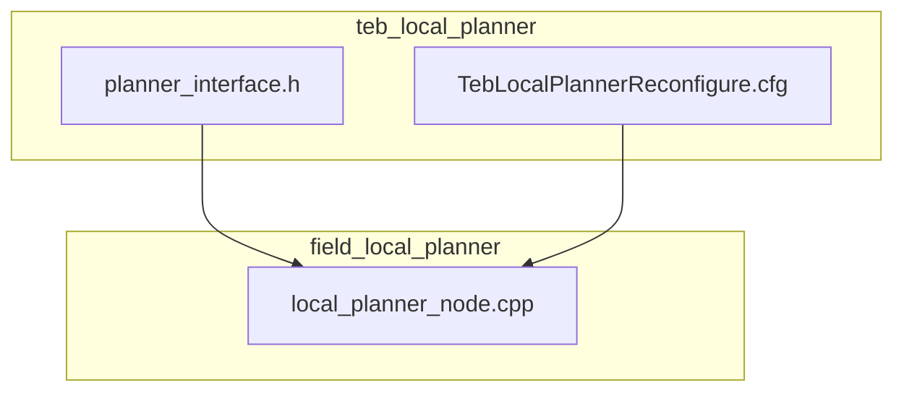
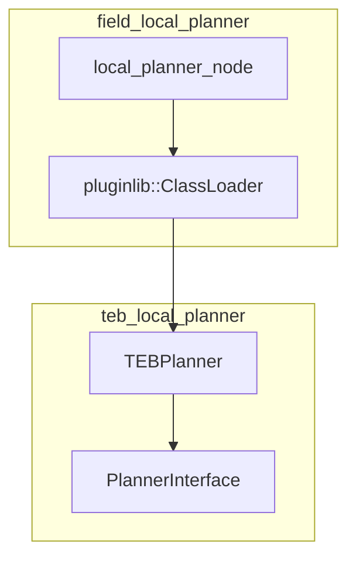
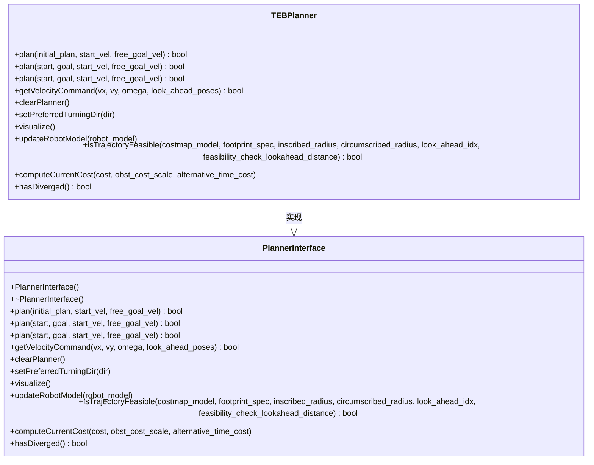
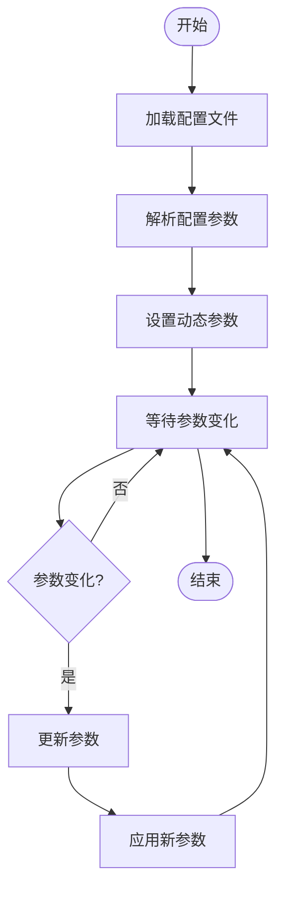
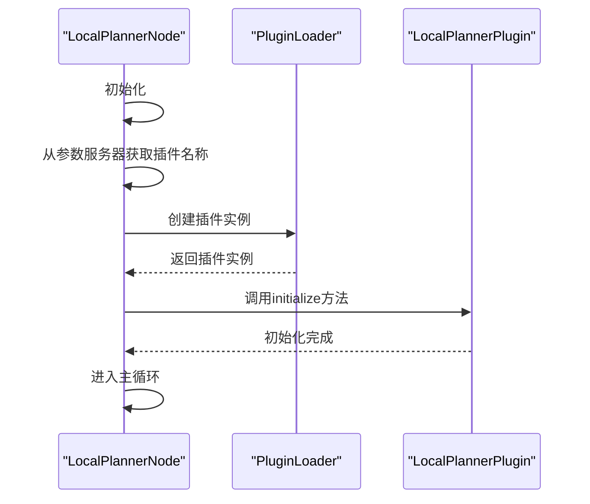
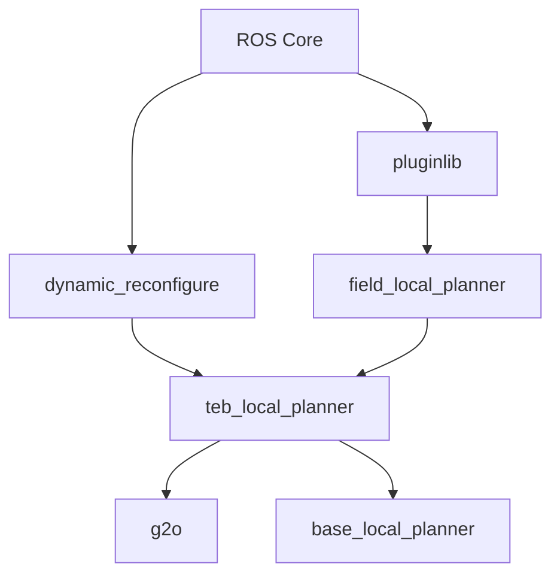

# 服务调用

<cite>
**本文档中引用的文件**   
- [planner_interface.h](file://teb_local_planner/include/teb_local_planner/planner_interface.h)
- [TebLocalPlannerReconfigure.cfg](file://teb_local_planner/cfg/TebLocalPlannerReconfigure.cfg)
- [local_planner_node.cpp](file://field_local_planner/field_local_planner_ros/src/local_planner_node.cpp)
</cite>

## 目录
1. [介绍](#介绍)
2. [项目结构](#项目结构)
3. [核心组件](#核心组件)
4. [架构概述](#架构概述)
5. [详细组件分析](#详细组件分析)
6. [依赖分析](#依赖分析)
7. [性能考虑](#性能考虑)
8. [故障排除指南](#故障排除指南)
9. [结论](#结论)
10. [附录](#附录)（如有必要）

## 介绍
本文档旨在深入解析ROS服务调用机制在项目中的应用，重点聚焦于`planner_interface.h`中定义的服务接口，如动态参数重配置和路径生成请求。结合`local_planner_node.cpp`中的实现，展示如何定义和实现自定义服务服务器，处理客户端请求并返回响应。为初学者提供从服务定义到调用的完整流程示例，涵盖`rosservice`命令行工具的使用。为高级开发者提供关于服务超时处理、错误码设计、并发请求管理以及服务端性能优化的技术指导。说明在实时规划系统中如何平衡服务调用的阻塞性与系统响应性。

## 项目结构
本项目包含多个子模块，其中`teb_local_planner`和`field_local_planner`是核心组件。`teb_local_planner`提供了局部路径规划功能，而`field_local_planner`则通过插件机制支持多种局部规划器。`planner_interface.h`定义了规划器的抽象接口，`TebLocalPlannerReconfigure.cfg`用于动态参数配置，`local_planner_node.cpp`实现了主节点逻辑。

**图源**
- [planner_interface.h](file://teb_local_planner/include/teb_local_planner/planner_interface.h#L1-L209)
- [TebLocalPlannerReconfigure.cfg](file://teb_local_planner/cfg/TebLocalPlannerReconfigure.cfg#L1-L448)

**本节来源**
- [planner_interface.h](file://teb_local_planner/include/teb_local_planner/planner_interface.h#L1-L209)
- [TebLocalPlannerReconfigure.cfg](file://teb_local_planner/cfg/TebLocalPlannerReconfigure.cfg#L1-L448)
- [local_planner_node.cpp](file://field_local_planner/field_local_planner_ros/src/local_planner_node.cpp#L1-L50)

## 核心组件
`planner_interface.h`定义了`PlannerInterface`抽象类，该类为局部规划器提供了统一的接口。`plan`方法用于基于初始参考路径或起始和目标姿态生成轨迹，`getVelocityCommand`方法用于从已优化的路径中获取速度命令。`TebLocalPlannerReconfigure.cfg`文件定义了动态参数，允许在运行时调整规划器的行为。`local_planner_node.cpp`实现了主节点，加载插件并初始化局部规划器。

**本节来源**
- [planner_interface.h](file://teb_local_planner/include/teb_local_planner/planner_interface.h#L1-L209)
- [TebLocalPlannerReconfigure.cfg](file://teb_local_planner/cfg/TebLocalPlannerReconfigure.cfg#L1-L448)
- [local_planner_node.cpp](file://field_local_planner/field_local_planner_ros/src/local_planner_node.cpp#L1-L50)

## 架构概述
系统架构采用插件化设计，`field_local_planner`通过`pluginlib`加载不同的局部规划器插件。`teb_local_planner`作为其中一个插件，实现了`PlannerInterface`接口。主节点`local_planner_node`负责初始化插件，并通过ROS服务和话题与外部通信。

**图源**
- [planner_interface.h](file://teb_local_planner/include/teb_local_planner/planner_interface.h#L1-L209)
- [local_planner_node.cpp](file://field_local_planner/field_local_planner_ros/src/local_planner_node.cpp#L1-L50)

## 详细组件分析

### PlannerInterface 分析
`PlannerInterface`类定义了局部规划器的抽象接口，包括轨迹规划、速度命令获取、轨迹可行性检查等方法。`plan`方法有多个重载版本，支持不同的输入格式。`getVelocityCommand`方法用于从优化后的轨迹中提取速度命令，控制机器人在当前采样间隔内的运动。

#### 类图

**图源**
- [planner_interface.h](file://teb_local_planner/include/teb_local_planner/planner_interface.h#L1-L209)

**本节来源**
- [planner_interface.h](file://teb_local_planner/include/teb_local_planner/planner_interface.h#L1-L209)

### 动态参数配置分析
`TebLocalPlannerReconfigure.cfg`文件定义了动态参数，允许在运行时调整规划器的行为。这些参数包括轨迹参数、机器人参数、目标容差、障碍物处理和优化设置等。通过`dynamic_reconfigure`，可以在不重启节点的情况下调整这些参数。

#### 流程图

**图源**
- [TebLocalPlannerReconfigure.cfg](file://teb_local_planner/cfg/TebLocalPlannerReconfigure.cfg#L1-L448)

**本节来源**
- [TebLocalPlannerReconfigure.cfg](file://teb_local_planner/cfg/TebLocalPlannerReconfigure.cfg#L1-L448)

### LocalPlannerNode 分析
`local_planner_node.cpp`实现了主节点逻辑，通过`pluginlib`加载指定的局部规划器插件。节点初始化时从参数服务器获取插件名称，创建插件实例并调用其`initialize`方法。

#### 序列图

**图源**
- [local_planner_node.cpp](file://field_local_planner/field_local_planner_ros/src/local_planner_node.cpp#L1-L50)

**本节来源**
- [local_planner_node.cpp](file://field_local_planner/field_local_planner_ros/src/local_planner_node.cpp#L1-L50)

## 依赖分析
项目依赖于ROS核心库、`pluginlib`用于插件加载、`dynamic_reconfigure`用于动态参数配置。`teb_local_planner`依赖于`g2o`用于优化，`base_local_planner`用于成本地图模型。`field_local_planner`通过插件机制与具体的规划器解耦，提高了系统的可扩展性。

**图源**
- [planner_interface.h](file://teb_local_planner/include/teb_local_planner/planner_interface.h#L1-L209)
- [TebLocalPlannerReconfigure.cfg](file://teb_local_planner/cfg/TebLocalPlannerReconfigure.cfg#L1-L448)
- [local_planner_node.cpp](file://field_local_planner/field_local_planner_ros/src/local_planner_node.cpp#L1-L50)

**本节来源**
- [planner_interface.h](file://teb_local_planner/include/teb_local_planner/planner_interface.h#L1-L209)
- [TebLocalPlannerReconfigure.cfg](file://teb_local_planner/cfg/TebLocalPlannerReconfigure.cfg#L1-L448)
- [local_planner_node.cpp](file://field_local_planner/field_local_planner_ros/src/local_planner_node.cpp#L1-L50)

## 性能考虑
在实时规划系统中，服务调用的阻塞性可能影响系统响应性。建议使用异步调用模式，避免阻塞主循环。对于耗时较长的规划任务，可以考虑使用动作（Action）而非服务（Service）。此外，合理设置动态参数，如`teb_autosize`和`dt_ref`，可以平衡规划精度和计算效率。

## 故障排除指南
- **插件加载失败**：检查插件名称是否正确，确保插件库已正确编译并安装。
- **动态参数不生效**：确认`dynamic_reconfigure`客户端已正确连接到服务器。
- **规划失败**：检查成本地图和障碍物数据是否正确发布，验证机器人模型参数。

**本节来源**
- [planner_interface.h](file://teb_local_planner/include/teb_local_planner/planner_interface.h#L1-L209)
- [TebLocalPlannerReconfigure.cfg](file://teb_local_planner/cfg/TebLocalPlannerReconfigure.cfg#L1-L448)
- [local_planner_node.cpp](file://field_local_planner/field_local_planner_ros/src/local_planner_node.cpp#L1-L50)

## 结论
本文档详细介绍了ROS服务调用机制在项目中的应用，重点解析了`planner_interface.h`中定义的服务接口和`local_planner_node.cpp`中的实现。通过插件化设计和动态参数配置，系统具有良好的可扩展性和灵活性。为初学者和高级开发者提供了从服务定义到调用的完整指导。

## 附录
无