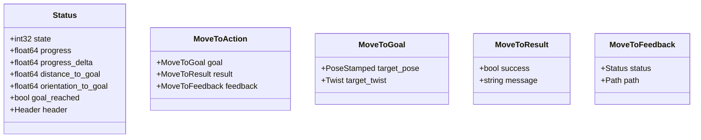
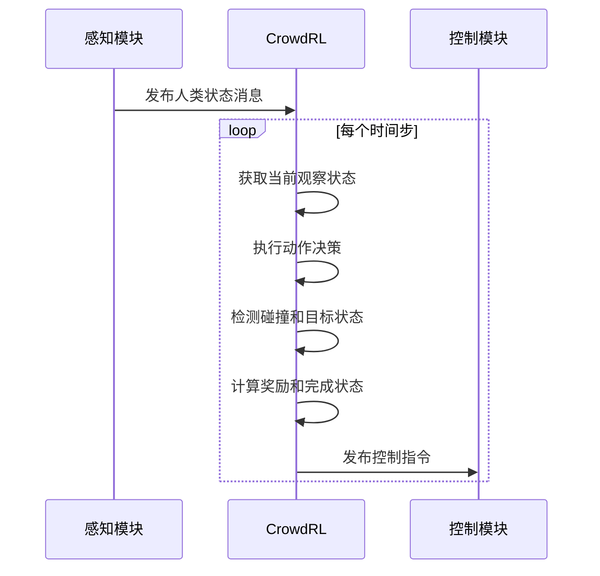
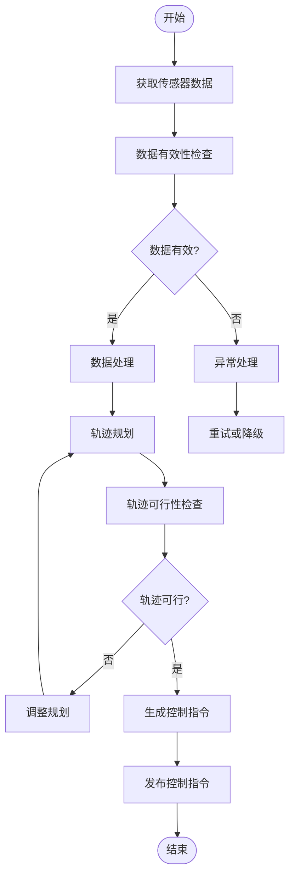

# 消息传递机制

<cite>
**本文档中引用的文件**  
- [planner_interface.h](file://teb_local_planner/include/teb_local_planner/planner_interface.h)
- [CrowdRL.py](file://AEMCARL/attachments/ros_ws/local_planner_py/scripts/CrowdRL.py)
- [field_local_planner_msgs/CMakeLists.txt](file://field_local_planner/field_local_planner_msgs/CMakeLists.txt)
- [field_local_planner_msgs/package.xml](file://field_local_planner/field_local_planner_msgs/package.xml)
- [utils.hpp](file://field_local_planner/field_local_planner_base/field_local_planner_base_plugin/include/field_local_planner_base_plugin/utils.hpp)
- [base_local_planner.hpp](file://field_local_planner/field_local_planner_base/field_local_planner_base/include/field_local_planner_base/base_local_planner.hpp)
</cite>

## 目录
1. [引言](#引言)
2. [规划器接口规范分析](#规划器接口规范分析)
3. [自定义消息类型定义与序列化机制](#自定义消息类型定义与序列化机制)
4. [CrowdRL中的ROS话题通信实现](#crowdrl中的ros话题通信实现)
5. [ROS基础通信机制使用指南](#ros基础通信机制使用指南)
6. [高级消息传递优化策略](#高级消息传递优化策略)
7. [异常处理与数据同步机制](#异常处理与数据同步机制)
8. [结论](#结论)

## 引言
本文档深入分析ROS消息传递机制在机器人导航项目中的具体应用。重点研究teb_local_planner中的规划器接口规范、field_local_planner_msgs中自定义消息类型的定义，以及CrowdRL.py中传感器数据订阅和控制指令发布的实现方式。为不同层次的开发者提供从基础使用到高级优化的完整技术方案。

## 规划器接口规范分析

teb_local_planner中的`PlannerInterface`类定义了局部规划器的标准接口规范，通过纯虚函数强制实现类提供统一的消息交互方式。该接口支持多种轨迹规划方法，包括基于初始参考路径的规划、基于起始和目标位姿的规划等。

接口定义了输入/输出话题的语义规范：
- 输入：初始路径（geometry_msgs/PoseStamped数组）、起始速度（geometry_msgs/Twist）
- 输出：速度命令（vx, vy, omega）、轨迹可行性状态
- 控制参数：是否允许目标点非零速度（free_goal_vel）

该接口还提供了轨迹可行性检查功能，通过成本地图模型验证机器人轨迹是否与障碍物发生碰撞，确保生成的路径安全可靠。

**Section sources**
- [planner_interface.h](file://teb_local_planner/include/teb_local_planner/planner_interface.h#L1-L209)

## 自定义消息类型定义与序列化机制

field_local_planner_msgs包定义了项目专用的自定义消息类型，通过ROS的消息生成系统实现高效的序列化和反序列化。

### 消息类型定义
根据CMakeLists.txt配置，该包定义了以下消息类型：
- `Status.msg`：用于传输局部规划器的状态信息
- `MoveTo.action`：定义动作接口，包含目标、反馈和结果

### 序列化机制
消息的序列化通过ROS的message_generation和message_runtime系统自动完成。CMakeLists.txt中配置了消息生成规则，编译时会自动生成C++和Python的序列化代码。

### 消息内容结构
Status消息包含以下字段：
- state：规划器当前状态（NOT_READY, FINISHED, EXECUTING, FAILURE）
- progress：任务完成进度
- progress_delta：进度变化率
- distance_to_goal：到目标的距离
- orientation_to_goal：到目标的方向角

消息转换通过工具函数实现C++数据结构到ROS消息的映射，如`toStatusMsg`函数将BaseLocalPlanner::Status转换为field_local_planner_msgs::Status。



**Diagram sources**
- [field_local_planner_msgs/CMakeLists.txt](file://field_local_planner/field_local_planner_msgs/CMakeLists.txt#L20-L35)
- [base_local_planner.hpp](file://field_local_planner/field_local_planner_base/include/field_local_planner_base/base_local_planner.hpp#L34-L87)
- [utils.hpp](file://field_local_planner/field_local_planner_base_plugin/include/field_local_planner_base_plugin/utils.hpp#L152-L165)

**Section sources**
- [field_local_planner_msgs/CMakeLists.txt](file://field_local_planner/field_local_planner_msgs/CMakeLists.txt#L1-L54)
- [field_local_planner_msgs/package.xml](file://field_local_planner/field_local_planner_msgs/package.xml#L1-L19)
- [base_local_planner.hpp](file://field_local_planner/field_local_planner_base/include/field_local_planner_base/base_local_planner.hpp#L34-L87)

## CrowdRL中的ROS话题通信实现

CrowdRL.py实现了基于ROS话题的传感器数据订阅和控制指令发布机制，构建了完整的感知-决策-控制闭环。

### 传感器数据订阅
通过`step`方法中的观察状态获取机制，模拟了从感知模块接收传感器数据的过程：
- 人类代理状态：通过`get_observable_state`方法获取其他人类的可观测状态
- 机器人状态：当机器人可见时，将其状态加入观察空间
- 数据格式：坐标系下的位置、速度、半径等信息

### 控制指令发布
在`step`方法中实现了控制指令的生成和发布：
- 动作执行：根据当前动作更新机器人状态
- 碰撞检测：计算机器人与人类之间的最小距离，判断是否发生碰撞
- 目标检测：检查机器人是否到达目标位置
- 奖励计算：根据任务完成情况、碰撞状态、舒适度等计算奖励值

### 通信流程


**Diagram sources**
- [CrowdRL.py](file://AEMCARL/attachments/ros_ws/local_planner_py/scripts/CrowdRL.py#L180-L265)

**Section sources**
- [CrowdRL.py](file://AEMCARL/attachments/ros_ws/local_planner_py/scripts/CrowdRL.py#L0-L265)

## ROS基础通信机制使用指南

### 话题发布/订阅
```python
# 订阅传感器数据
rospy.Subscriber('/sensor_data', SensorMsg, callback)

# 发布控制指令
pub = rospy.Publisher('/cmd_vel', Twist, queue_size=1)
pub.publish(twist_msg)
```

### 服务调用
```python
# 定义服务
srv = rospy.Service('get_path', GetPath, handle_request)

# 调用服务
rospy.wait_for_service('get_path')
try:
    get_path = rospy.ServiceProxy('get_path', GetPath)
    resp = get_path(start, goal)
except rospy.ServiceException as e:
    print("Service call failed: %s"%e)
```

### 参数服务器
```python
# 设置参数
rospy.set_param('/planner/max_speed', 1.0)

# 获取参数
max_speed = rospy.get_param('/planner/max_speed', 0.5)

# 检查参数是否存在
if rospy.has_param('/planner/use_orca'):
    use_orca = rospy.get_param('/planner/use_orca')
```

## 高级消息传递优化策略

### 消息缓冲策略
- 动态调整队列大小：根据网络状况和处理能力调整消息队列
- 优先级队列：为关键控制指令设置更高优先级
- 消息聚合：将多个小消息合并为大消息减少通信开销

### 带宽优化
- 数据压缩：对大尺寸消息（如点云）进行压缩传输
- 采样率控制：根据应用场景调整传感器数据发布频率
- 条件发布：仅在状态发生显著变化时发布消息

### 实时通信保障
- QoS配置：设置适当的消息服务质量等级
- 心跳机制：定期发送心跳消息监测通信链路状态
- 超时重试：为关键服务调用设置超时和重试机制

## 异常处理与数据同步机制

### 异常处理
- 碰撞检测：实时计算机器人与障碍物的最小距离，及时发现潜在碰撞
- 超时处理：设置任务执行时间限制，防止无限等待
- 状态监控：持续监控规划器状态，及时发现执行失败情况

### 数据同步
- 时间戳同步：所有消息携带时间戳，确保数据时序正确
- 缓冲区管理：合理设置接收缓冲区大小，平衡延迟和数据完整性
- 状态一致性：通过状态消息确保各模块对系统状态的认知一致



**Diagram sources**
- [planner_interface.h](file://teb_local_planner/include/teb_local_planner/planner_interface.h#L1-L209)
- [CrowdRL.py](file://AEMCARL/attachments/ros_ws/local_planner_py/scripts/CrowdRL.py#L180-L265)

## 结论
本文档详细分析了ROS消息传递机制在机器人导航项目中的应用。通过规划器接口规范、自定义消息类型、话题通信实现等方面的深入研究，为开发者提供了从基础使用到高级优化的完整技术方案。这些机制确保了系统各组件之间的高效、可靠通信，为复杂机器人应用的开发提供了坚实基础。