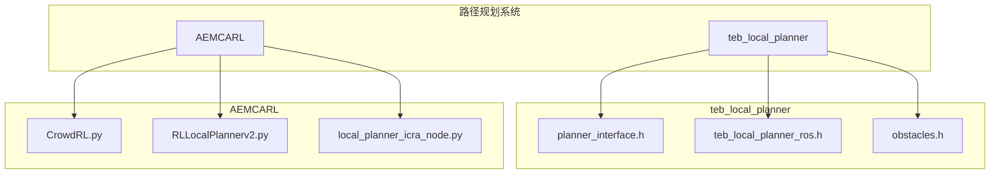
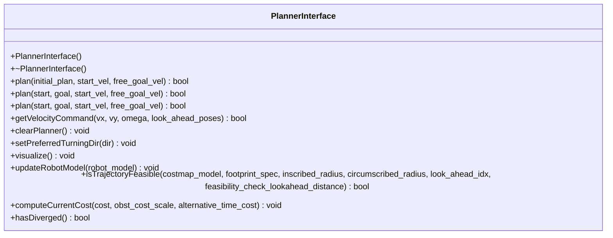
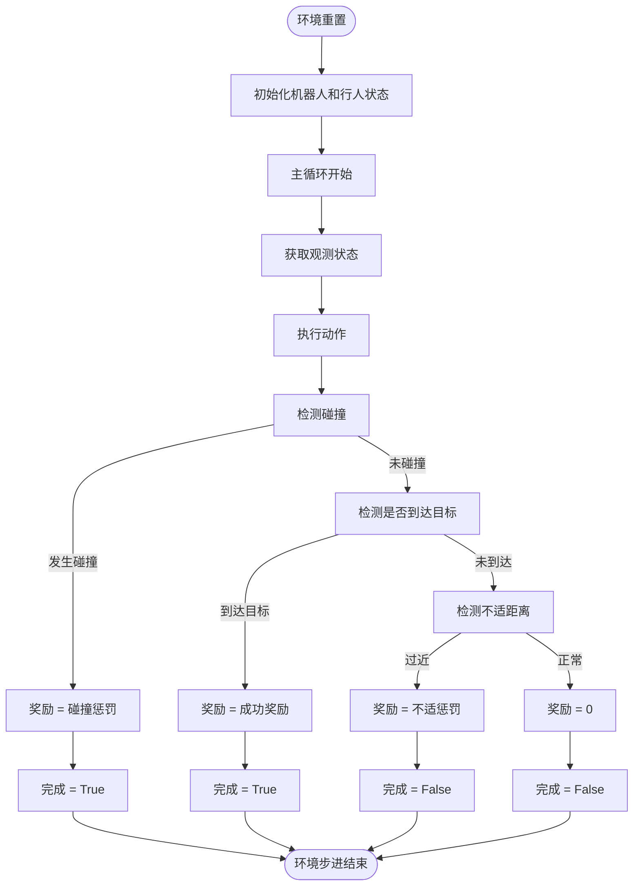
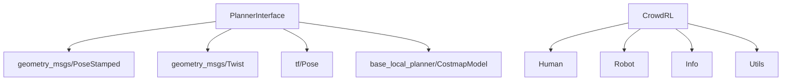

# 话题通信

<cite>
**本文档中引用的文件**  
- [planner_interface.h](file://teb_local_planner/include/teb_local_planner/planner_interface.h)
- [CrowdRL.py](file://AEMCARL/attachments/ros_ws/local_planner_py/scripts/CrowdRL.py)
</cite>

## 目录
1. [引言](#引言)
2. [项目结构](#项目结构)
3. [核心组件](#核心组件)
4. [架构概述](#架构概述)
5. [详细组件分析](#详细组件分析)
6. [依赖分析](#依赖分析)
7. [性能考虑](#性能考虑)
8. [故障排除指南](#故障排除指南)
9. [结论](#结论)

## 引言
本文档深入探讨ROS话题通信机制在本地路径规划项目中的实现与应用。重点分析`planner_interface.h`中定义的输入/输出话题（如/cmd_vel、/odom、/scan等）的命名规范、消息类型（如geometry_msgs、sensor_msgs）及其在规划器中的处理流程。结合`CrowdRL.py`中的实际代码，展示如何使用rospy进行话题订阅与发布，包括回调函数的设计、消息队列的管理以及多线程环境下的数据同步。为初学者提供创建和使用自定义话题的完整示例，为高级开发者提供关于消息传输延迟优化、带宽控制、QoS配置以及实时性保障的最佳实践。说明在高频率控制场景下如何避免消息积压和时序错乱问题。

## 项目结构
本项目包含多个ROS功能包，主要涉及路径规划、避障和仿真模块。核心路径规划功能由`teb_local_planner`和`AEMCARL`中的`local_planner_py`实现。`teb_local_planner`提供基于时间弹性带（TEB）的局部规划器接口，而`AEMCARL`则集成了基于强化学习的行人避障算法。



**图源**  
- [planner_interface.h](file://teb_local_planner/include/teb_local_planner/planner_interface.h#L1-L20)
- [CrowdRL.py](file://AEMCARL/attachments/ros_ws/local_planner_py/scripts/CrowdRL.py#L1-L50)

**本节来源**  
- [teb_local_planner/include/teb_local_planner](file://teb_local_planner/include/teb_local_planner)
- [AEMCARL/attachments/ros_ws/local_planner_py/scripts](file://AEMCARL/attachments/ros_ws/local_planner_py/scripts)

## 核心组件
本项目的核心组件包括基于TEB的局部规划器接口和基于强化学习的行人避障环境。`PlannerInterface`类定义了局部规划器的抽象接口，而`CrowdRL`类实现了多智能体避障仿真环境。

**本节来源**  
- [planner_interface.h](file://teb_local_planner/include/teb_local_planner/planner_interface.h#L50-L100)
- [CrowdRL.py](file://AEMCARL/attachments/ros_ws/local_planner_py/scripts/CrowdRL.py#L10-L50)

## 架构概述
系统采用分层架构，上层为基于强化学习的决策模块，下层为基于优化的局部规划器。`CrowdRL`环境通过ROS话题接收机器人状态和传感器数据，输出速度指令，再由`teb_local_planner`进行轨迹优化和执行。

```mermaid
graph LR
S[传感器] --> |/scan| C[CrowdRL]
O[/odom] --> C
C --> |/cmd_vel| T[teb_local_planner]
T --> |控制指令| R[机器人]
R --> S
R --> O
```

**图源**  
- [planner_interface.h](file://teb_local_planner/include/teb_local_planner/planner_interface.h#L1-L20)
- [CrowdRL.py](file://AEMCARL/attachments/ros_ws/local_planner_py/scripts/CrowdRL.py#L1-L50)

## 详细组件分析

### PlannerInterface 分析
`PlannerInterface`是局部规划器的抽象基类，定义了轨迹规划、速度获取、可行性检查等核心方法。该接口通过纯虚函数强制子类实现具体规划算法。



**图源**  
- [planner_interface.h](file://teb_local_planner/include/teb_local_planner/planner_interface.h#L50-L200)

**本节来源**  
- [planner_interface.h](file://teb_local_planner/include/teb_local_planner/planner_interface.h#L1-L209)

### CrowdRL 分析
`CrowdRL`类实现了多智能体避障仿真环境，负责管理机器人和行人的状态、检测碰撞、计算奖励并推进仿真时间步。

#### 状态管理与奖励计算


**图源**  
- [CrowdRL.py](file://AEMCARL/attachments/ros_ws/local_planner_py/scripts/CrowdRL.py#L150-L250)

**本节来源**  
- [CrowdRL.py](file://AEMCARL/attachments/ros_ws/local_planner_py/scripts/CrowdRL.py#L1-L266)

## 依赖分析
项目依赖关系清晰，`teb_local_planner`依赖ROS基础消息类型（geometry_msgs、tf等）和基础局部规划器包（base_local_planner）。`AEMCARL`中的`CrowdRL`模块依赖环境配置和人类模型。



**图源**  
- [planner_interface.h](file://teb_local_planner/include/teb_local_planner/planner_interface.h#L20-L30)
- [CrowdRL.py](file://AEMCARL/attachments/ros_ws/local_planner_py/scripts/CrowdRL.py#L1-L10)

**本节来源**  
- [planner_interface.h](file://teb_local_planner/include/teb_local_planner/planner_interface.h#L1-L209)
- [CrowdRL.py](file://AEMCARL/attachments/ros_ws/local_planner_py/scripts/CrowdRL.py#L1-L266)

## 性能考虑
在高频率控制场景下，需特别注意话题通信的性能。建议使用适当的QoS配置，避免消息积压。对于`/cmd_vel`等关键控制话题，应使用较小的消息队列长度（如1）以保证最新指令的优先执行。同时，合理设置话题发布频率，平衡控制精度和计算负载。

## 故障排除指南
常见问题包括话题未正确连接、消息类型不匹配和规划器发散。可通过`rostopic list`和`rostopic info`检查话题连接状态，使用`rosmsg show`验证消息类型。当规划器出现振荡或发散时，可调用`hasDiverged()`方法检测并重置规划器状态。

**本节来源**  
- [planner_interface.h](file://teb_local_planner/include/teb_local_planner/planner_interface.h#L190-L195)
- [CrowdRL.py](file://AEMCARL/attachments/ros_ws/local_planner_py/scripts/CrowdRL.py#L150-L200)

## 结论
本文档详细分析了ROS话题通信在路径规划项目中的应用。通过`PlannerInterface`的标准化接口和`CrowdRL`的复杂环境仿真，展示了ROS系统中模块化设计和松耦合通信的优势。开发者可基于此框架实现自定义的规划算法和仿真环境，同时遵循最佳实践确保系统的实时性和稳定性。