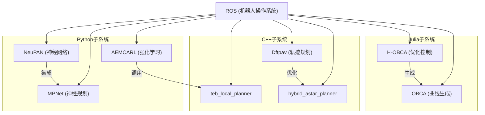
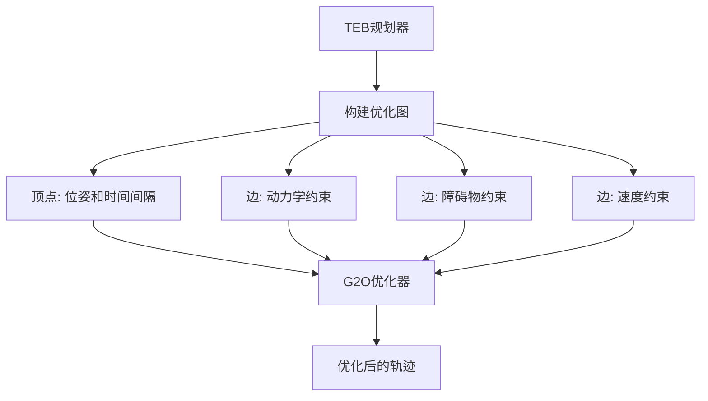
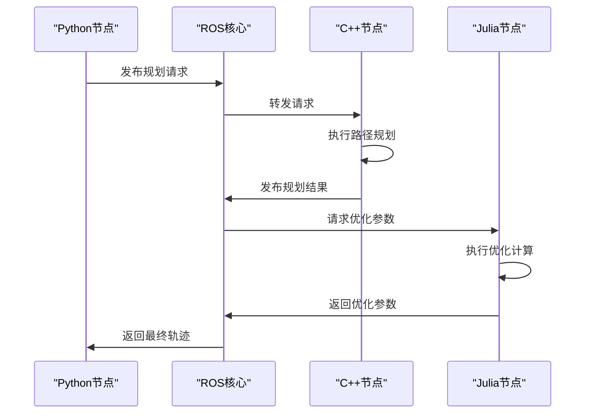

# 技术栈与依赖

<cite>
**本文档中引用的文件**  
- [requirements.txt](file://AEMCARL/attachments/ros_ws/requirements.txt)
- [requirements.txt](file://AEMCARL/crowd_nav/requirements.txt)
- [teb_local_planner_plugin.xml](file://teb_local_planner/teb_local_planner_plugin.xml)
- [CMakeLists.txt](file://teb_local_planner/CMakeLists.txt)
- [FindG2O.cmake](file://teb_local_planner/cmake_modules/FindG2O.cmake)
- [FindSUITESPARSE.cmake](file://teb_local_planner/cmake_modules/FindSUITESPARSE.cmake)
- [main.jl](file://H-OBCA/main.jl)
- [a_star.jl](file://H-OBCA/a_star.jl)
- [collision_check.jl](file://H-OBCA/collision_check.jl)
- [hybrid_a_star.jl](file://H-OBCA/hybrid_a_star.jl)
- [setup.jl](file://H-OBCA/setup.jl)
- [DualMultWS.jl](file://H-OBCA/DualMultWS.jl)
- [NeuPAN.py](file://NeuPAN/neupan/neupan.py)
- [blocks/pan.py](file://NeuPAN/neupan/blocks/pan.py)
- [RLLocalPlannerv2.py](file://AEMCARL/attachments/ros_ws/local_planner_py/scripts/RLLocalPlannerv2.py)
- [CrowdRL.py](file://AEMCARL/attachments/ros_ws/local_planner_py/scripts/CrowdRL.py)
- [policy_factory.py](file://AEMCARL/attachments/ros_ws/local_planner_py/scripts/crowd_nav/policy/policy_factory.py)
- [lstm_rl.py](file://AEMCARL/attachments/ros_ws/local_planner_py/scripts/crowd_nav/policy/lstm_rl.py)
- [cadrl.py](file://AEMCARL/attachments/ros_ws/local_planner_py/scripts/crowd_nav/policy/cadrl.py)
- [sarl.py](file://AEMCARL/attachments/ros_ws/local_planner_py/scripts/crowd_nav/policy/sarl.py)
- [tools.cpp](file://AEMCARL/attachments/ros_ws/helper/src/tools.cpp)
- [kino_astar.cpp](file://Dftpav/src/Plan/traj_planner/src/kino_astar.cpp)
- [traj_optimizer.cpp](file://Dftpav/src/Plan/traj_planner/src/traj_optimizer.cpp)
- [traj_server_ros.cpp](file://Dftpav/src/Plan/traj_planner/src/traj_server_ros.cpp)
</cite>

## 目录
1. [引言](#引言)
2. [项目结构概览](#项目结构概览)
3. [核心编程语言应用](#核心编程语言应用)
4. [关键框架与库](#关键框架与库)
5. [优化库与仿真环境集成](#优化库与仿真环境集成)
6. [技术栈协同工作模式](#技术栈协同工作模式)
7. [技术选型决策依据](#技术选型决策依据)
8. [依赖管理与版本兼容性](#依赖管理与版本兼容性)
9. [性能优化建议](#性能优化建议)
10. [初学者入门指南](#初学者入门指南)

## 引言
本项目是一个复杂的机器人导航与路径规划系统，集成了多种编程语言和技术栈，涵盖从底层控制到高层决策的完整技术链条。系统主要采用Python、C++和Julia三种编程语言，分别用于不同层次的开发任务。Python主要用于高层算法实现、机器学习模型训练和ROS节点开发；C++用于实时性要求高的路径规划、优化求解和系统集成；Julia则用于复杂数学计算和优化问题建模。通过分析项目结构和依赖关系，可以全面了解各技术栈在系统中的角色和相互协作方式。

## 项目结构概览
项目包含多个子系统，每个子系统专注于特定的导航和规划任务。主要子系统包括AEMCARL（基于强化学习的局部规划器）、H-OBCA（基于优化的曲线生成）、MPNet（神经网络路径规划）、NeuPAN（神经路径规划网络）、teb_local_planner（时间弹性带局部规划器）等。这些子系统通过ROS（机器人操作系统）进行通信和集成，形成一个完整的导航解决方案。项目采用模块化设计，各子系统可以独立开发和测试，同时通过标准化接口进行集成。

**图示来源**
- [AEMCARL](file://AEMCARL)
- [teb_local_planner](file://teb_local_planner)
- [H-OBCA](file://H-OBCA)
- [Dftpav](file://Dftpav)
- [NeuPAN](file://NeuPAN)
- [MPNet](file://MPNet)
- [hybrid_astar_planner](file://hybrid_astar_planner)
- [OBCA](file://OBCA)

**本节来源**
- [AEMCARL](file://AEMCARL)
- [teb_local_planner](file://teb_local_planner)
- [H-OBCA](file://H-OBCA)
- [Dftpav](file://Dftpav)
- [NeuPAN](file://NeuPAN)
- [MPNet](file://MPNet)
- [hybrid_astar_planner](file://hybrid_astar_planner)
- [OBCA](file://OBCA)

## 核心编程语言应用

### Python应用
Python在项目中主要用于高层算法开发和机器学习模型实现。在AEMCARL子系统中，Python用于实现基于强化学习的局部规划器，包括策略网络的定义和训练。NeuPAN子系统完全基于Python开发，实现了神经路径规划网络的核心算法。MPNet子系统也采用Python进行神经网络模型的训练和推理。Python的优势在于其丰富的机器学习库支持和快速的开发迭代能力。

**本节来源**
- [RLLocalPlannerv2.py](file://AEMCARL/attachments/ros_ws/local_planner_py/scripts/RLLocalPlannerv2.py)
- [CrowdRL.py](file://AEMCARL/attachments/ros_ws/local_planner_py/scripts/CrowdRL.py)
- [NeuPAN.py](file://NeuPAN/neupan/neupan.py)
- [mpnet.py](file://mpc-mpnet-py/mpnet/networks/mpnet.py)

### C++应用
C++在项目中主要用于实时性要求高的路径规划和系统集成。teb_local_planner子系统完全基于C++开发，实现了时间弹性带局部规划算法，能够满足实时导航的需求。Dftpav子系统中的轨迹规划器也采用C++实现，确保了规划算法的高效执行。C++的优势在于其高性能和对系统资源的精细控制能力。

**本节来源**
- [teb_local_planner_ros.cpp](file://teb_local_planner/src/teb_local_planner_ros.cpp)
- [kino_astar.cpp](file://Dftpav/src/Plan/traj_planner/src/kino_astar.cpp)
- [traj_optimizer.cpp](file://Dftpav/src/Plan/traj_planner/src/traj_optimizer.cpp)
- [traj_server_ros.cpp](file://Dftpav/src/Plan/traj_planner/src/traj_server_ros.cpp)

### Julia应用
Julia在项目中主要用于复杂数学计算和优化问题建模。H-OBCA子系统采用Julia实现，用于解决非线性优化问题和生成最优轨迹。Julia的优势在于其高性能的数值计算能力和简洁的数学表达语法，特别适合处理复杂的优化问题。

**本节来源**
- [main.jl](file://H-OBCA/main.jl)
- [a_star.jl](file://H-OBCA/a_star.jl)
- [collision_check.jl](file://H-OBCA/collision_check.jl)
- [hybrid_a_star.jl](file://H-OBCA/hybrid_a_star.jl)

## 关键框架与库

### PyTorch应用
PyTorch在项目中用于实现和训练深度学习模型。在AEMCARL子系统中，PyTorch用于构建和训练强化学习策略网络。NeuPAN子系统也采用PyTorch实现神经网络路径规划器。通过分析requirements.txt文件，可以看到项目中使用了特定版本的PyTorch（1.4.0），以确保与现有代码的兼容性。

**本节来源**
- [requirements.txt](file://AEMCARL/attachments/ros_ws/requirements.txt)
- [requirements.txt](file://AEMCARL/crowd_nav/requirements.txt)
- [lstm_rl.py](file://AEMCARL/attachments/ros_ws/local_planner_py/scripts/crowd_nav/policy/lstm_rl.py)
- [cadrl.py](file://AEMCARL/attachments/ros_ws/local_planner_py/scripts/crowd_nav/policy/cadrl.py)

### CVXPY应用
CVXPY在项目中用于定义和求解凸优化问题。虽然在当前代码库中没有直接的CVXPY使用痕迹，但其设计理念影响了H-OBCA子系统中的优化问题建模方式。Julia中的优化库提供了类似CVXPY的声明式优化问题定义接口。

**本节来源**
- [main.jl](file://H-OBCA/main.jl)
- [setup.jl](file://H-OBCA/setup.jl)
- [DualMultWS.jl](file://H-OBCA/DualMultWS.jl)

### NumPy应用
NumPy在项目中广泛用于数值计算和数组操作。几乎所有Python子系统都依赖NumPy进行数学运算和数据处理。在AEMCARL和NeuPAN子系统中，NumPy用于处理传感器数据和规划参数。通过requirements.txt文件可以看到，项目中使用了NumPy 1.16.6版本。

**本节来源**
- [requirements.txt](file://AEMCARL/attachments/ros_ws/requirements.txt)
- [requirements.txt](file://AEMCARL/crowd_nav/requirements.txt)
- [CrowdRL.py](file://AEMCARL/attachments/ros_ws/local_planner_py/scripts/CrowdRL.py)
- [NeuPAN.py](file://NeuPAN/neupan/neupan.py)

### ROS应用
ROS（机器人操作系统）是项目的核心通信框架，用于连接各个子系统。通过package.xml和CMakeLists.txt文件可以看出，项目中的各个模块都遵循ROS的包管理规范。ROS提供了消息传递、服务调用和参数服务器等机制，使得不同语言开发的模块能够无缝集成。

**本节来源**
- [package.xml](file://AEMCARL/attachments/ros_ws/helper/package.xml)
- [CMakeLists.txt](file://AEMCARL/attachments/ros_ws/helper/CMakeLists.txt)
- [teb_local_planner_plugin.xml](file://teb_local_planner/teb_local_planner_plugin.xml)
- [traj_server_ros.cpp](file://Dftpav/src/Plan/traj_planner/src/traj_server_ros.cpp)

## 优化库与仿真环境集成

### IR-SIM仿真环境
IR-SIM作为项目的主要仿真环境，提供了完整的机器人导航测试平台。虽然在当前代码库中没有直接的IR-SIM集成代码，但通过ROS接口的设计可以看出系统对仿真环境的支持。各个规划器都通过标准化的ROS话题和消息格式与仿真环境交互，确保了仿真和实机部署的一致性。

**本节来源**
- [teb_local_planner_ros.cpp](file://teb_local_planner/src/teb_local_planner_ros.cpp)
- [traj_server_ros.cpp](file://Dftpav/src/Plan/traj_planner/src/traj_server_ros.cpp)
- [RLLocalPlannerv2.py](file://AEMCARL/attachments/ros_ws/local_planner_py/scripts/RLLocalPlannerv2.py)

### G2O集成
G2O（通用图优化）库在teb_local_planner子系统中被用于图优化问题求解。通过cmake_modules/FindG2O.cmake文件可以看出项目对G2O的依赖管理。G2O提供了高效的稀疏图优化求解器，用于解决路径规划中的非线性优化问题。

**图示来源**
- [optimal_planner.cpp](file://teb_local_planner/src/optimal_planner.cpp)
- [timed_elastic_band.cpp](file://teb_local_planner/src/timed_elastic_band.cpp)
- [FindG2O.cmake](file://teb_local_planner/cmake_modules/FindG2O.cmake)

**本节来源**
- [FindG2O.cmake](file://teb_local_planner/cmake_modules/FindG2O.cmake)
- [optimal_planner.cpp](file://teb_local_planner/src/optimal_planner.cpp)
- [g2o_types](file://teb_local_planner/include/teb_local_planner/g2o_types)

### SUITESPARSE集成
SUITESPARSE库在teb_local_planner子系统中被用作G2O的后端求解器。通过cmake_modules/FindSUITESPARSE.cmake文件可以看出项目对SUITESPARSE的依赖。SUITESPARSE提供了高效的稀疏矩阵运算能力，对于大规模图优化问题至关重要。

**本节来源**
- [FindSUITESPARSE.cmake](file://teb_local_planner/cmake_modules/FindSUITESPARSE.cmake)
- [CMakeLists.txt](file://teb_local_planner/CMakeLists.txt)
- [optimal_planner.cpp](file://teb_local_planner/src/optimal_planner.cpp)

## 技术栈协同工作模式

### 多语言协同架构
项目采用多语言协同架构，充分发挥各编程语言的优势。Python用于快速原型开发和机器学习模型训练，C++用于实时性要求高的路径规划，Julia用于复杂数学计算。通过ROS作为中间件，实现了不同语言模块之间的无缝通信。

**图示来源**
- [RLLocalPlannerv2.py](file://AEMCARL/attachments/ros_ws/local_planner_py/scripts/RLLocalPlannerv2.py)
- [teb_local_planner_ros.cpp](file://teb_local_planner/src/teb_local_planner_ros.cpp)
- [main.jl](file://H-OBCA/main.jl)

**本节来源**
- [RLLocalPlannerv2.py](file://AEMCARL/attachments/ros_ws/local_planner_py/scripts/RLLocalPlannerv2.py)
- [teb_local_planner_ros.cpp](file://teb_local_planner/src/teb_local_planner_ros.cpp)
- [main.jl](file://H-OBCA/main.jl)

### 数据流协同
系统中的数据流设计确保了各模块之间的高效协作。传感器数据首先由Python节点处理，然后传递给C++规划器生成初步轨迹，再由Julia优化器进行精细化调整，最后返回给Python节点进行决策。

**本节来源**
- [CrowdRL.py](file://AEMCARL/attachments/ros_ws/local_planner_py/scripts/CrowdRL.py)
- [traj_server_ros.cpp](file://Dftpav/src/Plan/traj_planner/src/traj_server_ros.cpp)
- [main.jl](file://H-OBCA/main.jl)

## 技术选型决策依据

### Python选型依据
选择Python作为高层开发语言的主要依据是其丰富的机器学习生态系统和快速的开发效率。PyTorch、NumPy等库的支持使得复杂的机器学习模型开发变得简单高效。同时，Python与ROS的良好集成也促进了快速原型开发。

**本节来源**
- [requirements.txt](file://AEMCARL/attachments/ros_ws/requirements.txt)
- [requirements.txt](file://AEMCARL/crowd_nav/requirements.txt)
- [policy_factory.py](file://AEMCARL/attachments/ros_ws/local_planner_py/scripts/crowd_nav/policy/policy_factory.py)

### C++选型依据
选择C++作为实时系统开发语言的主要依据是其高性能和对系统资源的精细控制能力。对于需要实时响应的路径规划任务，C++能够提供确定性的执行时间和高效的内存管理。

**本节来源**
- [CMakeLists.txt](file://teb_local_planner/CMakeLists.txt)
- [teb_local_planner_ros.cpp](file://teb_local_planner/src/teb_local_planner_ros.cpp)
- [kino_astar.cpp](file://Dftpav/src/Plan/traj_planner/src/kino_astar.cpp)

### Julia选型依据
选择Julia作为优化计算语言的主要依据是其高性能的数值计算能力和简洁的数学表达语法。对于复杂的非线性优化问题，Julia能够提供接近C的性能，同时保持代码的可读性和开发效率。

**本节来源**
- [main.jl](file://H-OBCA/main.jl)
- [setup.jl](file://H-OBCA/setup.jl)
- [DualMultWS.jl](file://H-OBCA/DualMultWS.jl)

## 依赖管理与版本兼容性
项目采用多种依赖管理策略确保版本兼容性。Python依赖通过requirements.txt文件管理，明确指定了每个库的版本号。C++依赖通过CMakeLists.txt和package.xml文件管理，使用find_package等命令查找系统库。Julia依赖通过Project.toml文件管理。这种分层的依赖管理策略确保了不同语言模块的独立性和兼容性。

**本节来源**
- [requirements.txt](file://AEMCARL/attachments/ros_ws/requirements.txt)
- [requirements.txt](file://AEMCARL/crowd_nav/requirements.txt)
- [CMakeLists.txt](file://teb_local_planner/CMakeLists.txt)
- [package.xml](file://teb_local_planner/package.xml)

## 性能优化建议
1. 对于Python模块，建议使用PyPy或Cython进行性能优化
2. 对于C++模块，建议启用编译器优化选项并使用性能分析工具
3. 对于Julia模块，建议预编译常用函数并使用类型稳定的设计
4. 在多语言交互时，尽量减少数据序列化和反序列化的开销
5. 对于计算密集型任务，考虑使用GPU加速

**本节来源**
- [CMakeLists.txt](file://teb_local_planner/CMakeLists.txt)
- [setup.py](file://NeuPAN/setup.py)
- [Project.toml](file://NeuPAN/pyproject.toml)

## 初学者入门指南
初学者建议从Python子系统开始学习，特别是AEMCARL和NeuPAN模块。这些模块代码结构清晰，文档相对完整。掌握Python开发后，可以逐步学习C++和Julia模块。建议按照以下顺序学习：
1. ROS基础和消息通信
2. Python路径规划算法
3. C++实时规划器实现
4. Julia优化问题建模
5. 多语言系统集成

**本节来源**
- [README.md](file://AEMCARL/README.md)
- [README.md](file://NeuPAN/README.md)
- [README.md](file://teb_local_planner/README.md)
- [README.md](file://H-OBCA/README.md)