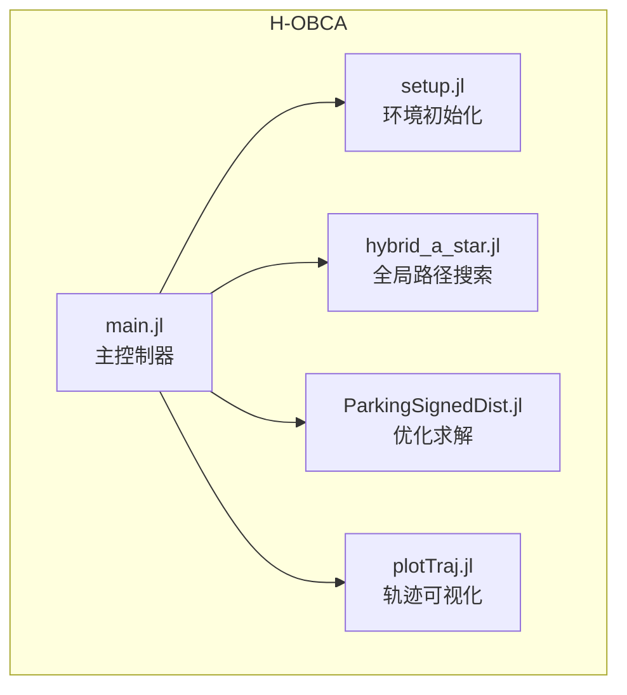
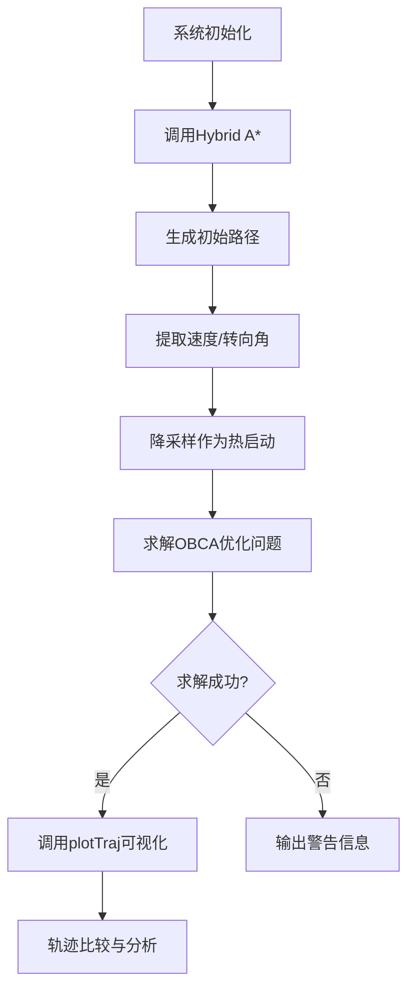
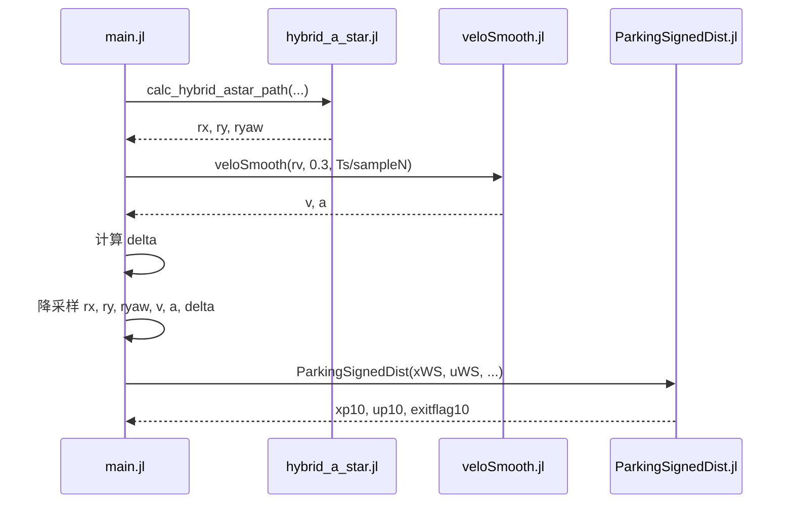
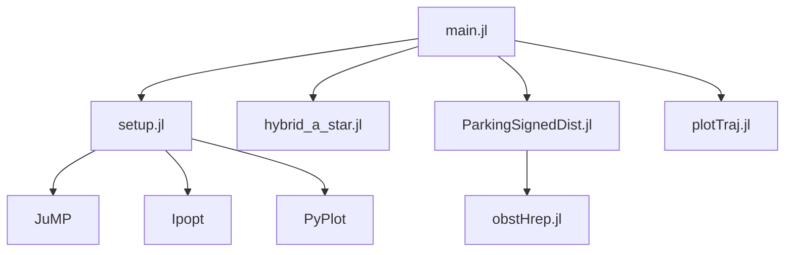

# 主控制器

<cite>
**本文档中引用的文件**  
- [main.jl](file://H-OBCA/main.jl)
- [setup.jl](file://H-OBCA/setup.jl)
- [plotTraj.jl](file://H-OBCA/plotTraj.jl)
</cite>

## 目录
1. [简介](#简介)
2. [项目结构](#项目结构)
3. [核心组件](#核心组件)
4. [架构概述](#架构概述)
5. [详细组件分析](#详细组件分析)
6. [依赖分析](#依赖分析)
7. [性能考量](#性能考量)
8. [故障排除指南](#故障排除指南)
9. [结论](#结论)

## 简介
本文档详细分析H-OBCA（分层优化避障）主控制器系统，重点解析其在自主泊车场景中的路径规划流程。系统采用分层架构，结合Hybrid A*全局路径搜索与基于优化的局部避障（OBCA）方法，实现安全、平滑的泊车轨迹生成。文档将深入探讨系统初始化、轨迹优化求解循环、结果可视化等核心流程，并说明各模块间的调用关系和数据传递机制。

## 项目结构
H-OBCA项目位于`H-OBCA`目录下，是一个基于Julia语言的路径规划系统。其核心文件包括`main.jl`（主执行文件）、`setup.jl`（环境与依赖初始化）和`plotTraj.jl`（轨迹可视化）。系统通过调用`hybrid_a_star.jl`进行初始路径搜索，并利用`ParkingSignedDist.jl`等模块求解非线性优化问题，最终生成无碰撞轨迹。

**图示来源**
- [main.jl](file://H-OBCA/main.jl#L1-L262)
- [setup.jl](file://H-OBCA/setup.jl#L1-L57)
- [plotTraj.jl](file://H-OBCA/plotTraj.jl#L1-L140)

**章节来源**
- [main.jl](file://H-OBCA/main.jl#L1-L262)
- [setup.jl](file://H-OBCA/setup.jl#L1-L57)

## 核心组件
本系统的核心组件包括主控制器`main.jl`、环境配置模块`setup.jl`和可视化模块`plotTraj.jl`。`main.jl`负责协调整个优化流程，从系统初始化、调用Hybrid A*生成初始路径，到执行OBCA优化求解，最后进行结果可视化。`setup.jl`负责加载必要的Julia包（如JuMP、Ipopt、PyPlot）和系统模块，为`main.jl`的执行提供运行环境。`plotTraj.jl`则提供动态轨迹绘制功能，用于直观展示优化结果。

**章节来源**
- [main.jl](file://H-OBCA/main.jl#L1-L262)
- [setup.jl](file://H-OBCA/setup.jl#L1-L57)
- [plotTraj.jl](file://H-OBCA/plotTraj.jl#L1-L140)

## 架构概述
H-OBCA系统采用“全局搜索 + 局部优化”的分层架构。首先，`main.jl`通过`hybrid_a_star.jl`模块计算一条从起点到终点的初始路径。随后，该路径被用作非线性优化问题的“热启动”（warm start）解。系统调用`ParkingSignedDist.jl`求解器，在考虑车辆动力学约束和障碍物避让的前提下，对初始路径进行精细化优化，生成一条平滑且无碰撞的最终轨迹。整个流程由`main.jl`统一调度，并通过`plotTraj.jl`进行结果验证。

**图示来源**
- [main.jl](file://H-OBCA/main.jl#L1-L262)

## 详细组件分析

### 主控制器流程分析
`main.jl`是整个系统的执行入口，其程序执行流程清晰地分为系统初始化、轨迹优化求解和结果可视化三个阶段。

#### 系统初始化
初始化阶段在`main.jl`文件中完成，主要任务是配置泊车场景、定义车辆和环境参数。用户通过设置`scenario`变量选择“backwards”（倒车入库）或“parallel”（侧方停车”）模式。系统根据场景定义障碍物的几何形状（`lObPlot`用于绘图，`lOb`用于优化）、车辆尺寸（`ego`）、轮距（`L`）以及状态空间边界（`XYbounds`）。同时，系统会设置初始状态`x0`和目标状态`xF`，并初始化Hybrid A*算法所需的离散化障碍物地图（`ox`, `oy`）。

**章节来源**
- [main.jl](file://H-OBCA/main.jl#L20-L140)

#### 轨迹优化求解循环
此阶段是系统的核心，实现了从初始路径到优化轨迹的转换。
1.  **初始路径生成**：调用`hybrid_a_star.calc_hybrid_astar_path`函数，基于A*算法的变种，计算出一条从`x0`到`xF`的初始路径（`rx`, `ry`, `ryaw`），并记录计算时间。
2.  **速度剖面提取与平滑**：从初始路径的坐标变化中提取名义速度`rv`，并调用`veloSmooth`函数，根据最大加速度约束（0.3 m/s²）生成平滑的速度`v`和加速度`a`序列。
3.  **转向角计算**：根据路径的航向角变化和车辆轮距`L`，计算出对应的转向角`delta`。
4.  **热启动准备**：为了降低优化问题的维度，对初始路径及其控制量进行降采样（`sampleN`倍），生成状态向量`xWS`和控制向量`uWS`。
5.  **OBCA优化求解**：调用`ParkingSignedDist`函数，以`xWS`和`uWS`为初始猜测，求解一个非线性规划问题。该问题的目标是最小化轨迹与障碍物的穿透距离，同时满足车辆动力学和状态边界约束。求解器返回优化后的状态轨迹`xp10`、控制序列`up10`、时间缩放因子`scaleTime10`以及求解状态`exitflag10`。

**图示来源**
- [main.jl](file://H-OBCA/main.jl#L142-L200)

**章节来源**
- [main.jl](file://H-OBCA/main.jl#L142-L200)

#### 结果可视化
可视化阶段由`main.jl`中的绘图指令和`plotTraj.jl`模块共同完成。
1.  **优化结果绘制**：如果`exitflag10`为1（求解成功），`main.jl`会调用`plotTraj`函数，传入优化后的轨迹`xp10`、控制量`up10`、车辆参数和障碍物信息。`plotTraj`函数会动态绘制车辆沿轨迹移动的动画，清晰地展示车辆姿态和与障碍物的相对位置。
2.  **轨迹对比**：`main.jl`还会创建一个对比图，将OBCA优化后的轨迹（实线）与Hybrid A*生成的初始路径（虚线）叠加绘制，直观地展示优化效果。
3.  **性能统计**：最后，系统会打印总运行时间、Hybrid A*耗时和OBCA优化耗时，便于性能分析。

**章节来源**
- [main.jl](file://H-OBCA/main.jl#L202-L262)
- [plotTraj.jl](file://H-OBCA/plotTraj.jl#L1-L140)

### 环境初始化逻辑分析
`setup.jl`文件是系统运行的前提，其主要功能是环境初始化。它通过`using`关键字加载了求解优化问题所必需的Julia包：`JuMP`（用于建立数学优化模型）、`Ipopt`（用于求解非线性规划问题）和`PyPlot`（用于绘图）。此外，它通过`include`语句将项目中的关键模块（如`ParkingSignedDist.jl`、`obstHrep.jl`、`plotTraj.jl`等）引入到当前作用域，确保`main.jl`可以无缝调用这些功能。`setup.jl`还定义了一个`clear()`函数，用于清空终端输出，保持运行环境的整洁。

**章节来源**
- [setup.jl](file://H-OBCA/setup.jl#L1-L57)

### 轨迹可视化功能实现
`plotTraj.jl`模块实现了轨迹的动态可视化。其核心是`plotTraj`函数，该函数接收轨迹点、车辆尺寸、障碍物顶点等参数。函数内部通过一个`for`循环，逐帧绘制车辆在每个离散时间点的位置和姿态。它利用`carBox`和`carBox_dashed`两个辅助函数来绘制实线和虚线的车辆轮廓。通过`sleep(0.05)`实现动画效果，让用户能够观察到车辆如何沿着规划的轨迹平稳移动，从而验证轨迹的安全性和合理性。

**章节来源**
- [plotTraj.jl](file://H-OBCA/plotTraj.jl#L1-L140)

## 依赖分析
H-OBCA系统依赖于多个外部和内部模块。外部依赖包括`JuMP`、`Ipopt`和`PyPlot`等Julia包，分别用于优化建模、求解和绘图。内部依赖则构成了系统的核心功能链：`main.jl`直接依赖`setup.jl`进行初始化，并调用`hybrid_a_star.jl`、`ParkingSignedDist.jl`和`plotTraj.jl`来完成路径搜索、优化求解和结果可视化。`ParkingSignedDist.jl`又依赖`obstHrep.jl`将障碍物从顶点表示转换为半空间表示（H-representation），这是求解优化问题所必需的输入格式。

**图示来源**
- [main.jl](file://H-OBCA/main.jl#L1-L262)
- [setup.jl](file://H-OBCA/setup.jl#L1-L57)

**章节来源**
- [main.jl](file://H-OBCA/main.jl#L1-L262)
- [setup.jl](file://H-OBCA/setup.jl#L1-L57)

## 性能考量
H-OBCA的性能主要体现在计算效率和求解成功率上。系统的总运行时间由Hybrid A*搜索时间和OBCA优化时间组成。通过使用降采样的初始路径作为“热启动”，OBCA求解器能够更快地收敛，显著提升了整体效率。开发者可以通过调整`sampleN`（降采样率）来平衡轨迹精度和计算速度。此外，`fixTime`参数控制时间步长是否固定，也会影响优化问题的复杂度。监控`exitflag10`是评估系统鲁棒性的关键，若求解失败，可能需要检查障碍物配置或调整优化问题的约束条件。

## 故障排除指南
当系统运行出现问题时，可参考以下调试技巧：
1.  **检查依赖**：确保`setup.jl`中`using`的包已正确安装。
2.  **验证场景配置**：确认`scenario`变量设置正确，且`lOb`（优化用障碍物）和`lObPlot`（绘图用障碍物）的顶点按顺时针方向排列，并且首尾顶点相同。
3.  **分析求解状态**：关注`exitflag10`的返回值。若不为1，说明优化失败，应检查初始状态`x0`和目标状态`xF`是否在`XYbounds`范围内，或尝试调整问题参数。
4.  **性能监控**：通过`println`输出的时间信息，定位性能瓶颈。若Hybrid A*耗时过长，可考虑增大`XY_GRID_RESOLUTION`；若OBCA耗时过长，可尝试减小`N`（优化步数）。

**章节来源**
- [main.jl](file://H-OBCA/main.jl#L1-L262)

## 结论
H-OBCA主控制器通过`main.jl`文件实现了从系统初始化、轨迹优化到结果可视化的完整闭环。`setup.jl`为系统提供了必要的运行环境和模块依赖，而`plotTraj.jl`则提供了直观的结果验证手段。该系统架构清晰，模块化程度高，开发者可以通过调整`main.jl`中的参数来配置不同的泊车场景，并利用内置的性能统计和调试信息来优化系统表现。理解各模块间的调用关系和数据流，是有效使用和扩展该系统的关键。