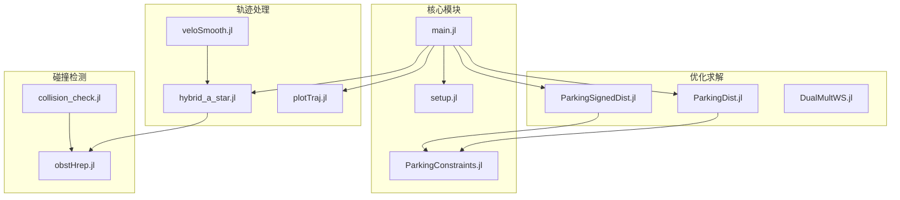
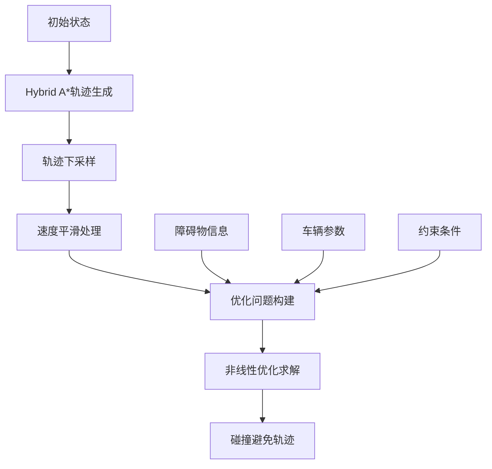
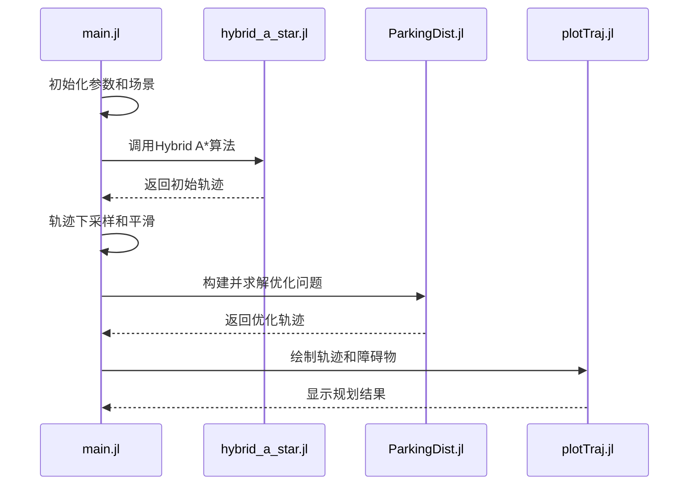
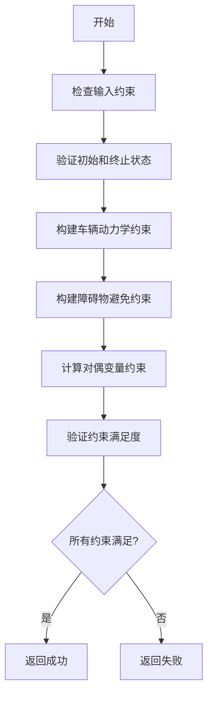
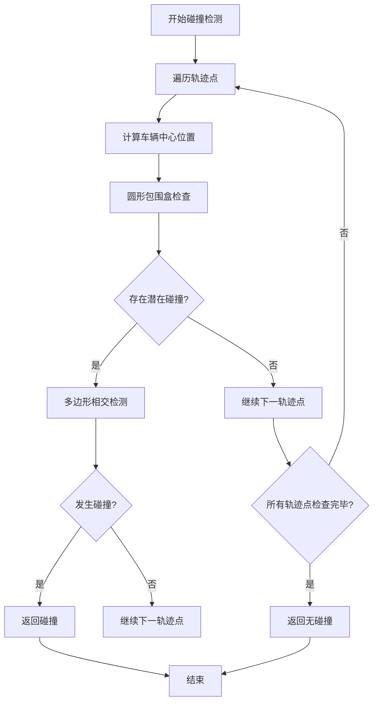
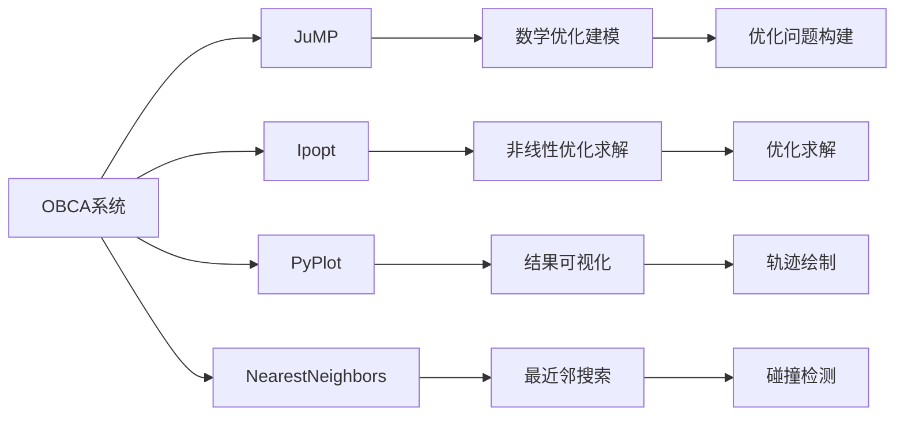

# 优化碰撞避免

<cite>
**本文档中引用的文件**   
- [main.jl](file://OBCA/AutonomousParking/main.jl)
- [ParkingConstraints.jl](file://OBCA/AutonomousParking/ParkingConstraints.jl)
- [collision_check.jl](file://OBCA/AutonomousParking/collision_check.jl)
- [ParkingDist.jl](file://OBCA/AutonomousParking/ParkingDist.jl)
- [ParkingSignedDist.jl](file://OBCA/AutonomousParking/ParkingSignedDist.jl)
- [obstHrep.jl](file://OBCA/AutonomousParking/obstHrep.jl)
- [setup.jl](file://OBCA/AutonomousParking/setup.jl)
- [hybrid_a_star.jl](file://OBCA/AutonomousParking/hybrid_a_star.jl)
- [veloSmooth.jl](file://OBCA/AutonomousParking/veloSmooth.jl)
- [plotTraj.jl](file://OBCA/AutonomousParking/plotTraj.jl)
</cite>

## 目录
1. [简介](#简介)
2. [项目结构](#项目结构)
3. [核心组件](#核心组件)
4. [架构概述](#架构概述)
5. [详细组件分析](#详细组件分析)
6. [依赖分析](#依赖分析)
7. [性能考量](#性能考量)
8. [故障排除指南](#故障排除指南)
9. [结论](#结论)

## 简介
本文档详细介绍了基于Julia语言的优化碰撞避免（OBCA）方法，重点阐述其在自动泊车等复杂场景中的应用。该方法利用优化框架实现安全、高效的路径规划，通过数学优化技术处理非凸障碍物和复杂约束条件。文档涵盖了从Julia环境配置到高级优化调参的完整内容，为不同层次的开发者提供指导。系统结合Hybrid A*算法生成初始轨迹，并通过非线性优化求解器实现碰撞避免，展示了与其他规划方法的集成潜力。

## 项目结构
OBCA项目采用模块化设计，各组件职责明确，便于维护和扩展。主程序通过调用多个功能模块实现完整的路径规划流程。系统以Julia语言实现，利用JuMP建模语言和Ipopt求解器进行优化计算，同时集成PyPlot进行结果可视化。

**图源**
- [main.jl](file://OBCA/AutonomousParking/main.jl#L1-L288)
- [setup.jl](file://OBCA/AutonomousParking/setup.jl#L1-L52)

**本节来源**
- [main.jl](file://OBCA/AutonomousParking/main.jl#L1-L50)
- [setup.jl](file://OBCA/AutonomousParking/setup.jl#L1-L20)

## 核心组件
OBCA系统的核心组件包括主程序控制流、优化求解器、碰撞约束处理和轨迹初始化模块。这些组件协同工作，实现从初始状态到目标状态的安全路径规划。系统采用分层优化策略，先通过Hybrid A*算法获取可行轨迹，再通过非线性优化进行精细化调整。

**本节来源**
- [main.jl](file://OBCA/AutonomousParking/main.jl#L25-L100)
- [ParkingDist.jl](file://OBCA/AutonomousParking/ParkingDist.jl#L15-L80)
- [ParkingSignedDist.jl](file://OBCA/AutonomousParking/ParkingSignedDist.jl#L15-L80)

## 架构概述
OBCA系统采用分层架构设计，包含轨迹生成、约束构建和优化求解三个主要阶段。系统首先利用Hybrid A*算法生成初始轨迹，然后建立包含车辆动力学和碰撞避免的优化问题，最后通过Ipopt求解器获得最优解。这种架构有效结合了搜索算法的全局探索能力和优化方法的局部精细化优势。

**图源**
- [main.jl](file://OBCA/AutonomousParking/main.jl#L150-L200)
- [hybrid_a_star.jl](file://OBCA/AutonomousParking/hybrid_a_star.jl#L1-L10)
- [ParkingDist.jl](file://OBCA/AutonomousParking/ParkingDist.jl#L50-L100)

## 详细组件分析
本节深入分析OBCA系统的关键组件，包括主程序执行流程、碰撞约束数学表达和碰撞检测算法实现。通过详细解析各模块的工作原理，帮助开发者理解系统内部机制，便于定制和优化。

### 主程序执行流程分析
main.jl作为系统入口，协调各模块完成完整的路径规划任务。程序首先初始化参数和场景配置，然后调用Hybrid A*算法生成初始轨迹，最后通过优化求解获得最终的碰撞避免轨迹。

**图源**
- [main.jl](file://OBCA/AutonomousParking/main.jl#L50-L250)
- [hybrid_a_star.jl](file://OBCA/AutonomousParking/hybrid_a_star.jl#L1-L20)
- [plotTraj.jl](file://OBCA/AutonomousParking/plotTraj.jl#L1-L10)

**本节来源**
- [main.jl](file://OBCA/AutonomousParking/main.jl#L1-L288)
- [hybrid_a_star.jl](file://OBCA/AutonomousParking/hybrid_a_star.jl#L1-L50)
- [veloSmooth.jl](file://OBCA/AutonomousParking/veloSmooth.jl#L1-L20)

### 碰撞避免约束分析
ParkingConstraints.jl模块实现了基于对偶距离函数的碰撞避免约束，通过数学优化方法确保轨迹的安全性。该模块将碰撞避免问题转化为一系列非线性约束，与车辆动力学约束共同构成完整的优化问题。

**图源**
- [ParkingConstraints.jl](file://OBCA/AutonomousParking/ParkingConstraints.jl#L1-L150)
- [obstHrep.jl](file://OBCA/AutonomousParking/obstHrep.jl#L1-L20)

**本节来源**
- [ParkingConstraints.jl](file://OBCA/AutonomousParking/ParkingConstraints.jl#L1-L150)
- [obstHrep.jl](file://OBCA/AutonomousParking/obstHrep.jl#L1-L102)

### 碰撞检测算法分析
collision_check.jl模块实现了基于最近邻搜索和几何检查的高效碰撞检测算法。该算法采用两阶段检测策略，首先通过圆形包围盒进行快速筛选，然后通过多边形相交检测进行精确判断，有效平衡了计算效率和检测精度。

**图源**
- [collision_check.jl](file://OBCA/AutonomousParking/collision_check.jl#L1-L136)
- [NearestNeighbors](file://OBCA/AutonomousParking/collision_check.jl#L10)

**本节来源**
- [collision_check.jl](file://OBCA/AutonomousParking/collision_check.jl#L1-L136)
- [NearestNeighbors](file://OBCA/AutonomousParking/collision_check.jl#L10)

## 依赖分析
OBCA系统依赖多个Julia包和外部库，这些依赖关系构成了系统的软件基础。通过分析依赖结构，可以更好地理解系统的运行环境和扩展可能性。

**图源**
- [setup.jl](file://OBCA/AutonomousParking/setup.jl#L20-L30)
- [main.jl](file://OBCA/AutonomousParking/main.jl#L10-L20)

**本节来源**
- [setup.jl](file://OBCA/AutonomousParking/setup.jl#L1-L52)
- [main.jl](file://OBCA/AutonomousParking/main.jl#L1-L20)

## 性能考量
OBCA系统的性能受多个因素影响，包括优化问题规模、障碍物复杂度和求解器参数设置。通过合理配置这些参数，可以在求解速度和轨迹质量之间取得良好平衡。系统采用warm start策略，利用Hybrid A*的初始解加速优化收敛，显著提高了求解效率。

## 故障排除指南
当OBCA系统无法找到可行解时，可参考以下排查步骤：检查障碍物定义是否正确、验证初始轨迹是否合理、调整优化求解器参数、增加warm start质量。特别需要注意障碍物顶点的顺时针排列要求和H-representation的正确转换。

**本节来源**
- [ParkingConstraints.jl](file://OBCA/AutonomousParking/ParkingConstraints.jl#L100-L150)
- [main.jl](file://OBCA/AutonomousParking/main.jl#L200-L250)

## 结论
OBCA方法提供了一种有效的优化碰撞避免解决方案，特别适用于自动泊车等复杂场景。通过结合Hybrid A*算法和非线性优化，系统能够在保证安全性的同时生成高质量的轨迹。该方法对非凸障碍物和复杂约束具有良好的处理能力，且具备与其他规划方法集成的潜力。对于初学者，建议从简单的场景开始，逐步理解系统工作原理；对于经验丰富的开发者，可通过调整优化目标和约束权重来进一步提升性能。