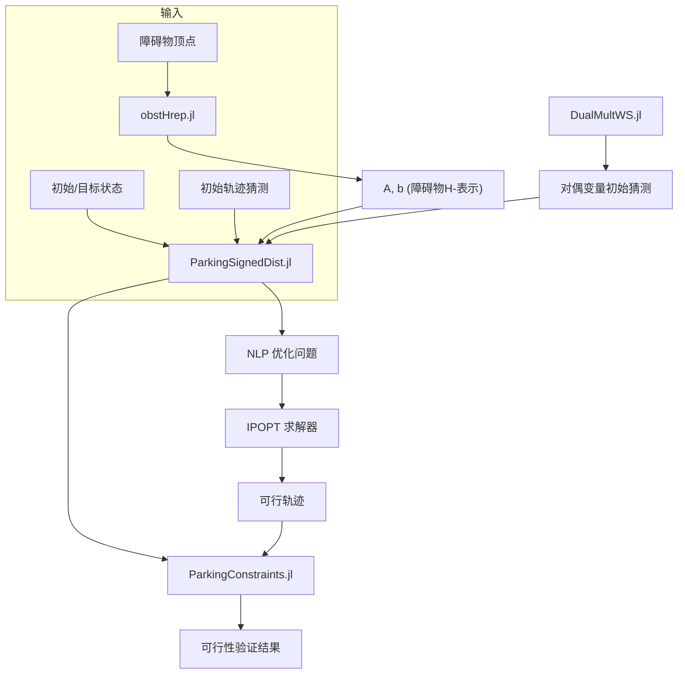

# 约束系统

<cite>
**本文档中引用的文件**  
- [ParkingConstraints.jl](file://OBCA/AutonomousParking/ParkingConstraints.jl)
- [ParkingSignedDist.jl](file://OBCA/AutonomousParking/ParkingSignedDist.jl)
- [ParkingDist.jl](file://OBCA/AutonomousParking/ParkingDist.jl)
- [obstHrep.jl](file://OBCA/AutonomousParking/obstHrep.jl)
- [DualMultWS.jl](file://OBCA/AutonomousParking/DualMultWS.jl)
</cite>

## 目录
1. [引言](#引言)
2. [约束系统架构](#约束系统架构)
3. [碰撞避免约束数学模型](#碰撞避免约束数学模型)
4. [非凸障碍物的平滑距离场表示](#非凸障碍物的平滑距离场表示)
5. [符号距离计算算法](#符号距离计算算法)
6. [几何约束到可微函数的转化](#几何约束到可微函数的转化)
7. [复杂环境中的约束构建实例](#复杂环境中的约束构建实例)
8. [自定义约束类型的扩展指南](#自定义约束类型的扩展指南)
9. [结论](#结论)

## 引言

OBCA（基于优化的碰撞避免）是一种用于自动泊车路径规划的先进方法，其核心在于将复杂的几何与动力学约束转化为可微的优化问题。本系统通过引入对偶变量和距离函数的重构，实现了在非凸障碍物环境中生成安全、平滑且满足动力学可行性的轨迹。该方法基于Zhang等人提出的理论框架，利用H-表示法描述障碍物，并通过非线性优化求解器（如IPOPT）高效求解。

本技术文档深入解析OBCA系统中关键的约束建模机制，重点阐述`ParkingConstraints.jl`、`ParkingSignedDist.jl`和`ParkingDist.jl`三个核心模块的实现原理，为开发者提供理论基础与实践指导。

## 约束系统架构

OBCA系统的约束体系由多个协同工作的模块构成，其核心是将物理世界的几何与动力学限制转化为非线性规划（NLP）问题中的可微分约束函数。系统架构主要包括以下几个层次：

1.  **障碍物表示层**：通过`obstHrep.jl`模块，将任意多边形障碍物的顶点列表转换为其H-表示（半平面交集），即Ax ≤ b的形式。
2.  **距离计算层**：`ParkingSignedDist.jl`和`ParkingDist.jl`模块利用对偶优化理论，将车辆与障碍物之间的最小距离（或符号距离）计算问题，转化为一组可微的非线性约束。
3.  **约束验证层**：`ParkingConstraints.jl`模块提供了一个独立的函数，用于验证给定轨迹是否满足所有约束条件，是优化求解过程中的可行性检查工具。
4.  **优化求解层**：整个系统基于JuMP建模语言和IPOPT求解器，将成本函数与约束集合并，求解最优轨迹。



**图源**
- [obstHrep.jl](file://OBCA/AutonomousParking/obstHrep.jl)
- [ParkingSignedDist.jl](file://OBCA/AutonomousParking/ParkingSignedDist.jl)
- [ParkingConstraints.jl](file://OBCA/AutonomousParking/ParkingConstraints.jl)

## 碰撞避免约束数学模型

`ParkingConstraints.jl`文件定义了用于验证轨迹可行性的核心函数`ParkingConstraints`。该函数不进行优化，而是作为一个“检查器”，接收一组状态`x`、控制输入`u`以及对偶变量`l`和`n`，并返回一个布尔值，指示该轨迹是否满足所有约束。

该函数的数学模型基于对偶距离函数（Dual Distance Function）理论，其核心思想是将两个凸集（车辆和障碍物）之间的最小距离问题，转化为一个关于对偶变量的优化问题。在OBCA中，这个对偶问题被直接作为约束嵌入到主优化问题中。

函数中定义了七组约束，分别对应：

- **c0**: 控制输入和时间尺度的边界约束。
- **c1, c2**: 起点和终点的状态约束。
- **c3**: 车辆动力学约束（采用欧拉前向积分的单车模型）。
- **c4, c5**: 控制输入变化率（加速度）的约束。
- **c6**: 碰撞避免约束，这是最核心的部分。

**碰撞避免约束（c6）的数学表达**：
对于每个时间步`i`和每个障碍物`j`，系统检查以下三个条件：
1.  **对偶变量范数约束**：`||A_j^T * λ_j||² ≤ 1`。这确保了对偶变量`λ_j`位于障碍物对偶范数的单位球内。
2.  **力平衡约束**：`G^T * μ + R^T * A_j * λ_j = 0`。这表示作用在车辆上的“力”（由对偶变量`μ`表示）与作用在障碍物上的“力”（由`A_j * λ_j`表示）在车辆坐标系下平衡。其中`R`是车辆的旋转矩阵。
3.  **分离距离约束**：`-g^T * μ + (t - b_j)^T * λ_j ≥ dmin`。这是保证安全距离的关键。`t`是车辆中心在世界坐标系中的位置，`g`是车辆半尺寸向量。该不等式确保了车辆与障碍物之间的最小距离大于预设的安全距离`dmin`。

**节源**
- [ParkingConstraints.jl](file://OBCA/AutonomousParking/ParkingConstraints.jl#L1-L150)

## 非凸障碍物的平滑距离场表示

OBCA系统能够处理任意形状的多边形障碍物，其关键在于`obstHrep.jl`模块。该模块将障碍物的几何表示从顶点列表（V-表示）转换为H-表示（半平面交集）。

**H-表示法**：一个凸多边形可以被定义为若干个半平面的交集。每个半平面由一个线性不等式`A_k * x ≤ b_k`定义，其中`A_k`是垂直于第`k`条边的法向量，`b_k`是常数项。所有这些不等式共同构成了障碍物的H-表示。

`obstHrep`函数的实现逻辑如下：
1.  遍历每个障碍物`i`。
2.  对于障碍物的每一条边（由两个顺时针排列的顶点`v1`和`v2`定义），计算该边的法向量`A_tmp`和偏移量`b_tmp`。
3.  法向量的方向被设定为指向障碍物外部，以确保不等式`A_k * x ≤ b_k`定义的是障碍物外部的区域。
4.  将所有边的`A_tmp`和`b_tmp`收集到全局矩阵`A_all`和向量`b_all`中。

这种表示方法将复杂的几何形状简化为一组线性不等式，使得后续的距离计算和约束构建可以通过解析的数学公式完成，从而实现了对非凸环境的“平滑”和可微分的表示。

```mermaid
graph LR
V[顶点列表<br/][(x1,y1), (x2,y2), ...]</br>顺时针] --> H[obstHrep.jl]
H --> A["A = [a11, a12; a21, a22; ...]"]
H --> B["b = [b1; b2; ...]"]
A --> C["约束: A*x ≤ b"]
B --> C
```

**图源**
- [obstHrep.jl](file://OBCA/AutonomousParking/obstHrep.jl#L1-L103)

## 符号距离计算算法

`ParkingSignedDist.jl`和`ParkingDist.jl`是OBCA系统的核心优化模块，它们实现了将几何约束转化为可微分函数的关键算法。两者的主要区别在于对碰撞避免约束的处理方式。

### ParkingSignedDist.jl

该模块旨在计算**符号距离**，即当车辆与障碍物发生碰撞时，允许一个“最小穿透”（Minimum-Penetration）的轨迹。其核心是将分离距离约束`-g^T * μ + (t - b_j)^T * λ_j ≥ dmin`中的`≥`改为`>=`，并引入一个松弛变量`sl[j,i]`来吸收不可行性。

-   **约束形式**：`... + sl[j,i] >= dmin`
-   **成本函数**：在目标函数中加入了`sum(sum(1e2*sl[j,i] + 1e4*sl[j,i]^2 ...))`项，这极大地惩罚了松弛变量`sl`的使用。因此，求解器会优先寻找完全无碰撞的轨迹（`sl=0`），只有在完全无碰撞不可行时，才会选择一个穿透量最小的轨迹。

这种方法更灵活，适用于初始猜测轨迹可能穿过障碍物的场景。

### ParkingDist.jl

该模块严格要求**无碰撞**轨迹。其分离距离约束直接使用`>= dmin`，没有松弛变量。

-   **约束形式**：`... >= dmin`
-   **成本函数**：不包含对松弛变量的惩罚项。

这种方法更严格，直接求解一个完全无碰撞的轨迹。

### 共同算法流程

两个模块的算法流程高度相似：
1.  **定义优化变量**：包括状态`x`、控制`u`、时间尺度`timeScale`（可选）以及对偶变量`l`（λ）和`n`（μ）。
2.  **设置目标函数**：最小化控制输入、控制输入变化率、跟踪参考轨迹的偏差等。
3.  **施加约束**：包括状态/输入边界、起点/终点、车辆动力学、对偶变量非负性，以及核心的碰撞避免约束。
4.  **设置初始猜测**：使用`DualMultWS.jl`提供的对偶变量初始值，这对于求解器的收敛至关重要。
5.  **求解与验证**：调用IPOPT求解器。如果求解失败，系统会尝试重启求解器，并使用`ParkingConstraints.jl`函数验证最终解的可行性。

**节源**
- [ParkingSignedDist.jl](file://OBCA/AutonomousParking/ParkingSignedDist.jl#L1-L315)
- [ParkingDist.jl](file://OBCA/AutonomousParking/ParkingDist.jl#L1-L316)

## 几何约束到可微函数的转化

OBCA系统的核心创新在于将离散的、非光滑的几何碰撞检测问题，转化为连续的、可微的优化约束。这一转化过程是通过**对偶距离函数**理论实现的。

### 转化原理

考虑两个凸集S1和S2，它们之间的最小距离`d(S1, S2)`可以表示为一个对偶优化问题：
`d(S1, S2) = max_{λ, μ} { -g1^T * μ - g2^T * λ + t^T * A2 * λ }`
`s.t. ||A1^T * μ|| ≤ 1, ||A2^T * λ|| ≤ 1, G1^T * μ + G2^T * λ = 0`

在OBCA中：
-   S1 是车辆（ego vehicle），其H-表示为 `G * x ≤ g`。
-   S2 是障碍物（obstacle），其H-表示为 `A * x ≤ b`。
-   `t` 是车辆中心的位置。

通过将上述对偶问题中的最大值条件`d(S1, S2) ≥ dmin`作为约束，我们得到了一个关于原始变量（`x`, `t`）和对偶变量（`λ`, `μ`）的可微函数。虽然这引入了额外的对偶变量，但它将一个复杂的几何问题转化为了一个标准的非线性规划问题。

### 数学表达总结

在代码中，这一转化体现为`ParkingSignedDist.jl`和`ParkingDist.jl`中的三组`@NLconstraint`：

1.  **范数约束**：`(sum(Aj[k,1]*lj[k,i] for k = 1 : vOb[j]))^2 + (sum(Aj[k,2]*lj[k,i] for k = 1 : vOb[j]))^2 <= 1`
2.  **力平衡约束**：`(nj[1,i] - nj[3,i]) + cos(x[3,i])*sum(...) + sin(x[3,i])*sum(...) == 0`
3.  **分离距离约束**：`-sum(g[k]*nj[k,i] for k = 1:4) + ... >= dmin`

这些约束共同保证了车辆与障碍物之间的距离大于安全距离`dmin`，并且它们都是关于状态`x`和对偶变量`l`, `n`的可微函数，使得梯度下降类的优化算法可以有效求解。

**节源**
- [ParkingSignedDist.jl](file://OBCA/AutonomousParking/ParkingSignedDist.jl#L200-L250)
- [ParkingDist.jl](file://OBCA/AutonomousParking/ParkingDist.jl#L200-L250)

## 复杂环境中的约束构建实例

假设在一个停车场环境中，有一辆阿克曼转向车辆需要从一个狭窄的停车位倒车出来，周围有多个非凸的柱状障碍物。

1.  **障碍物表示**：首先，使用`obstHrep`函数将每个柱状障碍物的顶点列表转换为H-表示（A, b）。
2.  **初始猜测**：提供一个初始的、可能穿过障碍物的参考轨迹（rx, ry, ryaw）。
3.  **调用优化**：调用`ParkingSignedDist`函数。
    -   优化器会创建状态变量`x`、控制变量`u`和对偶变量`l`, `n`。
    -   目标函数会引导车辆跟踪参考轨迹并平滑控制输入。
    -   动力学约束确保轨迹符合车辆运动学。
    -   **关键的碰撞避免约束**会被激活。对于轨迹上的每一个点和每一个障碍物，系统都会检查三组对偶约束。
4.  **求解过程**：IPOPT求解器通过迭代调整`x`, `u`, `l`, `n`的值，不断减小目标函数的值，同时满足所有约束。由于`ParkingSignedDist`允许松弛变量，即使初始轨迹穿过障碍物，求解器也能找到一个最终无碰撞或最小穿透的可行解。
5.  **输出**：返回优化后的安全轨迹`xp`和控制序列`up`。

这个过程展示了OBCA如何将复杂的、离散的“是否碰撞”问题，转化为一个连续的、可微的优化问题，并通过标准的数值方法高效求解。

## 自定义约束类型的扩展指南

开发者可以基于OBCA框架扩展自定义的约束类型。以下是扩展指南：

1.  **理解对偶框架**：任何新的几何约束（如新的车辆形状、新的障碍物类型）都必须能够用H-表示（Ax ≤ b）来描述。
2.  **修改对偶约束**：在`ParkingSignedDist.jl`或`ParkingDist.jl`中，找到`for i in 1:N+1`和`for j = 1 : nOb`的循环。在此处添加针对新约束的对偶约束组。
    -   需要为新约束定义新的对偶变量。
    -   需要推导出新的“范数约束”、“力平衡约束”和“分离距离约束”。
3.  **更新变量定义**：在`@variable`部分声明新的对偶变量。
4.  **调整成本函数**：如果需要，可以在目标函数中加入对新变量的正则化项。
5.  **提供初始猜测**：修改或创建新的`DualMultWS`函数版本，为新引入的对偶变量提供合理的初始值，这对求解器的收敛性至关重要。
6.  **验证**：在`ParkingConstraints.jl`中添加相应的验证逻辑，以确保新约束在优化后仍然被满足。

通过这种方式，OBCA框架可以被扩展以适应更复杂的车辆模型（如拖车）或更复杂的环境约束。

## 结论

OBCA约束系统通过精妙的数学建模，将自动泊车中的碰撞避免问题转化为一个可微的非线性优化问题。其核心在于利用H-表示法描述障碍物，并通过对偶距离函数理论，将几何约束转化为一组可微的非线性等式和不等式约束。`ParkingConstraints.jl`、`ParkingSignedDist.jl`和`ParkingDist.jl`三个模块协同工作，分别负责约束验证、带松弛的优化求解和严格的无碰撞求解。该系统为处理复杂、非凸环境中的路径规划提供了强大的理论基础和高效的实现方案，其模块化的设计也为开发者提供了良好的扩展性。