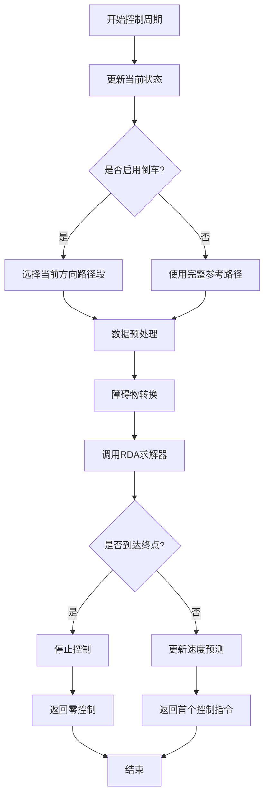

# MPC集成

<cite>
**本文档中引用的文件**  
- [mpc.py](file://RDA-planner/RDA_planner/mpc.py)
- [rda_solver.py](file://RDA-planner/RDA_planner/rda_solver.py)
</cite>

## 目录
1. [引言](#引言)
2. [MPC框架与RDA求解器集成机制](#mpc框架与rda求解器集成机制)
3. [预测时域与状态空间模型构建](#预测时域与状态空间模型构建)
4. [滚动优化循环实现](#滚动优化循环实现)
5. [状态估计、轨迹跟踪与反馈校正](#状态估计轨迹跟踪与反馈校正)
6. [MPC参数配置与系统性能影响](#mpc参数配置与系统性能影响)
7. [实时性、鲁棒性与稳定性分析](#实时性鲁棒性与稳定性分析)
8. [结论](#结论)

## 引言

模型预测控制（MPC）是一种先进的控制策略，通过在每个时间步长上求解一个有限时域的优化问题来实现对动态系统的闭环控制。本项目中的MPC框架与RDA（Relaxed Dual Alternating Direction Method of Multipliers）求解器紧密结合，利用RDA求解器高效处理非线性约束和大规模优化问题的能力，实现了复杂环境下的实时路径规划与避障控制。该集成方案特别适用于具有非完整约束的移动机器人，如阿克曼转向（acker）、差速驱动（diff）和全向移动（omni）机器人。

**Section sources**
- [mpc.py](file://RDA-planner/RDA_planner/mpc.py#L1-L569)
- [rda_solver.py](file://RDA-planner/RDA_planner/rda_solver.py#L1-L1067)

## MPC框架与RDA求解器集成机制

MPC框架的核心是`MPC`类，它封装了整个控制逻辑。该类在初始化时接收车辆动力学参数（`car_tuple`）、参考路径（`ref_path`）以及MPC的关键参数（如预测时域`receding`、迭代次数`iter_num`等）。其核心功能是通过`control`方法，在每个控制周期内接收当前机器人状态（`state`）、参考速度（`ref_speed`）和障碍物列表（`obstacle_list`），并输出最优的控制指令。

RDA求解器作为底层优化引擎，由`RDA_solver`类实现。`MPC`类在初始化时会创建一个`RDA_solver`实例，并将其作为成员变量`self.rda`。当`MPC.control()`方法被调用时，它会将预处理后的状态预测数组、当前速度数组、参考轨迹列表、参考速度和转换后的障碍物列表传递给`self.rda.iterative_solve()`方法。RDA求解器负责求解这个复杂的非线性优化问题，返回最优的速度控制序列和调试信息。

这种集成机制实现了清晰的职责分离：MPC框架负责高层的控制逻辑、状态预测和数据预处理，而RDA求解器则专注于底层的数学优化计算，两者通过定义良好的接口进行高效通信。

**Section sources**
- [mpc.py](file://RDA-planner/RDA_planner/mpc.py#L126-L186)
- [rda_solver.py](file://RDA-planner/RDA_planner/rda_solver.py#L385-L419)

## 预测时域与状态空间模型构建

### 预测时域构建

预测时域（`receding`）是MPC的核心参数，决定了优化问题的长度。在`MPC`类中，预测时域被定义为`self.receding`，默认值为10。在每个控制周期，`pre_process`方法会利用当前状态和当前的速度预测值，通过车辆的运动学模型向前递推`self.receding`个时间步长，生成一个包含未来`self.receding + 1`个状态的预测状态数组（`state_pre_array`）。这个数组作为优化问题的初始猜测值（nominal trajectory）。

### 状态空间模型

状态空间模型描述了系统的动态行为。`MPC`类支持三种动力学模型：阿克曼转向（acker）、差速驱动（diff）和全向移动（omni）。这些模型通过`motion_predict_model_acker`、`motion_predict_model_diff`和`motion_predict_model_omni`方法实现。例如，阿克曼模型的状态转移方程为：
```
x_dot = v * cos(phi)
y_dot = v * sin(phi)
phi_dot = v * tan(psi) / L
```
其中`v`是线速度，`psi`是前轮转向角，`L`是轴距，`phi`是航向角。RDA求解器内部会使用线性化的模型（`linear_ackermann_model`等）来构建优化问题的约束。

**Section sources**
- [mpc.py](file://RDA-planner/RDA_planner/mpc.py#L277-L378)
- [rda_solver.py](file://RDA-planner/RDA_planner/rda_solver.py#L680-L709)

## 滚动优化循环实现

滚动优化循环是MPC的执行核心，其实现在`MPC.control()`方法中。其流程如下：

1.  **状态更新与参考路径选择**：首先更新当前机器人状态`self.state`。如果启用了倒车功能（`enable_reverse`），则从`curve_list`中选择当前方向的参考路径段。
2.  **数据预处理**：调用`pre_process`方法。该方法首先通过`closest_point`找到当前状态在参考路径上的最近点，然后利用当前的速度预测值`self.cur_vel_array`和运动学模型，预测未来`receding`步的状态序列。同时，根据参考速度`ref_speed`和时间步长`dt`，通过`inter_point`方法在参考路径上插值出未来`receding + 1`个参考状态点，构成`ref_traj_list`。
3.  **障碍物处理**：如果`rda_obstacle`为`False`，则调用`convert_rda_obstacle`方法将原始的障碍物信息（如圆形或凸多边形）转换为RDA求解器可接受的不等式约束形式（A, b矩阵）。
4.  **调用RDA求解器**：将预处理后的`state_pre_array`、`self.cur_vel_array`、`ref_traj_list`、参考速度和障碍物列表传递给`self.rda.iterative_solve()`。
5.  **结果处理与输出**：RDA求解器返回最优的控制输入序列`u_opt_array`。如果机器人已接近路径终点，则停止控制。最后，将`u_opt_array`更新为下一次迭代的初始猜测，并返回第一个控制指令（`u_opt_array[:, 0:1]`）和调试信息。



**Diagram sources**
- [mpc.py](file://RDA-planner/RDA_planner/mpc.py#L126-L186)

**Section sources**
- [mpc.py](file://RDA-planner/RDA_planner/mpc.py#L126-L186)

## 状态估计、轨迹跟踪与反馈校正

### 状态估计
本框架假设机器人的状态（x, y, theta）由外部传感器（如IMU、里程计）或状态估计器（如EKF）提供，并通过`control`方法的`state`参数直接输入。因此，状态估计并非MPC框架内部实现，而是其输入。

### 轨迹跟踪
轨迹跟踪能力通过优化目标函数中的`C0_cost`项实现。该成本函数最小化预测状态与参考轨迹`ref_traj_list`之间的差异（`diff_s`），以及预测速度与参考速度`ref_speed`之间的差异（`diff_u`）。权重参数`ws`和`wu`分别控制状态跟踪和速度跟踪的优先级。

### 反馈校正
MPC的滚动优化特性本身就是一种强大的反馈机制。在每个周期，它都基于最新的状态测量值重新求解优化问题。`pre_process`方法中的`closest_point`确保了预测起点与当前实际位置对齐，这构成了一个直接的反馈校正。此外，RDA求解器采用的ADMM算法在迭代求解过程中也包含了对预测误差的持续修正。

**Section sources**
- [mpc.py](file://RDA-planner/RDA_planner/mpc.py#L277-L300)
- [rda_solver.py](file://RDA-planner/RDA_planner/rda_solver.py#L650-L659)

## MPC参数配置与系统性能影响

MPC的性能高度依赖于其参数配置。以下是一些关键参数及其影响：

- **预测时域 (`receding`)**：较长的时域能提供更好的前瞻性和稳定性，但会增加计算负担。较短的时域响应更快，但可能在复杂环境中表现不佳。
- **控制时域**：在本实现中，控制时域与预测时域相同。通常，控制时域可以更短，以减少优化变量。
- **权重矩阵 (`ws`, `wu`)**：`ws`控制轨迹跟踪精度，增大`ws`会使机器人更紧贴参考路径。`wu`控制速度平滑性，增大`wu`会减少速度波动，但可能降低响应速度。
- **障碍物安全距离 (`max_sd`, `min_sd`)**：`max_sd`定义了机器人与障碍物之间的最大允许距离，`min_sd`定义了最小安全距离。调整这些参数可以平衡避障的保守性与路径效率。
- **ADMM惩罚参数 (`ro1`, `ro2`)**：这些参数影响RDA求解器的收敛速度和稳定性。较大的`ro1`可以加快对不等式约束的收敛，但可能导致数值不稳定。

用户可以通过`MPC.update_parameter()`方法动态调整这些参数，以适应不同的运行环境。

**Section sources**
- [mpc.py](file://RDA-planner/RDA_planner/mpc.py#L114-L124)
- [rda_solver.py](file://RDA-planner/RDA_planner/rda_solver.py#L150-L165)

## 实时性、鲁棒性与稳定性分析

### 实时性
该集成方案通过多种方式保证实时性：
1.  **并行计算**：RDA求解器支持多进程（`process_num`），可以并行求解多个障碍物的子问题，显著缩短求解时间。
2.  **高效的求解器**：使用ECOS等高效的凸优化求解器。
3.  **迭代求解**：采用ADMM算法，允许在达到收敛阈值（`iter_threshold`）时提前终止迭代，避免不必要的计算。

### 鲁棒性
- **多种动力学模型**：支持acker、diff、omni等多种机器人模型，适应性强。
- **动态障碍物处理**：`convert_inequal_circle`和`convert_inequal_polygon`方法可以处理移动障碍物，通过在预测时域内更新障碍物位置来增强鲁棒性。
- **松弛变量**：`C1_cost`中的负松弛增益（`slack_gain`）鼓励增加安全距离，提供了一定的容错能力。

### 安定性
- **收敛性保证**：ADMM算法在凸优化问题上具有良好的收敛性保证。
- **状态约束**：通过`bound_su_constraints`对速度和加速度施加硬约束，防止产生不安全的控制指令。
- **参考路径管理**：`split_path`和`goal_index_threshold`机制确保了在多段路径和终点处的平稳过渡和停止。

**Section sources**
- [rda_solver.py](file://RDA-planner/RDA_planner/rda_solver.py#L385-L419)
- [rda_solver.py](file://RDA-planner/RDA_planner/rda_solver.py#L500-L530)

## 结论

本文详细阐述了MPC框架与RDA求解器的集成机制。该方案通过将MPC的高层控制逻辑与RDA求解器的强大优化能力相结合，成功实现了高效、鲁棒的闭环控制。MPC负责构建预测时域、管理参考路径和执行反馈校正，而RDA求解器则作为底层引擎，高效求解包含复杂非线性约束的优化问题。通过合理配置MPC参数，可以在实时性、鲁棒性和稳定性之间取得良好平衡，为移动机器人在复杂动态环境中的自主导航提供了一个可靠的解决方案。