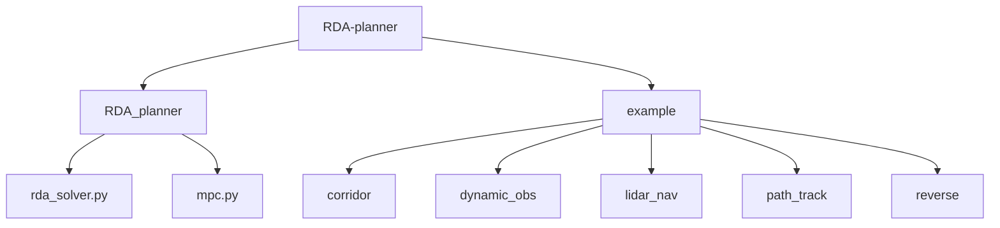
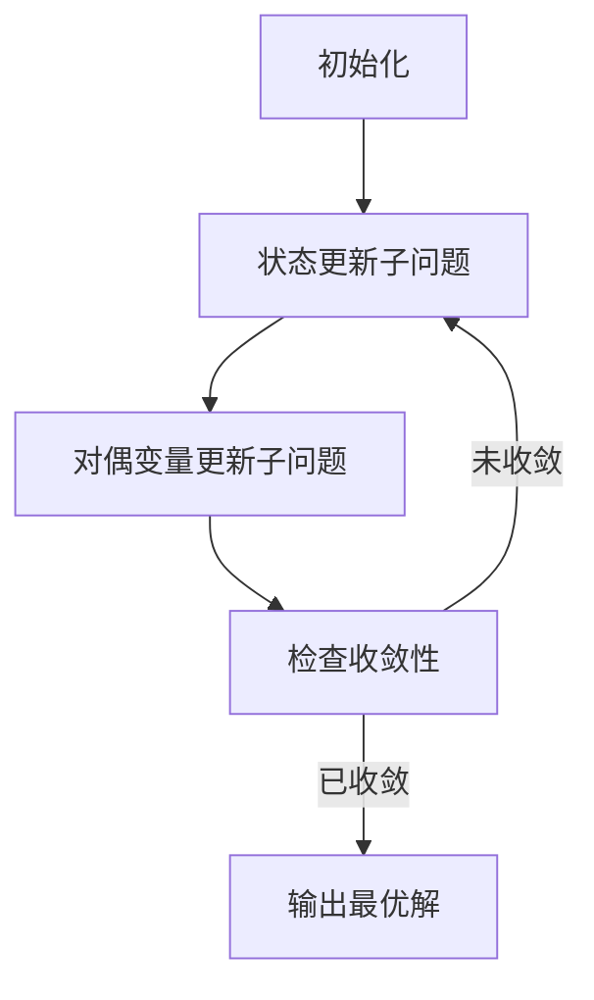
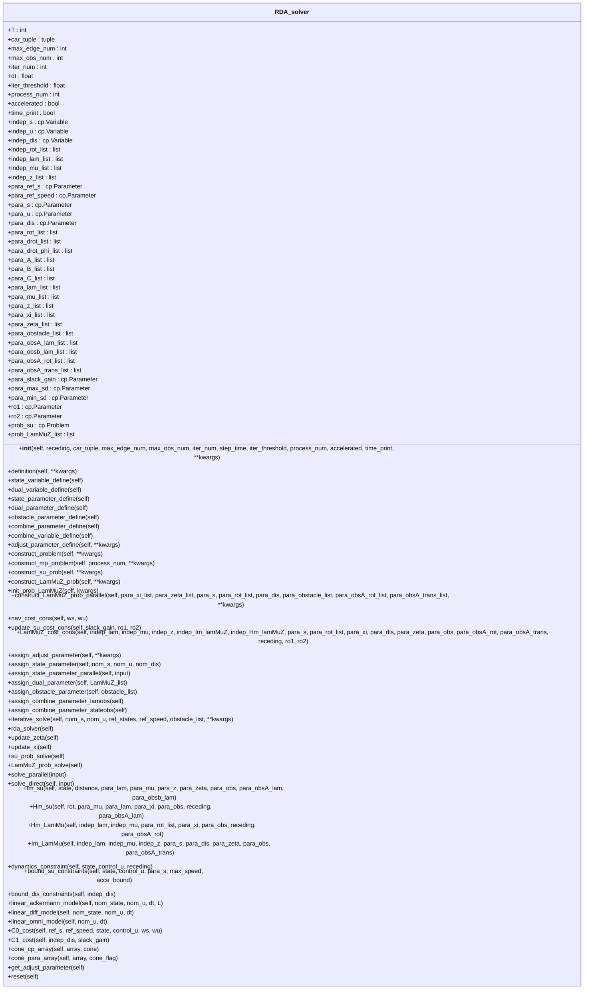
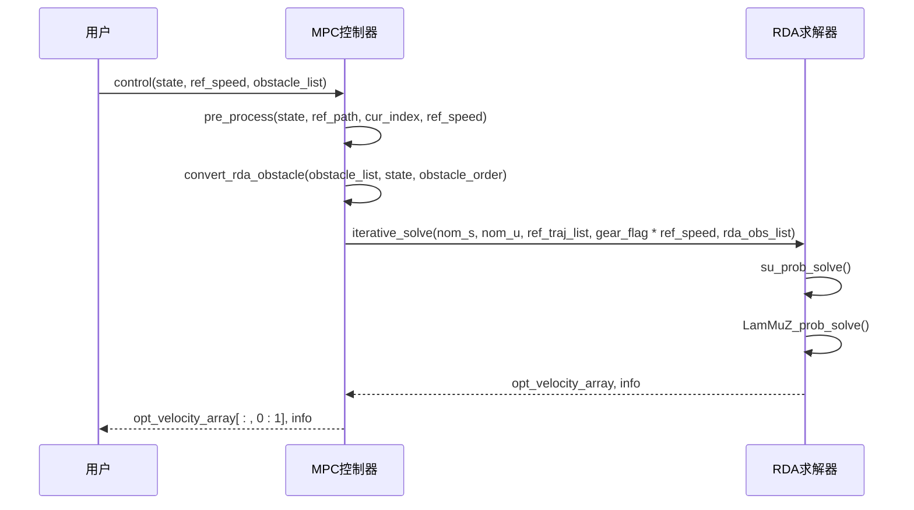
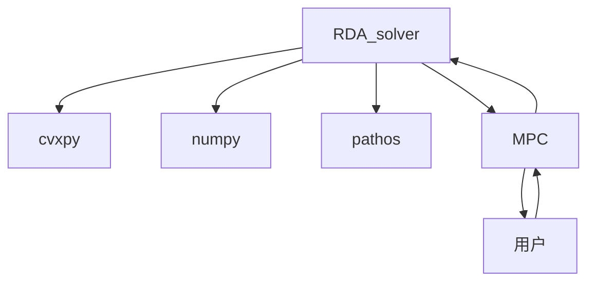

# RDA求解器核心

<cite>
**本文档中引用的文件**  
- [rda_solver.py](file://RDA-planner/RDA_planner/rda_solver.py)
- [mpc.py](file://RDA-planner/RDA_planner/mpc.py)
- [corridor.py](file://RDA-planner/example/corridor/corridor.py)
- [corridor.yaml](file://RDA-planner/example/corridor/corridor.yaml)
</cite>

## 目录
1. [引言](#引言)
2. [项目结构](#项目结构)
3. [核心组件](#核心组件)
4. [架构概述](#架构概述)
5. [详细组件分析](#详细组件分析)
6. [依赖分析](#依赖分析)
7. [性能考量](#性能考量)
8. [故障排除指南](#故障排除指南)
9. [结论](#结论)

## 引言
RDA求解器是一种基于凸优化的实时轨迹规划算法，专为动态环境中的机器人避障设计。该求解器通过将非凸的碰撞避免问题转化为高效的凸优化问题，实现了在复杂环境下的实时路径规划。其核心思想是利用交替方向乘子法（ADMM）进行并行优化，将原问题分解为状态更新（su）子问题和对偶变量更新（LamMuZ）子问题，从而实现高效的求解。本文档深入解析rda_solver.py中的核心求解算法，详细阐述其并行优化架构和数学原理。

## 项目结构
RDA-planner项目采用模块化设计，主要包含求解器核心（rda_solver.py）和MPC控制器（mpc.py）两个核心模块。求解器核心负责实现具体的优化算法，而MPC控制器则负责与外部环境交互，提供高层控制逻辑。项目还包含多个示例文件，用于演示不同场景下的应用。

**图源**  
- [rda_solver.py](file://RDA-planner/RDA_planner/rda_solver.py)
- [mpc.py](file://RDA-planner/RDA_planner/mpc.py)

**节源**  
- [rda_solver.py](file://RDA-planner/RDA_planner/rda_solver.py)
- [mpc.py](file://RDA-planner/RDA_planner/mpc.py)

## 核心组件
RDA求解器的核心组件包括状态变量、对偶变量、障碍物参数和优化问题的构建。状态变量包括机器人的位置、速度和方向，对偶变量用于处理障碍物约束，障碍物参数则描述了环境中障碍物的几何形状和位置。优化问题的构建分为两个子问题：状态更新子问题和对偶变量更新子问题，通过交替求解这两个子问题来逼近最优解。

**节源**  
- [rda_solver.py](file://RDA-planner/RDA_planner/rda_solver.py#L16-L1067)

## 架构概述
RDA求解器的架构基于ADMM算法，将原问题分解为两个子问题：状态更新（su）子问题和对偶变量更新（LamMuZ）子问题。状态更新子问题负责更新机器人的状态变量，包括位置、速度和方向，同时考虑动力学约束和目标函数。对偶变量更新子问题负责更新与障碍物相关的对偶变量，包括拉格朗日乘子和松弛变量，以确保机器人与障碍物之间的安全距离。

**图源**  
- [rda_solver.py](file://RDA-planner/RDA_planner/rda_solver.py#L16-L1067)

## 详细组件分析
### RDA求解器类分析
RDA求解器类（RDA_solver）是整个算法的核心，负责管理所有变量、参数和优化问题的求解。该类的初始化方法（__init__）设置了求解器的基本参数，包括预测时域、车辆模型、最大障碍物数量等。定义方法（definition）负责定义所有变量和参数，包括状态变量、对偶变量、障碍物参数等。

#### 对象导向组件

**图源**  
- [rda_solver.py](file://RDA-planner/RDA_planner/rda_solver.py#L16-L1067)

### MPC控制器分析
MPC控制器（MPC）是RDA求解器的上层控制器，负责与外部环境交互，提供高层控制逻辑。该控制器接收机器人的当前状态、参考路径和障碍物列表，通过调用RDA求解器来计算最优控制输入。MPC控制器还负责处理参考路径的更新、障碍物的转换和排序等任务。

#### API/服务组件

**图源**  
- [mpc.py](file://RDA-planner/RDA_planner/mpc.py#L14-L568)

## 依赖分析
RDA求解器依赖于多个外部库，包括cvxpy用于凸优化求解，numpy用于数值计算，pathos用于多进程并行计算。此外，求解器还依赖于MPC控制器提供的高层控制逻辑，以及外部环境提供的状态信息和障碍物信息。

**图源**  
- [rda_solver.py](file://RDA-planner/RDA_planner/rda_solver.py#L16-L1067)
- [mpc.py](file://RDA-planner/RDA_planner/mpc.py#L14-L568)

**节源**  
- [rda_solver.py](file://RDA-planner/RDA_planner/rda_solver.py#L16-L1067)
- [mpc.py](file://RDA-planner/RDA_planner/mpc.py#L14-L568)

## 性能考量
RDA求解器的性能主要受预测时域、障碍物数量和迭代次数的影响。较长的预测时域可以提高规划的准确性，但会增加计算时间。较多的障碍物数量会增加优化问题的复杂度，从而影响求解速度。较多的迭代次数可以提高解的精度，但也会增加计算时间。为了提高性能，可以调整求解器的参数，如减少预测时域、限制障碍物数量或减少迭代次数。

## 故障排除指南
在使用RDA求解器时，可能会遇到一些常见问题，如求解失败、收敛速度慢等。求解失败可能是由于初始状态不合法或障碍物约束过于严格导致的。收敛速度慢可能是由于参数设置不当或问题复杂度过高导致的。为了解决这些问题，可以检查初始状态的合法性，调整障碍物约束的严格程度，或优化求解器的参数设置。

**节源**  
- [rda_solver.py](file://RDA-planner/RDA_planner/rda_solver.py#L16-L1067)
- [mpc.py](file://RDA-planner/RDA_planner/mpc.py#L14-L568)

## 结论
RDA求解器是一种高效的实时轨迹规划算法，通过将非凸的碰撞避免问题转化为凸优化问题，实现了在复杂环境下的实时路径规划。其基于ADMM的并行优化架构，使得求解过程高效且稳定。通过合理调整求解器的参数，可以在保证规划质量的同时，满足实时性要求。未来的工作可以进一步优化求解器的性能，提高其在更复杂环境下的适用性。