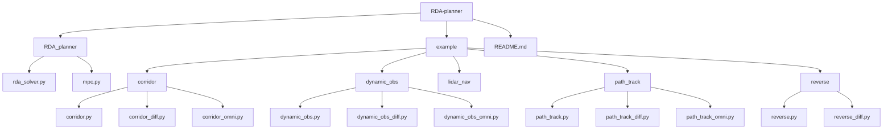
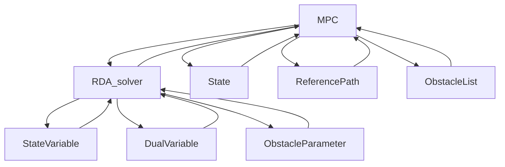
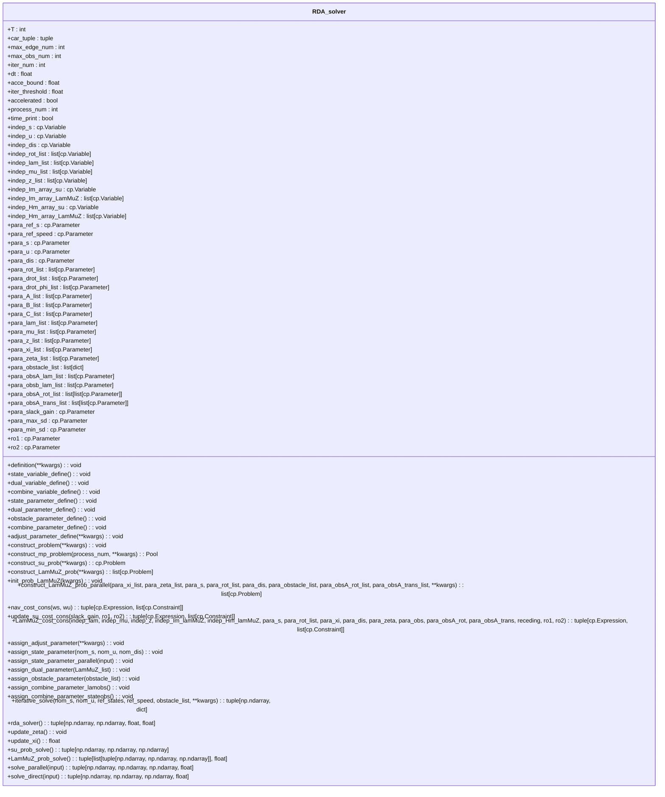
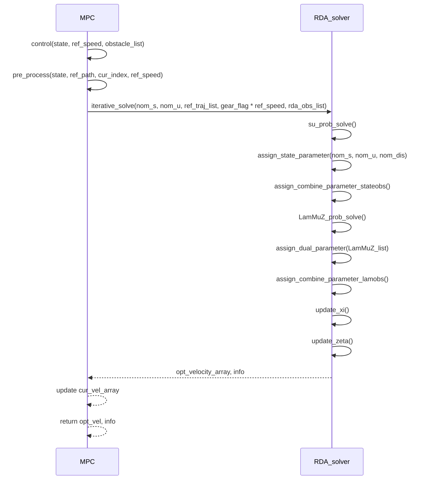
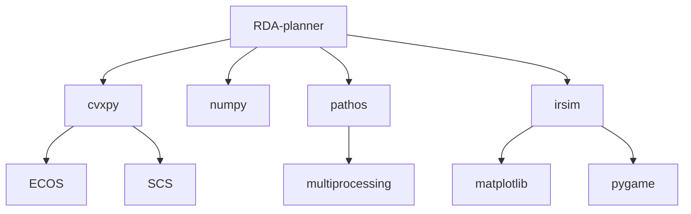

# 加速碰撞避免规划

<cite>
**本文档引用文件**  
- [rda_solver.py](file://RDA-planner/RDA_planner/rda_solver.py)
- [mpc.py](file://RDA-planner/RDA_planner/mpc.py)
- [corridor.py](file://RDA-planner/example/corridor/corridor.py)
- [dynamic_obs.py](file://RDA-planner/example/dynamic_obs/dynamic_obs.py)
- [path_track.py](file://RDA-planner/example/path_track/path_track.py)
- [reverse.py](file://RDA-planner/example/reverse/reverse.py)
- [README.md](file://RDA-planner/README.md)
</cite>

## 目录
1. [简介](#简介)
2. [项目结构](#项目结构)
3. [核心组件](#核心组件)
4. [架构概述](#架构概述)
5. [详细组件分析](#详细组件分析)
6. [依赖分析](#依赖分析)
7. [性能考量](#性能考量)
8. [故障排除指南](#故障排除指南)
9. [结论](#结论)

## 简介
RDA-planner 是一种基于优化的模型预测控制（MPC）运动规划器，专为在复杂和密集环境中实现自主导航而设计。该规划器利用交替方向乘子法（ADMM）将复杂的优化问题分解为多个简单的子问题，从而实现高效的并行计算。通过并行处理每个障碍物的避障约束，显著提升了计算速度。RDA-planner 支持任意凸形机器人和障碍物，适用于差速驱动、阿克曼转向和全向移动等多种机器人运动学模型，具备高精度控制和实时性能，适用于动态障碍物规避和走廊导航等场景。

## 项目结构
RDA-planner 项目的目录结构清晰，主要包含核心求解器、MPC 控制器、示例代码和配置文件。核心功能实现在 `RDA_planner` 包中，包括 `rda_solver.py` 和 `mpc.py` 两个核心模块。`example` 目录下提供了多个使用场景的示例脚本，如走廊导航、动态障碍物规避和路径跟踪等，便于用户快速上手和理解。

**图示来源**
- [rda_solver.py](file://RDA-planner/RDA_planner/rda_solver.py)
- [mpc.py](file://RDA-planner/RDA_planner/mpc.py)
- [corridor.py](file://RDA-planner/example/corridor/corridor.py)
- [dynamic_obs.py](file://RDA-planner/example/dynamic_obs/dynamic_obs.py)
- [path_track.py](file://RDA-planner/example/path_track/path_track.py)
- [reverse.py](file://RDA-planner/example/reverse/reverse.py)

**章节来源**
- [README.md](file://RDA-planner/README.md)

## 核心组件
RDA-planner 的核心组件包括 `RDA_solver` 类和 `MPC` 类。`RDA_solver` 类实现了基于 ADMM 的优化求解器，负责处理状态变量、对偶变量和障碍物参数的定义与更新。`MPC` 类则封装了模型预测控制逻辑，负责调用 `RDA_solver` 进行轨迹优化，并处理参考路径、障碍物列表和机器人状态的预处理。

**章节来源**
- [rda_solver.py](file://RDA-planner/RDA_planner/rda_solver.py#L1-L1081)
- [mpc.py](file://RDA-planner/RDA_planner/mpc.py#L1-L570)

## 架构概述
RDA-planner 的架构采用分层设计，上层为 MPC 控制器，下层为 RDA 求解器。MPC 控制器负责整体的控制逻辑和状态管理，而 RDA 求解器专注于优化问题的求解。两者通过参数传递和结果反馈进行交互，实现了高效的实时规划。

**图示来源**
- [mpc.py](file://RDA-planner/RDA_planner/mpc.py#L1-L570)
- [rda_solver.py](file://RDA-planner/RDA_planner/rda_solver.py#L1-L1081)

## 详细组件分析
### RDA 求解器分析
`RDA_solver` 类是 RDA-planner 的核心，负责实现优化问题的数学建模、约束处理机制和求解策略。该类通过定义状态变量、对偶变量和障碍物参数，构建了一个复杂的优化问题，并利用 ADMM 算法进行求解。

#### 数学建模
`RDA_solver` 类通过 `definition` 方法定义了所有变量和参数，包括状态变量 `indep_s`、控制变量 `indep_u`、距离变量 `indep_dis` 和旋转矩阵变量 `indep_rot_list`。对偶变量包括 `indep_lam_list`、`indep_mu_list` 和 `indep_z_list`，用于处理障碍物约束。

**图示来源**
- [rda_solver.py](file://RDA-planner/RDA_planner/rda_solver.py#L1-L1081)

#### 约束处理机制
`RDA_solver` 类通过 `update_su_cost_cons` 和 `LamMuZ_cost_cons` 方法定义了优化问题的约束条件。`update_su_cost_cons` 方法处理状态和控制变量的约束，包括动力学约束、速度和加速度约束以及距离约束。`LamMuZ_cost_cons` 方法处理障碍物约束，通过引入对偶变量 `lam`、`mu` 和 `z` 来确保机器人与障碍物之间的安全距离。

#### 求解策略
`RDA_solver` 类采用 ADMM 算法进行求解，通过 `iterative_solve` 方法迭代更新状态变量和对偶变量，直到满足收敛条件。`rda_solver` 方法是核心求解函数，负责调用 `su_prob_solve` 和 `LamMuZ_prob_solve` 方法分别求解状态和对偶变量的优化问题。

**章节来源**
- [rda_solver.py](file://RDA-planner/RDA_planner/rda_solver.py#L1-L1081)

### MPC 控制器分析
`MPC` 类封装了模型预测控制逻辑，负责调用 `RDA_solver` 进行轨迹优化，并处理参考路径、障碍物列表和机器人状态的预处理。`MPC` 类通过 `control` 方法实现控制逻辑，调用 `pre_process` 方法进行状态和参考路径的预处理，然后调用 `RDA_solver` 的 `iterative_solve` 方法进行优化求解。

#### 集成方式
`MPC` 类通过 `rda` 属性持有 `RDA_solver` 的实例，并在 `control` 方法中调用其 `iterative_solve` 方法。`MPC` 类还提供了 `convert_rda_obstacle` 方法，将障碍物列表转换为 `RDA_solver` 可以处理的格式。

**图示来源**
- [mpc.py](file://RDA-planner/RDA_planner/mpc.py#L1-L570)
- [rda_solver.py](file://RDA-planner/RDA_planner/rda_solver.py#L1-L1081)

**章节来源**
- [mpc.py](file://RDA-planner/RDA_planner/mpc.py#L1-L570)

## 依赖分析
RDA-planner 依赖于多个外部库，包括 `cvxpy` 用于优化求解，`numpy` 用于数值计算，`pathos` 用于并行计算，`irsim` 用于仿真环境。这些依赖项在 `setup.py` 文件中定义，并通过 `pip install -e .` 命令安装。

**图示来源**
- [setup.py](file://RDA-planner/setup.py)
- [rda_solver.py](file://RDA-planner/RDA_planner/rda_solver.py)
- [mpc.py](file://RDA-planner/RDA_planner/mpc.py)

**章节来源**
- [setup.py](file://RDA-planner/setup.py)

## 性能考量
RDA-planner 的性能主要体现在计算效率和规划质量之间的权衡。通过并行计算和 ADMM 算法，RDA-planner 实现了高效的实时规划，适用于动态环境中的快速决策。然而，优化问题的复杂性和障碍物数量会影响计算时间，需要根据具体应用场景调整参数以达到最佳性能。

## 故障排除指南
### 常见问题
- **优化问题无解**：检查输入的参考路径和障碍物列表是否合理，确保机器人状态和参考路径的初始位置接近。
- **计算时间过长**：减少障碍物数量或降低优化问题的复杂性，调整 `receding` 和 `iter_num` 参数。
- **轨迹不稳定**：调整 `ro1` 和 `ro2` 参数，增加 `slack_gain` 值以提高稳定性。

**章节来源**
- [rda_solver.py](file://RDA-planner/RDA_planner/rda_solver.py#L1-L1081)
- [mpc.py](file://RDA-planner/RDA_planner/mpc.py#L1-L570)

## 结论
RDA-planner 是一种高效的加速碰撞避免规划器，通过 ADMM 算法和并行计算实现了实时的轨迹优化。该规划器支持多种机器人运动学模型和障碍物类型，适用于复杂和密集环境中的自主导航。通过合理配置参数和优化算法，RDA-planner 能够在计算效率和规划质量之间取得良好的平衡，为机器人平台提供可靠的运动规划解决方案。