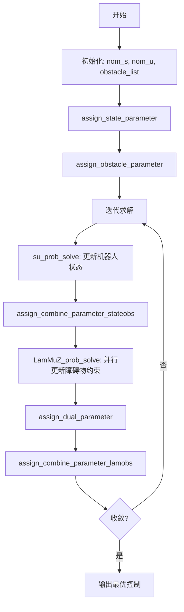

# 动态障碍物规避示例

<cite>
**本文档中引用的文件**  
- [dynamic_obs.py](file://RDA-planner/example/dynamic_obs/dynamic_obs.py)
- [dynamic_obs.yaml](file://RDA-planner/example/dynamic_obs/dynamic_obs.yaml)
- [rda_solver.py](file://RDA-planner/RDA_planner/rda_solver.py)
- [mpc.py](file://RDA-planner/RDA_planner/mpc.py)
</cite>

## 目录
1. [项目结构](#项目结构)
2. [核心组件](#核心组件)
3. [动态障碍物建模](#动态障碍物建模)
4. [配置参数解析](#配置参数解析)
5. [RDA求解器与动态约束整合](#rda求解器与动态约束整合)
6. [参数调整与实时性权衡](#参数调整与实时性权衡)
7. [调试技巧与常见问题](#调试技巧与常见问题)

## 项目结构

RDA-planner项目采用模块化设计，主要包含以下核心目录：

- `RDA_planner/`: 核心算法实现，包含MPC控制器和RDA求解器。
- `example/dynamic_obs/`: 动态障碍物规避的示例代码和配置文件。
- `example/dynamic_obs/dynamic_obs.py`: 示例主程序，演示了如何使用RDA-planner处理动态障碍物。
- `example/dynamic_obs/dynamic_obs.yaml`: 仿真环境的配置文件，定义了机器人、动态障碍物等参数。

该结构清晰地分离了算法核心与应用示例，便于用户理解和复用。

**文档来源**
- [dynamic_obs.py](file://RDA-planner/example/dynamic_obs/dynamic_obs.py)
- [dynamic_obs.yaml](file://RDA-planner/example/dynamic_obs/dynamic_obs.yaml)

## 核心组件

RDA-planner的核心由两个主要Python类构成：`MPC` 和 `RDA_solver`。

- `MPC` 类位于 `mpc.py`，是用户的主要接口。它负责处理机器人状态、参考路径、障碍物列表，并将其预处理后传递给底层的RDA求解器。
- `RDA_solver` 类位于 `rda_solver.py`，是算法的核心。它基于交替方向乘子法（ADMM）构建了一个可并行化的优化问题，用于求解无碰撞的最优轨迹。

`dynamic_obs.py` 作为示例脚本，通过实例化 `MPC` 类并调用其 `control` 方法，展示了整个规划流程。

**文档来源**
- [mpc.py](file://RDA-planner/RDA_planner/mpc.py)
- [rda_solver.py](file://RDA-planner/RDA_planner/rda_solver.py)
- [dynamic_obs.py](file://RDA-planner/example/dynamic_obs/dynamic_obs.py)

## 动态障碍物建模

RDA-planner通过预测动态障碍物在未来一段时间内的运动轨迹来实现规避。其建模方式主要体现在 `mpc.py` 文件中的 `convert_inequal_circle` 和 `convert_inequal_polygon` 方法。

### 运动轨迹预测

当障碍物具有速度（`velocity`）时，系统会预测其在未来 `T+1` 个时间步长（`receding horizon`）内的位置。对于圆形障碍物，其预测轨迹由一系列不等式约束构成：

```python
def convert_inequal_circle(self, center, radius, velocity=np.zeros((2, 1))):
    if np.linalg.norm(velocity) <= 0.01:
        # 静态障碍物
        A = np.array([[1, 0], [0, 1], [0, 0]])
        b = np.row_stack((center, -radius * np.ones((1, 1))))
    else:
        # 动态障碍物：生成预测时间窗内的多个位置
        A, b = [], []
        for t in range(self.receding + 1):
            next_center = center + velocity * (t * self.dt)
            temp_A = np.array([[1, 0], [0, 1], [0, 0]])
            temp_b = np.row_stack((next_center, -radius * np.ones((1, 1))))
            A.append(temp_A)
            b.append(temp_b)
    return A, b
```

此方法为每个预测时间点 `t` 计算一个障碍物中心 `next_center`，并生成对应的线性不等式约束 `(A, b)`。这些约束共同构成了一个时空安全区域，确保机器人在规划的整个时间窗内都不会与移动的障碍物发生碰撞。

### 时间窗口设置

时间窗口的长度由MPC的**预测时域**（`receding`）决定。在 `dynamic_obs.py` 示例中，`receding=10`，意味着求解器会考虑未来10个时间步长（`sample_time=0.1`秒）的障碍物位置，即一个1秒长的时间窗口。这个窗口的设置是动态的，随着机器人的移动和障碍物的运动，每个控制周期都会重新预测和更新。

**文档来源**
- [mpc.py](file://RDA-planner/RDA_planner/mpc.py#L500-L520)
- [dynamic_obs.py](file://RDA-planner/example/dynamic_obs/dynamic_obs.py#L15-L16)

## 配置参数解析

与动态物体相关的参数主要在 `MPC` 类的初始化和 `dynamic_obs.yaml` 配置文件中定义。

### MPC类中的关键参数

| 参数名 | 类型 | 默认值 | 说明 |
| :--- | :--- | :--- | :--- |
| `receding` | int | 10 | MPC的预测时域，决定了轨迹优化和障碍物预测的时间窗口长度。 |
| `sample_time` | float | 0.1 | 仿真和控制的步长时间，单位为秒。 |
| `max_obs_num` | int | 5 | 求解器在一次迭代中考虑的最大障碍物数量。 |
| `max_edge_num` | int | 5 | 多边形障碍物的最大边数。 |
| `accelerated` | bool | True | 是否使用加速版ADMM算法，影响收敛速度和稳定性。 |

### dynamic_obs.yaml中的动态障碍物参数

在 `dynamic_obs.yaml` 文件中，`obstacle` 字段定义了动态障碍物的行为：

```yaml
obstacle:
  - number: 7
    kinematics: {name: 'diff'}
    behavior: 
      - {name: 'dash', range_low: [10, 10, -3.14], range_high: [40, 40, 3.14], wander: True}
    vel_min: [-1.0, -3.14]
    vel_max: [1.0, 3.14]
```

- `vel_min` 和 `vel_max`: 定义了障碍物线速度和角速度的上下限，即**速度和加速度限制**。在示例中，障碍物的最大线速度为1.0 m/s，最大角速度为3.14 rad/s。
- `behavior`: 定义了障碍物的运动模式。`dash` 模式表示障碍物会朝某个目标点移动，`wander: True` 表示目标点会随机变化，模拟了动态环境。
- `receding`: 虽然在yaml文件中未直接定义，但它是 `MPC` 类的构造参数，共同决定了**预测时域**。

**文档来源**
- [mpc.py](file://RDA-planner/RDA_planner/mpc.py#L85-L124)
- [dynamic_obs.yaml](file://RDA-planner/example/dynamic_obs/dynamic_obs.yaml#L29-L48)

## RDA求解器与动态约束整合

RDA求解器通过将动态障碍物的预测轨迹转化为一系列线性不等式约束，并将其整合到ADMM框架中，从而在时空维度上保证轨迹安全。

### 优化问题构建

`RDA_solver` 类在初始化时，通过 `obstacle_parameter_define` 方法为每个障碍物定义了参数化的约束：
```python
def obstacle_parameter_define(self):
    self.para_obstacle_list = []
    for index in range(self.max_obs_num):
        A_list = [ cp.Parameter((oen, 2), ...) for t in range(self.T+1)]
        b_list = [ cp.Parameter((oen, 1), ...) for t in range(self.T+1)]
        para_obstacle={'A': A_list, 'b': b_list, ...}
        self.para_obstacle_list.append(para_obstacle)
```
这里的 `A_list` 和 `b_list` 是长度为 `T+1` 的列表，每个元素对应一个时间步长的障碍物几何约束，完美地编码了动态障碍物的预测轨迹。

### ADMM框架中的并行求解

RDA的核心优势在于其ADMM分解。`construct_LamMuZ_prob` 方法为每个障碍物创建了一个独立的子问题（`prob_list`）。在 `LamMuZ_prob_solve` 中，这些子问题可以并行求解（当 `process_num > 1` 时），极大地提升了计算效率。每个子问题负责更新与特定障碍物相关的对偶变量（`lam`, `mu`, `z`），而主问题 `su_prob_solve` 则负责更新机器人的状态和控制输入。这种分解确保了即使在有多个动态障碍物的复杂环境中，求解器也能高效运行。



**文档来源**
- [rda_solver.py](file://RDA-planner/RDA_planner/rda_solver.py#L150-L180)
- [rda_solver.py](file://RDA-planner/RDA_planner/rda_solver.py#L550-L610)

## 参数调整与实时性权衡

为了适应不同速度的移动障碍物，可以通过调整以下参数来优化性能：

1.  **增加 `receding`**: 对于高速移动的障碍物，应增加预测时域，以便更早地规划规避路径。但过大的 `receding` 会显著增加计算复杂度。
2.  **调整 `sample_time`**: 减小步长时间可以提高控制精度，但也要求求解器在更短时间内完成计算。
3.  **调节 `max_obs_num` 和 `max_edge_num`**: 增加这些值可以处理更复杂的场景，但同样会增加问题规模。
4.  **优化ADMM参数**: `ro1` 和 `ro2` 是ADMM的惩罚参数。增大 `ro1` 可以加快收敛，但可能导致数值不稳定。`iter_num` 决定了最大迭代次数，增加它可以提高解的精度，但会牺牲实时性。

**计算复杂度与实时性的权衡**：RDA-planner的计算复杂度主要取决于预测时域 `T`、障碍物数量 `N` 和机器人状态维度。其并行化设计（`process_num`）是保证实时性的关键。在CPU核心充足的系统上，将 `process_num` 设置为等于或接近CPU核心数，可以最大化利用计算资源，从而在保证规划质量的同时满足实时性要求。

**文档来源**
- [mpc.py](file://RDA-planner/RDA_planner/mpc.py#L85-L124)
- [rda_solver.py](file://RDA-planner/RDA_planner/rda_solver.py#L20-L40)

## 调试技巧与常见问题

### 调试技巧

1.  **启用 `time_print`**: 在 `MPC` 初始化时设置 `time_print=True`，可以打印每次迭代的耗时，帮助评估算法的实时性能。
2.  **检查 `info` 字典**: `control` 方法返回的 `info` 字典包含了 `resi_dual` 和 `resi_pri`（对偶残差和原始残差），它们是ADMM收敛性的指标。如果这些值在迭代后仍然很大，说明求解可能不收敛。
3.  **可视化**: `dynamic_obs.py` 示例中使用 `env.draw_trajectory` 绘制了最优轨迹，这是验证规划结果最直观的方法。

### 常见问题及解决方案

- **问题**: 机器人无法及时规避高速障碍物。
  - **解决方案**: 增加 `receding` 值以延长预测窗口，并确保 `sample_time` 足够小以提供足够的控制频率。

- **问题**: 求解器耗时过长，无法满足实时性要求。
  - **解决方案**: 降低 `receding` 或 `max_obs_num` 以减小问题规模；确保 `process_num` 设置合理以利用多核并行；检查 `iter_num` 是否过高。

- **问题**: 规划轨迹不稳定或出现抖动。
  - **解决方案**: 尝试降低 `ro1` 的值（例如从200降到100），并增加 `iter_num`，以提高ADMM算法的稳定性。

**文档来源**
- [mpc.py](file://RDA-planner/RDA_planner/mpc.py#L122-L165)
- [rda_solver.py](file://RDA-planner/RDA_planner/rda_solver.py#L582-L609)