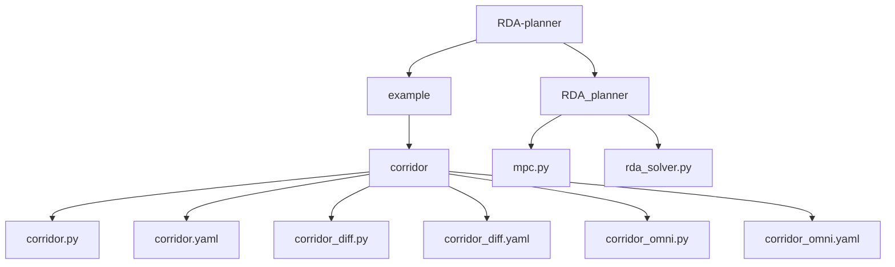
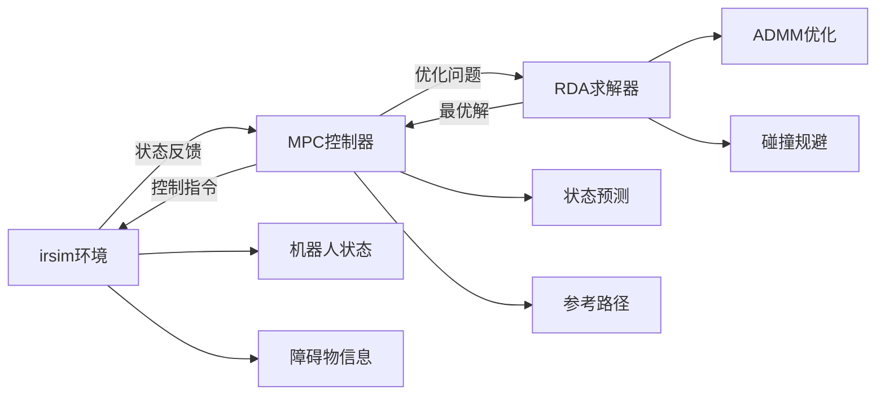
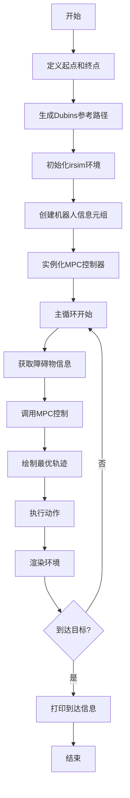
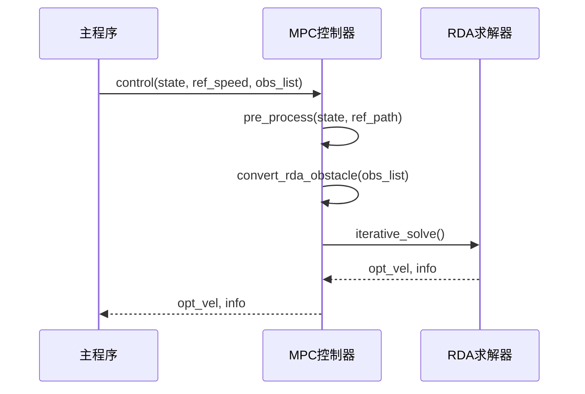
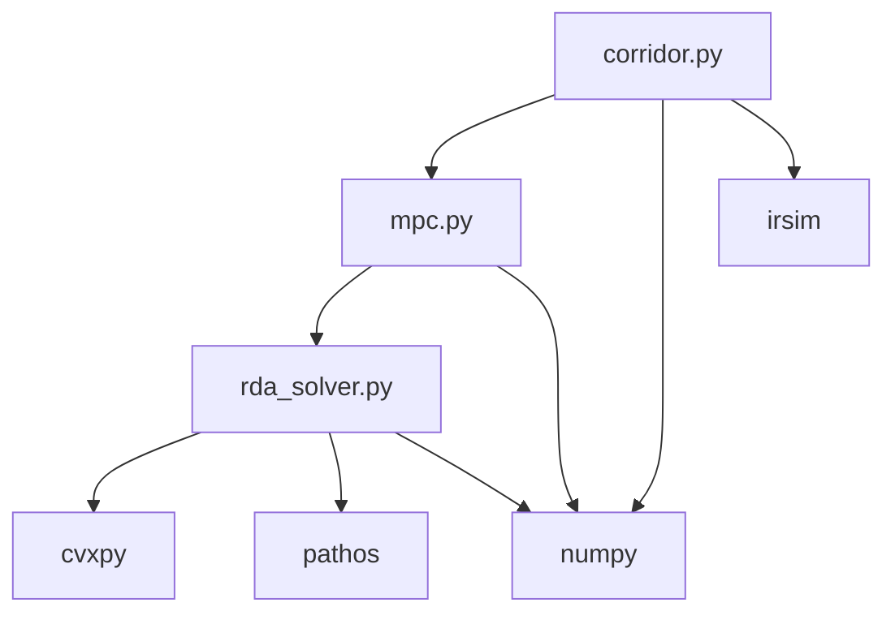

# 走廊导航示例

<cite>
**本文档中引用的文件**  
- [corridor.py](file://RDA-planner/example/corridor/corridor.py)
- [corridor.yaml](file://RDA-planner/example/corridor/corridor.yaml)
- [mpc.py](file://RDA-planner/RDA_planner/mpc.py)
- [rda_solver.py](file://RDA-planner/RDA_planner/rda_solver.py)
</cite>

## 目录
1. [简介](#简介)
2. [项目结构](#项目结构)
3. [核心组件](#核心组件)
4. [架构概述](#架构概述)
5. [详细组件分析](#详细组件分析)
6. [依赖分析](#依赖分析)
7. [性能考虑](#性能考虑)
8. [故障排除指南](#故障排除指南)
9. [结论](#结论)

## 简介
本文档详细解析RDA-planner在走廊导航场景中的应用。重点解释环境配置文件`corridor.yaml`中各项参数的含义，包括机器人尺寸、走廊宽度、目标点设置等。深入分析`corridor.py`代码结构，说明如何定义静态障碍物、设置规划目标、调用RDA求解器以及可视化结果。提供完整的代码执行流程，从初始化到轨迹生成的每一步骤。讨论在狭窄空间中规划的挑战，如避障与路径优化的平衡，并给出性能调优建议。包含可直接运行的代码示例和预期输出结果。

## 项目结构
RDA-planner项目包含多个示例场景，其中走廊导航示例位于`RDA-planner/example/corridor/`目录下。该目录包含不同机器人动力学模型的配置文件和脚本，如阿克曼转向（acker）、差速驱动（diff）和全向移动（omni）。

**图示来源**
- [corridor.py](file://RDA-planner/example/corridor/corridor.py)
- [corridor.yaml](file://RDA-planner/example/corridor/corridor.yaml)
- [mpc.py](file://RDA-planner/RDA_planner/mpc.py)

## 核心组件
走廊导航示例的核心组件包括环境配置文件`corridor.yaml`、主执行脚本`corridor.py`、MPC控制器`mpc.py`和RDA求解器`rda_solver.py`。这些组件协同工作，实现机器人在狭窄走廊环境中的自主导航。

**节来源**
- [corridor.py](file://RDA-planner/example/corridor/corridor.py)
- [corridor.yaml](file://RDA-planner/example/corridor/corridor.yaml)
- [mpc.py](file://RDA-planner/RDA_planner/mpc.py)

## 架构概述
RDA-planner采用模型预测控制（MPC）框架，结合RDA求解器进行实时轨迹规划。系统架构分为环境层、控制层和求解层。环境层负责模拟机器人和障碍物的物理状态；控制层实现MPC算法，处理状态预测和参考路径跟踪；求解层使用RDA算法解决非凸优化问题，确保在复杂环境中的安全导航。

**图示来源**
- [corridor.py](file://RDA-planner/example/corridor/corridor.py)
- [mpc.py](file://RDA-planner/RDA_planner/mpc.py)
- [rda_solver.py](file://RDA-planner/RDA_planner/rda_solver.py)

## 详细组件分析

### 环境配置分析
`corridor.yaml`文件定义了走廊导航场景的物理参数和机器人属性。世界尺寸为63x20单位，时间步长为0.1秒。机器人采用阿克曼转向模型，尺寸为4.6x1.6单位，轮距为3单位。起始点为(0,20)，目标点为(60,20)。障碍物由6个矩形组成，形成两侧墙壁和内部障碍物。

**节来源**
- [corridor.yaml](file://RDA-planner/example/corridor/corridor.yaml)

### 代码结构分析
`corridor.py`脚本首先导入必要的库，然后定义起始点和目标点。使用`curve_generator`生成Dubins曲线作为参考路径。初始化`irsim`环境后，创建机器人信息元组并实例化MPC控制器。主循环中，控制器根据当前状态和障碍物信息计算最优速度，环境执行动作并渲染结果。

**图示来源**
- [corridor.py](file://RDA-planner/example/corridor/corridor.py)

### MPC控制器分析
`mpc.py`中的MPC类封装了轨迹规划的核心逻辑。`control`方法接收当前状态、参考速度和障碍物列表，返回最优控制输入。预处理阶段通过`pre_process`方法预测状态序列并生成参考轨迹。`convert_rda_obstacle`方法将障碍物转换为RDA求解器可处理的格式。最后调用RDA求解器迭代求解优化问题。

**图示来源**
- [mpc.py](file://RDA-planner/RDA_planner/mpc.py)
- [rda_solver.py](file://RDA-planner/RDA_planner/rda_solver.py)

### RDA求解器分析
`rda_solver.py`实现了基于ADMM的RDA算法。求解器定义了状态变量、对偶变量和障碍物参数。`construct_problem`方法构建优化问题，`iterative_solve`方法执行迭代求解。`su_prob_solve`和`LamMuZ_prob_solve`分别求解状态-控制问题和对偶问题。算法通过交替优化和参数更新，收敛到最优解。

**节来源**
- [rda_solver.py](file://RDA-planner/RDA_planner/rda_solver.py)

## 依赖分析
RDA-planner依赖多个外部库，包括`cvxpy`用于凸优化求解，`pathos`用于多进程并行计算，`numpy`用于数值计算，`irsim`用于环境模拟。项目内部模块间依赖关系清晰，`corridor.py`依赖`mpc.py`，`mpc.py`依赖`rda_solver.py`，形成层次化的架构。

**图示来源**
- [corridor.py](file://RDA-planner/example/corridor/corridor.py)
- [mpc.py](file://RDA-planner/RDA_planner/mpc.py)
- [rda_solver.py](file://RDA-planner/RDA_planner/rda_solver.py)

## 性能考虑
在狭窄走廊环境中进行路径规划面临避障与路径优化的平衡挑战。RDA-planner通过调整`slack_gain`、`max_sd`、`min_sd`、`ro1`和`ro2`等参数来优化性能。增加`slack_gain`可以提高松弛变量的惩罚，增强避障能力；调整`ro1`和`ro2`可以控制ADMM算法的收敛速度和稳定性。使用多进程并行求解可以显著提高计算效率。

**节来源**
- [mpc.py](file://RDA-planner/RDA_planner/mpc.py)
- [rda_solver.py](file://RDA-planner/RDA_planner/rda_solver.py)

## 故障排除指南
常见问题包括求解器不收敛、机器人碰撞障碍物和轨迹抖动。检查障碍物定义是否正确，确保`max_edge_num`和`max_obs_num`设置合理。调整ADMM参数`ro1`和`ro2`，通常`ro1`设置为200，`ro2`设置为1。增加`iter_num`可以提高求解精度，但会增加计算时间。确保参考路径平滑，避免急转弯。

**节来源**
- [mpc.py](file://RDA-planner/RDA_planner/mpc.py)
- [rda_solver.py](file://RDA-planner/RDA_planner/rda_solver.py)

## 结论
RDA-planner在走廊导航场景中表现出色，能够有效处理狭窄空间中的避障和路径优化问题。通过合理配置环境参数和调优算法参数，可以实现稳定可靠的自主导航。未来工作可以探索动态障碍物处理和多机器人协同导航。