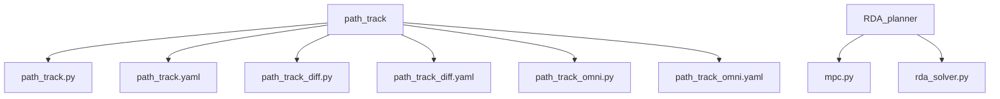
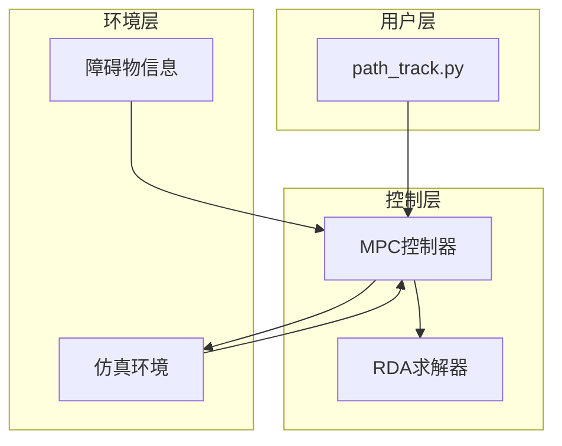
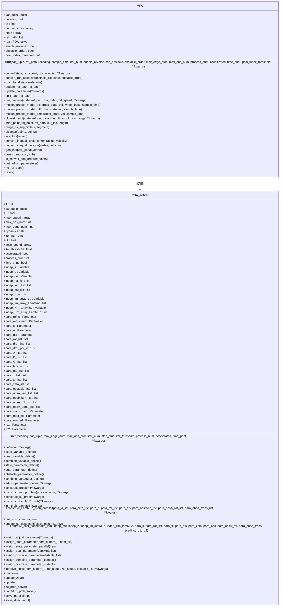
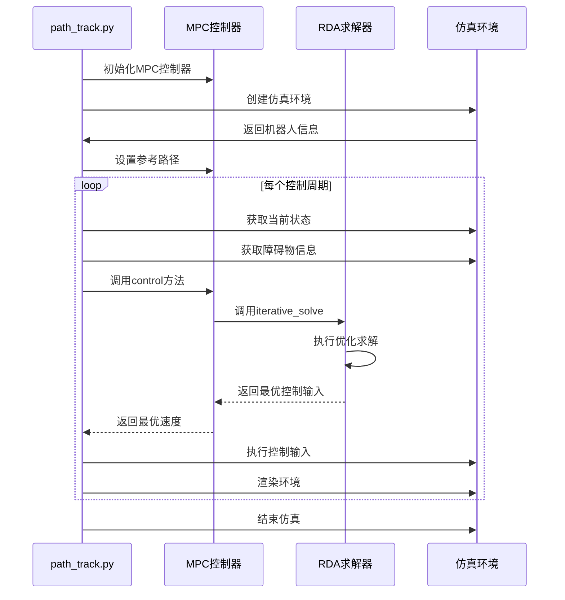
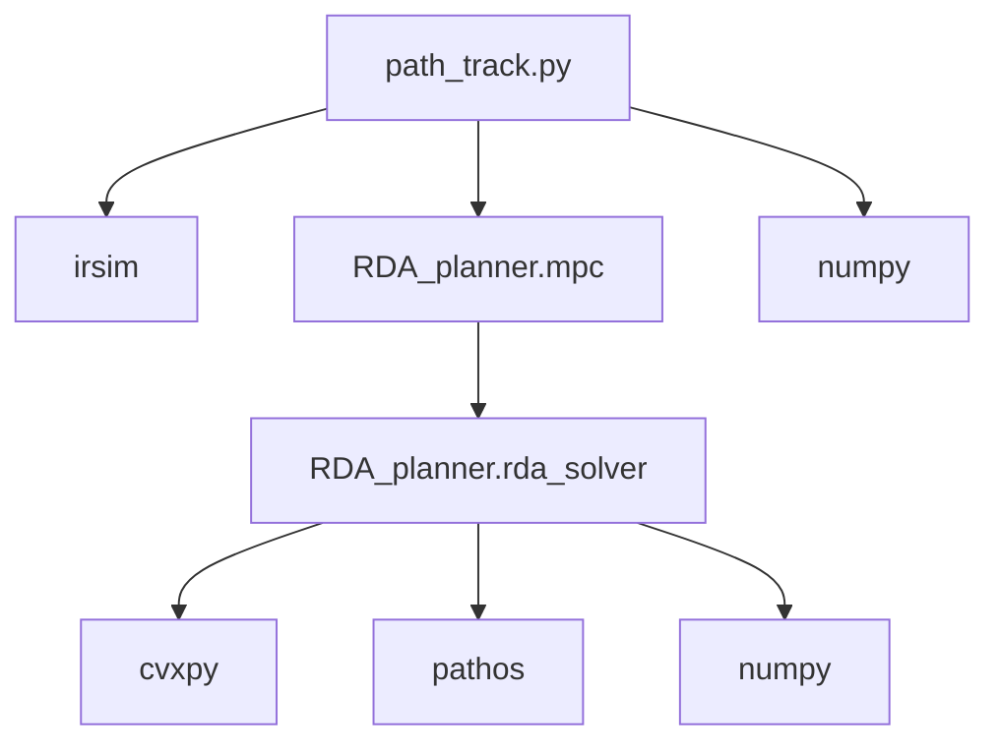

# 路径跟踪示例

<cite>
**本文档中引用的文件**  
- [path_track.py](file://RDA-planner/example/path_track/path_track.py)
- [path_track.yaml](file://RDA-planner/example/path_track/path_track.yaml)
- [mpc.py](file://RDA-planner/RDA_planner/mpc.py)
- [rda_solver.py](file://RDA-planner/RDA_planner/rda_solver.py)
</cite>

## 目录
1. [项目结构](#项目结构)
2. [核心组件](#核心组件)
3. [架构概述](#架构概述)
4. [详细组件分析](#详细组件分析)
5. [依赖分析](#依赖分析)
6. [性能考虑](#性能考虑)
7. [故障排除指南](#故障排除指南)
8. [结论](#结论)

## 项目结构

RDA-planner项目中的路径跟踪示例位于`RDA-planner/example/path_track`目录下，包含多个针对不同机器人动力学模型的实现文件。该目录包含用于阿克曼转向、差速驱动和全向移动机器人的路径跟踪脚本及其相应的配置文件。

**图示来源**
- [path_track.py](file://RDA-planner/example/path_track/path_track.py)
- [mpc.py](file://RDA-planner/RDA_planner/mpc.py)

**章节来源**
- [path_track.py](file://RDA-planner/example/path_track/path_track.py)
- [path_track.yaml](file://RDA-planner/example/path_track/path_track.yaml)

## 核心组件

路径跟踪示例的核心组件包括`path_track.py`脚本，该脚本利用RDA求解器生成平滑且符合动力学约束的跟踪轨迹。MPC控制器通过预定义路径作为参考轨迹输入，并结合环境信息进行实时控制。

**章节来源**
- [path_track.py](file://RDA-planner/example/path_track/path_track.py#L1-L46)
- [mpc.py](file://RDA-planner/RDA_planner/mpc.py#L1-L569)

## 架构概述

系统架构基于模型预测控制（MPC）框架，利用RDA求解器处理路径跟踪问题。控制器接收当前机器人状态和参考路径，通过优化算法计算最优控制输入，确保机器人能够平滑地跟踪预定义路径。

**图示来源**
- [path_track.py](file://RDA-planner/example/path_track/path_track.py#L1-L46)
- [mpc.py](file://RDA-planner/RDA_planner/mpc.py#L1-L569)

## 详细组件分析

### MPC控制器分析

MPC控制器负责将预定义路径作为参考轨迹输入，并利用RDA求解器生成平滑且符合动力学约束的跟踪轨迹。控制器通过迭代求解优化问题，实时调整控制输入以最小化跟踪误差。

#### 类图

**图示来源**
- [mpc.py](file://RDA-planner/RDA_planner/mpc.py#L1-L569)
- [rda_solver.py](file://RDA-planner/RDA_planner/rda_solver.py#L1-L799)

#### 控制流程

**图示来源**
- [path_track.py](file://RDA-planner/example/path_track/path_track.py#L1-L46)
- [mpc.py](file://RDA-planner/RDA_planner/mpc.py#L1-L569)

**章节来源**
- [path_track.py](file://RDA-planner/example/path_track/path_track.py#L1-L46)
- [mpc.py](file://RDA-planner/RDA_planner/mpc.py#L1-L569)

## 依赖分析

路径跟踪示例依赖于RDA-planner库中的MPC和RDA求解器组件，以及irsim仿真环境。这些组件共同协作，实现高效的路径跟踪功能。

**图示来源**
- [path_track.py](file://RDA-planner/example/path_track/path_track.py#L1-L46)
- [mpc.py](file://RDA-planner/RDA_planner/mpc.py#L1-L569)
- [rda_solver.py](file://RDA-planner/RDA_planner/rda_solver.py#L1-L799)

**章节来源**
- [path_track.py](file://RDA-planner/example/path_track/path_track.py#L1-L46)
- [mpc.py](file://RDA-planner/RDA_planner/mpc.py#L1-L569)
- [rda_solver.py](file://RDA-planner/RDA_planner/rda_solver.py#L1-L799)

## 性能考虑

RDA-planner通过并行计算和高效的优化算法确保实时性能。MPC控制器的迭代次数和预测时域可以根据具体应用场景进行调整，以平衡计算复杂度和控制精度。

## 故障排除指南

在使用路径跟踪示例时，如果遇到问题，可以检查以下几点：
- 确保参考路径文件存在且格式正确
- 检查机器人动力学参数设置是否合理
- 验证障碍物信息是否正确传递给控制器
- 调整MPC控制器的参数以优化跟踪性能

**章节来源**
- [path_track.py](file://RDA-planner/example/path_track/path_track.py#L1-L46)
- [mpc.py](file://RDA-planner/RDA_planner/mpc.py#L1-L569)

## 结论

RDA-planner的路径跟踪示例展示了如何利用MPC框架和RDA求解器实现高效、平滑的路径跟踪。通过合理配置参数和优化算法，可以在复杂环境中实现精确的机器人导航。