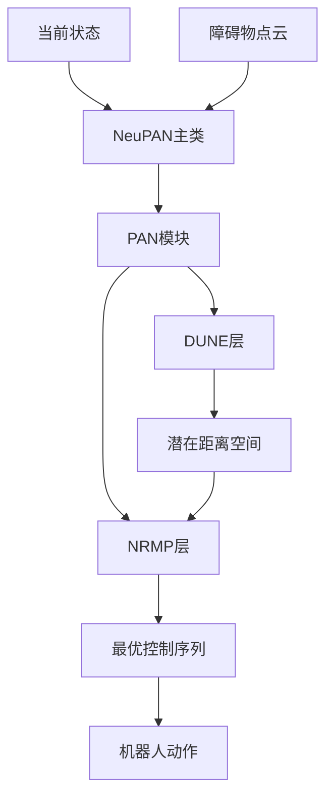
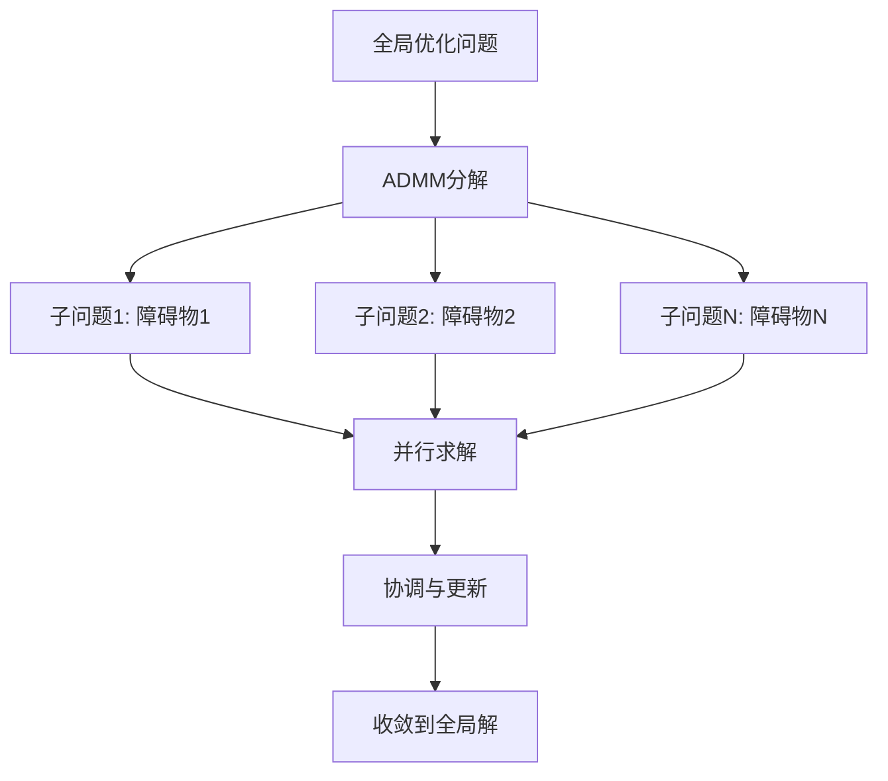
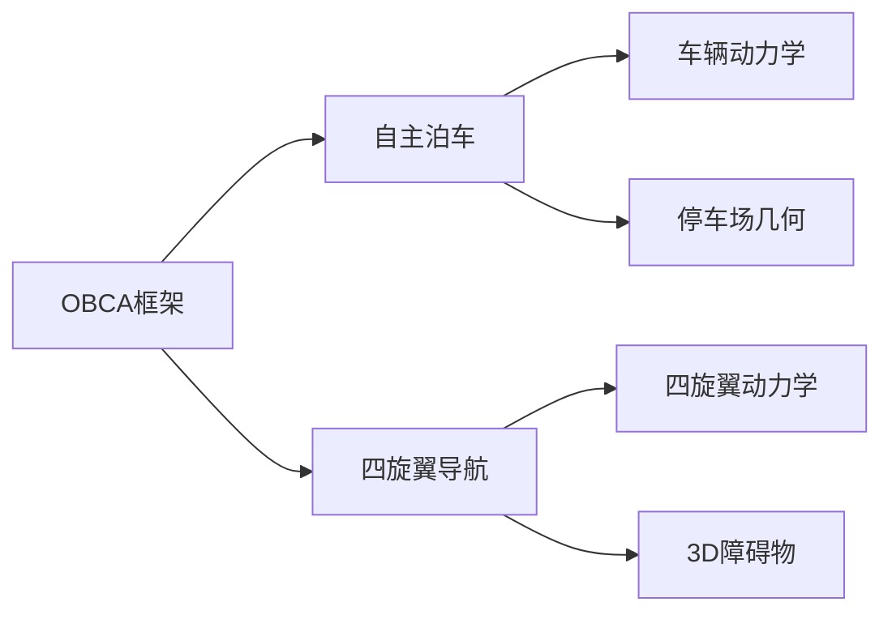
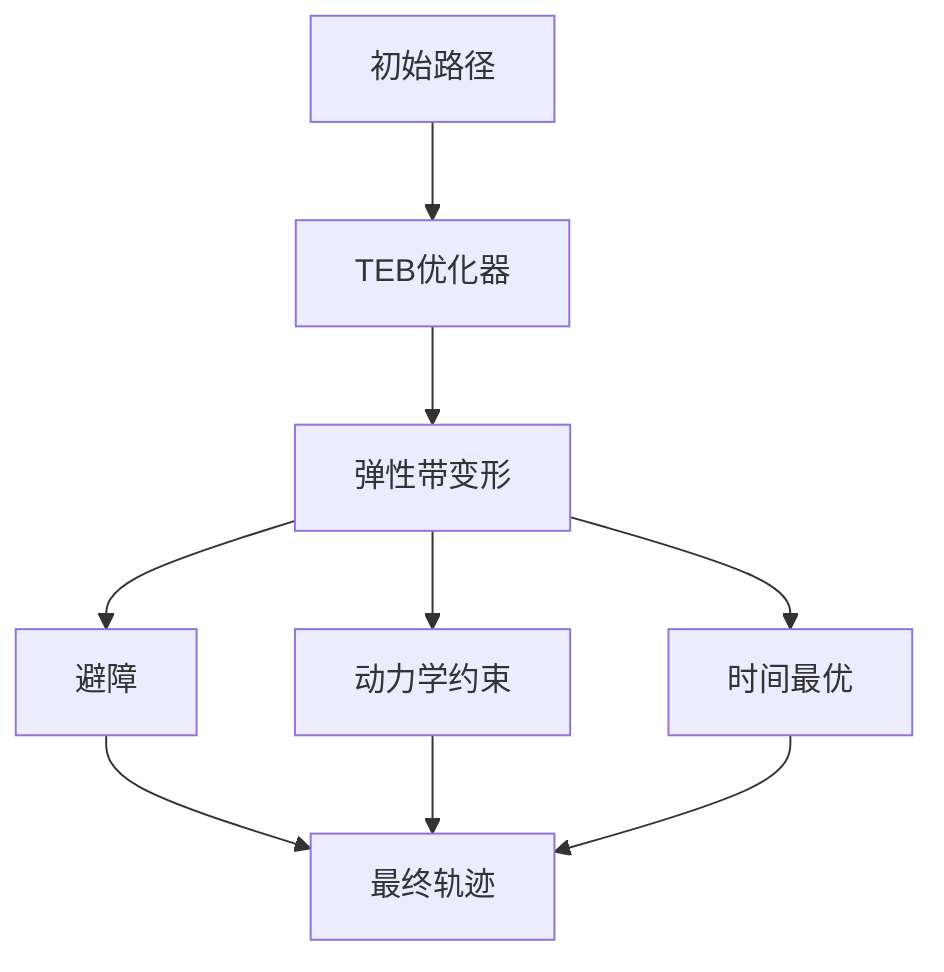

# 核心功能与服务

<cite>
**本文档引用的文件**  
- [neupan.py](file://NeuPAN/neupan/neupan.py)
- [pan.py](file://NeuPAN/neupan/blocks/pan.py)
- [nrmp.py](file://NeuPAN/neupan/blocks/nrmp.py)
- [README.md](file://NeuPAN/README.md)
- [mpc.py](file://RDA-planner/RDA_planner/mpc.py)
- [ParkingConstraints.jl](file://OBCA/AutonomousParking/ParkingConstraints.jl)
- [constrSatisfaction.jl](file://OBCA/QuadcopterNavigation/constrSatisfaction.jl)
- [kino_astar.h](file://Dftpav/src/Plan/traj_planner/include/path_searching/kino_astar.h)
- [teb_config.h](file://teb_local_planner/include/teb_local_planner/teb_config.h)
</cite>

## 目录
1. [引言](#引言)
2. [端到端神经规划（NeuPAN）](#端到端神经规划neupan)
3. [加速碰撞避免规划（RDA-planner）](#加速碰撞避免规划rda-planner)
4. [优化碰撞避免（OBCA）](#优化碰撞避免obca)
5. [经典路径规划](#经典路径规划)
6. [功能模块集成与应用策略](#功能模块集成与应用策略)
7. [性能调优与开发建议](#性能调优与开发建议)

## 引言
本文档详细介绍了NeuPAN实验项目中的核心功能与服务，重点涵盖端到端神经规划、加速碰撞避免规划、优化碰撞避免和经典路径规划等主要模块。文档结合实际代码实现，深入解析各功能模块的技术原理、接口定义和使用模式。为初学者提供清晰的功能使用指南，同时为经验丰富的开发者提供性能调优和定制化开发建议。通过分析各模块之间的关系和集成方式，帮助用户在不同应用场景下做出合理的选择。

## 端到端神经规划（NeuPAN）

NeuPAN（Neural Proximal Alternating-minimization Network）是一种端到端、实时、无需地图且易于部署的基于模型预测控制（MPC）的机器人运动规划器。它通过整合基于学习和基于优化的技术，直接将障碍物点数据映射到实时控制动作，通过求解包含大量点级碰撞避免约束的端到端数学模型来实现。这消除了中间模块设计以避免误差传播，实现了高精度，使机器人能够在杂乱和未知环境中高效、安全地导航。

### 核心架构与工作原理
NeuPAN的核心是一个名为PAN（Proximal Alternating-minimization Network）的网络，它由NRMP（Neural Regularized Motion Planner）和DUNE（Deep UNsupervised Embedding）两个关键组件构成。该架构通过交替最小化算法迭代求解优化问题。



**Diagram sources**
- [neupan.py](file://NeuPAN/neupan/neupan.py#L30-L65)
- [pan.py](file://NeuPAN/neupan/blocks/pan.py#L30-L50)

**核心组件说明：**
- **NeuPAN类**：主入口，封装了PAN模块，提供用户友好的接口。
- **PAN类**：核心求解器，通过交替最小化算法协调NRMP和DUNE。
- **NRMP类**：基于凸优化的运动规划器，负责求解包含动力学约束和碰撞避免约束的优化问题。
- **DUNE类**：深度无监督嵌入网络，将高维障碍物点云映射到低维潜在距离空间，为NRMP提供安全距离信息。

### 接口定义与使用模式
NeuPAN通过`forward`方法接收当前机器人状态和障碍物点云，并输出最优控制动作。

```python
action, info = neupan_planner.forward(state, points, velocities)
```

**关键参数：**
- `state`: 机器人当前状态，形状为(3, 1)，包含x, y, theta。
- `points`: 障碍物点云位置，形状为(2, N)，N为点数。
- `velocities`: 障碍物点云速度，形状为(2, N)，可选。

**配置参数：**
| 参数名称 | 类型/默认值 | 描述 |
| :--- | :--- | :--- |
| `receding` | `int` / 10 | MPC预测步数。 |
| `step_time` | `float` / 0.1 | MPC时间步长（秒）。 |
| `ref_speed` | `float` / 4.0 | MPC参考速度（米/秒）。 |
| `device` | `str` / "cpu" | 运行设备，"cpu"或"cuda"。 |
| `time_print` | `bool` / False | 是否打印前向传播时间（秒）。 |
| `collision_threshold` | `float` / 0.1 | 碰撞检测阈值（米）。 |

**Section sources**
- [neupan.py](file://NeuPAN/neupan/neupan.py#L30-L65)
- [README.md](file://NeuPAN/README.md#L76-L87)

## 加速碰撞避免规划（RDA-planner）

RDA Planner是一种高性能、基于优化的模型预测控制（MPC）运动规划器，专为在复杂和杂乱环境中自主导航而设计。它利用交替方向乘子法（ADMM），将复杂的优化问题分解为几个简单的子问题。这种分解使得每个障碍物的碰撞避免约束可以并行计算，显著提高了计算速度。

### 技术原理
RDA的核心是ADMM算法，它将一个大的全局优化问题分解为多个可以并行求解的局部子问题。对于每个障碍物，RDA求解一个独立的碰撞避免子问题，然后通过拉格朗日乘子和惩罚项将这些子问题的结果协调起来，最终收敛到全局最优解。



**Diagram sources**
- [mpc.py](file://RDA-planner/RDA_planner/mpc.py#L31-L52)

### 接口与配置
RDA Planner通过配置参数来控制其行为和性能。

**关键配置参数：**
- `accelerated`: 布尔值，默认为True。控制是否在rda_solver中使用加速ADMM。
- `process_num`: 整数，默认为4。用于并行求解rda问题的进程数，应根据CPU核心数设置。
- `max_obs_num`: 整数，默认为5。在rda_solver中考虑的最大障碍物数量。
- `max_edge_num`: 整数，默认为5。在rda_solver中考虑的多边形障碍物的最大边数。
- `obstacle_order`: 布尔值，默认为True。如果为True，障碍物列表按与机器人的最小距离排序。

**Section sources**
- [mpc.py](file://RDA-planner/RDA_planner/mpc.py#L31-L52)

## 优化碰撞避免（OBCA）

OBCA（Optimization-Based Collision Avoidance）是一种基于优化的碰撞避免路径规划器，主要用于自主泊车等场景。其核心思想是将非凸的碰撞避免约束通过数学变换重构为凸约束或通过松弛方法处理，从而可以使用高效的凸优化求解器来找到安全路径。

### 约束重构技术
OBCA的关键创新在于对碰撞避免约束的平滑重构。传统的碰撞避免约束（如机器人与障碍物之间的距离大于安全距离）是非凸的，难以求解。OBCA通过引入辅助变量和松弛变量，将这些非凸约束转化为一系列凸约束或通过惩罚函数来处理。

例如，在`ParkingConstraints.jl`中，通过定义安全距离`dmin`和使用H-representation（半空间表示）来描述障碍物，将复杂的几何碰撞检测问题转化为一系列线性不等式约束。

```julia
# 期望的安全距离
dmin = 0.05
```

### 多场景应用
OBCA不仅适用于地面车辆的自主泊车，还扩展到了三维空间的四旋翼无人机导航。



**Diagram sources**
- [ParkingConstraints.jl](file://OBCA/AutonomousParking/ParkingConstraints.jl#L0-L32)
- [constrSatisfaction.jl](file://OBCA/QuadcopterNavigation/constrSatisfaction.jl#L0-L49)

**Section sources**
- [ParkingConstraints.jl](file://OBCA/AutonomousParking/ParkingConstraints.jl#L0-L32)
- [constrSatisfaction.jl](file://OBCA/QuadcopterNavigation/constrSatisfaction.jl#L0-L49)

## 经典路径规划

除了先进的神经和优化规划器，项目中还集成了多种经典的路径规划算法，如Kinodynamic A*和TEB（Timed Elastic Band）。

### Kinodynamic A*
Kinodynamic A*是一种考虑机器人动力学约束的A*搜索算法。它在状态空间（位置、速度、加速度）中进行搜索，确保生成的路径不仅是几何上最短的，而且是动力学上可行的。

**关键特性：**
- 使用`kino_astar.h`中的`KinoAstar`类实现。
- 支持Reeds-Shepp和Dubins路径生成，适用于阿克曼转向车辆。
- 在搜索过程中考虑车辆的最大转向角和弧长变化。

**Section sources**
- [kino_astar.h](file://Dftpav/src/Plan/traj_planner/include/path_searching/kino_astar.h#L0-L38)

### TEB（Timed Elastic Band）
TEB是一种基于图优化的局部规划器，它将机器人的轨迹视为一条有弹性的带子（Elastic Band），并通过优化其形状来满足目标、避障和动力学约束。

**关键特性：**
- 在`teb_local_planner`包中实现。
- 支持多线程并行规划多个同伦类（homotopy classes）的轨迹。
- 可以激活同伦类规划，探索不同的路径选择（如从障碍物左侧或右侧通过）。



**Diagram sources**
- [teb_config.h](file://teb_local_planner/include/teb_local_planner/teb_config.h#L182-L191)

**Section sources**
- [teb_config.h](file://teb_local_planner/include/teb_local_planner/teb_config.h#L182-L191)

## 功能模块集成与应用策略

本项目中的各个规划模块可以协同工作，形成一个完整的导航系统。通常，一个全局规划器（如A*）生成粗略的初始路径，然后由局部规划器（如NeuPAN、RDA或TEB）进行精细化和实时避障。

### 集成架构
```mermaid
graph LR
A[全局规划器<br>(A*, Hybrid A*)] --> B[初始路径]
B --> C[局部规划器]
C --> D[NeuPAN]
C --> E[RDA-planner]
C --> F[TEB]
D --> G[实时控制]
E --> G
F --> G
H[传感器] --> C
```

### 应用场景选择策略
- **NeuPAN**: 适用于需要端到端、实时响应的复杂动态环境，特别是当计算资源充足时。
- **RDA-planner**: 适用于障碍物密集的场景，利用其并行计算优势实现高速避障。
- **OBCA**: 适用于对路径安全性要求极高的场景，如自主泊车，需要精确的约束处理。
- **TEB**: 适用于ROS环境下的标准机器人，提供成熟稳定的局部规划能力。
- **Kinodynamic A***: 适用于需要生成动力学可行的全局路径的场景。

## 性能调优与开发建议

### NeuPAN性能调优
- **硬件**: 建议使用强大的CPU（如Intel i7）以实现10Hz以上的控制频率。
- **参数调整**: 调整`receding`, `nrmp_max_num`, `dune_max_num`, `iter_num`和`iter_threshold`等参数以平衡性能和速度。
- **调整参数**: 通过调整`adjust`部分的参数（`q_s`, `p_u`, `eta`, `d_max`, `d_min`）来改变规划器的行为，使其更激进或更保守。

### 开发者建议
- **部署**: 可以通过[neupan_ros](https://github.com/hanruihua/neupan_ros)将NeuPAN部署到真实机器人平台。
- **传感器**: NeuPAN设计为读取2D点作为障碍物。可以使用3D激光雷达（通过投影到地面平面）或摄像头（通过提取2D点）作为输入。
- **扩展性**: 对于其他运动学的机器人，可以修改NRMP层中的约束来适应特定需求。

**Section sources**
- [README.md](file://NeuPAN/README.md#L180-L193)