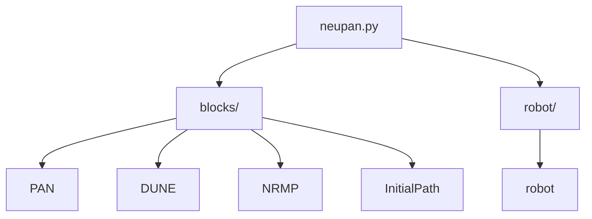
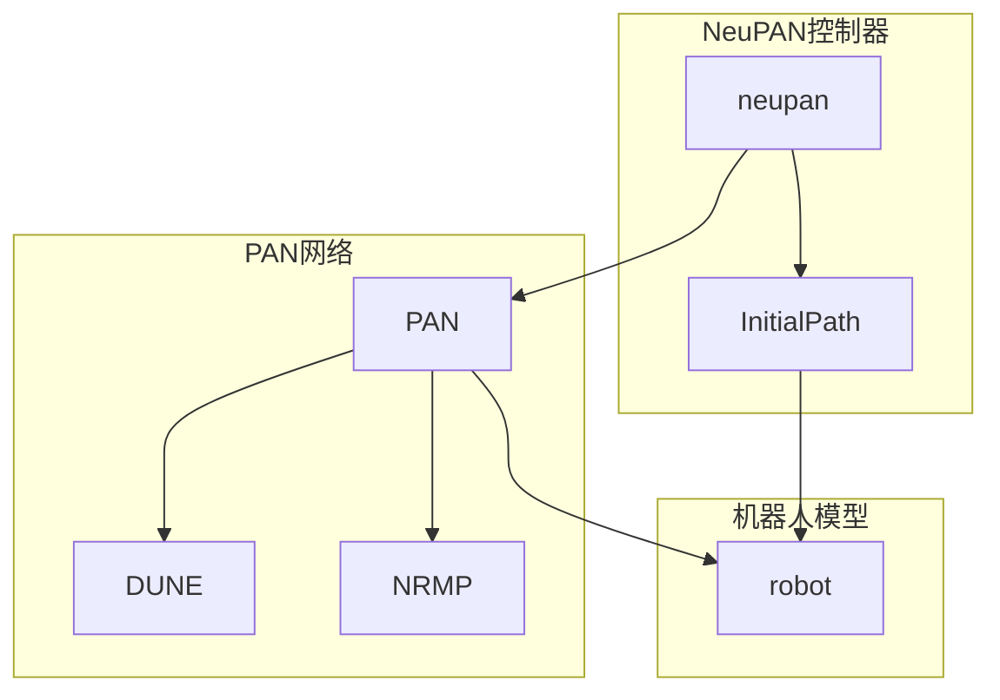
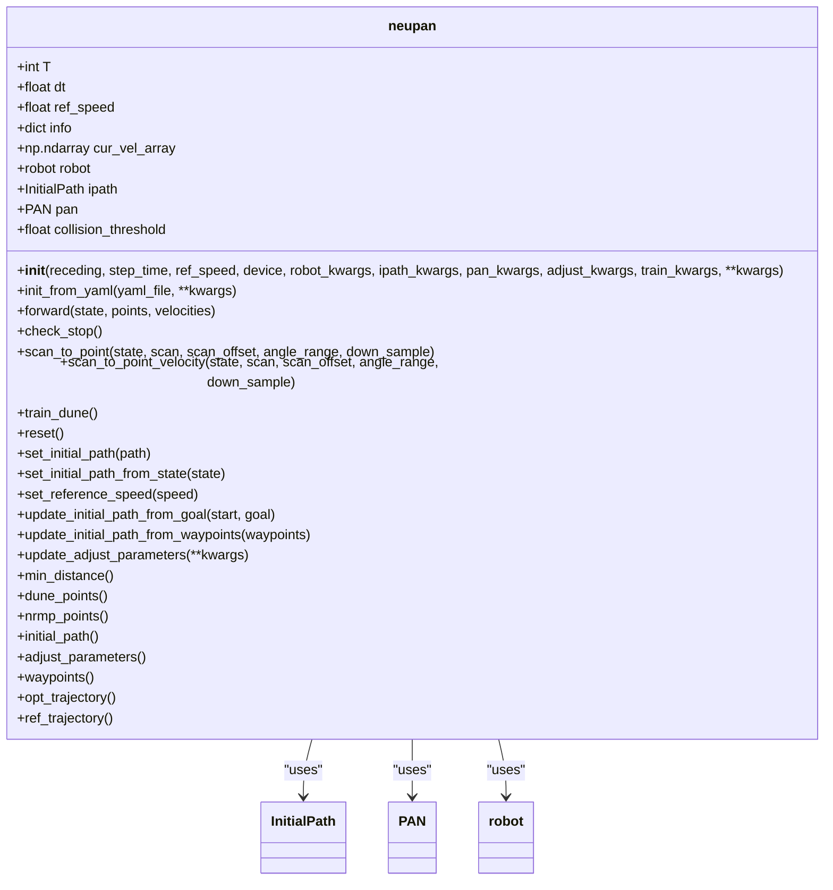
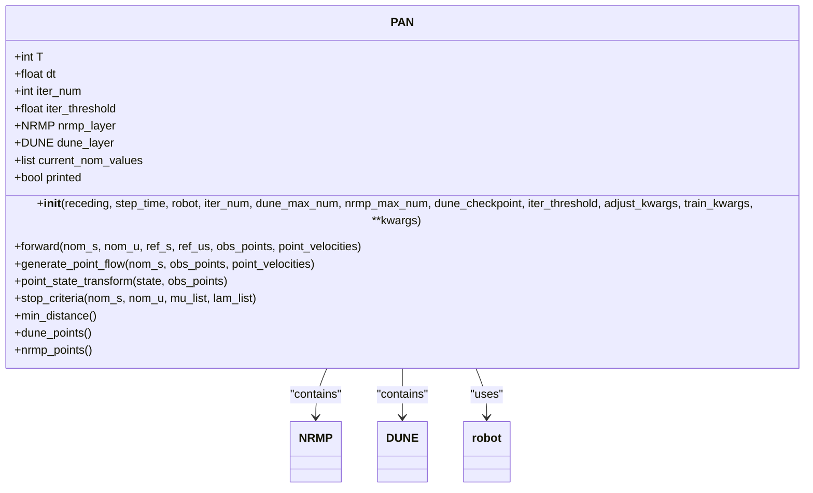
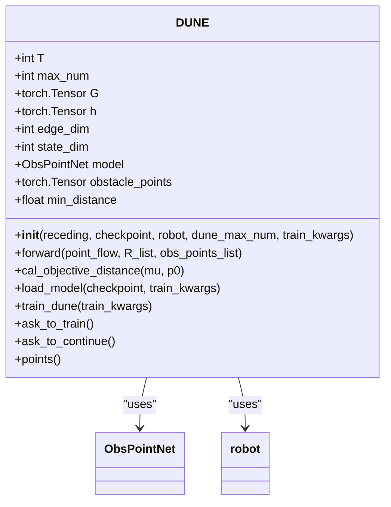
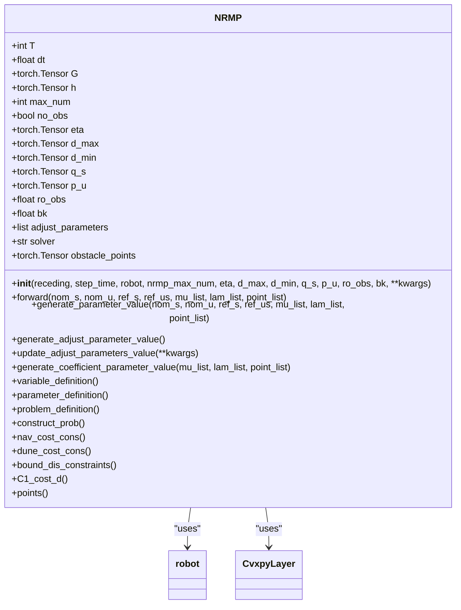
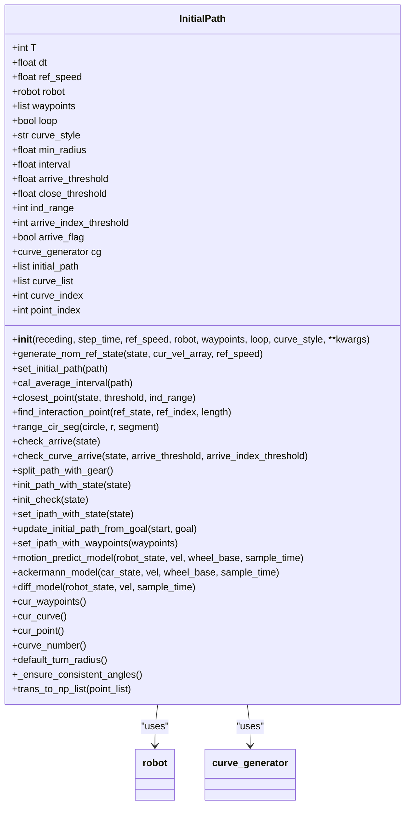
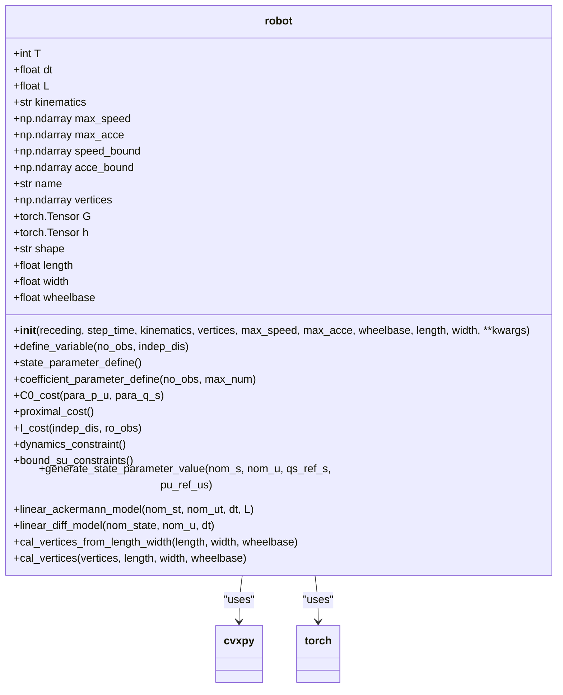
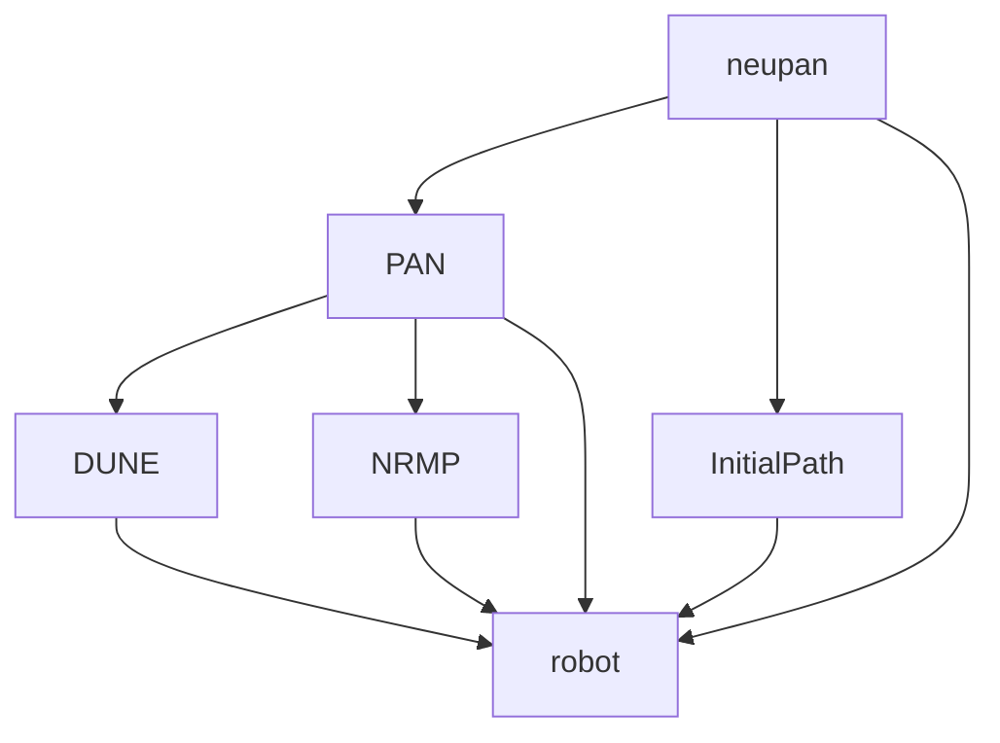

# NeuPAN核心控制器

<cite>
**本文档引用的文件**  
- [neupan.py](file://NeuPAN/neupan/neupan.py)
- [blocks/pan.py](file://NeuPAN/neupan/blocks/pan.py)
- [blocks/dune.py](file://NeuPAN/neupan/blocks/dune.py)
- [blocks/nrmp.py](file://NeuPAN/neupan/blocks/nrmp.py)
- [blocks/initial_path.py](file://NeuPAN/neupan/blocks/initial_path.py)
- [robot/robot.py](file://NeuPAN/neupan/robot/robot.py)
- [README.md](file://NeuPAN/README.md)
- [example/run_exp.py](file://NeuPAN/example/run_exp.py)
</cite>

## 目录
1. [简介](#简介)
2. [项目结构](#项目结构)
3. [核心组件](#核心组件)
4. [架构概述](#架构概述)
5. [详细组件分析](#详细组件分析)
6. [依赖关系分析](#依赖关系分析)
7. [性能考量](#性能考量)
8. [故障排除指南](#故障排除指南)
9. [结论](#结论)

## 简介
NeuPAN（Neural Proximal Alternating-minimization Network）是一种端到端、实时、无需地图且易于部署的基于模型预测控制（MPC）的机器人运动规划器。它通过整合基于学习和基于优化的技术，直接将障碍物点数据映射为实时控制动作，通过求解一个包含大量点级避障约束的端到端数学模型来实现。这消除了中间模块设计，避免了误差传播，实现了高精度，使机器人能够在杂乱和未知的环境中高效、安全地导航。

## 项目结构
NeuPAN项目遵循模块化设计，主要组件位于`neupan`包内。核心控制器`neupan.py`作为主入口，封装了底层神经网络块（如PAN、DUNE）。`blocks`目录包含核心算法组件，`robot`目录定义机器人模型，`configuration`和`util`提供配置和工具函数。`example`目录包含多个演示场景的配置文件和运行脚本。



**图表来源**
- [neupan.py](file://NeuPAN/neupan/neupan.py)
- [blocks/pan.py](file://NeuPAN/neupan/blocks/pan.py)
- [blocks/dune.py](file://NeuPAN/neupan/blocks/dune.py)
- [blocks/nrmp.py](file://NeuPAN/neupan/blocks/nrmp.py)
- [blocks/initial_path.py](file://NeuPAN/neupan/blocks/initial_path.py)
- [robot/robot.py](file://NeuPAN/neupan/robot/robot.py)

## 核心组件
`neupan.py`模块是NeuPAN算法的主类，它封装了PAN类并提供了更友好的用户接口。其主要职责包括状态估计、轨迹优化和控制指令生成。它作为端到端MPC规划器，协调底层神经网络块和机器人动力学模型。

**章节来源**
- [neupan.py](file://NeuPAN/neupan/neupan.py)

## 架构概述
NeuPAN的核心架构由`neupan`控制器、`PAN`（Proximal Alternating-minimization Network）网络、`DUNE`（Deep Unfolded Neural Encoder）和`NRMP`（Neural Regularized Motion Planner）组成。`neupan`控制器接收机器人状态和传感器数据，生成初始路径，并调用`PAN`进行优化。`PAN`通过`DUNE`和`NRMP`的交替最小化过程求解优化问题。



**图表来源**
- [neupan.py](file://NeuPAN/neupan/neupan.py)
- [blocks/pan.py](file://NeuPAN/neupan/blocks/pan.py)
- [blocks/dune.py](file://NeuPAN/neupan/blocks/dune.py)
- [blocks/nrmp.py](file://NeuPAN/neupan/blocks/nrmp.py)
- [blocks/initial_path.py](file://NeuPAN/neupan/blocks/initial_path.py)
- [robot/robot.py](file://NeuPAN/neupan/robot/robot.py)

## 详细组件分析

### NeuPAN控制器分析
`neupan`类是整个系统的主控制器，负责协调所有组件并执行主控制循环。

#### 类图


**图表来源**
- [neupan.py](file://NeuPAN/neupan/neupan.py)

#### 主控制循环序列图
```mermaid
sequenceDiagram
participant User as "用户"
participant Controller as "neupan"
participant Path as "InitialPath"
participant PAN as "PAN"
participant DUNE as "DUNE"
participant NRMP as "NRMP"
User->>Controller : 初始化 (init_from_yaml)
Controller->>Path : 初始化初始路径
Controller->>PAN : 初始化
PAN->>DUNE : 初始化
PAN->>NRMP : 初始化
loop 主控制循环
User->>Controller : 提供状态和点云 (forward)
Controller->>Path : 检查是否到达目标
alt 到达目标
Controller-->>User : 返回停止指令
break
end
Controller->>Path : 生成名义参考状态
Controller->>PAN : 执行优化 (forward)
PAN->>DUNE : 生成点流和变换
DUNE->>DUNE : 映射到潜在距离空间 (mu, lam)
PAN->>NRMP : 执行优化迭代
NRMP->>NRMP : 求解优化问题
PAN->>PAN : 检查收敛条件
alt 未收敛
PAN->>DUNE : 使用新状态重新计算
PAN->>NRMP : 再次优化
end
PAN-->>Controller : 返回最优状态和速度
Controller->>Controller : 更新当前速度数组
Controller->>Controller : 检查停止条件
alt 应停止
Controller-->>User : 返回停止指令
else
Controller-->>User : 返回控制动作
end
end
```

**图表来源**
- [neupan.py](file://NeuPAN/neupan/neupan.py)
- [blocks/pan.py](file://NeuPAN/neupan/blocks/pan.py)
- [blocks/dune.py](file://NeuPAN/neupan/blocks/dune.py)
- [blocks/nrmp.py](file://NeuPAN/neupan/blocks/nrmp.py)
- [blocks/initial_path.py](file://NeuPAN/neupan/blocks/initial_path.py)

### PAN网络分析
PAN（Proximal Alternating-minimization Network）是NeuPAN的核心优化网络，由NRMP和DUNE两个组件通过交替最小化过程组成。

#### 类图


**图表来源**
- [blocks/pan.py](file://NeuPAN/neupan/blocks/pan.py)

### DUNE组件分析
DUNE（Deep Unfolded Neural Encoder）将点流映射到潜在距离空间（mu和lambda），为NRMP提供避障约束。

#### 类图


**图表来源**
- [blocks/dune.py](file://NeuPAN/neupan/blocks/dune.py)

### NRMP组件分析
NRMP（Neural Regularized Motion Planner）求解集成神经潜在距离空间的优化问题，生成最优控制序列。

#### 类图


**图表来源**
- [blocks/nrmp.py](file://NeuPAN/neupan/blocks/nrmp.py)

### 初始路径组件分析
InitialPath类负责从给定的航点生成朴素的初始路径，为MPC提供参考轨迹。

#### 类图


**图表来源**
- [blocks/initial_path.py](file://NeuPAN/neupan/blocks/initial_path.py)

### 机器人模型分析
robot类定义了机器人的模型和运动学模型，为优化问题生成约束和成本函数。

#### 类图


**图表来源**
- [robot/robot.py](file://NeuPAN/neupan/robot/robot.py)

## 依赖关系分析
NeuPAN的组件之间存在清晰的依赖关系。`neupan`控制器依赖于`PAN`、`InitialPath`和`robot`。`PAN`依赖于`DUNE`、`NRMP`和`robot`。`DUNE`和`NRMP`都直接依赖于`robot`模型。这种分层依赖确保了系统的模块化和可维护性。



**图表来源**
- [neupan.py](file://NeuPAN/neupan/neupan.py)
- [blocks/pan.py](file://NeuPAN/neupan/blocks/pan.py)
- [blocks/dune.py](file://NeuPAN/neupan/blocks/dune.py)
- [blocks/nrmp.py](file://NeuPAN/neupan/blocks/nrmp.py)
- [blocks/initial_path.py](file://NeuPAN/neupan/blocks/initial_path.py)
- [robot/robot.py](file://NeuPAN/neupan/robot/robot.py)

## 性能考量
NeuPAN的性能受多个因素影响。计算能力是关键，推荐使用强大的CPU（如Intel i7）以实现高于10Hz的控制频率。参数调整也至关重要，`receding`、`nrmp_max_num`、`dune_max_num`、`iter_num`和`iter_threshold`等参数可以调整以平衡性能和计算成本。实时调整`adjust`参数可以适应不同场景，使行为更激进或更保守。

**章节来源**
- [README.md](file://NeuPAN/README.md)

## 故障排除指南
常见问题包括DUNE模型未找到、性能不佳和传感器集成。如果DUNE模型未找到，系统会提示训练新模型。性能不佳时，应检查硬件平台、调整参数或优化初始路径。对于3D激光雷达或相机等传感器，可以将3D点投影到2D平面或从图像中提取2D点来使用。

**章节来源**
- [README.md](file://NeuPAN/README.md)

## 结论
NeuPAN是一个先进的端到端MPC规划器，通过整合学习和优化技术，实现了高效、安全的机器人导航。其模块化设计和清晰的接口使其易于扩展和部署。通过合理配置和优化，NeuPAN可以在各种复杂环境中表现出色。