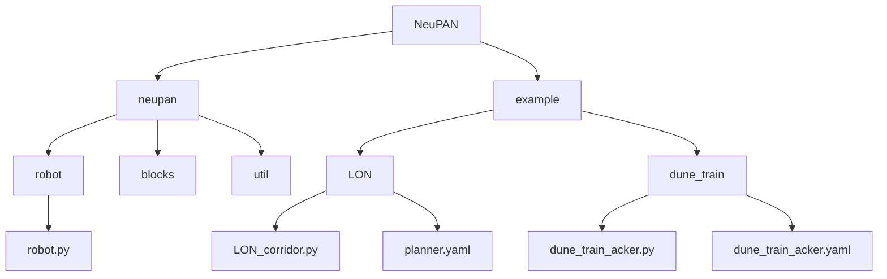
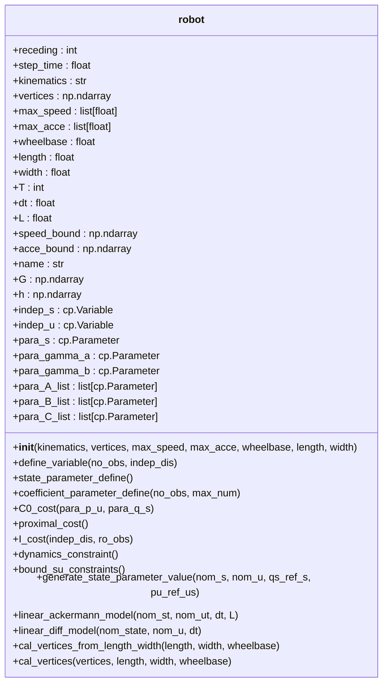
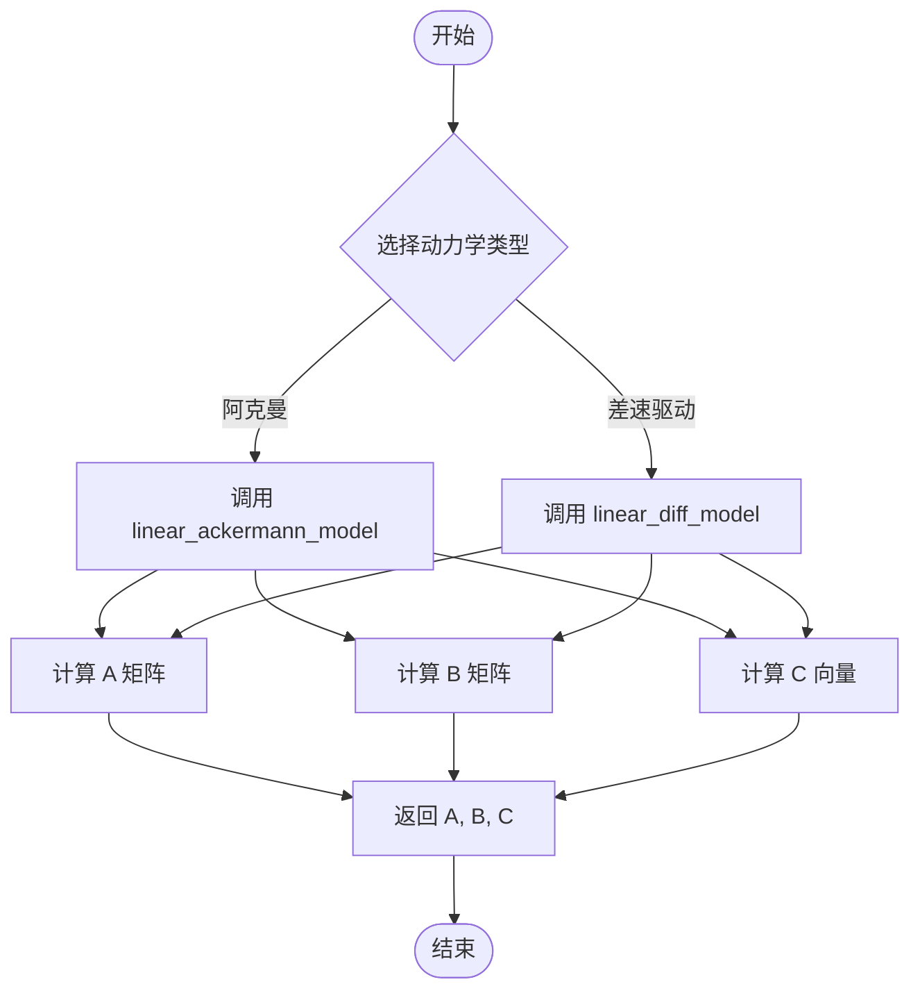
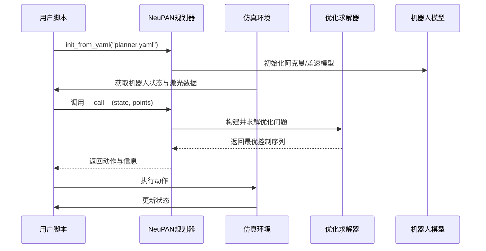

# 机器人模型集成

<cite>
**本文档中引用的文件**  
- [robot.py](file://NeuPAN/neupan/robot/robot.py)
- [LON_corridor.py](file://NeuPAN/example/LON/LON_corridor.py)
- [dune_train_acker.py](file://NeuPAN/example/dune_train/dune_train_acker.py)
- [planner.yaml](file://NeuPAN/example/LON/planner.yaml)
- [dune_train_acker.yaml](file://NeuPAN/example/dune_train/dune_train_acker.yaml)
</cite>

## 目录
1. [引言](#引言)
2. [项目结构](#项目结构)
3. [核心组件](#核心组件)
4. [机器人模型设计](#机器人模型设计)
5. [动力学模型实现](#动力学模型实现)
6. [与NeuPAN规划框架的集成](#与neupan规划框架的集成)
7. [示例配置与仿真应用](#示例配置与仿真应用)
8. [自定义机器人模型指南](#自定义机器人模型指南)
9. [数据交互与耦合机制](#数据交互与耦合机制)
10. [结论](#结论)

## 引言
本文档旨在详细介绍NeuPAN规划框架中机器人模型的集成方法，重点分析`robot.py`模块的设计原理与使用方式。通过解析阿克曼转向（acker）和差速驱动（diff）两类典型机器人的动力学建模过程，展示如何将这些模型无缝集成至NeuPAN神经规划系统中。文档结合`LON_corridor.py`和`dune_train_acker.py`等示例脚本，说明具体机器人的配置流程及其在仿真环境中的实际应用。同时，阐述机器人模型与神经规划器之间的数据交互格式与耦合机制，并为用户提供建立自定义机器人模型的完整步骤指导，涵盖状态空间定义、控制输入约束及运动学方程实现等内容。

## 项目结构
NeuPAN项目的目录结构清晰地划分了功能模块与示例配置。核心机器人模型定义位于`neupan/robot/`目录下的`robot.py`文件中，负责处理不同类型的机器人动力学建模与优化约束生成。示例脚本存放在`example/`目录下，包括走廊导航（LON）、沙丘训练（dune_train）等多种场景，每个子目录包含具体的Python脚本和YAML配置文件，用于定义机器人参数、规划器设置和训练策略。



**图示来源**  
- [robot.py](file://NeuPAN/neupan/robot/robot.py)
- [LON_corridor.py](file://NeuPAN/example/LON/LON_corridor.py)
- [dune_train_acker.py](file://NeuPAN/example/dune_train/dune_train_acker.py)

**本节来源**  
- [robot.py](file://NeuPAN/neupan/robot/robot.py)
- [LON_corridor.py](file://NeuPAN/example/LON/LON_corridor.py)
- [dune_train_acker.py](file://NeuPAN/example/dune_train/dune_train_acker.py)

## 核心组件
NeuPAN框架的核心组件包括机器人模型模块、规划器引擎和训练接口。其中，`robot.py`是机器人建模的核心，封装了阿克曼和差速驱动机器人的运动学模型、状态变量定义、约束生成以及成本函数构建等功能。该模块通过线性化非线性动力学方程，支持在优化问题中高效求解轨迹规划任务。

**本节来源**  
- [robot.py](file://NeuPAN/neupan/robot/robot.py)

## 机器人模型设计
`robot.py`模块通过类`robot`实现通用机器人建模接口，支持多种运动学类型（如`acker`和`diff`）。类初始化时需指定`kinematics`参数以选择动力学模型，并可选地提供机器人几何尺寸（长度、宽度、轴距）或顶点坐标来定义其形状。

### 状态与控制变量
机器人状态向量为三维：\[x, y, \theta\]，分别表示位置和航向角；控制输入为二维：\[v, \delta\] 或 \[v, \omega\]，对应线速度与转向角或角速度。

### 几何建模
若未提供顶点列表，则根据`length`、`width`和`wheelbase`自动生成矩形轮廓顶点，用于碰撞检测与不等式约束生成。顶点通过`cal_vertices_from_length_width`方法计算，并转换为半平面表示（Gx ≤ h）用于优化约束。



**图示来源**  
- [robot.py](file://NeuPAN/neupan/robot/robot.py#L1-L350)

**本节来源**  
- [robot.py](file://NeuPAN/neupan/robot/robot.py#L1-L350)

## 动力学模型实现
`robot.py`实现了两种主流移动机器人动力学模型：阿克曼转向模型与差速驱动模型。两者均基于非完整约束下的运动学方程，并通过泰勒展开进行线性化处理，以便在优化中使用。

### 阿克曼转向模型
适用于前轮转向车辆，其状态转移方程如下：
\[
\begin{cases}
\dot{x} = v \cos(\theta) \\
\dot{y} = v \sin(\theta) \\
\dot{\theta} = \frac{v}{L} \tan(\delta)
\end{cases}
\]
其中 \(L\) 为轴距，\(\delta\) 为前轮转角。代码中通过`linear_ackermann_model`方法对名义轨迹点进行雅可比线性化，生成状态转移矩阵A、B和偏置项C。

### 差速驱动模型
适用于两轮差速机器人，其状态转移方程为：
\[
\begin{cases}
\dot{x} = v \cos(\theta) \\
\dot{y} = v \sin(\theta) \\
\dot{\theta} = \omega
\end{cases}
\]
其中 \(\omega\) 为角速度。`linear_diff_model`方法同样进行线性化处理，简化了控制输入对状态的影响。



**图示来源**  
- [robot.py](file://NeuPAN/neupan/robot/robot.py#L250-L320)

**本节来源**  
- [robot.py](file://NeuPAN/neupan/robot/robot.py#L250-L320)

## 与NeuPAN规划框架的集成
机器人模型通过`neupan.init_from_yaml`接口加载YAML配置文件，自动实例化相应类型的机器人对象并初始化规划器。规划器利用机器人模型提供的线性化动力学约束、状态边界和成本函数，构建凸优化问题求解局部轨迹。

### 优化变量与参数
- **独立变量**：状态序列 `indep_s` 和控制序列 `indep_u`
- **参数化参考轨迹**：`para_gamma_a`（状态参考）、`para_gamma_b`（速度参考）
- **线性化系数**：`para_A_list`, `para_B_list`, `para_C_list` 来自名义轨迹的雅可比矩阵

### 成本函数构成
- **C0_cost**：跟踪误差成本，包含状态与速度偏差
- **proximal_cost**：近端项，保证迭代收敛性
- **I_cost**：障碍物规避成本，基于点云距离函数

**本节来源**  
- [robot.py](file://NeuPAN/neupan/robot/robot.py#L100-L200)
- [planner.yaml](file://NeuPAN/example/LON/planner.yaml)

## 示例配置与仿真应用
### LON_corridor 示例
`LON_corridor.py`演示了差速驱动机器人在走廊环境中的导航训练过程。通过IRSIM仿真器获取激光雷达扫描数据，转换为点云输入至NeuPAN规划器。损失函数结合距离损失与轨迹跟踪误差，使用PyTorch进行端到端训练。

### dune_train_acker 示例
`dune_train_acker.py`展示了阿克曼转向车辆的训练流程。配置文件`dune_train_acker.yaml`定义了机器人参数（长4.6m、宽1.6m、轴距3m），并通过`train_dune()`方法启动大规模数据生成与模型训练。



**图示来源**  
- [LON_corridor.py](file://NeuPAN/example/LON/LON_corridor.py)
- [dune_train_acker.py](file://NeuPAN/example/dune_train/dune_train_acker.py)

**本节来源**  
- [LON_corridor.py](file://NeuPAN/example/LON/LON_corridor.py)
- [dune_train_acker.py](file://NeuPAN/example/dune_train/dune_train_acker.py)
- [dune_train_acker.yaml](file://NeuPAN/example/dune_train/dune_train_acker.yaml)

## 自定义机器人模型指南
用户可通过以下步骤创建自定义机器人模型：

1. **定义YAML配置文件**：指定`kinematics`、`length`、`width`、`wheelbase`、`max_speed`等参数。
2. **扩展robot类（可选）**：继承`robot`类并重写`linear_xxx_model`方法以支持新动力学模型。
3. **设置状态空间与约束**：确保状态维度一致，控制输入符合物理限制。
4. **验证模型有效性**：在仿真环境中测试轨迹生成与避障能力。

示例配置片段：
```yaml
robot:
  kinematics: 'acker'
  length: 4.6
  width: 1.6
  wheelbase: 3
  max_speed: [10, 1.0]
  max_acce: [5, 2]
```

**本节来源**  
- [robot.py](file://NeuPAN/neupan/robot/robot.py)
- [dune_train_acker.yaml](file://NeuPAN/example/dune_train/dune_train_acker.yaml)

## 数据交互与耦合机制
机器人模型与NeuPAN规划器之间通过张量（Tensor）和CVXPY变量进行数据交换。规划器接收机器人当前状态与环境点云，调用`scan_to_point`方法处理传感器数据，并将优化结果以动作形式反馈给仿真器。

关键数据流包括：
- **输入**：`robot_state`（3维）、`lidar_scan`（N×2点云）
- **中间表示**：`state_tensor`, `vel_tensor`, `distance_tensor`
- **输出**：`action`（v, δ或v, ω）

耦合方式采用**交替最小化框架**（Proximal Alternating Minimization），在每次迭代中固定部分变量优化另一部分，提升求解稳定性。

**本节来源**  
- [robot.py](file://NeuPAN/neupan/robot/robot.py)
- [LON_corridor.py](file://NeuPAN/example/LON/LON_corridor.py)

## 结论
本文档系统性地介绍了NeuPAN框架中机器人模型的集成方法，涵盖从基础建模、动力学实现到实际应用的全过程。通过`robot.py`模块，用户可以灵活定义阿克曼或差速驱动机器人，并通过YAML配置快速部署于各类仿真场景。结合示例脚本，展示了完整的训练与推理流程，为开发自定义机器人模型提供了清晰的技术路径。