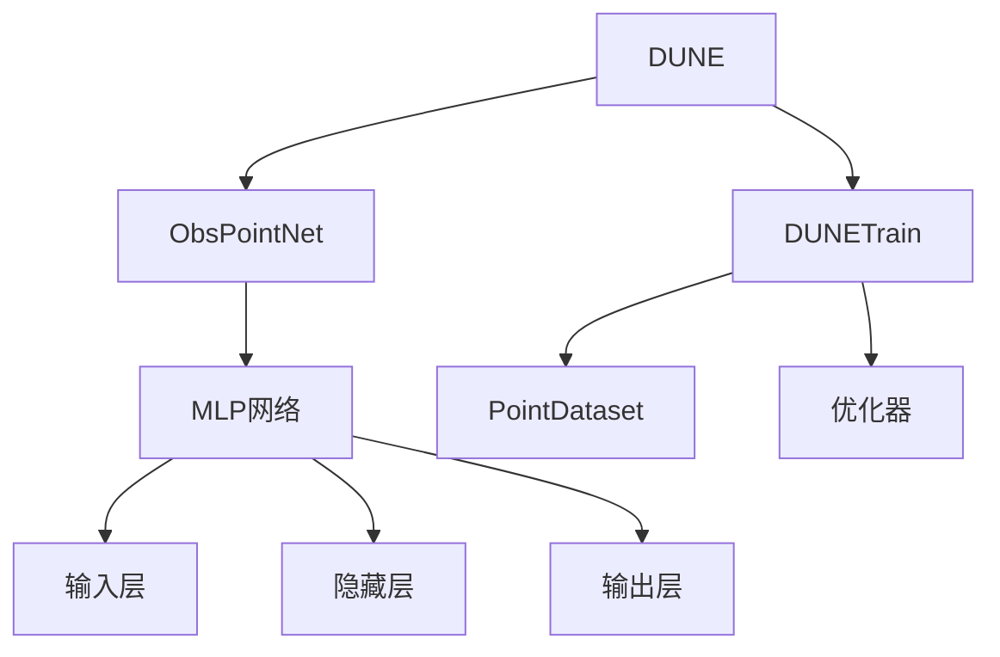
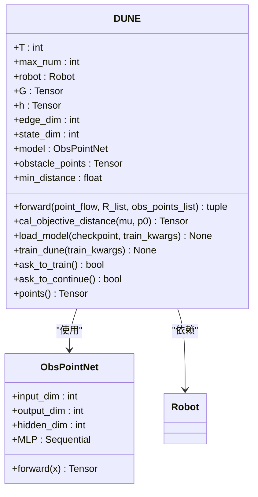
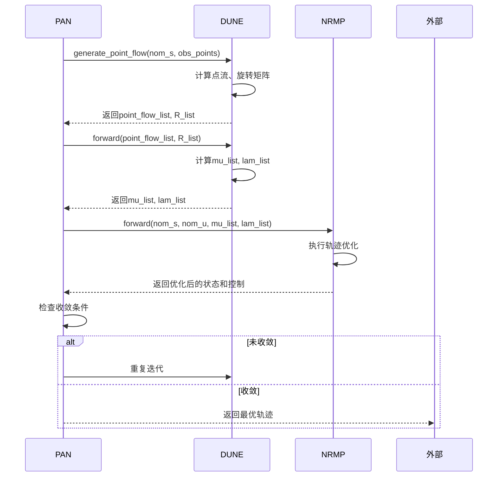
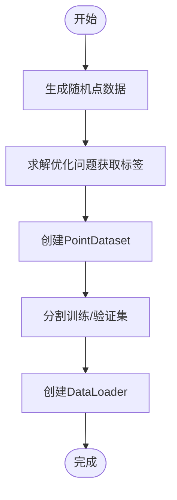
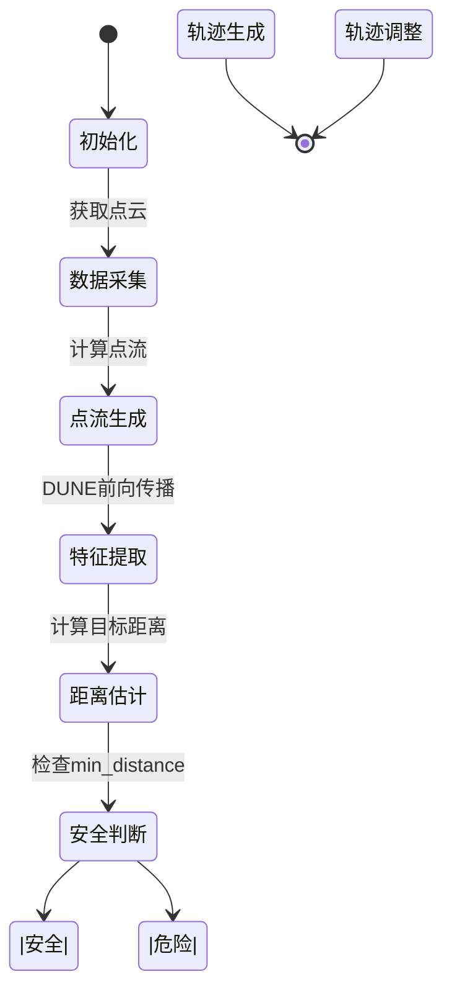

# DUNE深度不确定性感知导航引擎

<cite>
**本文档引用文件**   
- [dune.py](file://NeuPAN/neupan/blocks/dune.py)
- [dune_train.py](file://NeuPAN/neupan/blocks/dune_train.py)
- [pan.py](file://NeuPAN/neupan/blocks/pan.py)
- [robot.py](file://NeuPAN/neupan/robot/robot.py)
- [obs_point_net.py](file://NeuPAN/neupan/blocks/obs_point_net.py)
</cite>

## 目录
1. [引言](#引言)
2. [DUNE架构概述](#dune架构概述)
3. [不确定性量化机制](#不确定性量化机制)
4. [DUNE与PAN协同工作原理](#dune与pan协同工作原理)
5. [训练流程指南](#训练流程指南)
6. [动态环境中的安全性提升](#动态环境中的安全性提升)
7. [结论](#结论)

## 引言
DUNE（Deep Uncertainty-aware Navigation Engine）是NeuPAN算法中的核心组件，专门用于处理导航过程中的环境不确定性。该引擎通过将点云流映射到潜在距离空间，实现了对障碍物距离特征的精确估计。DUNE与PAN（Proximal Alternating-minimization Network）协同工作，能够在复杂动态环境中生成更加鲁棒的轨迹。本文档详细阐述DUNE的概率模型、不确定性估计机制、训练流程以及在动态环境中的安全性能。

**Section sources**
- [dune.py](file://NeuPAN/neupan/blocks/dune.py#L1-L36)
- [pan.py](file://NeuPAN/neupan/blocks/pan.py#L1-L36)

## DUNE架构概述
DUNE架构由多个关键组件构成，包括ObsPointNet神经网络、DUNE核心类和DUNETrain训练类。ObsPointNet负责将障碍物点映射到潜在距离特征空间，DUNE类实现前向传播和不确定性估计，而DUNETrain类则负责模型的训练过程。



**Diagram sources**
- [dune.py](file://NeuPAN/neupan/blocks/dune.py#L1-L252)
- [dune_train.py](file://NeuPAN/neupan/blocks/dune_train.py#L1-L545)
- [obs_point_net.py](file://NeuPAN/neupan/blocks/obs_point_net.py#L1-L73)

**Section sources**
- [dune.py](file://NeuPAN/neupan/blocks/dune.py#L1-L252)
- [dune_train.py](file://NeuPAN/neupan/blocks/dune_train.py#L1-L545)

## 不确定性量化机制
DUNE通过ObsPointNet神经网络实现不确定性量化。该网络将每个障碍物点映射到潜在距离特征μ，然后通过旋转矩阵R和机器人几何参数G、h计算λ特征。不确定性估计的核心在于目标距离的计算和点的排序。



**Diagram sources**
- [dune.py](file://NeuPAN/neupan/blocks/dune.py#L20-L252)
- [obs_point_net.py](file://NeuPAN/neupan/blocks/obs_point_net.py#L1-L73)
- [robot.py](file://NeuPAN/neupan/robot/robot.py#L1-L350)

**Section sources**
- [dune.py](file://NeuPAN/neupan/blocks/dune.py#L100-L252)
- [obs_point_net.py](file://NeuPAN/neupan/blocks/obs_point_net.py#L1-L73)

## DUNE与PAN协同工作原理
DUNE与PAN通过迭代优化过程协同工作。PAN框架包含NRMP和DUNE两个主要组件，通过交替最小化实现优化。DUNE负责生成潜在距离特征，而NRMP则利用这些特征进行轨迹优化。



**Diagram sources**
- [pan.py](file://NeuPAN/neupan/blocks/pan.py#L1-L273)
- [dune.py](file://NeuPAN/neupan/blocks/dune.py#L1-L252)
- [dune_train.py](file://NeuPAN/neupan/blocks/dune_train.py#L1-L545)

**Section sources**
- [pan.py](file://NeuPAN/neupan/blocks/pan.py#L50-L273)
- [dune.py](file://NeuPAN/neupan/blocks/dune.py#L50-L252)

## 训练流程指南
DUNE的训练流程包括数据准备、损失函数设计、不确定性校准和训练监控等关键步骤。训练过程通过DUNETrain类实现，确保模型能够准确学习障碍物距离特征。

### 数据准备
训练数据通过随机采样生成，覆盖指定范围内的点云数据。每个数据样本包括输入点坐标、标签μ值和距离值。



**Diagram sources**
- [dune_train.py](file://NeuPAN/neupan/blocks/dune_train.py#L100-L200)

### 损失函数设计
DUNE采用复合损失函数，包括μ损失、距离损失、fa损失和fb损失四个部分，确保模型学习到正确的距离特征和变换关系。

```mermaid
graph TD
A[总损失] --> B[μ损失]
A --> C[距离损失]
A --> D[fa损失]
A --> E[fb损失]
B --> F[MSE(输出μ, 标签μ)]
C --> G[MSE(输出距离, 标签距离)]
D --> H[MSE(λ^T, 标签λ^T)]
E --> I[MSE(λ^T*p + μ^T*h, 标签值)]
```

**Diagram sources**
- [dune_train.py](file://NeuPAN/neupan/blocks/dune_train.py#L300-L400)

### 训练过程监控
训练过程通过Rich库提供实时进度监控，包括损失值、学习率等关键指标。训练结果保存在指定路径，便于后续分析和使用。

**Section sources**
- [dune_train.py](file://NeuPAN/neupan/blocks/dune_train.py#L200-L545)
- [dune.py](file://NeuPAN/neupan/blocks/dune.py#L173-L252)

## 动态环境中的安全性提升
在动态或感知不完美的环境中，DUNE通过实时更新障碍物点流和距离估计，显著提升了系统的安全性。最小距离属性提供了关键的安全指标，用于判断碰撞风险。



**Diagram sources**
- [pan.py](file://NeuPAN/neupan/blocks/pan.py#L240-L271)
- [dune.py](file://NeuPAN/neupan/blocks/dune.py#L150-L170)

**Section sources**
- [pan.py](file://NeuPAN/neupan/blocks/pan.py#L240-L271)
- [dune.py](file://NeuPAN/neupan/blocks/dune.py#L150-L170)

## 结论
DUNE深度不确定性感知导航引擎通过创新的概率模型和不确定性估计机制，有效解决了复杂环境中的导航挑战。与PAN框架的协同工作实现了鲁棒的轨迹生成，而完整的训练流程确保了模型的准确性和可靠性。在动态环境中，DUNE显著提升了系统的安全性，为自动驾驶和机器人导航提供了强有力的技术支持。