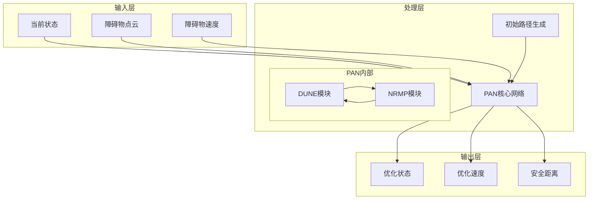
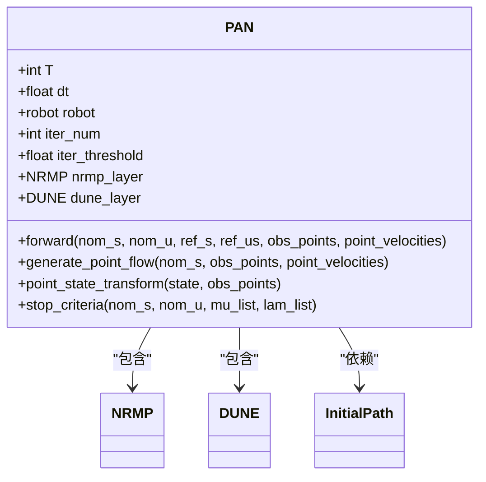
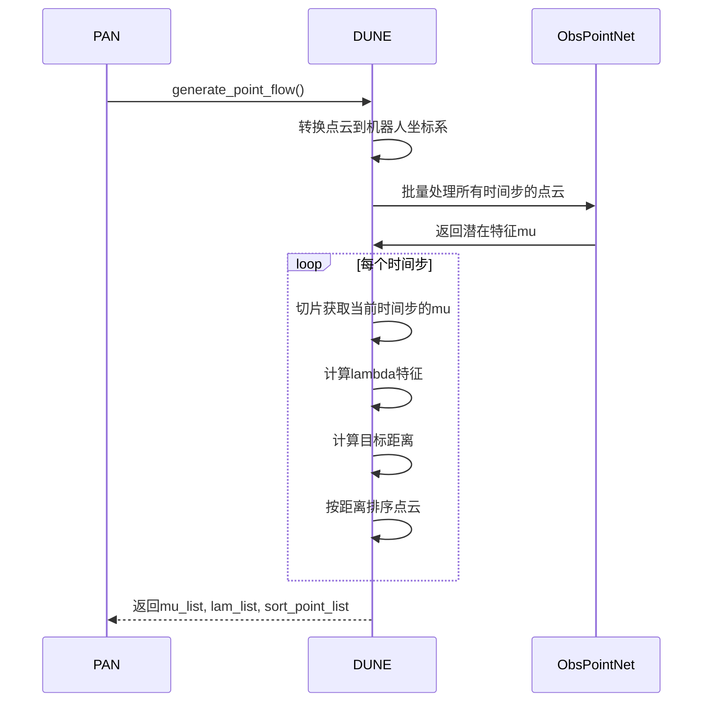
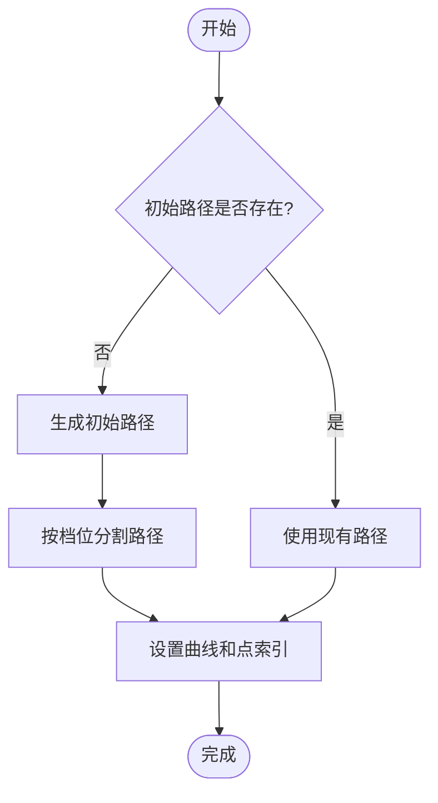
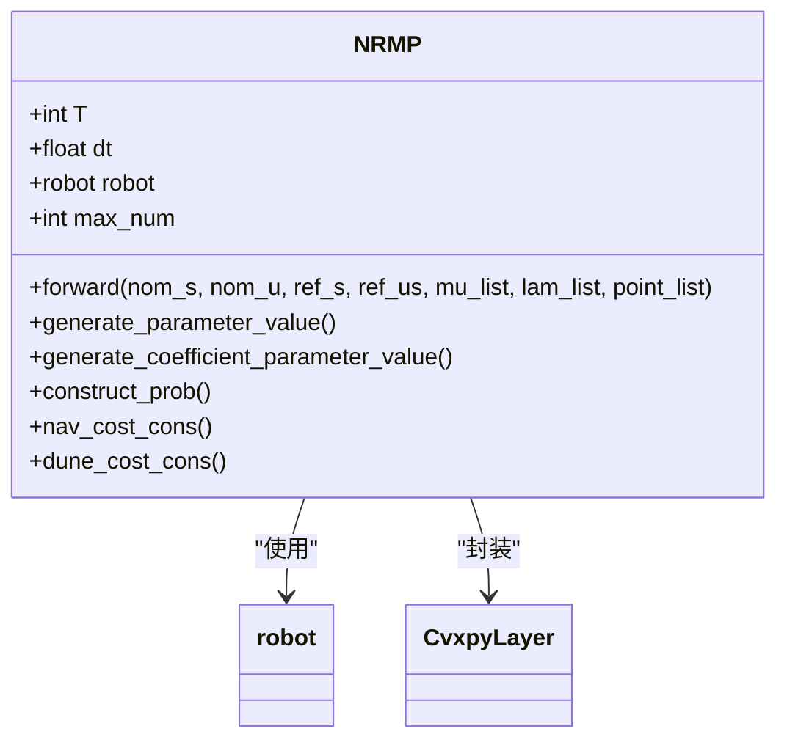
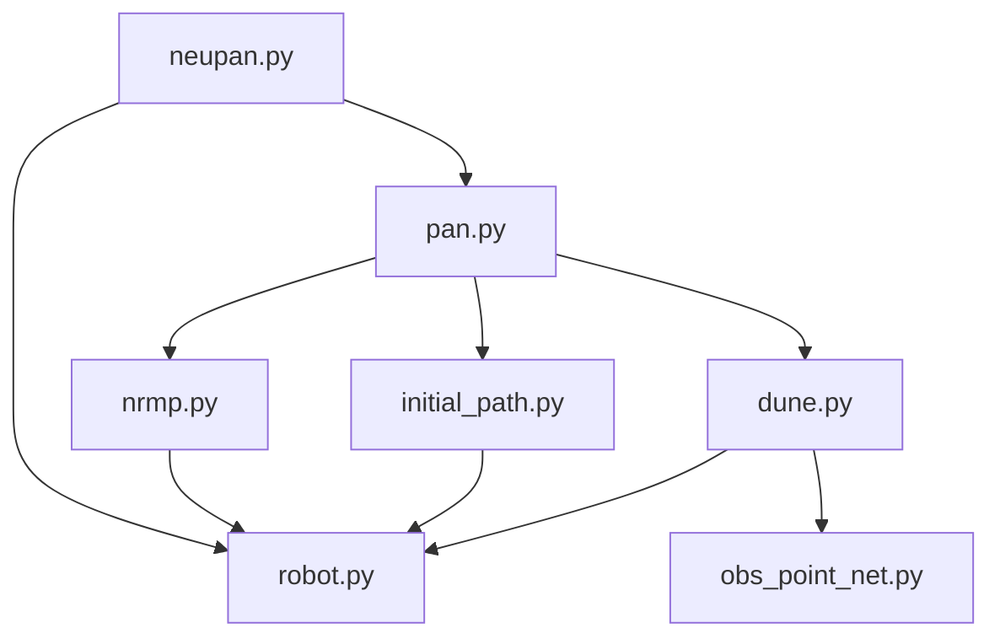

# PAN路径规划注意力网络

<cite>
**本文档引用的文件**   
- [pan.py](file://NeuPAN/neupan/blocks/pan.py)
- [dune.py](file://NeuPAN/neupan/blocks/dune.py)
- [nrmp.py](file://NeuPAN/neupan/blocks/nrmp.py)
- [initial_path.py](file://NeuPAN/neupan/blocks/initial_path.py)
- [neupan.py](file://NeuPAN/neupan/neupan.py)
- [robot.py](file://NeuPAN/neupan/robot/robot.py)
- [obs_point_net.py](file://NeuPAN/neupan/blocks/obs_point_net.py)
</cite>

## 目录
1. [项目结构](#项目结构)
2. [核心组件](#核心组件)
3. [架构概述](#架构概述)
4. [详细组件分析](#详细组件分析)
5. [依赖分析](#依赖分析)
6. [性能考虑](#性能考虑)
7. [故障排除指南](#故障排除指南)
8. [结论](#结论)

## 项目结构

NeuPAN项目采用模块化设计，主要包含路径规划、机器人模型和工具函数等核心模块。项目结构清晰，各模块职责分明。

```mermaid
graph TD
subgraph "NeuPAN"
subgraph "blocks"
pan[pan.py]
dune[dune.py]
nrmp[nrmp.py]
initial_path[initial_path.py]
obs_point_net[obs_point_net.py]
end
subgraph "robot"
robot[robot.py]
end
neupan[neupan.py]
end
```

**图源**
- [pan.py](file://NeuPAN/neupan/blocks/pan.py)
- [dune.py](file://NeuPAN/neupan/blocks/dune.py)
- [nrmp.py](file://NeuPAN/neupan/blocks/nrmp.py)
- [initial_path.py](file://NeuPAN/neupan/blocks/initial_path.py)
- [neupan.py](file://NeuPAN/neupan/neupan.py)
- [robot.py](file://NeuPAN/neupan/robot/robot.py)

**章节源**
- [pan.py](file://NeuPAN/neupan/blocks/pan.py)
- [dune.py](file://NeuPAN/neupan/blocks/dune.py)
- [nrmp.py](file://NeuPAN/neupan/blocks/nrmp.py)

## 核心组件

PAN（Path Planning Attention Network）是NeuPAN算法的核心，采用交替最小化网络架构，结合NRMP和DUNE模块解决多点碰撞规避优化问题。系统通过初始路径生成、环境感知和优化求解三个主要阶段完成路径规划。

**章节源**
- [pan.py](file://NeuPAN/neupan/blocks/pan.py#L1-L50)
- [neupan.py](file://NeuPAN/neupan/neupan.py#L1-L50)
- [initial_path.py](file://NeuPAN/neupan/blocks/initial_path.py#L1-L50)

## 架构概述

PAN路径规划系统采用编码器-解码器架构，通过注意力机制处理环境观测并生成路径点。系统整体架构包含多个协同工作的组件，实现从环境感知到路径优化的完整流程。



**图源**
- [pan.py](file://NeuPAN/neupan/blocks/pan.py#L1-L50)
- [neupan.py](file://NeuPAN/neupan/neupan.py#L1-L50)
- [dune.py](file://NeuPAN/neupan/blocks/dune.py#L1-L50)
- [nrmp.py](file://NeuPAN/neupan/blocks/nrmp.py#L1-L50)

## 详细组件分析

### PAN核心网络分析

PAN类作为路径规划的核心，实现了交替最小化算法，通过迭代优化生成安全路径。网络采用编码器-解码器架构，结合注意力机制处理环境观测。



**图源**
- [pan.py](file://NeuPAN/neupan/blocks/pan.py#L1-L272)

**章节源**
- [pan.py](file://NeuPAN/neupan/blocks/pan.py#L1-L272)

### 注意力机制实现

DUNE（Deep Unfolded Neural Encoder）模块实现了注意力机制的核心功能，将障碍物点云映射到潜在距离特征空间，生成注意力权重。



**图源**
- [dune.py](file://NeuPAN/neupan/blocks/dune.py#L1-L251)
- [obs_point_net.py](file://NeuPAN/neupan/blocks/obs_point_net.py#L1-L72)

**章节源**
- [dune.py](file://NeuPAN/neupan/blocks/dune.py#L1-L251)
- [obs_point_net.py](file://NeuPAN/neupan/blocks/obs_point_net.py#L1-L72)

### 初始路径生成

InitialPath类负责从给定航点生成初始路径，为PAN网络提供参考轨迹。该模块支持多种曲线样式和路径循环功能。



**图源**
- [initial_path.py](file://NeuPAN/neupan/blocks/initial_path.py#L1-L483)

**章节源**
- [initial_path.py](file://NeuPAN/neupan/blocks/initial_path.py#L1-L483)

### 优化求解器

NRMP（Neural Regularized Motion Planner）模块作为优化求解器，集成神经潜在距离空间，生成最优控制序列。该模块基于凸优化框架实现。



**图源**
- [nrmp.py](file://NeuPAN/neupan/blocks/nrmp.py#L1-L325)

**章节源**
- [nrmp.py](file://NeuPAN/neupan/blocks/nrmp.py#L1-L325)

## 依赖分析

PAN系统各组件之间存在复杂的依赖关系，形成了一个协同工作的整体。理解这些依赖关系对于系统调试和优化至关重要。



**图源**
- [neupan.py](file://NeuPAN/neupan/neupan.py#L1-L402)
- [pan.py](file://NeuPAN/neupan/blocks/pan.py#L1-L272)
- [nrmp.py](file://NeuPAN/neupan/blocks/nrmp.py#L1-L325)
- [dune.py](file://NeuPAN/neupan/blocks/dune.py#L1-L251)
- [initial_path.py](file://NeuPAN/neupan/blocks/initial_path.py#L1-L483)
- [robot.py](file://NeuPAN/neupan/robot/robot.py#L1-L349)

**章节源**
- [neupan.py](file://NeuPAN/neupan/neupan.py#L1-L402)
- [pan.py](file://NeuPAN/neupan/blocks/pan.py#L1-L272)
- [nrmp.py](file://NeuPAN/neupan/blocks/nrmp.py#L1-L325)

## 性能考虑

PAN系统在设计时考虑了多个性能优化方面，包括计算效率、内存使用和实时性要求。系统通过多种机制确保在复杂环境中的高效运行。

1. **点云降采样**: 当障碍物点云数量超过设定阈值时，系统自动进行降采样处理
2. **无梯度推理**: DUNE模块在前向传播时使用`torch.no_grad()`上下文管理器
3. **迭代收敛**: 系统通过`stop_criteria`方法判断迭代收敛，避免不必要的计算
4. **批量处理**: 系统将所有时间步的点云合并后一次性处理，提高计算效率

**章节源**
- [pan.py](file://NeuPAN/neupan/blocks/pan.py#L100-L120)
- [dune.py](file://NeuPAN/neupan/blocks/dune.py#L60-L80)

## 故障排除指南

在使用PAN系统时可能遇到一些常见问题，以下提供相应的解决方案。

**章节源**
- [dune.py](file://NeuPAN/neupan/blocks/dune.py#L200-L250)
- [neupan.py](file://NeuPAN/neupan/neupan.py#L300-L350)

### 模型检查点问题

当系统无法找到DUNE模型检查点时，会提示用户选择是否立即训练模型：

```python
def ask_to_train(self):
    while True:
        choice = input("Do not find the DUNE model; Do you want to train the model now, input Y or N:").upper()
        if choice == 'Y':
            return True
        elif choice == 'N':
            print('Please set the your model path for the DUNE layer.')
            sys.exit()
        else:
            print("Wrong input, Please input Y or N.")
```

### 碰撞检测

系统通过`min_distance`属性和`collision_threshold`参数实现碰撞检测：

```python
def check_stop(self):
    return self.min_distance < self.collision_threshold
```

## 结论

PAN路径规划注意力网络通过创新的编码器-解码器架构和注意力机制，实现了高效、安全的路径规划。系统将深度学习与传统优化方法相结合，在复杂动态环境中表现出色。通过合理调整超参数，系统可适应不同场景的需求，为自动驾驶和机器人导航提供了可靠的解决方案。