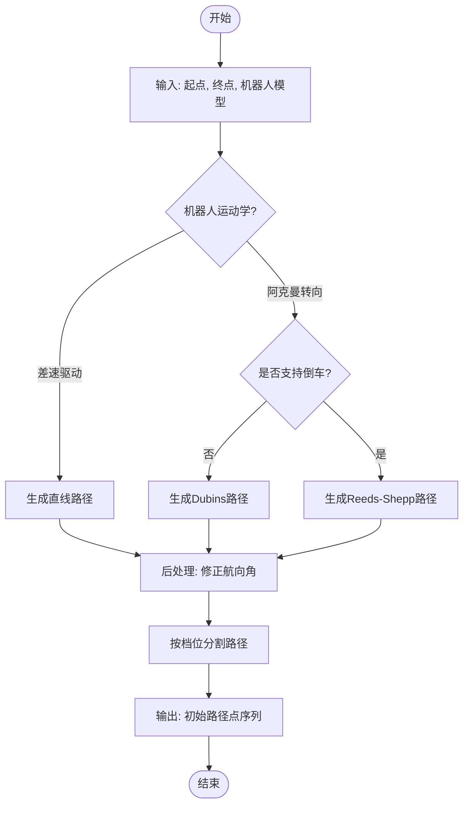
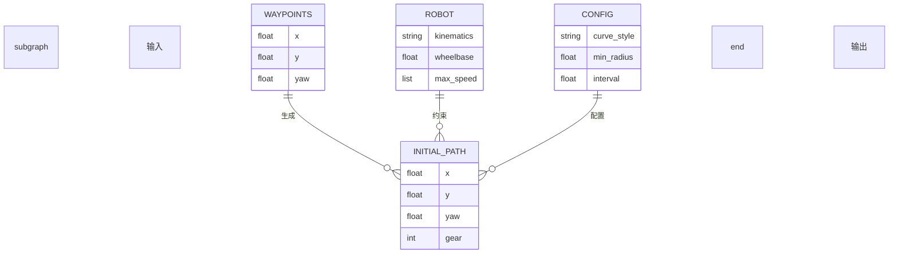

# 初始路径生成器

<cite>
**本文档中引用的文件**  
- [initial_path.py](file://NeuPAN/neupan/blocks/initial_path.py)
- [pan.py](file://NeuPAN/neupan/blocks/pan.py)
- [dune.py](file://NeuPAN/neupan/blocks/dune.py)
- [README.md](file://NeuPAN/README.md)
</cite>

## 目录
1. [简介](#简介)
2. [核心功能与作用](#核心功能与作用)
3. [算法实现与路径生成策略](#算法实现与路径生成策略)
4. [输入与输出格式](#输入与输出格式)
5. [与NeuPAN两阶段优化流程的集成](#与neupan两阶段优化流程的集成)
6. [高质量初始路径的重要性](#高质量初始路径的重要性)
7. [参数配置与灵活性](#参数配置与灵活性)
8. [与其他全局规划器的集成](#与其他全局规划器的集成)

## 简介

`initial_path.py` 是 NeuPAN（Neural Proximal Alternating-minimization Network）两阶段规划框架中的关键模块，负责生成一个粗糙但可行的初始轨迹。该模块作为整个规划流程的起点，为后续基于神经网络的精细化优化（PAN 和 DUNE）提供初始猜测。其设计旨在快速生成一条从起点到终点的基本路径，而不考虑环境中的障碍物，从而确保后续优化过程有一个合理的初始解。

该模块通过 `InitialPath` 类实现，能够根据机器人的运动学模型（差速驱动或阿克曼转向）和给定的路点（waypoints）生成不同风格的初始路径。其生成的路径不仅包含空间坐标，还包含姿态角和档位信息，为后续的实时优化提供了完整的初始状态序列。

**Section sources**
- [initial_path.py](file://NeuPAN/neupan/blocks/initial_path.py#L1-L50)

## 核心功能与作用

`InitialPath` 模块在 NeuPAN 架构中扮演着“粗规划”或“初始猜测生成器”的角色。其主要功能是为复杂的非线性优化问题提供一个高质量的初始解。在 NeuPAN 的两阶段规划流程中，第一阶段由 `InitialPath` 完成，它快速生成一条从当前状态到目标状态的可行路径。第二阶段则由 PAN（Proximal Alternating-minimization Network）和 DUNE（Deep Unfolded Neural Encoder）模块完成，它们以第一阶段生成的路径为起点，结合实时感知的障碍物点云数据，进行精细化的实时优化，最终输出安全、平滑且符合动力学约束的控制指令。

这种两阶段设计的优势在于，它将计算密集型的全局路径搜索与实时优化分离。`InitialPath` 模块的计算开销极低，可以快速响应目标点的变化；而 PAN 和 DUNE 模块则专注于在局部范围内进行高精度的避障和轨迹优化。通过提供一个合理的初始路径，`InitialPath` 模块显著降低了后续优化过程的搜索空间，从而加速了神经网络的收敛速度，并提高了最终轨迹的全局最优性。

**Section sources**
- [initial_path.py](file://NeuPAN/neupan/blocks/initial_path.py#L51-L100)
- [pan.py](file://NeuPAN/neupan/blocks/pan.py#L1-L20)

## 算法实现与路径生成策略

`InitialPath` 模块的核心是 `curve_generator`，它根据配置的 `curve_style` 参数采用不同的几何方法生成初始路径。具体策略如下：

- **直线路径 (line)**：对于差速驱动机器人，模块会直接在相邻路点之间生成直线段。为了确保路径的平滑性，模块内部实现了 `_ensure_consistent_angles` 方法，用于计算并修正路径点上的航向角，使其与行进方向一致。
- **Dubins 路径**：对于仅支持前进的阿克曼转向车辆，模块采用 Dubins 路径规划算法。该算法通过组合直线段和最小转弯半径的圆弧段，生成满足车辆最小转弯半径约束的最短路径。
- **Reeds-Shepp 路径**：对于支持前进和后退的阿克曼转向车辆（如汽车倒车入库场景），模块采用 Reeds-Shepp 路径规划算法。该算法是 Dubins 路径的扩展，允许车辆在路径中进行倒车，从而找到更短或更可行的路径。

路径生成过程由 `init_path_with_state`、`update_initial_path_from_goal` 和 `set_ipath_with_waypoints` 等方法驱动。这些方法首先将输入的路点进行预处理（如添加当前状态、处理循环路径等），然后调用 `curve_generator` 生成完整的路径点序列。生成的路径随后通过 `split_path_with_gear` 方法按档位（前进/后退）分割成多个子路径，以便在后续跟踪中进行管理。

**Diagram sources**
- [initial_path.py](file://NeuPAN/neupan/blocks/initial_path.py#L200-L300)

## 输入与输出格式

`InitialPath` 模块的输入和输出都具有明确的格式定义，确保了与 NeuPAN 框架其他部分的无缝集成。

**输入**：
- **路点 (waypoints)**：一个包含多个路点的列表，每个路点是一个包含 `[x, y, yaw]` 的列表或形状为 `(n, 3)` 的 NumPy 数组，分别表示该点的 x 坐标、y 坐标和航向角（弧度）。
- **机器人模型 (robot)**：一个包含机器人运动学参数（如 `kinematics`、`wheelbase`、`max_speed` 等）的对象，用于确定路径生成策略和约束条件。
- **配置参数**：包括 `curve_style`（路径风格）、`min_radius`（最小转弯半径）、`interval`（路径点间隔）等，这些参数通常从 YAML 配置文件中读取。

**输出**：
- **初始路径 (initial_path)**：一个列表，其中每个元素是一个形状为 `(4, 1)` 的 NumPy 数组。数组的前三个元素 `[x, y, yaw]` 表示路径点的状态，第四个元素表示档位（`1` 为前进，`-1` 为后退）。这个序列化的路径点列表直接作为 PAN 模块的初始状态猜测 `nom_s` 和初始控制猜测 `nom_u` 的输入。

**Diagram sources**
- [initial_path.py](file://NeuPAN/neupan/blocks/initial_path.py#L101-L150)

## 与NeuPAN两阶段优化流程的集成

`InitialPath` 模块与 NeuPAN 的核心优化模块 PAN 和 DUNE 紧密集成。在每次规划周期开始时，`InitialPath` 会生成或更新初始路径。PAN 模块的 `forward` 方法接收这个初始路径作为 `nom_s` 和 `nom_u` 的初始值。

DUNE 模块负责将实时感知的障碍物点云数据映射到一个低维的“潜在距离空间”（latent distance space），生成 `mu` 和 `lambda` 特征。这些特征随后被传递给 NRMP（Nonlinear Receding-horizon Model Predictive）层，作为避障约束。NRMP 层以 `InitialPath` 提供的初始猜测为基础，通过求解一个带有大量点级避障约束的优化问题，迭代地更新状态和控制序列。

`InitialPath` 生成的初始路径的质量直接影响 NRMP 层的求解效率。一个接近最优解的初始路径可以大大减少优化所需的迭代次数，从而降低计算时间，这对于实现实时规划至关重要。

**Section sources**
- [initial_path.py](file://NeuPAN/neupan/blocks/initial_path.py#L301-L350)
- [pan.py](file://NeuPAN/neupan/blocks/pan.py#L50-L100)
- [dune.py](file://NeuPAN/neupan/blocks/dune.py#L50-L100)

## 高质量初始路径的重要性

一个高质量的初始路径对于 NeuPAN 算法的整体性能至关重要，主要体现在以下两个方面：

1.  **加速神经网络收敛**：PAN 模块中的优化过程是一个迭代求解过程。如果初始猜测 `nom_s` 和 `nom_u` 远离最优解，优化器需要更多的迭代次数才能收敛，这会显著增加单步规划的计算时间。一个由 `InitialPath` 生成的、几何上合理的初始路径，为优化器提供了一个良好的起点，使其能够在更少的迭代次数内找到最优或次优解，从而保证了算法的实时性。

2.  **提高最终轨迹的全局最优性**：非线性优化问题可能存在多个局部最优解。优化器的最终解往往取决于其初始状态。一个高质量的初始路径可以将优化过程引导到一个更优的吸引域（basin of attraction），从而增加找到全局最优或高质量局部最优解的概率。例如，在一个复杂的迷宫中，一个直接指向目标的初始路径比一个绕远路的初始路径更有可能引导出一条全局最短的最终轨迹。

因此，`InitialPath` 模块虽然不进行复杂的避障计算，但其生成的“粗糙”路径的质量，是决定 NeuPAN 最终规划效果的基石。

**Section sources**
- [README.md](file://NeuPAN/README.md#L180-L200)

## 参数配置与灵活性

`InitialPath` 模块通过 YAML 配置文件提供了丰富的参数，使其具有很高的灵活性，可以适应不同的机器人和应用场景。

在 YAML 文件的 `ipath` 部分，用户可以配置以下关键参数：
- `curve_style`: 可选择 `line`、`dubins` 或 `reeds`，以匹配机器人的运动能力。
- `min_radius`: 定义了路径的最小转弯半径，应与机器人的物理特性（如轮距和最大转向角）相匹配。
- `interval`: 控制生成路径点的密度，影响路径的平滑度和后续优化的精度。
- `loop`: 用于循环路径场景，当机器人到达终点时自动重置路径。

这种基于配置的灵活性使得 `InitialPath` 模块无需修改代码即可适应多种机器人平台和任务需求。

**Section sources**
- [README.md](file://NeuPAN/README.md#L150-L180)

## 与其他全局规划器的集成

`InitialPath` 模块的设计允许其与传统的全局规划器（如 A*）无缝集成。用户可以通过 `set_initial_path` 方法，将 A* 等全局规划器生成的、考虑了静态地图信息的路径，动态地注入到 NeuPAN 框架中。

在这种集成模式下，A* 规划器负责处理全局拓扑和静态障碍物，生成一条宏观上最优的路径。`InitialPath` 模块则接收这条路径作为输入，并可能对其进行格式转换或平滑处理，然后将其作为初始猜测传递给 PAN 和 DUNE 模块。PAN 和 DUNE 模块则专注于处理动态障碍物和进行局部轨迹优化。这种结合方式充分发挥了传统规划器的全局视野和 NeuPAN 的实时避障能力，形成了一种强大的混合规划策略。

**Section sources**
- [README.md](file://NeuPAN/README.md#L210-L214)
- [initial_path.py](file://NeuPAN/neupan/blocks/initial_path.py#L400-L450)