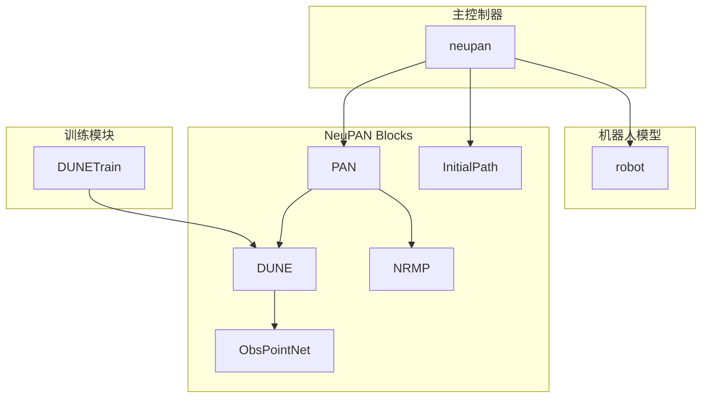
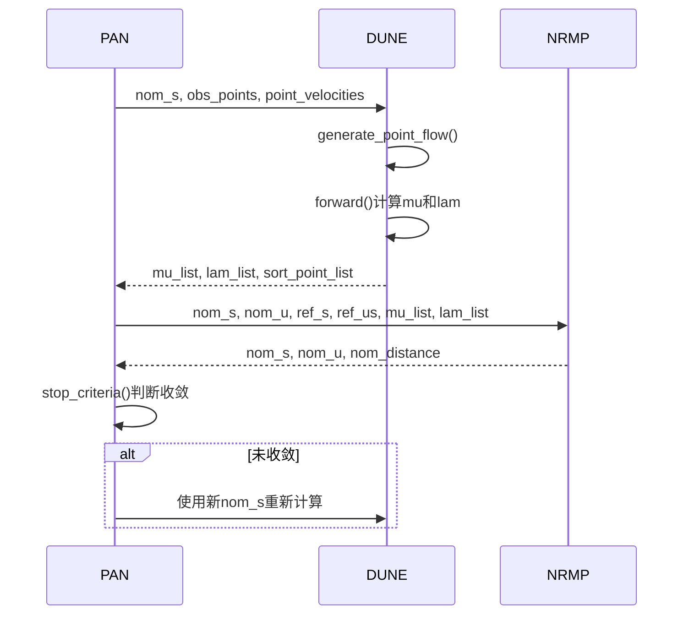
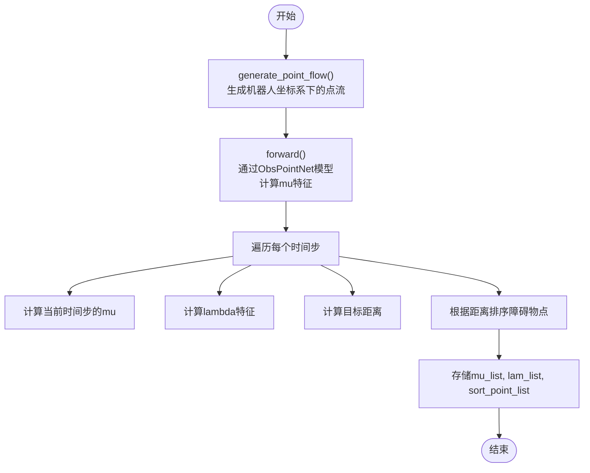
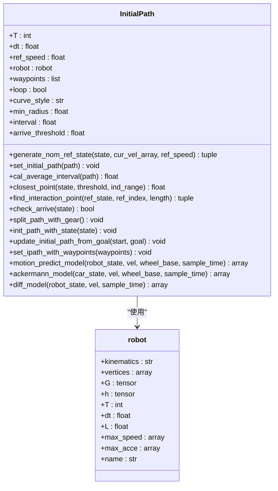
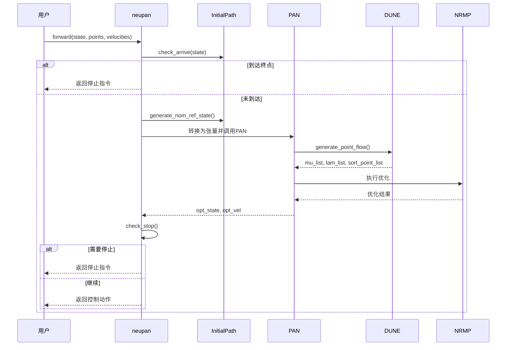
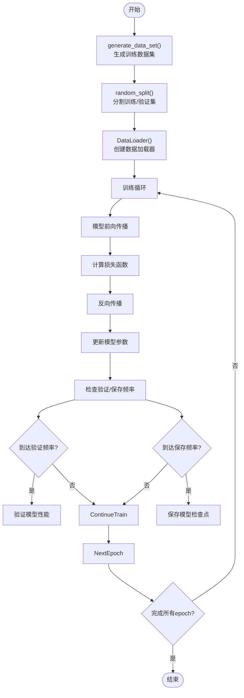

# 神经网络功能块

<cite>
**本文档中引用的文件**  
- [pan.py](file://NeuPAN/neupan/blocks/pan.py)
- [dune.py](file://NeuPAN/neupan/blocks/dune.py)
- [dune_train.py](file://NeuPAN/neupan/blocks/dune_train.py)
- [initial_path.py](file://NeuPAN/neupan/blocks/initial_path.py)
- [neupan.py](file://NeuPAN/neupan/neupan.py)
- [robot.py](file://NeuPAN/neupan/robot/robot.py)
</cite>

## 目录
1. [项目结构](#项目结构)
2. [核心组件](#核心组件)
3. [PAN注意力机制设计](#pan注意力机制设计)
4. [DUNE环境不确定性处理](#dune环境不确定性处理)
5. [初始路径生成](#初始路径生成)
6. [主控制器集成](#主控制器集成)
7. [训练数据与脚本](#训练数据与脚本)
8. [超参数调优指南](#超参数调优指南)

## 项目结构

NeuPAN项目的神经网络功能块主要位于`NeuPAN/neupan/blocks`目录下，包含PAN、DUNE、initial_path等核心组件。主控制器位于`NeuPAN/neupan/neupan.py`，机器人模型定义在`NeuPAN/neupan/robot/robot.py`。训练脚本`dune_train.py`用于训练DUNE模型。

**图源**
- [pan.py](file://NeuPAN/neupan/blocks/pan.py#L1-L272)
- [dune.py](file://NeuPAN/neupan/blocks/dune.py#L1-L251)
- [initial_path.py](file://NeuPAN/neupan/blocks/initial_path.py#L1-L483)
- [neupan.py](file://NeuPAN/neupan/neupan.py#L1-L402)
- [robot.py](file://NeuPAN/neupan/robot/robot.py#L1-L349)
- [dune_train.py](file://NeuPAN/neupan/blocks/dune_train.py#L1-L544)

**节源**
- [pan.py](file://NeuPAN/neupan/blocks/pan.py#L1-L272)
- [dune.py](file://NeuPAN/neupan/blocks/dune.py#L1-L251)
- [initial_path.py](file://NeuPAN/neupan/blocks/initial_path.py#L1-L483)
- [neupan.py](file://NeuPAN/neupan/neupan.py#L1-L402)
- [robot.py](file://NeuPAN/neupan/robot/robot.py#L1-L349)
- [dune_train.py](file://NeuPAN/neupan/blocks/dune_train.py#L1-L544)

## 核心组件

NeuPAN神经网络功能块由PAN（Path Planning Attention Network）、DUNE（Deep Uncertainty-aware Navigation Engine）和InitialPath等核心组件构成。PAN作为主优化网络，采用交替最小化框架，集成NRMP和DUNE模块，解决包含大量点级碰撞规避约束的优化问题。DUNE负责处理环境不确定性和动态障碍物，InitialPath生成初始轨迹供PAN优化。

**节源**
- [pan.py](file://NeuPAN/neupan/blocks/pan.py#L1-L272)
- [dune.py](file://NeuPAN/neupan/blocks/dune.py#L1-L251)
- [initial_path.py](file://NeuPAN/neupan/blocks/initial_path.py#L1-L483)

## PAN注意力机制设计

PAN（Path Planning Attention Network）采用交替最小化框架，通过注意力机制处理路径规划中的碰撞规避约束。其核心设计包含两个主要阶段：DUNE阶段和NRMP阶段。

**图源**
- [pan.py](file://NeuPAN/neupan/blocks/pan.py#L1-L272)
- [dune.py](file://NeuPAN/neupan/blocks/dune.py#L1-L251)

**节源**
- [pan.py](file://NeuPAN/neupan/blocks/pan.py#L1-L272)
- [dune.py](file://NeuPAN/neupan/blocks/dune.py#L1-L251)

## DUNE环境不确定性处理

DUNE（Deep Uncertainty-aware Navigation Engine）专门处理环境不确定性和动态障碍物。它通过深度展开神经编码器将点流映射到潜在距离空间，生成mu和lambda特征。

DUNE通过`cal_objective_distance`方法计算障碍物点到机器人约束边界的距离，并在`load_model`方法中实现模型加载逻辑，支持从检查点加载或直接训练。

**图源**
- [dune.py](file://NeuPAN/neupan/blocks/dune.py#L1-L251)

**节源**
- [dune.py](file://NeuPAN/neupan/blocks/dune.py#L1-L251)

## 初始路径生成

InitialPath类负责从给定航点生成初始路径，为NeuPAN提供优化起点。它支持线性和曲线路径生成，并能处理不同档位的路径段。

**图源**
- [initial_path.py](file://NeuPAN/neupan/blocks/initial_path.py#L1-L483)
- [robot.py](file://NeuPAN/neupan/robot/robot.py#L1-L349)

**节源**
- [initial_path.py](file://NeuPAN/neupan/blocks/initial_path.py#L1-L483)

## 主控制器集成

NeuPAN主控制器通过`neupan`类集成所有功能块，提供用户友好的接口。主控制器负责协调PAN、DUNE和InitialPath组件的工作流程。

**图源**
- [neupan.py](file://NeuPAN/neupan/neupan.py#L1-L402)
- [pan.py](file://NeuPAN/neupan/blocks/pan.py#L1-L272)
- [dune.py](file://NeuPAN/neupan/blocks/dune.py#L1-L251)
- [initial_path.py](file://NeuPAN/neupan/blocks/initial_path.py#L1-L483)

**节源**
- [neupan.py](file://NeuPAN/neupan/neupan.py#L1-L402)

## 训练数据与脚本

DUNE模型需要针对特定机器人几何形状进行训练，训练数据通过`DUNETrain`类生成。训练脚本`dune_train.py`实现了完整的训练流程。

训练数据格式包括输入点坐标、标签mu值和距离值。训练脚本支持通过YAML配置文件进行参数设置。

**图源**
- [dune_train.py](file://NeuPAN/neupan/blocks/dune_train.py#L1-L544)

**节源**
- [dune_train.py](file://NeuPAN/neupan/blocks/dune_train.py#L1-L544)

## 超参数调优指南

NeuPAN系统包含多个可调超参数，针对不同应用场景需要进行优化调整。

### PAN超参数
| 参数 | 描述 | 推荐值 | 调整建议 |
|------|------|--------|----------|
| receding | 预测时域步数 | 10 | 增加可提高规划质量，但增加计算成本 |
| step_time | MPC时间步长 | 0.1 | 根据传感器频率和计算能力调整 |
| iter_num | PAN迭代次数 | 2 | 增加可提高收敛性，但增加延迟 |
| iter_threshold | 收敛阈值 | 0.1 | 降低可提高精度，但可能增加迭代次数 |

### DUNE训练超参数
| 参数 | 描述 | 推荐值 | 调整建议 |
|------|------|--------|----------|
| data_size | 训练数据量 | 100000 | 增加可提高模型泛化能力 |
| batch_size | 批量大小 | 256 | 根据GPU内存调整 |
| epoch | 训练轮数 | 5000 | 监控验证损失确定最佳值 |
| lr | 学习率 | 5e-5 | 初始值，根据训练情况调整 |
| lr_decay | 学习率衰减 | 0.5 | 每decay_freq轮衰减一次 |

### NRMP调整参数
| 参数 | 描述 | 推荐值 | 调整建议 |
|------|------|--------|----------|
| eta | 碰撞规避成本权重 | 10.0 | 增加可增强避障能力 |
| d_max | 最大障碍物距离 | 1.0 | 根据传感器范围设置 |
| d_min | 最小安全距离 | 0.1 | 根据机器人尺寸设置 |
| q_s | 状态成本权重 | 1.0 | 调整轨迹平滑度 |
| p_u | 速度成本权重 | 1.0 | 调整速度跟踪性能 |

**节源**
- [pan.py](file://NeuPAN/neupan/blocks/pan.py#L1-L272)
- [dune_train.py](file://NeuPAN/neupan/blocks/dune_train.py#L1-L544)
- [neupan.py](file://NeuPAN/neupan/neupan.py#L1-L402)