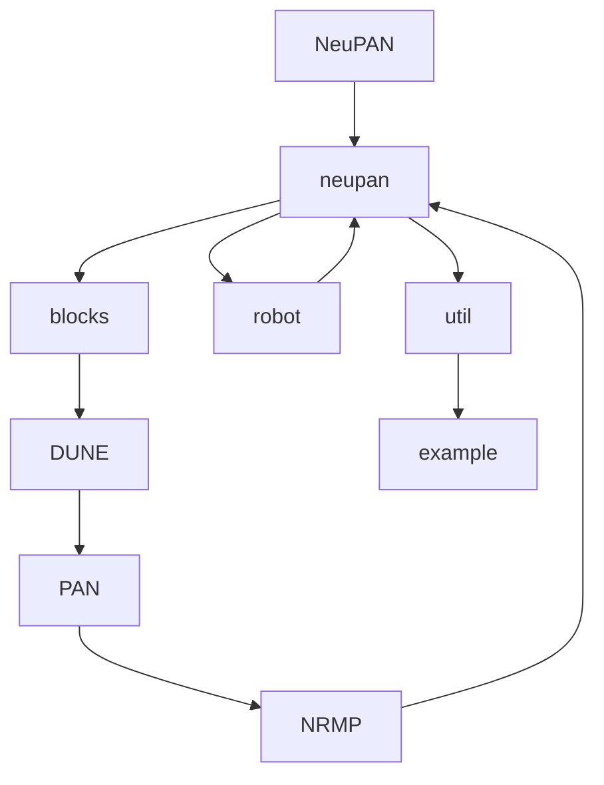
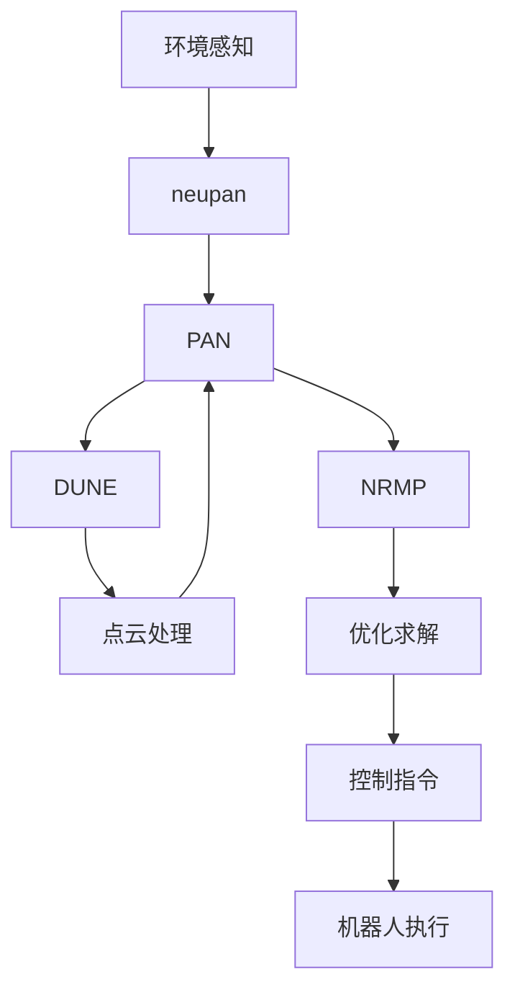
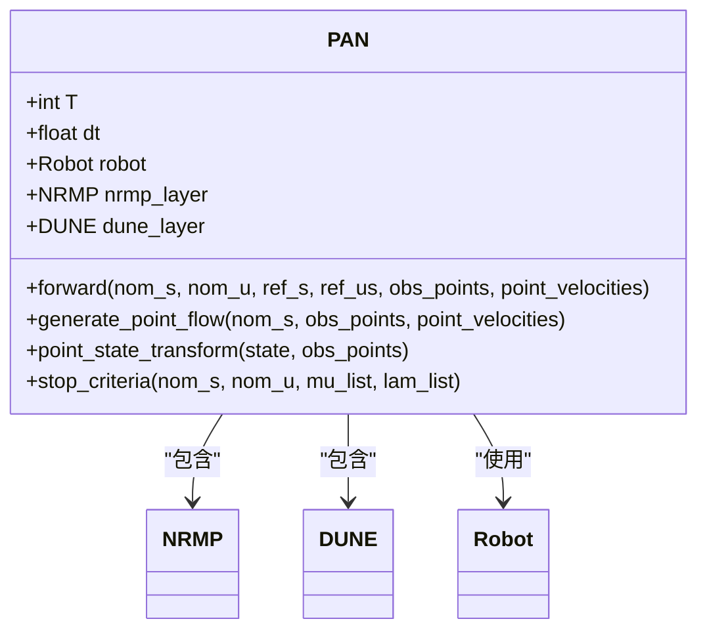
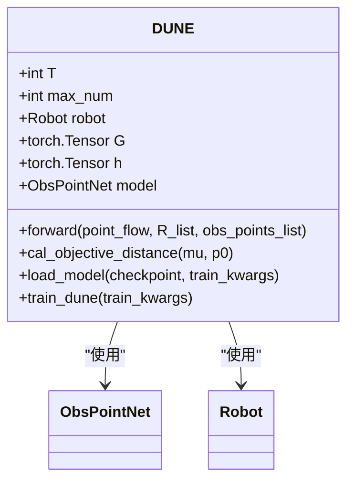
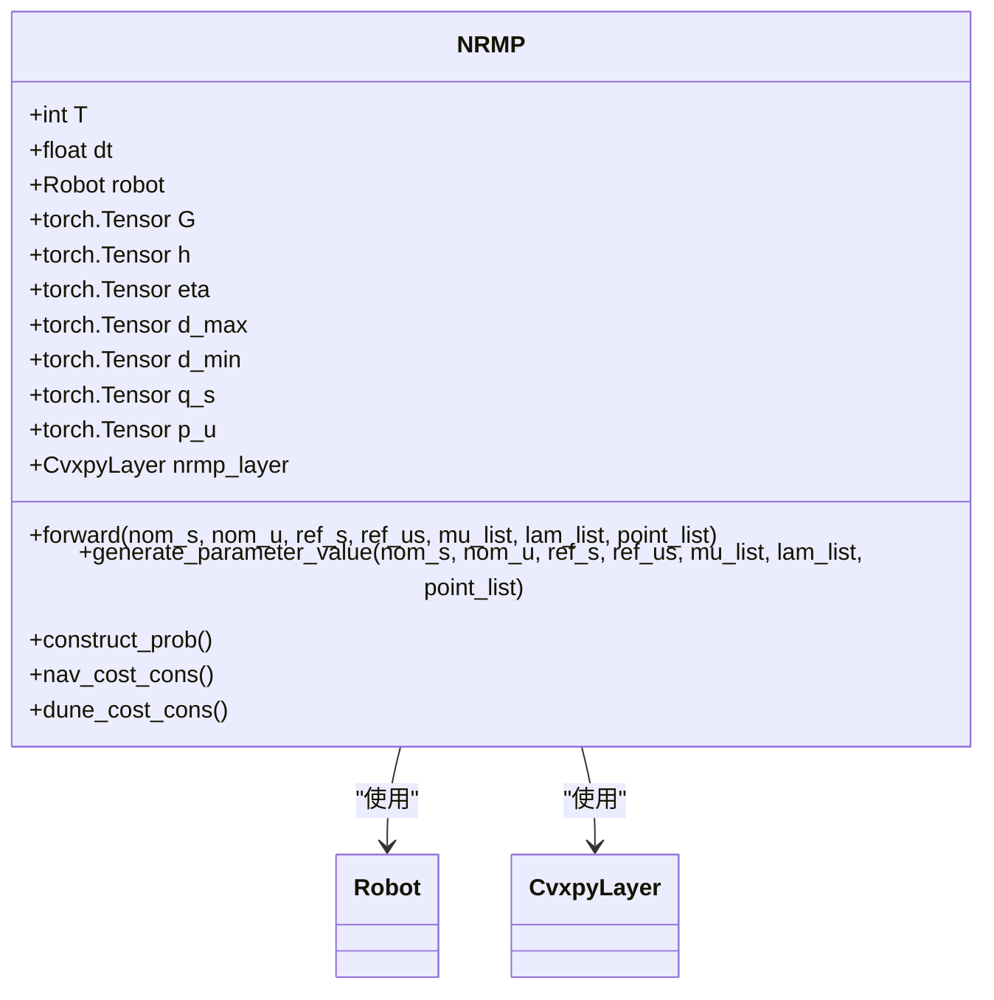
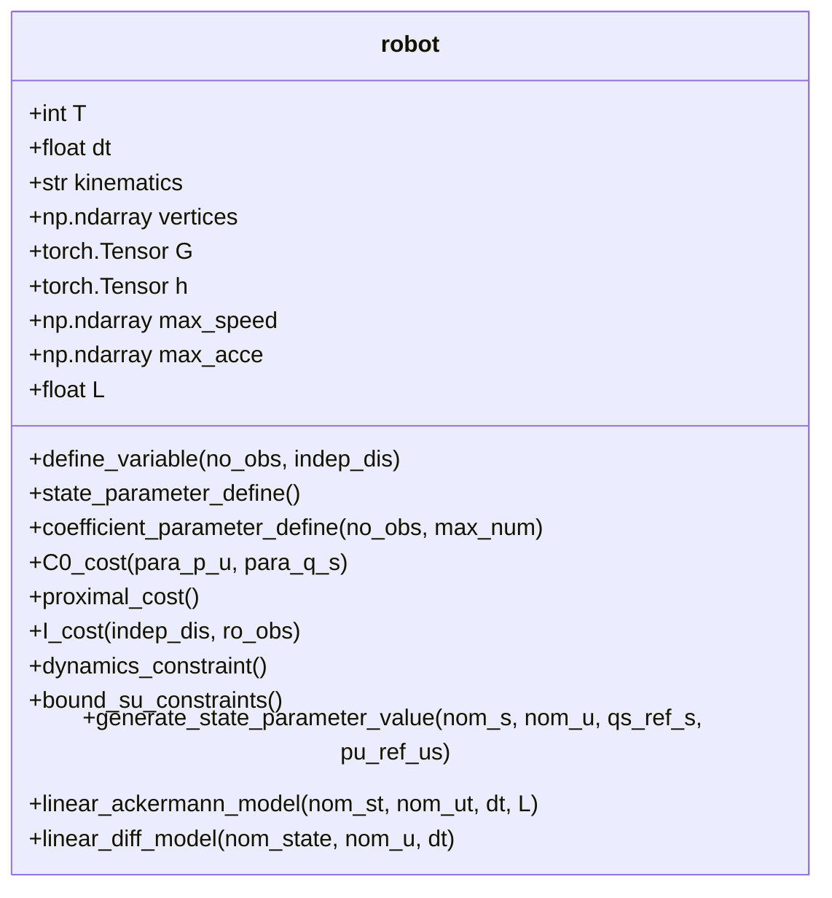
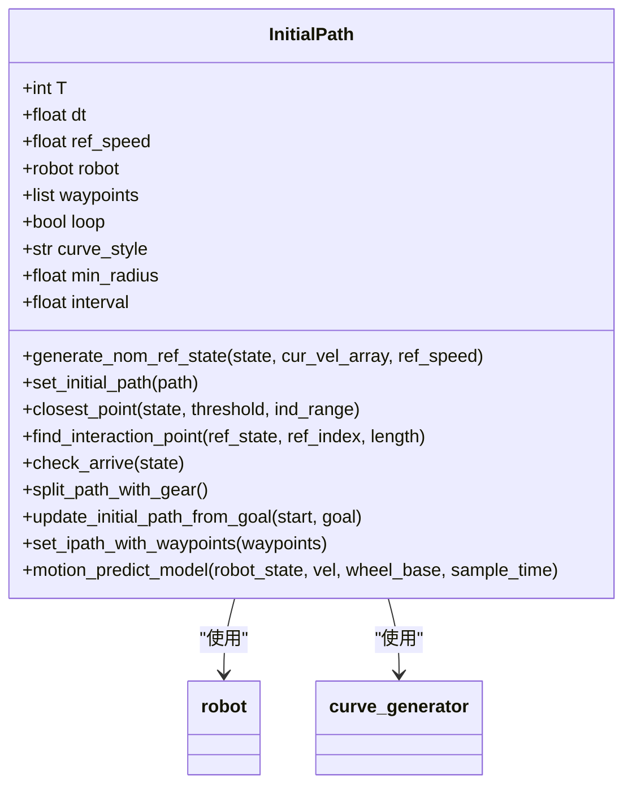
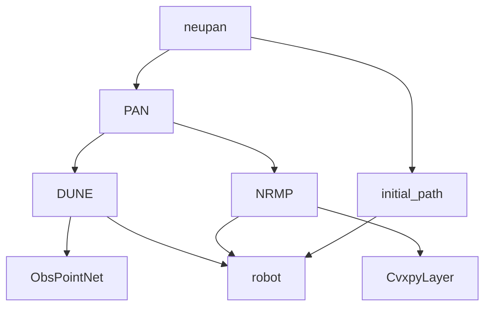

# 端到端神经规划

<cite>
**本文档引用的文件**
- [neupan.py](file://NeuPAN/neupan/neupan.py)
- [pan.py](file://NeuPAN/neupan/blocks/pan.py)
- [dune.py](file://NeuPAN/neupan/blocks/dune.py)
- [nrmp.py](file://NeuPAN/neupan/blocks/nrmp.py)
- [robot.py](file://NeuPAN/neupan/robot/robot.py)
- [initial_path.py](file://NeuPAN/neupan/blocks/initial_path.py)
- [obs_point_net.py](file://NeuPAN/neupan/blocks/obs_point_net.py)
</cite>

## 目录
1. [引言](#引言)
2. [项目结构](#项目结构)
3. [核心组件](#核心组件)
4. [架构概述](#架构概述)
5. [详细组件分析](#详细组件分析)
6. [依赖关系分析](#依赖关系分析)
7. [性能考量](#性能考量)
8. [故障排除指南](#故障排除指南)
9. [结论](#结论)

## 引言
NeuPAN是一种基于深度学习的端到端神经规划方法，旨在实现从环境感知到控制指令生成的完整映射。该方法结合了模型预测控制（MPC）框架与深度神经网络，通过DUNE（深度展开神经编码器）和NRMP（神经正则化运动规划器）两个核心组件，实现了高效且安全的机器人运动规划。NeuPAN特别适用于复杂动态环境中的导航任务，如走廊导航和动态障碍物规避。本文档将深入探讨其架构设计、关键组件功能以及实际应用方法。

## 项目结构
NeuPAN项目的目录结构清晰地划分了各个功能模块。核心算法实现位于`neupan`包内，其中`blocks`子模块包含了DUNE、NRMP等关键组件，`robot`模块定义了机器人动力学模型，`util`提供了实用工具函数。`example`目录则包含了多种场景下的配置文件和示例脚本，便于用户快速上手和测试。

**Diagram sources**
- [neupan.py](file://NeuPAN/neupan/neupan.py)
- [pan.py](file://NeuPAN/neupan/blocks/pan.py)

**Section sources**
- [neupan.py](file://NeuPAN/neupan/neupan.py)
- [pan.py](file://NeuPAN/neupan/blocks/pan.py)

## 核心组件
NeuPAN的核心由`neupan.py`中的`neupan`类封装，该类作为高级接口整合了底层的PAN（近端交替最小化网络）算法。`neupan`类负责管理MPC框架的递推时域、时间步长和参考速度等参数，并通过`InitialPath`模块生成初始路径。其前向传播过程首先调用`InitialPath`生成名义参考状态，然后将障碍物点云数据转换为张量，最终交由PAN模块进行优化求解。

**Section sources**
- [neupan.py](file://NeuPAN/neupan/neupan.py#L1-L402)
- [initial_path.py](file://NeuPAN/neupan/blocks/initial_path.py#L1-L483)

## 架构概述
NeuPAN的整体架构采用分层设计，上层为`neupan`主控制器，中层为`PAN`核心优化器，底层为`DUNE`和`NRMP`两个协同工作的子模块。`DUNE`负责将感知到的障碍物点云映射到潜在的距离特征空间，而`NRMP`则基于这些特征求解最优控制序列。这种设计实现了感知与规划的深度融合，使得系统能够直接从原始传感器数据生成安全的运动轨迹。

**Diagram sources**
- [neupan.py](file://NeuPAN/neupan/neupan.py#L1-L402)
- [pan.py](file://NeuPAN/neupan/blocks/pan.py#L1-L272)

## 详细组件分析

### PAN模块分析
PAN（Proximal Alternating-minimization Network）是NeuPAN的核心优化引擎，采用近端交替最小化算法迭代求解运动规划问题。它通过在DUNE和NRMP之间交替优化，逐步逼近最优解。

**Diagram sources**
- [pan.py](file://NeuPAN/neupan/blocks/pan.py#L1-L272)
- [nrmp.py](file://NeuPAN/neupan/blocks/nrmp.py#L1-L325)
- [dune.py](file://NeuPAN/neupan/blocks/dune.py#L1-L211)

**Section sources**
- [pan.py](file://NeuPAN/neupan/blocks/pan.py#L1-L272)

### DUNE模块分析
DUNE（Deep Unfolded Neural Encoder）是NeuPAN的感知-特征转换模块，其主要功能是将原始的障碍物点云数据映射到一个潜在的距离特征空间。这一过程通过一个名为`ObsPointNet`的深度神经网络实现，该网络将每个障碍物点的坐标作为输入，并输出对应的潜在特征向量`mu`。DUNE还负责计算机器人与障碍物之间的最小距离，用于碰撞检测。

**Diagram sources**
- [dune.py](file://NeuPAN/neupan/blocks/dune.py#L1-L211)
- [obs_point_net.py](file://NeuPAN/neupan/blocks/obs_point_net.py#L1-L48)

**Section sources**
- [dune.py](file://NeuPAN/neupan/blocks/dune.py#L1-L211)

### NRMP模块分析
NRMP（Neural Regularized Motion Planner）是NeuPAN的优化求解模块，它基于DUNE提供的潜在距离特征，构建并求解一个凸优化问题。NRMP利用`cvxpylayers`库将凸优化层集成到PyTorch框架中，从而实现了可微分的优化求解。其目标函数包含导航成本和安全距离成本两部分，通过调整权重参数可以在路径效率和安全性之间取得平衡。

**Diagram sources**
- [nrmp.py](file://NeuPAN/neupan/blocks/nrmp.py#L1-L325)
- [robot.py](file://NeuPAN/neupan/robot/robot.py#L1-L349)

**Section sources**
- [nrmp.py](file://NeuPAN/neupan/blocks/nrmp.py#L1-L325)

### 机器人模型分析
`robot.py`模块定义了机器人的运动学模型和约束条件。它支持阿克曼转向（acker）和差速驱动（diff）两种常见的机器人类型。该模块不仅提供了状态转移模型，还负责生成优化问题所需的参数，如状态转移矩阵A、B、C等。此外，它还定义了速度、加速度等物理约束，确保生成的轨迹符合机器人的实际能力。

**Diagram sources**
- [robot.py](file://NeuPAN/neupan/robot/robot.py#L1-L349)

**Section sources**
- [robot.py](file://NeuPAN/neupan/robot/robot.py#L1-L349)

### 初始路径生成分析
`initial_path.py`模块负责生成和管理初始路径。它可以从给定的航点列表生成平滑的曲线路径，支持直线和样条曲线等多种风格。该模块还实现了路径跟踪逻辑，能够根据机器人的当前位置动态更新参考轨迹。此外，它还提供了到达检测功能，用于判断机器人是否已到达目标点。

**Diagram sources**
- [initial_path.py](file://NeuPAN/neupan/blocks/initial_path.py#L1-L483)

**Section sources**
- [initial_path.py](file://NeuPAN/neupan/blocks/initial_path.py#L1-L483)

## 依赖关系分析
NeuPAN各组件之间的依赖关系清晰且紧密。`neupan`模块作为顶层控制器，依赖于`PAN`模块进行核心优化计算。`PAN`模块又进一步依赖于`DUNE`和`NRMP`两个子模块，分别负责感知特征提取和优化求解。`DUNE`和`NRMP`都依赖于`robot`模块提供的机器人几何和动力学信息。`initial_path`模块为整个系统提供初始路径参考，是规划过程的起点。

**Diagram sources**
- [neupan.py](file://NeuPAN/neupan/neupan.py#L1-L402)
- [pan.py](file://NeuPAN/neupan/blocks/pan.py#L1-L272)
- [dune.py](file://NeuPAN/neupan/blocks/dune.py#L1-L211)
- [nrmp.py](file://NeuPAN/neupan/blocks/nrmp.py#L1-L325)
- [robot.py](file://NeuPAN/neupan/robot/robot.py#L1-L349)
- [initial_path.py](file://NeuPAN/neupan/blocks/initial_path.py#L1-L483)

**Section sources**
- [neupan.py](file://NeuPAN/neupan/neupan.py#L1-L402)
- [pan.py](file://NeuPAN/neupan/blocks/pan.py#L1-L272)

## 性能考量
NeuPAN的性能受多个因素影响。首先，DUNE网络的推理速度直接影响整个系统的实时性，因此建议在支持CUDA的设备上运行以获得最佳性能。其次，MPC的递推时域长度和时间步长的选择需要在规划精度和计算开销之间进行权衡。较长的时域可以提供更优的全局路径，但会增加计算负担。此外，障碍物点云的数量也会影响DUNE的处理时间，系统通过下采样机制来控制输入数据的规模。

## 故障排除指南
在使用NeuPAN时，可能会遇到一些常见问题。如果系统无法找到DUNE模型，会提示用户是否要立即训练新模型。此时，应确保`train_kwargs`参数已正确配置，并且有足够的训练数据。如果规划结果不稳定，可以尝试调整NRMP中的权重参数，如`q_s`、`p_u`和`eta`，以改变目标函数中各项成本的相对重要性。对于路径跟踪不准确的问题，应检查初始路径的生成质量和机器人的运动学参数设置是否正确。

**Section sources**
- [dune.py](file://NeuPAN/neupan/blocks/dune.py#L1-L211)
- [nrmp.py](file://NeuPAN/neupan/blocks/nrmp.py#L1-L325)
- [initial_path.py](file://NeuPAN/neupan/blocks/initial_path.py#L1-L483)

## 结论
NeuPAN作为一种端到端的神经规划方法，通过深度融合深度学习与传统优化技术，实现了高效且安全的机器人运动规划。其模块化的设计使得各个组件可以独立开发和优化，同时也便于集成到不同的机器人系统中。与传统规划器相比，NeuPAN能够更好地处理复杂动态环境，并且具有更强的泛化能力。然而，该方法也存在一些局限性，例如对训练数据的依赖性和在极端情况下的可解释性问题。未来的工作可以集中在提高模型的鲁棒性和减少对大量训练数据的需求上。