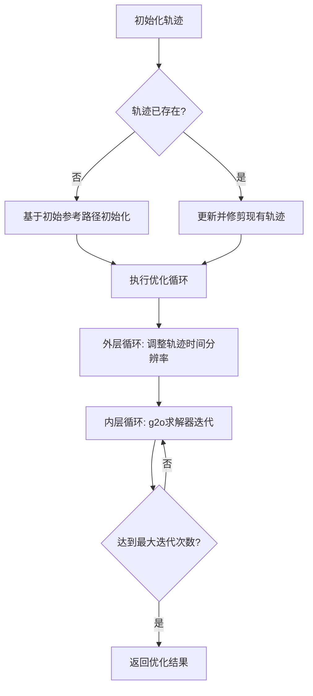
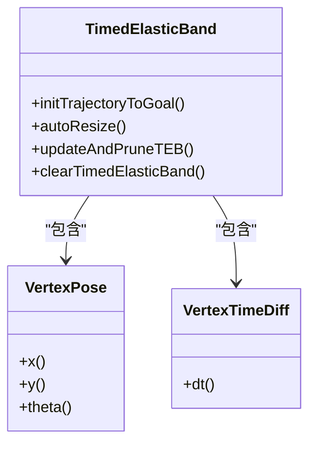
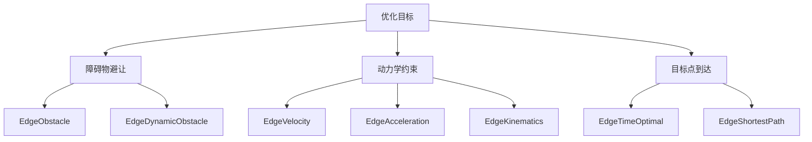

# 时序弹性带规划器

<cite>
**本文档中引用的文件**   
- [teb_local_planner_ros.cpp](file://teb_local_planner/src/teb_local_planner_ros.cpp)
- [TebLocalPlannerReconfigure.cfg](file://teb_local_planner/cfg/TebLocalPlannerReconfigure.cfg)
- [optimal_planner.h](file://teb_local_planner/include/teb_local_planner/optimal_planner.h)
- [optimal_planner.cpp](file://teb_local_planner/src/optimal_planner.cpp)
- [teb_local_planner_ros.h](file://teb_local_planner/include/teb_local_planner/teb_local_planner_ros.h)
</cite>

## 目录
1. [引言](#引言)
2. [基于优化的轨迹生成框架](#基于优化的轨迹生成框架)
3. [时序弹性带结构](#时序弹性带结构)
4. [代价项数学建模](#代价项数学建模)
5. [参数配置与调优](#参数配置与调优)
6. [高级开发指南](#高级开发指南)

## 引言
时序弹性带（Timed Elastic Band, TEB）规划器是一种基于优化的局部路径规划算法，它将路径规划问题转化为非线性优化问题进行求解。该规划器通过在时间维度上对轨迹进行弹性变形，同时考虑机器人动力学约束、障碍物避让和目标点到达等多个优化目标，生成平滑且可行的运动轨迹。TEB规划器的核心思想是将轨迹表示为一系列离散的位姿（pose）和时间间隔（timediff），并通过图优化框架（g2o）对这些变量进行联合优化。

**Section sources**
- [teb_local_planner_ros.cpp](file://teb_local_planner/src/teb_local_planner_ros.cpp#L76-L134)

## 基于优化的轨迹生成框架
TEB规划器的优化框架基于g2o图优化库实现，将轨迹规划问题建模为一个超图（hyper-graph）优化问题。该框架由顶点（vertices）和边（edges）组成，其中顶点代表优化变量，边代表约束条件或代价函数。

在TEB规划器中，优化变量包括轨迹上的位姿（VertexPose）和相邻位姿之间的时间间隔（VertexTimeDiff）。这些变量通过一系列边连接，形成一个优化图。优化过程通过最小化所有边的代价函数总和来寻找最优解。

规划器的主优化循环由内外两层循环构成：外层循环负责根据时间分辨率自动调整轨迹（autoResize），内层循环调用g2o求解器进行迭代优化。这种双重循环结构能够有效平衡轨迹的收缩行为和收敛速度。

**Diagram sources **
- [optimal_planner.cpp](file://teb_local_planner/src/optimal_planner.cpp#L181-L230)
- [optimal_planner.h](file://teb_local_planner/include/teb_local_planner/optimal_planner.h#L500-L540)

**Section sources**
- [optimal_planner.cpp](file://teb_local_planner/src/optimal_planner.cpp#L181-L230)
- [optimal_planner.h](file://teb_local_planner/include/teb_local_planner/optimal_planner.h#L500-L540)

## 时序弹性带结构
时序弹性带（TEB）是一种特殊的轨迹表示方法，它将轨迹建模为一系列离散的位姿点和时间间隔。每个位姿点包含位置（x, y）和方向（θ）信息，而时间间隔则表示相邻位姿点之间的时间差。

TEB结构由TimedElasticBand类实现，该类管理着轨迹上的所有位姿和时间间隔。在优化过程中，这些变量作为可优化的顶点被添加到g2o图中。位姿顶点（VertexPose）和时间间隔顶点（VertexTimeDiff）交替排列，形成一条完整的轨迹。

轨迹的初始化可以基于全局路径规划结果，通过插值方法生成初始轨迹。在后续的优化过程中，规划器会根据当前环境信息和机器人状态，动态调整轨迹的形状和时间分布。

**Diagram sources **
- [optimal_planner.h](file://teb_local_planner/include/teb_local_planner/optimal_planner.h#L100-L694)
- [optimal_planner.cpp](file://teb_local_planner/src/optimal_planner.cpp#L61-L69)

**Section sources**
- [optimal_planner.h](file://teb_local_planner/include/teb_local_planner/optimal_planner.h#L100-L694)
- [optimal_planner.cpp](file://teb_local_planner/src/optimal_planner.cpp#L61-L69)

## 代价项数学建模
TEB规划器通过多种代价项（edges）来表达不同的优化目标，这些代价项在优化图中作为边连接相应的顶点。每种代价项对应一个特定的约束或优化目标，其数学模型如下：

### 障碍物代价
障碍物代价项用于确保轨迹与障碍物保持安全距离。对于静态障碍物，使用EdgeObstacle边；对于动态障碍物，则使用EdgeDynamicObstacle边。代价函数通常与机器人到障碍物的距离成反比。

### 动力学约束代价
动力学约束代价项包括速度约束（EdgeVelocity）、加速度约束（EdgeAcceleration）和运动学约束（EdgeKinematics）。这些约束确保生成的轨迹符合机器人的物理限制。

### 目标点代价
目标点代价项（EdgeTimeOptimal）用于最小化轨迹的总时间，使机器人能够尽快到达目标点。同时，EdgeShortestPath边用于最小化轨迹的路径长度。

**Diagram sources **
- [optimal_planner.cpp](file://teb_local_planner/src/optimal_planner.cpp#L322-L365)
- [optimal_planner.h](file://teb_local_planner/include/teb_local_planner/optimal_planner.h#L550-L650)

**Section sources**
- [optimal_planner.cpp](file://teb_local_planner/src/optimal_planner.cpp#L322-L365)
- [optimal_planner.h](file://teb_local_planner/include/teb_local_planner/optimal_planner.h#L550-L650)

## 参数配置与调优
TEB规划器通过TebLocalPlannerReconfigure.cfg文件提供丰富的参数配置选项，用户可以根据不同机器人平台的特点进行调优。

### 轨迹参数
- teb_autosize: 启用轨迹自动调整功能
- dt_ref: 轨迹的时间分辨率
- max_global_plan_lookahead_dist: 全局计划的最大前瞻距离

### 机器人参数
- max_vel_x: 机器人最大前进速度
- max_vel_theta: 机器人最大角速度
- acc_lim_x: 机器人最大加速度
- min_turning_radius: 汽车式机器人的最小转弯半径

### 障碍物参数
- min_obstacle_dist: 与障碍物的最小安全距离
- inflation_dist: 障碍物膨胀距离
- include_dynamic_obstacles: 是否考虑动态障碍物

### 优化参数
- no_inner_iterations: 内层循环迭代次数
- no_outer_iterations: 外层循环迭代次数
- weight_obstacle: 障碍物代价权重
- weight_optimaltime: 时间最优代价权重

用户可以通过动态重配置（dynamic reconfigure）工具实时调整这些参数，观察其对规划结果的影响。

**Section sources**
- [TebLocalPlannerReconfigure.cfg](file://teb_local_planner/cfg/TebLocalPlannerReconfigure.cfg#L1-L448)

## 高级开发指南
对于高级用户，TEB规划器提供了扩展和自定义的接口，允许用户实现自定义的代价函数和优化模型。

### 自定义代价函数
用户可以通过继承PlannerInterface类并重写相关方法来实现自定义的代价函数。新的代价项需要实现g2o::BaseBinaryEdge接口，并在buildGraph方法中添加到优化图中。

### 扩展优化模型
用户可以扩展TimedElasticBand类，添加新的优化变量或修改现有的优化策略。例如，可以引入新的顶点类型来表示额外的状态信息，或者实现新的边类型来表达特定的约束条件。

### 多目标优化
TEB规划器支持多目标优化，用户可以通过调整不同代价项的权重来平衡各个优化目标。权重自适应策略（weight_adapt_factor）可以在优化过程中动态调整代价权重，改善数值条件。

**Section sources**
- [teb_local_planner_ros.h](file://teb_local_planner/include/teb_local_planner/teb_local_planner_ros.h#L78-L126)
- [optimal_planner.h](file://teb_local_planner/include/teb_local_planner/optimal_planner.h#L100-L694)