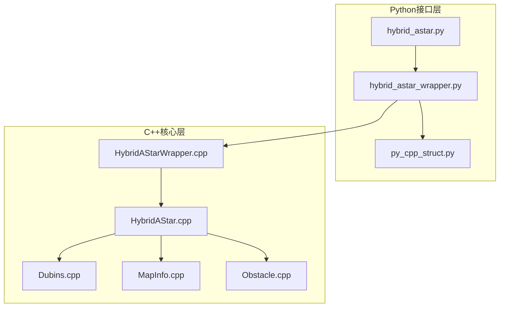
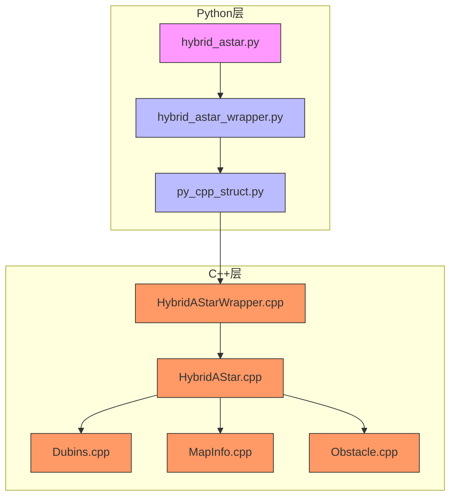
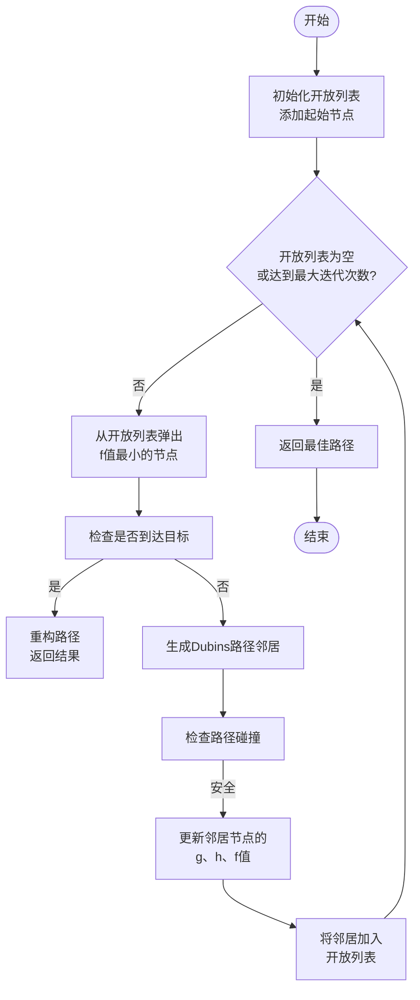
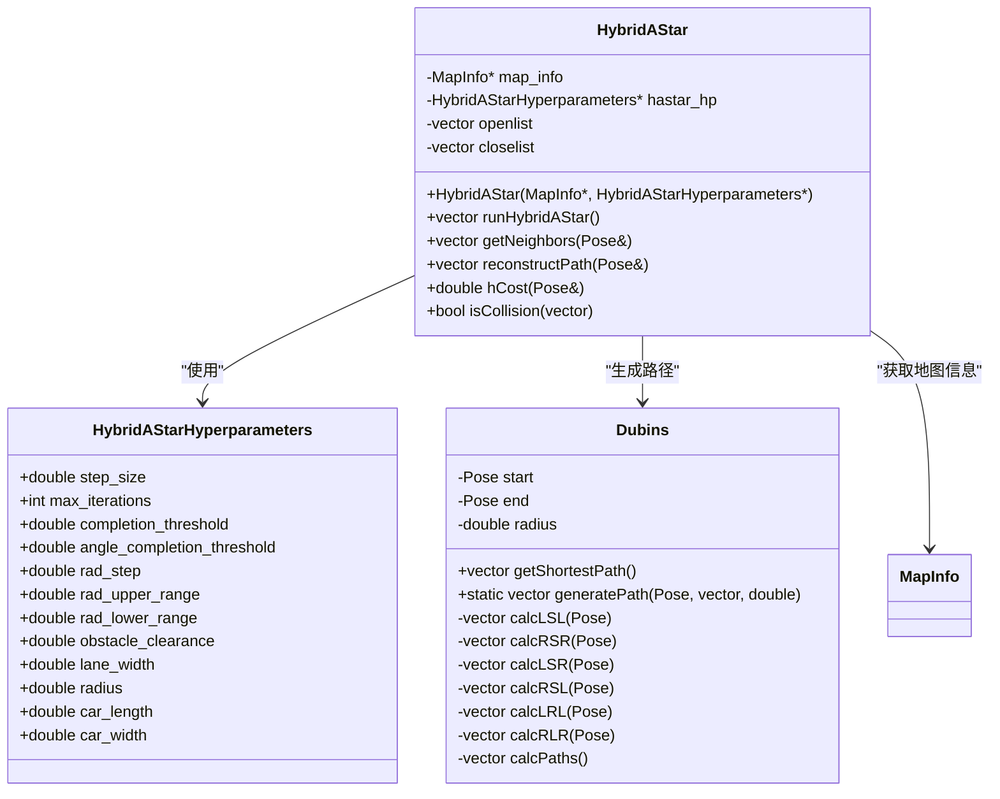
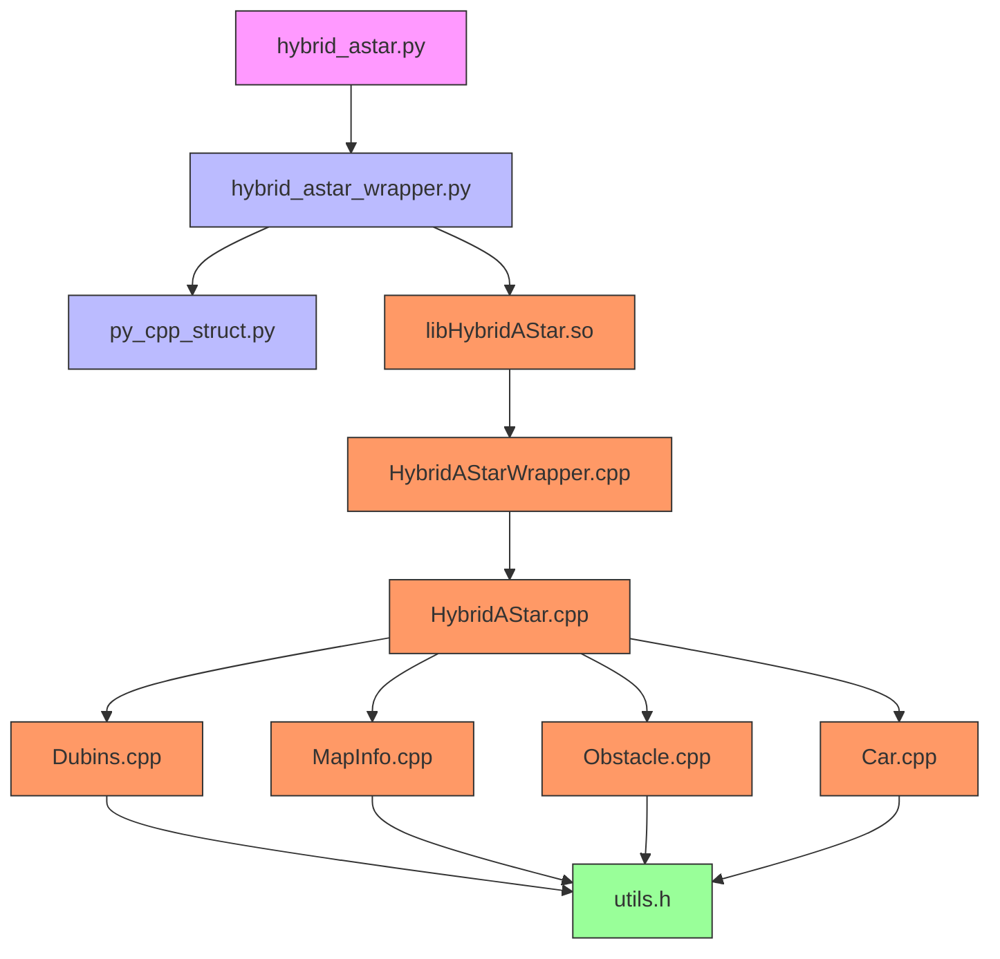

# 混合A*算法

<cite>
**本文档中引用的文件**   
- [hybrid_astar.py](file://hybrid_astar_planner/HybridAStar/hybrid_astar.py)
- [HybridAStar.cpp](file://hybrid_astar_planner/src/HybridAStar.cpp)
- [hybrid_astar_wrapper.py](file://hybrid_astar_planner/HybridAStar/hybrid_astar_wrapper.py)
- [HybridAStarWrapper.cpp](file://hybrid_astar_planner/src/HybridAStarWrapper.cpp)
- [py_cpp_struct.py](file://hybrid_astar_planner/HybridAStar/py_cpp_struct.py)
- [Dubins.cpp](file://hybrid_astar_planner/src/Dubins.cpp)
- [Dubins.h](file://hybrid_astar_planner/include/Dubins.h)
</cite>

## 目录
1. [简介](#简介)
2. [项目结构](#项目结构)
3. [核心组件](#核心组件)
4. [架构概述](#架构概述)
5. [详细组件分析](#详细组件分析)
6. [依赖分析](#依赖分析)
7. [性能考虑](#性能考虑)
8. [故障排除指南](#故障排除指南)
9. [结论](#结论)

## 简介
混合A*算法是一种专为满足车辆运动学约束的路径规划而设计的高级搜索算法。该算法结合了A*搜索的全局最优性与Dubins路径的局部可行性，特别适用于狭窄空间导航和低速机动场景。本文档深入分析`hybrid_astar.py`和`HybridAStar.cpp`中的实现细节，重点解析搜索流程、离散化策略和轨迹平滑机制。文档还将详细说明启发式函数的设计原理及其对搜索效率的影响，并为开发者提供性能优化建议。

## 项目结构
混合A*算法的实现分布在多个文件中，主要分为Python接口层和C++核心算法层。Python脚本提供高层接口和可视化功能，而C++代码负责高性能的路径搜索计算。这种架构设计实现了开发便捷性与运行效率的平衡。



**图源**
- [hybrid_astar.py](file://hybrid_astar_planner/HybridAStar/hybrid_astar.py#L1-L101)
- [hybrid_astar_wrapper.py](file://hybrid_astar_planner/HybridAStar/hybrid_astar_wrapper.py#L1-L124)
- [HybridAStarWrapper.cpp](file://hybrid_astar_planner/src/HybridAStarWrapper.cpp#L1-L33)
- [HybridAStar.cpp](file://hybrid_astar_planner/src/HybridAStar.cpp#L1-L171)

**节源**
- [hybrid_astar.py](file://hybrid_astar_planner/HybridAStar/hybrid_astar.py#L1-L101)
- [HybridAStar.cpp](file://hybrid_astar_planner/src/HybridAStar.cpp#L1-L171)

## 核心组件
混合A*算法的核心组件包括搜索算法、运动学模型和碰撞检测系统。搜索算法基于A*框架，但使用Dubins路径作为状态转移，确保生成的路径符合车辆的最小转弯半径约束。运动学模型通过Dubins曲线精确描述车辆的可行驶轨迹，而碰撞检测系统则确保路径在复杂环境中是安全的。

**节源**
- [HybridAStar.cpp](file://hybrid_astar_planner/src/HybridAStar.cpp#L91-L171)
- [Dubins.cpp](file://hybrid_astar_planner/src/Dubins.cpp#L1-L280)
- [hybrid_astar_wrapper.py](file://hybrid_astar_planner/HybridAStar/hybrid_astar_wrapper.py#L40-L122)

## 架构概述
混合A*算法采用分层架构设计，上层为Python接口，下层为C++核心算法。这种设计允许开发者使用Python进行快速原型开发和测试，同时利用C++的高性能特性进行实际部署。算法的核心是HybridAStar类，它管理开放列表和关闭列表，执行搜索循环，并调用Dubins类生成符合运动学约束的路径。



**图源**
- [hybrid_astar_wrapper.py](file://hybrid_astar_planner/HybridAStar/hybrid_astar_wrapper.py#L1-L124)
- [HybridAStarWrapper.cpp](file://hybrid_astar_planner/src/HybridAStarWrapper.cpp#L1-L33)
- [HybridAStar.cpp](file://hybrid_astar_planner/src/HybridAStar.cpp#L1-L171)

## 详细组件分析

### 搜索流程分析
混合A*算法的搜索流程从初始化开放列表开始，将起始位置作为第一个节点加入。然后进入主循环，每次从开放列表中取出f值最小的节点进行扩展。对于每个扩展节点，算法生成其所有可能的Dubins路径邻居，并检查这些路径是否与障碍物碰撞。如果路径安全，则计算其g、h和f值，并将其加入开放列表。



**图源**
- [HybridAStar.cpp](file://hybrid_astar_planner/src/HybridAStar.cpp#L91-L171)

**节源**
- [HybridAStar.cpp](file://hybrid_astar_planner/src/HybridAStar.cpp#L91-L171)

### 离散化策略分析
算法的离散化策略主要体现在转向角的采样上。通过`rad_step`参数控制转向角的离散化精度，`rad_upper_range`和`rad_lower_range`定义了左右转向的最大角度范围。这种离散化策略允许算法在保证路径质量的同时控制计算复杂度。



**图源**
- [py_cpp_struct.py](file://hybrid_astar_planner/HybridAStar/py_cpp_struct.py#L1-L43)
- [HybridAStar.cpp](file://hybrid_astar_planner/src/HybridAStar.cpp#L1-L171)
- [Dubins.h](file://hybrid_astar_planner/include/Dubins.h#L1-L36)

**节源**
- [HybridAStar.cpp](file://hybrid_astar_planner/src/HybridAStar.cpp#L44-L89)
- [py_cpp_struct.py](file://hybrid_astar_planner/HybridAStar/py_cpp_struct.py#L1-L43)

### 轨迹平滑机制分析
混合A*算法的轨迹平滑主要通过Dubins路径的自然平滑特性实现。Dubins路径由直线段和圆弧段组成，这些几何元素本身就具有良好的平滑性。当算法找到一条从当前节点到目标节点的Dubins路径且无碰撞时，这条路径就被认为是平滑的最终路径。

```mermaid
sequenceDiagram
participant HA as HybridAStar
participant D as Dubins
participant MI as MapInfo
HA->>HA : 初始化搜索
loop 搜索循环
HA->>HA : 从开放列表获取最小f节点
HA->>D : 请求从当前节点到目标的最短Dubins路径
D->>D : 计算所有可能的Dubins路径(LSL, RSR, LSR, RSL, LRL, RLR)
D->>D : 选择总成本最低的路径
D-->>HA : 返回最短Dubins路径
HA->>MI : 检查Dubins路径是否与障碍物碰撞
MI-->>HA : 返回碰撞检测结果
alt 路径安全且接近目标
HA->>HA : 重构并返回完整路径
break 搜索完成
else 需要继续搜索
HA->>HA : 生成当前节点的Dubins邻居
HA->>HA : 将安全邻居加入开放列表
end
end
```

**图源**
- [HybridAStar.cpp](file://hybrid_astar_planner/src/HybridAStar.cpp#L91-L171)
- [Dubins.cpp](file://hybrid_astar_planner/src/Dubins.cpp#L1-L280)
- [MapInfo.cpp](file://hybrid_astar_planner/src/MapInfo.cpp)

**节源**
- [HybridAStar.cpp](file://hybrid_astar_planner/src/HybridAStar.cpp#L91-L171)
- [Dubins.cpp](file://hybrid_astar_planner/src/Dubins.cpp#L1-L280)

## 依赖分析
混合A*算法的依赖关系清晰地分为三层：接口层、核心算法层和辅助工具层。接口层依赖于ctypes库与C++代码进行交互；核心算法层依赖于Eigen库进行数学计算；辅助工具层提供地图信息、障碍物表示和车辆模型等基本功能。



**图源**
- [hybrid_astar_wrapper.py](file://hybrid_astar_planner/HybridAStar/hybrid_astar_wrapper.py)
- [HybridAStarWrapper.cpp](file://hybrid_astar_planner/src/HybridAStarWrapper.cpp)
- [CMakeLists.txt](file://hybrid_astar_planner/CMakeLists.txt)

**节源**
- [hybrid_astar_wrapper.py](file://hybrid_astar_planner/HybridAStar/hybrid_astar_wrapper.py#L1-L124)
- [HybridAStarWrapper.cpp](file://hybrid_astar_planner/src/HybridAStarWrapper.cpp#L1-L33)

## 性能考虑
混合A*算法的性能受多个关键参数影响。`step_size`决定了路径搜索的步长，较小的值会提高路径精度但增加计算时间。`max_iterations`限制了搜索的最大迭代次数，防止算法在复杂环境中无限运行。`rad_step`控制转向角的离散化精度，直接影响搜索空间的大小。

为了优化性能，建议根据具体应用场景调整这些参数。在开阔环境中可以使用较大的`step_size`和`rad_step`以提高搜索速度；在狭窄环境中则需要较小的值以确保找到可行路径。此外，合理设置`completion_threshold`和`angle_completion_threshold`可以平衡路径质量和计算效率。

**节源**
- [hybrid_astar.py](file://hybrid_astar_planner/HybridAStar/hybrid_astar.py#L28-L64)
- [py_cpp_struct.py](file://hybrid_astar_planner/HybridAStar/py_cpp_struct.py#L25-L43)

## 故障排除指南
当混合A*算法无法找到路径时，首先检查初始条件是否合理，确保起始点和目标点都在可行驶区域内。其次验证障碍物定义是否正确，避免出现不合理的障碍物配置。如果问题仍然存在，可以尝试调整超参数，如增加`max_iterations`或放宽`completion_threshold`。

在调试过程中，可以启用`hybrid_astar.py`中的动画功能来可视化搜索过程，这有助于理解算法的行为和识别问题所在。此外，检查C++代码中的碰撞检测逻辑，确保车辆轮廓与障碍物的碰撞判断准确无误。

**节源**
- [hybrid_astar.py](file://hybrid_astar_planner/HybridAStar/hybrid_astar.py#L1-L101)
- [HybridAStar.cpp](file://hybrid_astar_planner/src/HybridAStar.cpp#L1-L171)

## 结论
混合A*算法通过巧妙结合A*搜索和Dubins路径，在保证路径全局最优性的同时满足车辆的运动学约束。该算法在狭窄空间导航和低速机动场景中表现出色，相比纯几何路径规划方法具有明显优势。通过合理配置关键参数，可以在计算复杂度和路径质量之间取得良好平衡，为自动驾驶车辆提供可靠、高效的路径规划解决方案。