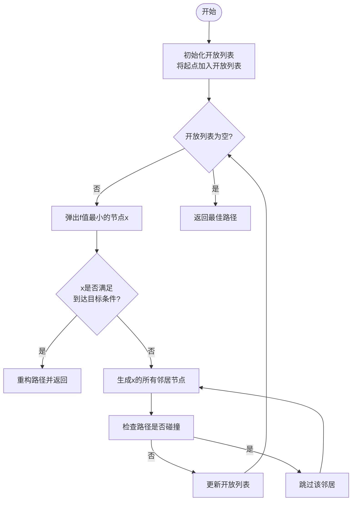
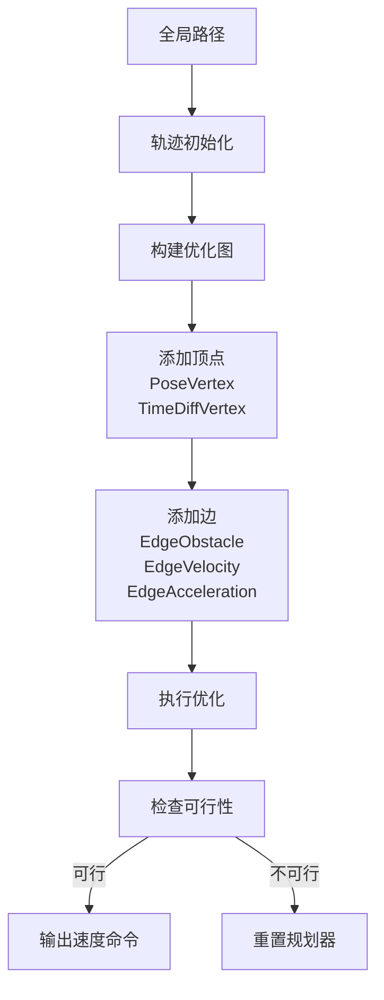

# 经典路径规划

<cite>
**本文档中引用的文件**  
- [hybrid_astar.py](file://hybrid_astar_planner/HybridAStar/hybrid_astar.py)
- [HybridAStar.cpp](file://hybrid_astar_planner/src/HybridAStar.cpp)
- [teb_local_planner_ros.cpp](file://teb_local_planner/src/teb_local_planner_ros.cpp)
- [HybridAStar.h](file://hybrid_astar_planner/include/HybridAStar.h)
- [teb_local_planner_ros.h](file://teb_local_planner/include/teb_local_planner/teb_local_planner_ros.h)
</cite>

## 目录
1. [引言](#引言)
2. [混合A*算法实现](#混合a-算法实现)
3. [时序弹性带（TEB）规划器实现](#时序弹性带teb-规划器实现)
4. [算法对比与应用场景](#算法对比与应用场景)
5. [参数调优指南](#参数调优指南)
6. [现代机器人系统中的应用](#现代机器人系统中的应用)
7. [结论](#结论)

## 引言
路径规划是机器人自主导航的核心技术之一，它决定了机器人如何从起点安全、高效地到达目标点。在众多路径规划算法中，混合A*算法和时序弹性带（TEB）规划器因其各自独特的优势而被广泛应用。混合A*算法结合了传统A*搜索与车辆运动学约束，能够在考虑非完整约束的情况下找到可行路径；而TEB规划器则通过优化框架实时调整轨迹，适应动态环境变化。本文将深入分析这两种经典方法的实现细节，为开发者提供全面的技术参考。

## 混合A*算法实现

混合A*算法是一种专为非完整约束系统设计的路径搜索方法，特别适用于汽车-like机器人的路径规划。该算法在传统A*的基础上引入了Dubins路径作为状态转移方式，确保生成的路径符合车辆的运动学限制。

### 搜索策略
混合A*算法采用优先队列维护开放列表，以总代价f=g+h最小的节点优先扩展。其中g表示从起点到当前节点的实际代价，h为启发式估计代价。算法通过`runHybridAStar`函数实现主循环，持续从开放列表中取出代价最小的节点进行扩展，直到满足终止条件或达到最大迭代次数。

在每个扩展步骤中，算法首先检查当前节点是否可以直接通过Dubins路径连接到目标点。如果可以且无碰撞，则记录该路径作为候选解。随后，算法生成当前节点的所有可能邻居节点，这些邻居由不同曲率的Dubins路径构成，包括左转、右转和直行三种基本动作。

**Section sources**
- [HybridAStar.cpp](file://hybrid_astar_planner/src/HybridAStar.cpp#L100-L170)
- [HybridAStar.h](file://hybrid_astar_planner/include/HybridAStar.h#L15-L25)

### 启发式函数设计
启发式函数的设计对搜索效率至关重要。在混合A*算法中，启发式代价h采用欧几里得距离计算当前节点到目标点的直线距离。这种设计保证了启发式的可接纳性（admissible），即不会高估实际代价，从而确保算法能找到最优解。

**Diagram sources**
- [HybridAStar.cpp](file://hybrid_astar_planner/src/HybridAStar.cpp#L100-L170)

### 轨迹生成机制
轨迹生成的核心在于Dubins路径的构造与拼接。算法利用`getNeighbors`函数生成一系列具有不同曲率半径的Dubins路径段，每个路径段代表一个可能的运动方向。当搜索完成时，`reconstructPath`函数负责回溯闭合列表，将各个路径段连接成完整的轨迹。

路径的连续性通过姿态（x, y, yaw）的平滑过渡来保证。此外，算法还考虑了车辆的实际尺寸，通过`isCollision`函数检测路径上每一点是否与障碍物发生碰撞，确保生成路径的安全性。

**Section sources**
- [HybridAStar.cpp](file://hybrid_astar_planner/src/HybridAStar.cpp#L50-L99)
- [hybrid_astar.py](file://hybrid_astar_planner/HybridAStar/hybrid_astar.py#L20-L40)

## 时序弹性带（TEB）规划器实现

TEB规划器是一种基于优化的局部路径规划方法，能够实时生成平滑且可行的轨迹。与混合A*不同，TEB不进行全局搜索，而是基于当前环境信息和全局路径，通过非线性优化不断调整轨迹。

### 优化框架
TEB规划器的核心是一个非线性优化问题，其目标是最小化一个包含多种代价项的能量函数。这些代价项包括路径长度、偏离全局路径的程度、与障碍物的距离、速度平滑性等。优化过程使用g2o框架实现，构建了一个图优化模型，其中顶点表示轨迹上的位姿和时间间隔，边表示各种约束和代价。

**Diagram sources**
- [teb_local_planner_ros.cpp](file://teb_local_planner/src/teb_local_planner_ros.cpp#L300-L400)
- [teb_local_planner_ros.h](file://teb_local_planner/include/teb_local_planner/teb_local_planner_ros.h#L200-L250)

### 约束处理
TEB规划器通过多种边类型实现复杂的约束处理。例如：
- `EdgeObstacle`：确保轨迹与障碍物保持安全距离
- `EdgeVelocity`：限制线速度和角速度不超过设定上限
- `EdgeAcceleration`：保证加速度平滑，避免剧烈变化
- `EdgeKinematics`：满足车辆运动学约束

这些约束以软约束的形式加入优化问题，通过调整相应的权重参数可以灵活平衡不同目标之间的优先级。

**Section sources**
- [teb_local_planner_ros.cpp](file://teb_local_planner/src/teb_local_planner_ros.cpp#L500-L600)
- [teb_local_planner_ros.h](file://teb_local_planner/include/teb_local_planner/teb_local_planner_ros.h#L300-L350)

### 实时性能保障
为了保证实时性，TEB规划器采用了多项优化策略：
1. **增量式优化**：只对局部路径进行重新规划，而非全局重算
2. **多线程处理**：将障碍物更新、轨迹优化和命令生成分离到不同线程
3. **动态降级**：当计算资源紧张时，自动降低优化精度或减少轨迹点数

此外，规划器还实现了故障检测机制，当连续多次无法生成有效路径时，会触发恢复行为，如停止移动或执行避障动作。

**Section sources**
- [teb_local_planner_ros.cpp](file://teb_local_planner/src/teb_local_planner_ros.cpp#L600-L700)

## 算法对比与应用场景

| 特性 | 混合A*算法 | TEB规划器 |
|------|-----------|----------|
| **规划类型** | 全局规划 | 局部规划 |
| **实时性** | 较低 | 高 |
| **平滑性** | 一般 | 优秀 |
| **动态适应** | 弱 | 强 |
| **计算复杂度** | 高 | 中等 |

在静态环境中，混合A*算法适合用于生成初始全局路径；而在动态环境中，TEB规划器更适合实时调整轨迹以应对突发情况。两者常结合使用，形成分层规划架构。

**Section sources**
- [hybrid_astar.py](file://hybrid_astar_planner/HybridAStar/hybrid_astar.py#L10-L30)
- [teb_local_planner_ros.cpp](file://teb_local_planner/src/teb_local_planner_ros.cpp#L100-L150)

## 参数调优指南

### 混合A*参数调优
关键参数包括：
- `step_size`：步长越大搜索越快但精度越低
- `completion_threshold`：影响路径精度和收敛速度
- `obstacle_clearance`：决定路径与障碍物的最小距离

建议初学者从默认值开始，逐步调整并观察路径质量变化。

### TEB规划器参数调优
主要关注：
- 代价权重：平衡路径长度、平滑性和安全性
- 时间分辨率：影响轨迹的时间离散程度
- 最大速度：需与机器人实际能力匹配

经验丰富的开发者可通过分析优化过程中的残差变化，进一步微调参数以获得最佳性能。

**Section sources**
- [hybrid_astar.py](file://hybrid_astar_planner/HybridAStar/hybrid_astar.py#L40-L60)
- [teb_local_planner_ros.cpp](file://teb_local_planner/src/teb_local_planner_ros.cpp#L200-L250)

## 现代机器人系统中的应用
在现代机器人系统中，经典路径规划方法仍然扮演着重要角色。它们不仅作为独立的规划模块运行，还经常与学习型规划器结合使用。例如，可以使用深度强化学习生成粗略路径，再用TEB规划器进行精细化调整。这种混合架构既能发挥学习方法的泛化能力，又能保证路径的物理可行性和安全性。

**Section sources**
- [teb_local_planner_ros.cpp](file://teb_local_planner/src/teb_local_planner_ros.cpp#L1-L50)

## 结论
混合A*算法和TEB规划器代表了经典路径规划方法的两个重要方向。前者擅长处理复杂的运动学约束，后者则在实时优化方面表现出色。理解它们的实现原理和适用场景，对于开发高效可靠的机器人导航系统具有重要意义。随着技术的发展，这些经典方法将继续与新兴技术融合，推动机器人自主能力的不断提升。