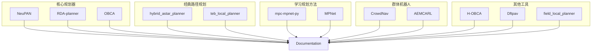
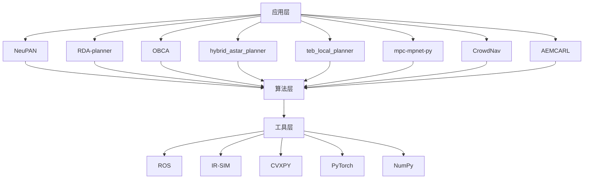
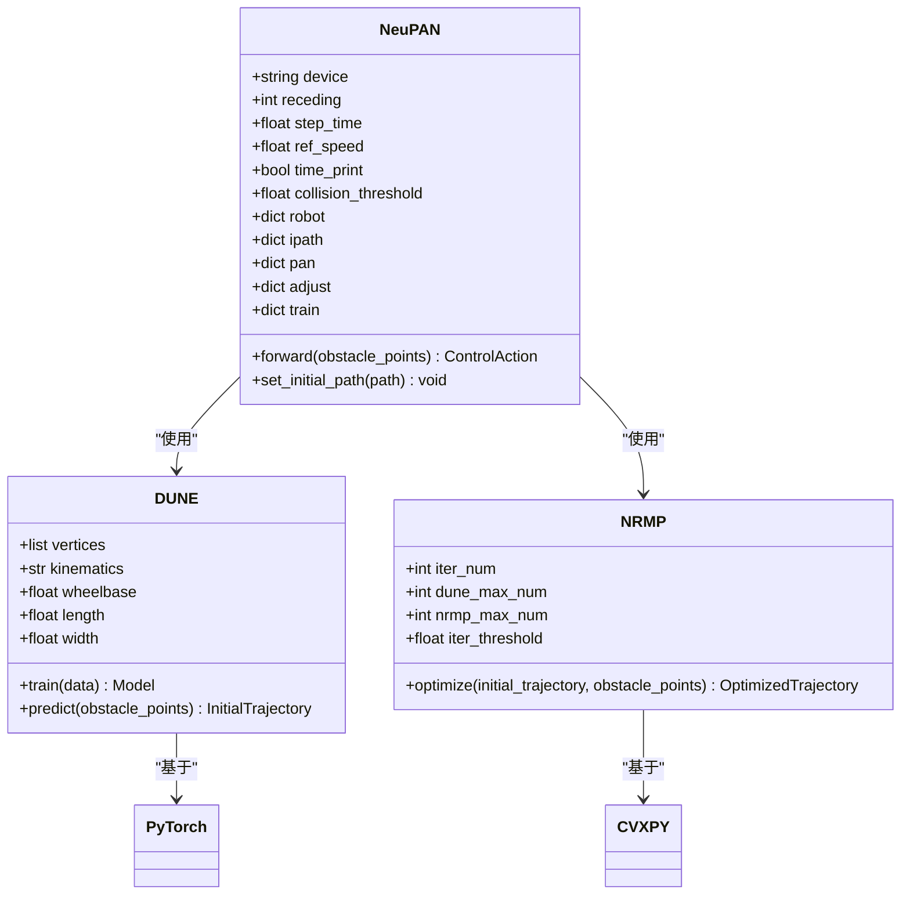
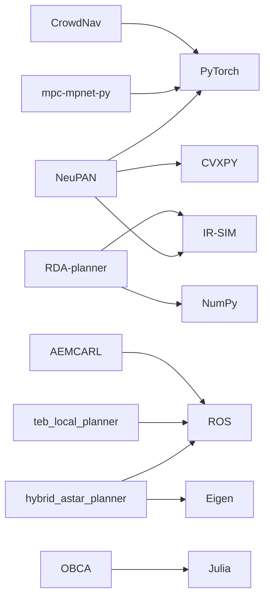

# 代码贡献

<cite>
**本文档中引用的文件**  
- [README.md](file://README.md)
- [NeuPAN/README.md](file://NeuPAN/README.md)
- [RDA-planner/README.md](file://RDA-planner/README.md)
- [OBCA/README.md](file://OBCA/README.md)
- [hybrid_astar_planner/README.md](file://hybrid_astar_planner/README.md)
- [teb_local_planner/README.md](file://teb_local_planner/README.md)
- [mpc-mpnet-py/README.md](file://mpc-mpnet-py/README.md)
- [CrowdNav/README.md](file://CrowdNav/README.md)
- [AEMCARL/README.md](file://AEMCARL/README.md)
- [H-OBCA/README.md](file://H-OBCA/README.md)
- [Dftpav/README.md](file://Dftpav/README.md)
- [field_local_planner/README.md](file://field_local_planner/README.md)
</cite>

## 目录

1. [引言](#引言)
2. [项目结构](#项目结构)
3. [核心组件](#核心组件)
4. [架构概述](#架构概述)
5. [详细组件分析](#详细组件分析)
6. [依赖分析](#依赖分析)
7. [性能考虑](#性能考虑)
8. [故障排除指南](#故障排除指南)
9. [结论](#结论)
10. [附录](#附录)（如有必要）

## 引言

本仓库汇集了多种路径规划、运动控制与机器学习相关算法模块（Python/ROS/C++/Julia 混合），包含前沿的端到端学习规划器、优化方法、经典路径规划算法及仿真工具。每个子项目均为独立的研究级系统，具备完整的文档和示例。本贡献指南旨在为开发者提供清晰的代码提交流程，确保代码质量与一致性。

## 项目结构

本仓库采用模块化设计，每个子项目独立存放于根目录下，具有清晰的功能划分。主要模块包括：NeuPAN（端到端神经规划器）、RDA-planner（加速碰撞避免规划器）、OBCA（优化碰撞避免框架）、hybrid_astar_planner（混合A*算法）、teb_local_planner（时序弹性带规划器）、mpc-mpnet-py（模型预测运动规划网络）、CrowdNav（人群导航强化学习）等。每个模块均包含README.md说明文档、源代码、示例和必要的依赖配置文件。

**图源**  
- [README.md](file://README.md#L0-L280)

**本节来源**  
- [README.md](file://README.md#L0-L280)

## 核心组件

本仓库的核心组件涵盖从传统优化方法到深度学习驱动的规划算法。NeuPAN作为首个直接映射障碍物点到控制指令的端到端MPC规划器，实现实时运行（>15Hz），无需地图，支持任意凸形机器人。RDA-planner基于ADMM的并行碰撞避免优化，支持动态障碍物，实时处理复杂环境。OBCA提供通用碰撞避免约束的平滑重构，支持四旋翼和自动驾驶停车。hybrid_astar_planner考虑车辆运动学的路径规划，支持Reeds-Shepp曲线。teb_local_planner作为ROS导航栈插件，优化轨迹执行时间和避障能力。mpc-mpnet-py结合MPC和深度学习实现快速近优规划。CrowdNav和AEMCARL专注于密集人群中的机器人导航。

**本节来源**  
- [README.md](file://README.md#L0-L280)
- [NeuPAN/README.md](file://NeuPAN/README.md#L0-L243)
- [RDA-planner/README.md](file://RDA-planner/README.md)
- [OBCA/README.md](file://OBCA/README.md)

## 架构概述

系统架构采用分层设计，顶层为应用层，包含各类规划器和导航算法；中间为算法层，实现具体的路径规划、运动控制和机器学习模型；底层为工具层，提供ROS接口、仿真环境（如IR-SIM）和基础库支持。各模块通过标准化接口进行通信，确保高内聚低耦合。Python模块主要负责高层决策和学习算法，C++模块用于实时性要求高的局部规划，Julia模块处理复杂的数学优化问题。

**图源**  
- [README.md](file://README.md#L0-L280)
- [NeuPAN/README.md](file://NeuPAN/README.md#L0-L243)

## 详细组件分析

### NeuPAN 分析

NeuPAN是一个端到端、实时、无需地图且易于部署的基于MPC的机器人运动规划器。它通过将学习技术和优化技术相结合，直接将障碍物点数据实时映射到控制动作，解决了传统规划器中因中间模块设计导致的误差传播问题。

#### 架构图

**图源**  
- [NeuPAN/README.md](file://NeuPAN/README.md#L0-L243)
- [NeuPAN/neupan.py](file://NeuPAN/neupan/neupan.py)
- [NeuPAN/blocks/dune.py](file://NeuPAN/neupan/blocks/dune.py)
- [NeuPAN/blocks/nrmp.py](file://NeuPAN/neupan/blocks/nrmp.py)

**本节来源**  
- [NeuPAN/README.md](file://NeuPAN/README.md#L0-L243)
- [NeuPAN/neupan.py](file://NeuPAN/neupan/neupan.py)
- [NeuPAN/blocks/dune.py](file://NeuPAN/neupan/blocks/dune.py)
- [NeuPAN/blocks/nrmp.py](file://NeuPAN/neupan/blocks/nrmp.py)

### RDA-planner 分析

RDA-planner基于ADMM（交替方向乘子法）实现并行碰撞避免优化，支持动态障碍物和多种机器人运动学模型。其核心在于将复杂的非凸优化问题分解为多个可并行求解的子问题，从而实现实时处理复杂环境。

**本节来源**  
- [RDA-planner/README.md](file://RDA-planner/README.md)

### OBCA 分析

OBCA（Optimization-Based Collision Avoidance）是用Julia语言实现的优化碰撞避免框架，支持四旋翼和自动驾驶停车场景。它通过平滑重构通用碰撞避免约束，生成高质量轨迹以满足系统动力学和安全约束。

**本节来源**  
- [OBCA/README.md](file://OBCA/README.md)

## 依赖分析

本仓库各模块依赖不同的技术栈。Python模块主要依赖PyTorch、NumPy、CVXPY等科学计算库。C++模块依赖ROS、Eigen等框架。Julia模块需要Julia 1.6+运行环境。部分模块如NeuPAN和RDA-planner依赖IR-SIM仿真环境。构建系统多样化，包括pip、catkin_make、cmake和julia包管理器。

**图源**  
- [README.md](file://README.md#L0-L280)
- [NeuPAN/README.md](file://NeuPAN/README.md#L0-L243)
- [RDA-planner/README.md](file://RDA-planner/README.md)
- [OBCA/README.md](file://OBCA/README.md)

**本节来源**  
- [README.md](file://README.md#L0-L280)
- [NeuPAN/README.md](file://NeuPAN/README.md#L0-L243)
- [RDA-planner/README.md](file://RDA-planner/README.md)
- [OBCA/README.md](file://OBCA/README.md)

## 性能考虑

各模块性能表现各异。NeuPAN在Intel i7 CPU上可实现15-20Hz的运行频率，内存占用约500MB。RDA-planner得益于并行计算，可在10-15Hz下处理高复杂度场景，内存占用约200MB。hybrid_astar_planner响应时间从简单场景的1ms到复杂场景的3s不等，内存占用约50MB。teb_local_planner在ROS优化下可达到20-40Hz，内存占用约100MB。开发者应根据应用场景选择合适的规划器，并合理配置硬件资源。

## 故障排除指南

常见问题包括依赖缺失、环境配置错误和硬件性能不足。建议首先查阅各子模块的README文档，确认所有依赖已正确安装。对于ROS相关模块，确保ROS环境变量已正确设置。对于计算密集型模块如NeuPAN，建议使用高性能CPU以保证实时性。若遇到具体技术问题，可通过GitHub Issues向维护者反馈。

**本节来源**  
- [README.md](file://README.md#L0-L280)
- [NeuPAN/README.md](file://NeuPAN/README.md#L0-L243)
- [FAQ](file://NeuPAN/README.md#L208-L242)

## 结论

本仓库提供了一个全面的路径规划与自主导航算法集合，涵盖从传统方法到前沿深度学习技术。通过遵循本文档的贡献指南，开发者可以高效地参与项目开发，共同推动机器人技术的进步。我们鼓励社区贡献，并期待更多创新算法的加入。