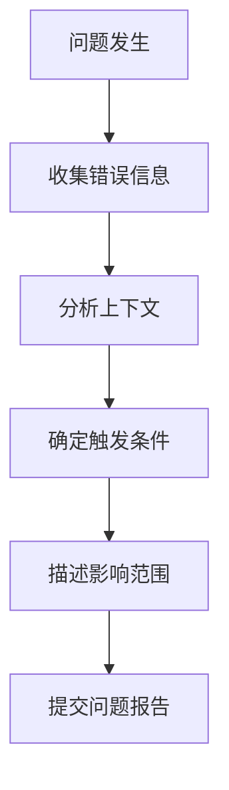
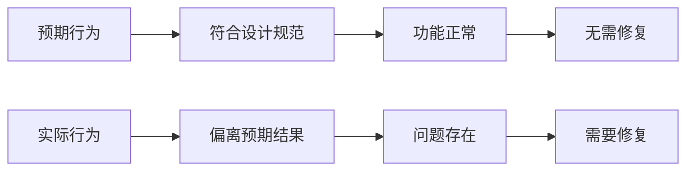

# 问题报告

<cite>
**本文档中引用的文件**  
- [README.md](file://README.md)
- [NeuPAN/README.md](file://NeuPAN/README.md)
- [Dftpav/src/Sim/core/common/thirdparty/backward.hpp](file://Dftpav/src/Sim/core/common/thirdparty/backward.hpp)
- [Dftpav/src/Sim/core/common/thirdparty/json/README.md](file://Dftpav/src/Sim/core/common/thirdparty/json/README.md)
</cite>

## 目录
1. [引言](#引言)
2. [问题报告流程](#问题报告流程)
3. [问题分类](#问题分类)
4. [问题描述规范](#问题描述规范)
5. [环境信息](#环境信息)
6. [复现步骤](#复现步骤)
7. [预期行为与实际行为](#预期行为与实际行为)
8. [高级诊断技巧](#高级诊断技巧)
9. [问题跟踪与状态更新](#问题跟踪与状态更新)
10. [附录](#附录)

## 引言
本指南旨在为项目贡献者提供完整的问题报告框架。通过标准化的问题报告流程，确保开发团队能够高效地识别、复现和解决各类问题。文档涵盖了从初学者到高级开发者所需的所有问题报告最佳实践，包括问题分类、详细描述、环境配置、复现步骤等关键要素。

## 问题报告流程
问题报告流程是确保项目质量的关键环节。一个完整的问题报告应包含问题分类、详细描述、环境信息、复现步骤、预期行为与实际行为对比等核心要素。报告者应尽可能提供详细的上下文信息，包括错误日志、堆栈跟踪和相关配置文件。对于复杂问题，建议提供最小可复现示例。问题报告提交后，维护团队将根据严重程度和影响范围进行优先级划分，并在处理过程中及时更新状态。

**Section sources**
- [README.md](file://README.md#L0-L279)

## 问题分类
问题应根据其性质进行准确分类，常见的分类包括：
- **功能缺陷**：功能未按预期工作
- **性能问题**：响应时间过长或资源消耗过高
- **安全漏洞**：潜在的安全风险
- **文档错误**：文档与实际实现不符
- **新功能请求**：建议添加新功能
- **构建问题**：编译或安装失败
- **依赖问题**：第三方库兼容性问题

准确的分类有助于快速分配给相应的开发人员处理。

**Section sources**
- [README.md](file://README.md#L0-L279)

## 问题描述规范
问题描述应清晰、简洁且完整。描述应包括问题的上下文、触发条件和影响范围。对于错误信息，应完整复制错误消息，包括堆栈跟踪。描述中应避免主观判断，专注于客观事实。建议使用"当...时，发生..."的句式来描述问题。对于复杂场景，可以分步骤描述问题的演变过程。



**Diagram sources**
- [Dftpav/src/Sim/core/common/thirdparty/backward.hpp](file://Dftpav/src/Sim/core/common/thirdparty/backward.hpp#L114-L152)
- [Dftpav/src/Sim/core/common/thirdparty/backward.hpp](file://Dftpav/src/Sim/core/common/thirdparty/backward.hpp#L3635-L3679)

**Section sources**
- [README.md](file://README.md#L0-L279)

## 环境信息
完整的环境信息是复现问题的关键。应包括：
- 操作系统版本
- Python/编译器版本
- 依赖库版本
- 硬件配置
- 项目版本号
- 配置文件内容

对于ROS相关项目，还需提供ROS版本和工作空间配置。环境信息应尽可能详细，因为许多问题具有环境依赖性。

**Section sources**
- [README.md](file://README.md#L0-L279)
- [NeuPAN/README.md](file://NeuPAN/README.md#L0-L242)

## 复现步骤
复现步骤应详细、有序且可操作。每个步骤应独立且明确，避免使用模糊的描述。建议按以下格式编写：
1. 准备环境
2. 执行操作
3. 观察结果

对于需要特定输入的场景，应提供示例输入数据。如果问题不是100%可复现，应注明复现概率和可能的影响因素。

**Section sources**
- [README.md](file://README.md#L0-L279)

## 预期行为与实际行为
清晰对比预期行为和实际行为是问题诊断的基础。预期行为应基于文档或合理推断，实际行为应基于观察结果。对比时应使用具体的指标，如响应时间、输出格式、状态码等。对于视觉相关的问题，建议提供截图或视频。



**Diagram sources**
- [README.md](file://README.md#L0-L279)

**Section sources**
- [README.md](file://README.md#L0-L279)

## 高级诊断技巧
对于经验丰富的开发者，可以使用以下高级诊断技巧：
- 使用调试工具获取详细的堆栈跟踪
- 分析内存使用情况和性能瓶颈
- 检查日志文件中的警告和错误
- 使用性能分析工具定位热点
- 构建最小可复现示例

在Dftpav项目中，backward库提供了详细的堆栈跟踪功能，可以提取对象文件名、函数名、源文件名、行号等详细信息，有助于精确定位问题。

**Section sources**
- [Dftpav/src/Sim/core/common/thirdparty/backward.hpp](file://Dftpav/src/Sim/core/common/thirdparty/backward.hpp#L114-L152)
- [Dftpav/src/Sim/core/common/thirdparty/backward.hpp](file://Dftpav/src/Sim/core/common/thirdparty/backward.hpp#L3524-L3577)

## 问题跟踪与状态更新
问题跟踪系统应记录问题的完整生命周期。状态更新应及时且准确，常见的状态包括：
- 新建：问题刚被报告
- 确认：问题已被验证
- 处理中：正在修复
- 待验证：修复完成等待测试
- 已解决：问题已修复
- 已关闭：问题处理完毕

优先级划分应基于问题的严重程度和影响范围，确保关键问题得到及时处理。

**Section sources**
- [README.md](file://README.md#L0-L279)

## 附录
### 常见问题模板
```markdown
## 问题描述
[详细描述问题]

## 环境信息
- 操作系统: 
- Python版本: 
- 项目版本: 

## 复现步骤
1. 
2. 
3. 

## 预期行为
[描述预期结果]

## 实际行为
[描述实际结果]

## 错误日志
[粘贴完整的错误日志]
```

**Section sources**
- [README.md](file://README.md#L0-L279)
- [NeuPAN/README.md](file://NeuPAN/README.md#L0-L242)