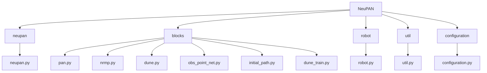
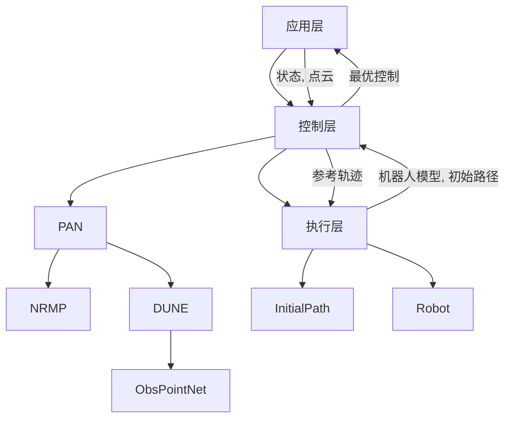
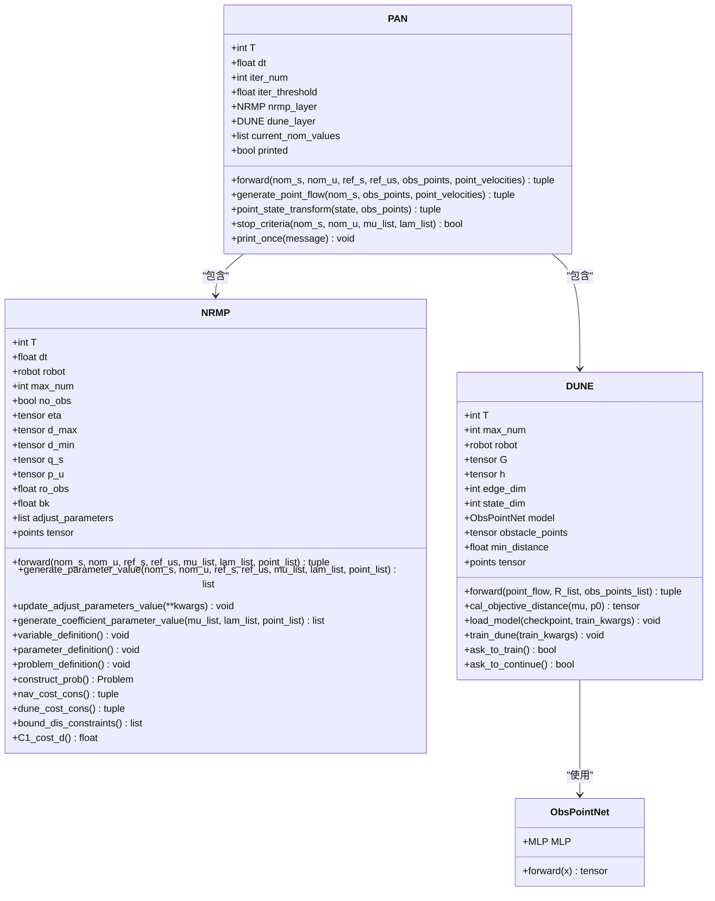
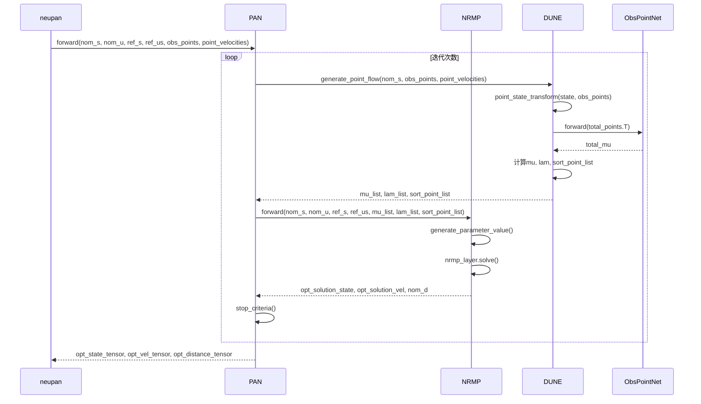
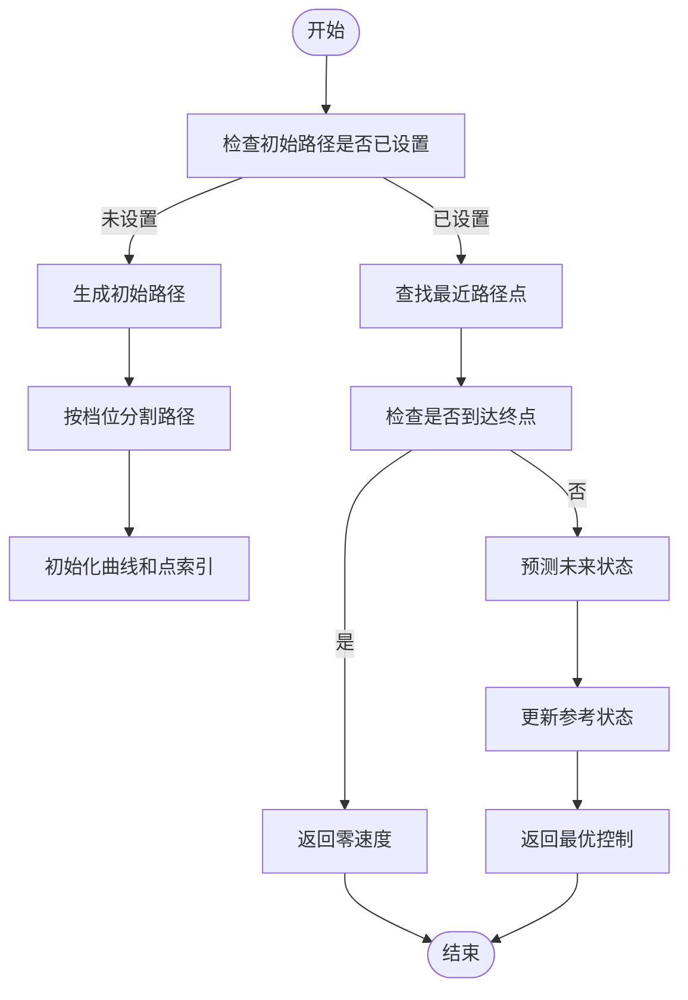
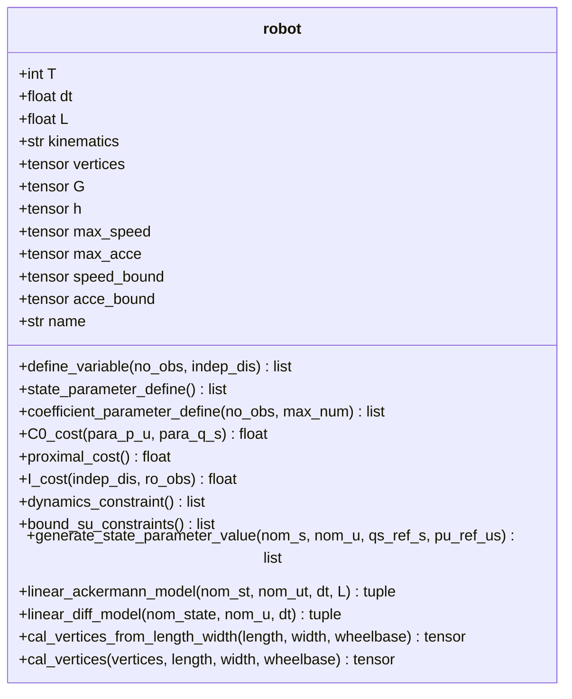
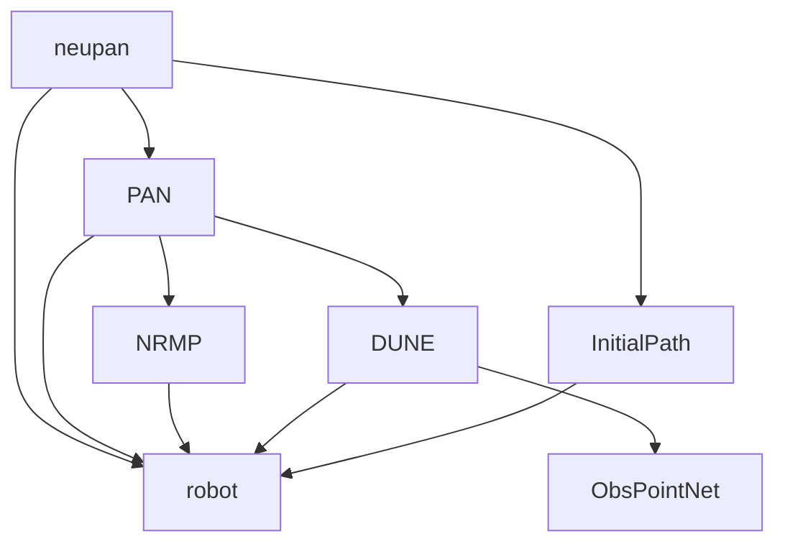

# NeuPAN: 端到端神经规划

<cite>
**本文档中引用的文件**  
- [neupan.py](file://NeuPAN/neupan/neupan.py)
- [pan.py](file://NeuPAN/neupan/blocks/pan.py)
- [nrmp.py](file://NeuPAN/neupan/blocks/nrmp.py)
- [dune.py](file://NeuPAN/neupan/blocks/dune.py)
- [obs_point_net.py](file://NeuPAN/neupan/blocks/obs_point_net.py)
- [initial_path.py](file://NeuPAN/neupan/blocks/initial_path.py)
- [robot.py](file://NeuPAN/neupan/robot/robot.py)
</cite>

## 目录
1. [简介](#简介)
2. [项目结构](#项目结构)
3. [核心组件](#核心组件)
4. [架构概述](#架构概述)
5. [详细组件分析](#详细组件分析)
6. [依赖分析](#依赖分析)
7. [性能考虑](#性能考虑)
8. [故障排除指南](#故障排除指南)
9. [结论](#结论)

## 简介
NeuPAN（Neural Proximal Alternating Minimization Network）是一种先进的端到端神经规划器，专为动态环境中的自主导航设计。该系统结合了深度学习与模型预测控制（MPC）技术，实现了高效、安全的路径规划。NeuPAN通过将复杂的优化问题分解为可学习的子问题，利用神经网络进行实时求解，从而在保证计算效率的同时实现高精度的轨迹优化。本项目由Ruihua Han开发，采用GNU通用公共许可证（GPL）发布，确保了其开源性和可扩展性。

## 项目结构
NeuPAN项目采用模块化设计，主要包含`neupan`、`blocks`、`robot`和`util`等核心模块。其中，`neupan`模块作为主入口，封装了PAN（Proximal Alternating Minimization Network）类并提供了用户友好的接口；`blocks`模块实现了NeuPAN的核心算法组件，包括DUNE（Deep Unfolded Neural Encoder）和NRMP（Neural Regularized Motion Planner）；`robot`模块定义了机器人模型及其运动学约束；`util`模块则提供了通用的工具函数。此外，项目还包含配置文件和示例脚本，便于用户快速上手和测试。

**图源**  
- [neupan.py](file://NeuPAN/neupan/neupan.py)
- [pan.py](file://NeuPAN/neupan/blocks/pan.py)
- [nrmp.py](file://NeuPAN/neupan/blocks/nrmp.py)
- [dune.py](file://NeuPAN/neupan/blocks/dune.py)
- [obs_point_net.py](file://NeuPAN/neupan/blocks/obs_point_net.py)
- [initial_path.py](file://NeuPAN/neupan/blocks/initial_path.py)
- [robot.py](file://NeuPAN/neupan/robot/robot.py)

**节源**  
- [neupan.py](file://NeuPAN/neupan/neupan.py)
- [pan.py](file://NeuPAN/neupan/blocks/pan.py)
- [nrmp.py](file://NeuPAN/neupan/blocks/nrmp.py)
- [dune.py](file://NeuPAN/neupan/blocks/dune.py)
- [obs_point_net.py](file://NeuPAN/neupan/blocks/obs_point_net.py)
- [initial_path.py](file://NeuPAN/neupan/blocks/initial_path.py)
- [robot.py](file://NeuPAN/neupan/robot/robot.py)

## 核心组件
NeuPAN的核心组件包括`neupan`类、`PAN`类、`NRMP`类、`DUNE`类、`ObsPointNet`类、`InitialPath`类和`robot`类。这些组件协同工作，实现了从初始路径生成到最终轨迹优化的完整流程。`neupan`类作为主控制器，负责协调各子模块的调用；`PAN`类实现了交替最小化算法，将优化问题分解为NRMP和DUNE两个子问题；`NRMP`类基于凸优化框架求解运动规划问题；`DUNE`类利用深度神经网络预测障碍物的距离特征；`ObsPointNet`类是DUNE的神经网络结构；`InitialPath`类负责生成初始参考路径；`robot`类定义了机器人的几何和运动学模型。

**节源**  
- [neupan.py](file://NeuPAN/neupan/neupan.py)
- [pan.py](file://NeuPAN/neupan/blocks/pan.py)
- [nrmp.py](file://NeuPAN/neupan/blocks/nrmp.py)
- [dune.py](file://NeuPAN/neupan/blocks/dune.py)
- [obs_point_net.py](file://NeuPAN/neupan/blocks/obs_point_net.py)
- [initial_path.py](file://NeuPAN/neupan/blocks/initial_path.py)
- [robot.py](file://NeuPAN/neupan/robot/robot.py)

## 架构概述
NeuPAN的系统架构采用分层设计，自上而下分为应用层、控制层和执行层。应用层负责接收用户输入和环境感知数据；控制层由`neupan`类主导，协调`PAN`、`NRMP`和`DUNE`等核心算法模块；执行层则通过`robot`类和`InitialPath`类实现具体的运动学建模和路径生成。整个系统以MPC框架为基础，在每个控制周期内，首先通过`InitialPath`生成参考轨迹，然后由`DUNE`处理障碍物点云数据，最后由`NRMP`求解优化问题，输出最优控制指令。

**图源**  
- [neupan.py](file://NeuPAN/neupan/neupan.py)
- [pan.py](file://NeuPAN/neupan/blocks/pan.py)
- [nrmp.py](file://NeuPAN/neupan/blocks/nrmp.py)
- [dune.py](file://NeuPAN/neupan/blocks/dune.py)
- [obs_point_net.py](file://NeuPAN/neupan/blocks/obs_point_net.py)
- [initial_path.py](file://NeuPAN/neupan/blocks/initial_path.py)
- [robot.py](file://NeuPAN/neupan/robot/robot.py)

## 详细组件分析
### PAN类分析
PAN（Proximal Alternating Minimization Network）类是NeuPAN的核心算法框架，实现了交替最小化优化策略。该类通过迭代求解NRMP和DUNE两个子问题，逐步逼近全局最优解。

#### 类图

**图源**  
- [pan.py](file://NeuPAN/neupan/blocks/pan.py)
- [nrmp.py](file://NeuPAN/neupan/blocks/nrmp.py)
- [dune.py](file://NeuPAN/neupan/blocks/dune.py)
- [obs_point_net.py](file://NeuPAN/neupan/blocks/obs_point_net.py)

#### 序列图

**图源**  
- [neupan.py](file://NeuPAN/neupan/neupan.py)
- [pan.py](file://NeuPAN/neupan/blocks/pan.py)
- [nrmp.py](file://NeuPAN/neupan/blocks/nrmp.py)
- [dune.py](file://NeuPAN/neupan/blocks/dune.py)
- [obs_point_net.py](file://NeuPAN/neupan/blocks/obs_point_net.py)

**节源**  
- [pan.py](file://NeuPAN/neupan/blocks/pan.py)
- [nrmp.py](file://NeuPAN/neupan/blocks/nrmp.py)
- [dune.py](file://NeuPAN/neupan/blocks/dune.py)
- [obs_point_net.py](file://NeuPAN/neupan/blocks/obs_point_net.py)

### InitialPath类分析
InitialPath类负责生成初始参考路径，为后续优化提供基准轨迹。该类支持从给定的航点或目标点生成平滑路径，并能处理不同类型的机器人运动学模型。

#### 流程图

**图源**  
- [initial_path.py](file://NeuPAN/neupan/blocks/initial_path.py)

**节源**  
- [initial_path.py](file://NeuPAN/neupan/blocks/initial_path.py)

### robot类分析
robot类定义了机器人的几何和运动学模型，为优化问题提供必要的约束条件。该类支持阿克曼转向和差速驱动两种运动学模型，并能生成相应的线性化动力学方程。

#### 类图

**图源**  
- [robot.py](file://NeuPAN/neupan/robot/robot.py)

**节源**  
- [robot.py](file://NeuPAN/neupan/robot/robot.py)

## 依赖分析
NeuPAN各组件之间的依赖关系清晰明确，形成了一个层次化的调用链。`neupan`类依赖于`PAN`类，`PAN`类又依赖于`NRMP`和`DUNE`类，而`DUNE`类进一步依赖于`ObsPointNet`类。`InitialPath`类和`robot`类作为基础组件，被多个上层模块所依赖。这种设计使得系统具有良好的模块化和可维护性。

**图源**  
- [neupan.py](file://NeuPAN/neupan/neupan.py)
- [pan.py](file://NeuPAN/neupan/blocks/pan.py)
- [nrmp.py](file://NeuPAN/neupan/blocks/nrmp.py)
- [dune.py](file://NeuPAN/neupan/blocks/dune.py)
- [obs_point_net.py](file://NeuPAN/neupan/blocks/obs_point_net.py)
- [initial_path.py](file://NeuPAN/neupan/blocks/initial_path.py)
- [robot.py](file://NeuPAN/neupan/robot/robot.py)

**节源**  
- [neupan.py](file://NeuPAN/neupan/neupan.py)
- [pan.py](file://NeuPAN/neupan/blocks/pan.py)
- [nrmp.py](file://NeuPAN/neupan/blocks/nrmp.py)
- [dune.py](file://NeuPAN/neupan/blocks/dune.py)
- [obs_point_net.py](file://NeuPAN/neupan/blocks/obs_point_net.py)
- [initial_path.py](file://NeuPAN/neupan/blocks/initial_path.py)
- [robot.py](file://NeuPAN/neupan/robot/robot.py)

## 性能考虑
NeuPAN在设计时充分考虑了实时性要求，采用了多种优化策略。首先，通过将复杂的非凸优化问题分解为可学习的子问题，显著降低了求解难度；其次，利用深度神经网络对障碍物信息进行预处理，减少了优化变量的数量；最后，采用MPC框架，在保证控制精度的同时实现了滚动优化。此外，系统还支持GPU加速，进一步提升了计算效率。

## 故障排除指南
在使用NeuPAN时可能遇到的常见问题包括：模型文件缺失、参数配置错误和运行时异常。对于模型文件缺失问题，系统会提示用户是否立即训练模型；对于参数配置错误，建议仔细检查YAML配置文件中的各项参数；对于运行时异常，可通过启用`time_print`选项来定位性能瓶颈。此外，确保所有依赖库（如PyTorch、cvxpylayers等）正确安装也是避免问题的关键。

**节源**  
- [neupan.py](file://NeuPAN/neupan/neupan.py)
- [dune.py](file://NeuPAN/neupan/blocks/dune.py)

## 结论
NeuPAN作为一种创新的端到端神经规划器，成功地将深度学习与传统优化方法相结合，实现了高效、安全的路径规划。其模块化设计和清晰的架构使得系统易于理解和扩展。通过与RDA-planner和teb_local_planner等组件的集成，NeuPAN能够适应多种应用场景，为自主导航系统提供了强大的技术支持。未来的工作可以集中在进一步优化网络结构、提高泛化能力和扩展到多机器人协作场景等方面。