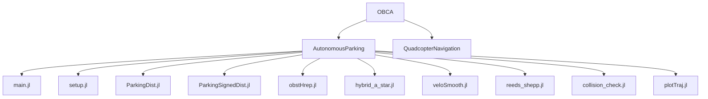
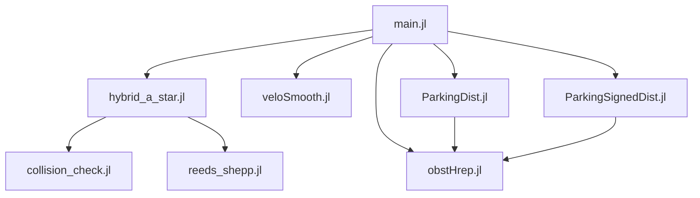
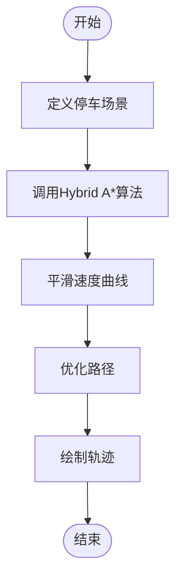
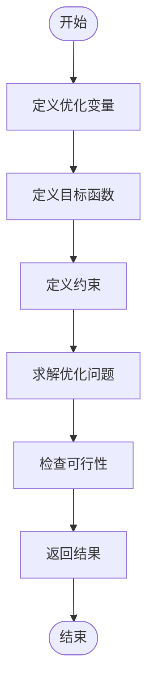
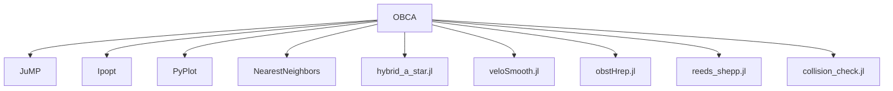

# OBCA: 优化碰撞避免

<cite>
**本文档中引用的文件**  
- [main.jl](file://OBCA/AutonomousParking/main.jl)
- [setup.jl](file://OBCA/AutonomousParking/setup.jl)
- [ParkingDist.jl](file://OBCA/AutonomousParking/ParkingDist.jl)
- [ParkingSignedDist.jl](file://OBCA/AutonomousParking/ParkingSignedDist.jl)
- [obstHrep.jl](file://OBCA/AutonomousParking/obstHrep.jl)
- [hybrid_a_star.jl](file://OBCA/AutonomousParking/hybrid_a_star.jl)
- [veloSmooth.jl](file://OBCA/AutonomousParking/veloSmooth.jl)
- [reeds_shepp.jl](file://OBCA/AutonomousParking/reeds_shepp.jl)
- [collision_check.jl](file://OBCA/AutonomousParking/collision_check.jl)
- [plotTraj.jl](file://OBCA/AutonomousParking/plotTraj.jl)
</cite>

## 目录
1. [简介](#简介)
2. [项目结构](#项目结构)
3. [核心组件](#核心组件)
4. [架构概述](#架构概述)
5. [详细组件分析](#详细组件分析)
6. [依赖分析](#依赖分析)
7. [性能考虑](#性能考虑)
8. [故障排除指南](#故障排除指南)
9. [结论](#结论)

## 简介
OBCA（优化碰撞避免）是一个基于优化的路径规划器，专为自动驾驶停车场景设计。该系统利用Julia语言实现，通过重构通用碰撞避免约束，实现了在复杂环境中的高效路径优化。OBCA模块的核心是`main.jl`文件，它集成了Hybrid A*算法和优化技术，以生成无碰撞且平滑的轨迹。该系统支持两种主要的停车场景：平行停车和倒车停车，并能够处理非凸障碍物。OBCA与`hybrid_astar_planner`和`teb_local_planner`等其他规划器协同工作，提供了一个完整的解决方案。

## 项目结构
OBCA模块的项目结构清晰，主要分为两个子目录：`AutonomousParking`和`QuadcopterNavigation`。`AutonomousParking`目录包含了用于自动驾驶停车的核心文件，而`QuadcopterNavigation`目录则包含了用于四旋翼无人机导航的文件。核心文件包括`main.jl`、`setup.jl`、`ParkingDist.jl`、`ParkingSignedDist.jl`、`obstHrep.jl`、`hybrid_a_star.jl`、`veloSmooth.jl`、`reeds_shepp.jl`、`collision_check.jl`和`plotTraj.jl`。这些文件共同构成了OBCA模块的功能。

**图源**
- [main.jl](file://OBCA/AutonomousParking/main.jl)
- [setup.jl](file://OBCA/AutonomousParking/setup.jl)
- [ParkingDist.jl](file://OBCA/AutonomousParking/ParkingDist.jl)
- [ParkingSignedDist.jl](file://OBCA/AutonomousParking/ParkingSignedDist.jl)
- [obstHrep.jl](file://OBCA/AutonomousParking/obstHrep.jl)
- [hybrid_a_star.jl](file://OBCA/AutonomousParking/hybrid_a_star.jl)
- [veloSmooth.jl](file://OBCA/AutonomousParking/veloSmooth.jl)
- [reeds_shepp.jl](file://OBCA/AutonomousParking/reeds_shepp.jl)
- [collision_check.jl](file://OBCA/AutonomousParking/collision_check.jl)
- [plotTraj.jl](file://OBCA/AutonomousParking/plotTraj.jl)

**节源**
- [main.jl](file://OBCA/AutonomousParking/main.jl)
- [setup.jl](file://OBCA/AutonomousParking/setup.jl)

## 核心组件
OBCA模块的核心组件包括`main.jl`、`ParkingDist.jl`、`ParkingSignedDist.jl`和`obstHrep.jl`。`main.jl`是主文件，负责调用其他组件并执行路径规划。`ParkingDist.jl`和`ParkingSignedDist.jl`分别实现了基于距离和符号距离的碰撞避免算法。`obstHrep.jl`负责将障碍物的顶点表示转换为半空间表示（H-representation），以便于优化求解。

**节源**
- [main.jl](file://OBCA/AutonomousParking/main.jl#L1-L288)
- [ParkingDist.jl](file://OBCA/AutonomousParking/ParkingDist.jl#L1-L315)
- [ParkingSignedDist.jl](file://OBCA/AutonomousParking/ParkingSignedDist.jl#L1-L314)
- [obstHrep.jl](file://OBCA/AutonomousParking/obstHrep.jl#L1-L102)

## 架构概述
OBCA模块的架构设计围绕优化碰撞避免的核心目标展开。系统首先使用Hybrid A*算法生成一个初步的路径，然后通过优化算法对路径进行平滑和调整，以确保无碰撞。`main.jl`文件负责协调整个流程，调用`hybrid_a_star.jl`生成初始路径，调用`veloSmooth.jl`平滑速度曲线，调用`obstHrep.jl`处理障碍物，最后调用`ParkingDist.jl`或`ParkingSignedDist.jl`进行优化。

**图源**
- [main.jl](file://OBCA/AutonomousParking/main.jl#L1-L288)
- [hybrid_a_star.jl](file://OBCA/AutonomousParking/hybrid_a_star.jl#L1-L639)
- [veloSmooth.jl](file://OBCA/AutonomousParking/veloSmooth.jl#L1-L109)
- [obstHrep.jl](file://OBCA/AutonomousParking/obstHrep.jl#L1-L102)
- [ParkingDist.jl](file://OBCA/AutonomousParking/ParkingDist.jl#L1-L315)
- [ParkingSignedDist.jl](file://OBCA/AutonomousParking/ParkingSignedDist.jl#L1-L314)
- [collision_check.jl](file://OBCA/AutonomousParking/collision_check.jl)
- [reeds_shepp.jl](file://OBCA/AutonomousParking/reeds_shepp.jl)

## 详细组件分析
### 主模块分析
`main.jl`文件是OBCA模块的入口点，负责初始化参数、调用Hybrid A*算法生成初始路径，并调用优化算法进行路径优化。文件中定义了停车场景（平行停车或倒车停车），并根据场景设置相应的障碍物和目标状态。`main.jl`还负责调用`veloSmooth.jl`平滑速度曲线，并将结果作为优化算法的初始猜测。

**图源**
- [main.jl](file://OBCA/AutonomousParking/main.jl#L1-L288)

**节源**
- [main.jl](file://OBCA/AutonomousParking/main.jl#L1-L288)

### 优化算法分析
`ParkingDist.jl`和`ParkingSignedDist.jl`文件实现了基于优化的碰撞避免算法。`ParkingDist.jl`通过最小化控制输入和时间来生成无碰撞路径，而`ParkingSignedDist.jl`则通过最小化穿透深度来生成路径。两个文件都使用JuMP和IPOPT求解器进行优化，并通过拉格朗日乘子处理碰撞避免约束。

**图源**
- [ParkingDist.jl](file://OBCA/AutonomousParking/ParkingDist.jl#L1-L315)
- [ParkingSignedDist.jl](file://OBCA/AutonomousParking/ParkingSignedDist.jl#L1-L314)

**节源**
- [ParkingDist.jl](file://OBCA/AutonomousParking/ParkingDist.jl#L1-L315)
- [ParkingSignedDist.jl](file://OBCA/AutonomousParking/ParkingSignedDist.jl#L1-L314)

## 依赖分析
OBCA模块依赖于多个外部库和内部文件。外部依赖包括JuMP、Ipopt、PyPlot和NearestNeighbors，这些库用于优化求解、绘图和最近邻搜索。内部依赖包括`hybrid_a_star.jl`、`veloSmooth.jl`、`obstHrep.jl`、`reeds_shepp.jl`和`collision_check.jl`，这些文件提供了路径生成、速度平滑、障碍物处理、路径插值和碰撞检测功能。

**图源**
- [setup.jl](file://OBCA/AutonomousParking/setup.jl#L1-L52)
- [hybrid_a_star.jl](file://OBCA/AutonomousParking/hybrid_a_star.jl#L1-L639)
- [veloSmooth.jl](file://OBCA/AutonomousParking/veloSmooth.jl#L1-L109)
- [obstHrep.jl](file://OBCA/AutonomousParking/obstHrep.jl#L1-L102)
- [reeds_shepp.jl](file://OBCA/AutonomousParking/reeds_shepp.jl#L1-L799)
- [collision_check.jl](file://OBCA/AutonomousParking/collision_check.jl)

**节源**
- [setup.jl](file://OBCA/AutonomousParking/setup.jl#L1-L52)

## 性能考虑
OBCA模块在性能方面进行了多项优化。首先，通过使用Hybrid A*算法生成初始路径，减少了优化算法的搜索空间。其次，通过平滑速度曲线，提高了路径的可执行性。此外，通过使用半空间表示处理障碍物，简化了碰撞避免约束。最后，通过使用IPOPT求解器，确保了优化问题的高效求解。

## 故障排除指南
在使用OBCA模块时，可能会遇到一些常见问题。例如，优化问题可能无法求解，这通常是由于初始猜测不合适或约束过于严格。在这种情况下，可以尝试调整初始猜测或放松约束。另一个常见问题是路径生成时间过长，这可能是由于障碍物过多或分辨率过高。在这种情况下，可以尝试减少障碍物数量或降低分辨率。

**节源**
- [ParkingDist.jl](file://OBCA/AutonomousParking/ParkingDist.jl#L1-L315)
- [ParkingSignedDist.jl](file://OBCA/AutonomousParking/ParkingSignedDist.jl#L1-L314)

## 结论
OBCA模块是一个功能强大的优化碰撞避免系统，适用于自动驾驶停车场景。通过结合Hybrid A*算法和优化技术，OBCA能够生成无碰撞且平滑的轨迹。该系统具有良好的可扩展性和灵活性，可以与其他规划器协同工作。未来的工作可以包括支持更多类型的车辆和障碍物，以及进一步优化性能。