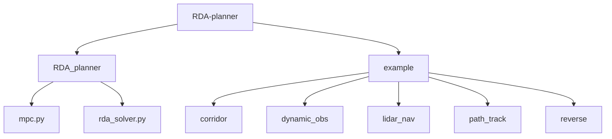
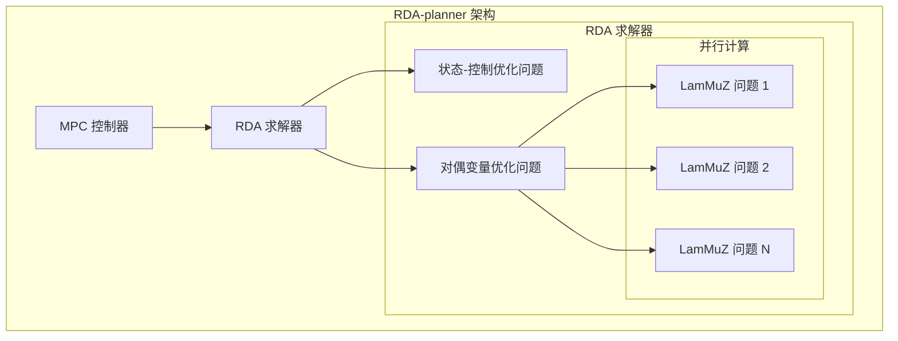
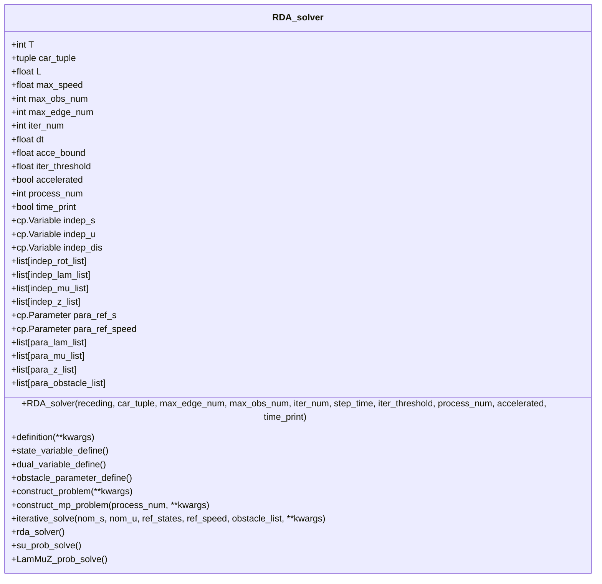
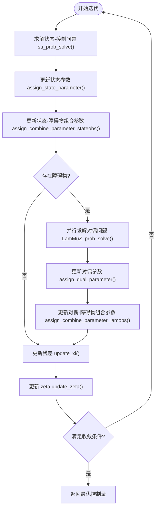
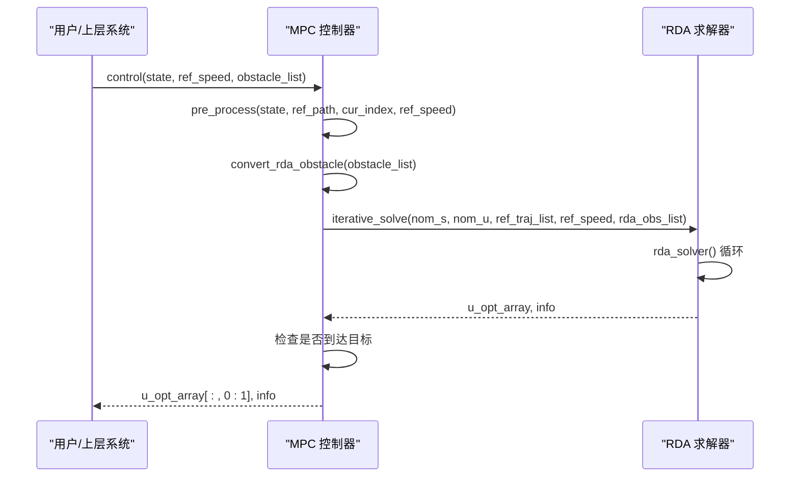
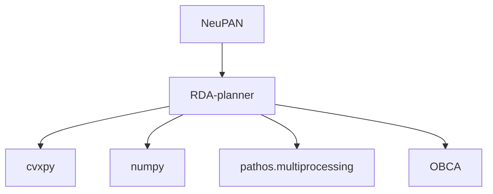

# RDA-planner: 加速碰撞避免规划

<cite>
**本文档中引用的文件**   
- [rda_solver.py](file://RDA-planner/RDA_planner/rda_solver.py)
- [mpc.py](file://RDA-planner/RDA_planner/mpc.py)
- [README.md](file://RDA-planner/README.md)
- [neupan.py](file://NeuPAN/neupan/neupan.py)
- [pan.py](file://NeuPAN/neupan/blocks/pan.py)
</cite>

## 目录
1. [引言](#引言)
2. [项目结构](#项目结构)
3. [核心组件](#核心组件)
4. [架构概述](#架构概述)
5. [详细组件分析](#详细组件分析)
6. [依赖关系分析](#依赖关系分析)
7. [性能考量](#性能考量)
8. [故障排除指南](#故障排除指南)
9. [结论](#结论)

## 引言
RDA-planner 是一种高性能、基于优化的模型预测控制（MPC）运动规划器，专为复杂和杂乱环境中的自主导航而设计。利用交替方向乘子法（ADMM），RDA将复杂的优化问题分解为几个简单的子问题。这种分解使得每个障碍物的碰撞避免约束可以并行计算，显著提高了计算速度。该模块支持任意凸形机器人和障碍物，处理静态和动态障碍物，并兼容差速驱动、阿克曼转向和全向系统等多种机器人运动学。

## 项目结构
RDA-planner 模块包含核心求解器、MPC控制器和多个示例。其结构清晰，便于集成和使用。

**图示来源**
- [rda_solver.py](file://RDA-planner/RDA_planner/rda_solver.py)
- [mpc.py](file://RDA-planner/RDA_planner/mpc.py)

**章节来源**
- [rda_solver.py](file://RDA-planner/RDA_planner/rda_solver.py)
- [mpc.py](file://RDA-planner/RDA_planner/mpc.py)

## 核心组件
RDA-planner 的核心由 `rda_solver.py` 中的 `RDA_solver` 类和 `mpc.py` 中的 `MPC` 类构成。`RDA_solver` 负责实现基于ADMM的优化求解，而 `MPC` 类则作为高层控制器，处理状态预测、参考路径跟踪和与外部系统的接口。

**章节来源**
- [rda_solver.py](file://RDA-planner/RDA_planner/rda_solver.py#L1-L100)
- [mpc.py](file://RDA-planner/RDA_planner/mpc.py#L1-L50)

## 架构概述
RDA-planner 的架构采用分层设计，将复杂的运动规划问题分解为可管理的组件。其核心是ADMM优化框架，该框架将主问题分解为两个子问题：一个处理机器人动力学和目标跟踪，另一个并行处理每个障碍物的碰撞避免约束。

**图示来源**
- [rda_solver.py](file://RDA-planner/RDA_planner/rda_solver.py#L100-L200)
- [mpc.py](file://RDA-planner/RDA_planner/mpc.py#L50-L100)

## 详细组件分析

### RDA 求解器分析
`RDA_solver` 类是整个模块的核心，它实现了ADMM算法来解决非凸的碰撞避免问题。

#### 类结构与变量定义

**图示来源**
- [rda_solver.py](file://RDA-planner/RDA_planner/rda_solver.py#L1-L50)

#### 求解流程

**图示来源**
- [rda_solver.py](file://RDA-planner/RDA_planner/rda_solver.py#L500-L700)

**章节来源**
- [rda_solver.py](file://RDA-planner/RDA_planner/rda_solver.py#L1-L1081)

### MPC 控制器分析
`MPC` 类是 `RDA_solver` 的封装，提供了更高级别的接口，用于处理实际的导航任务。

#### 与 RDA 求解器的协同工作

**图示来源**
- [mpc.py](file://RDA-planner/RDA_planner/mpc.py#L100-L200)
- [rda_solver.py](file://RDA-planner/RDA_planner/rda_solver.py#L500-L600)

**章节来源**
- [mpc.py](file://RDA-planner/RDA_planner/mpc.py#L1-L570)

## 依赖关系分析
RDA-planner 模块主要依赖于 `cvxpy` 进行凸优化求解，`numpy` 进行数值计算，以及 `pathos.multiprocessing` 进行并行计算。它与 NeuPAN 和 OBCA 的协同工作主要体现在数据流和功能互补上。

**图示来源**
- [rda_solver.py](file://RDA-planner/RDA_planner/rda_solver.py#L1-L10)
- [mpc.py](file://RDA-planner/RDA_planner/mpc.py#L1-L10)

**章节来源**
- [rda_solver.py](file://RDA-planner/RDA_planner/rda_solver.py)
- [mpc.py](file://RDA-planner/RDA_planner/mpc.py)

## 性能考量
RDA-planner 的核心优势在于其通过并行计算实现的高性能。通过将碰撞避免约束分解并分配给多个进程，它能够实时处理多个动态障碍物。计算复杂度主要取决于障碍物数量和预测时域长度。硬件加速支持通过多核CPU的并行处理来实现，`process_num` 参数允许用户根据硬件配置进行调整以优化性能。

## 故障排除指南
当遇到求解失败或性能不佳时，应首先检查障碍物定义是否正确（凸多边形且顶点顺序正确），并确保 `car_tuple` 中的动力学参数与实际机器人匹配。如果求解器状态为非最优，可以尝试切换求解器（如从ECOS切换到SCS）或调整ADMM的惩罚参数 `ro1` 和 `ro2`。对于实时性问题，应检查并行进程数 `process_num` 是否与CPU核心数匹配。

**章节来源**
- [rda_solver.py](file://RDA-planner/RDA_planner/rda_solver.py#L700-L800)
- [mpc.py](file://RDA-planner/RDA_planner/mpc.py#L400-L500)

## 结论
RDA-planner 是一个功能强大且高效的碰撞避免规划器，其基于ADMM的并行优化架构使其在处理高动态环境中的多障碍物场景时表现出色。通过与NeuPAN等感知模块和OBCA等路径规划模块的协同工作，它可以构建一个完整的自主导航系统。其模块化设计和清晰的接口使其易于集成到不同的机器人平台中。